# 欢迎来到未来：生成式软件工程第一讲

> **原视频**：[Bilibili · BV1pb8o6yE8f](https://www.bilibili.com/video/BV1pb8o6yE8f/)（时长约 100 分钟）
> **课程**：南京大学《生成式软件工程》（2026）第 01 讲 · Raw 版
> **整理说明**：本书由视频语音转录后经 AI 重构而成，口语已转写为书面语，并修正了转录中的明显识别错误；关键时间点均标注 *(参考时间)*，点击截图卡片可跳转视频对应位置。

---

## 目录

1. [开场：站在历史的交叉路口](#1)
2. [AI 时代的焦虑：这门课为什么存在](#2-ai)
3. [课程怎么上：把教学当成一场演出](#3)
4. [课程政策：Token、考核与简历](#4-token)
5. [认识大语言模型：一个概率分布](#5)
6. [从模型到 Agent](#6-agent)
7. [Agent 入门：原则与第一课](#7-agent)
8. [案例集：Agent 的日常操作](#8-agent)
9. [Skill 生态与个人知识飞轮](#9-skill)
10. [浏览器自动化：DevTools 与填表实战](#10-devtools)
11. [统分流水线：CS 从业者知道边界在哪里](#11-cs)
12. [小软件工程产品：用二维码偷数据](#12)
13. [三个空间与 Gap：生成式软件工程的核心](#13-gap)
14. [对照实验：AI 为什么写出 AI Slop](#14-ai-ai-slop)
15. [大模型时代，软件工程的定义没有变](#15)
16. [结语：古法编程已死，软件工程未死](#16)

---

## 1. 开场：站在历史的交叉路口

*(参考时间: 00:00)*

课程的开场颇具仪式感：主讲人按下 F5，从 Neovim 中打开浏览器，正式开始上课。他提醒在座的计算机专业学生：我们正站在一个非常重要的历史交叉路口。

回顾计算机发展史，每一次重大变革都有一个共同的主题——**把昂贵的能力变成日用品**：

- **1975 年**，第一台个人计算机 Altair 8800 诞生（开场幻灯片中那张复古图片本身就是 AI 生成的，"AI 味儿"明显）；
- **互联网时代**，人与人被连接起来。主讲人回忆自己小学毕业时装了 ICQ（"ICU"），可以随机加到地球另一端的人；腾讯的山寨版当时还叫 OICQ，后来改名 QQ；
- **移动互联网时代**，"一夜之间，所有菜场卖菜的人都挂上了支付宝和微信的二维码"；
- **2022 年**，ChatGPT 出现，成为人类历史上增长最快的产品。

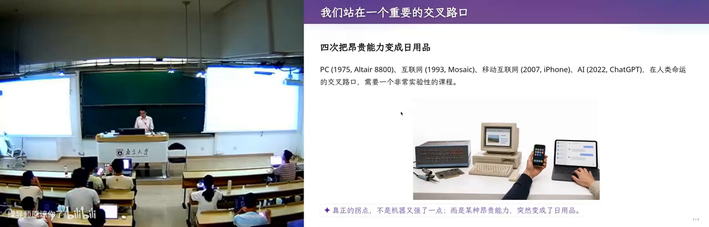

在这样的人类命运交叉路口，**我们上课的方式、我们该学什么，都需要重新思考**。这门《生成式软件工程》课程正是在这个背景下开设的。

---

## 2. AI 时代的焦虑：这门课为什么存在

*(参考时间: 02:13)*

### 2.1 "AI 替我上大学"

前两年流传一个说法：**AI 替我上大学**。仔细想想，这个说法很对——老师用豆包出题，学生用豆包做作业，在整个闭环当中，只有学生没有受到训练。

如今 Vibe Coding 已经强到什么程度？曾经折磨一代代学生的操作系统实验，现在只需要把作业链接丢进 Codex，甚至不用复制粘贴，直接说一句："蒋老师的操作系统课第八个实验，帮我实现一下。"好，结束了。

那么问题来了：在这样的时代，到底还应不应该学编程？答案是**既应该也不应该**——有些能力你仍然需要，但应该怎么做，没有人知道。

### 2.2 两种焦虑

主讲人把同学们的焦虑归纳为两种：

1. **AI 帮我上完了大学，我什么都没学会。** 假设每门课都开卷考试、都由 AI 答题、全都答对，走出校门的那一刻，你会发现自己第一个被 AI 取代。
2. **我认真学了四年，却被大学"骗"了。** 延续中学时代"老师说什么就做什么"的状态，每堂课认真听、每次作业认真做，毕业时却发现：你学会的东西，AI 都会做。

### 2.3 一份"零分简历"

最切实的痛苦来自求职。主讲人展示了一份收到的真实简历（个人信息已用 Unicode 黑色方块字符抹掉）：

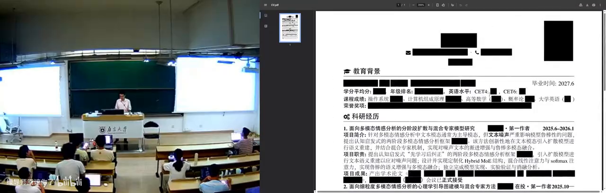

这份简历堪称"完美"：列着一整排 CCF 期刊列表上的论文。但在主讲人眼中，这是一份**零分简历**——

> "所有这一切都是 AI 做的。我没有干任何事，我只是告诉它：有一份简历，我需要在上课时展示一下。"

它没有 GitHub 链接，没有个人主页，没有任何可以证明"这个人真正做过什么"的信息。更糟糕的是，这样的简历他收到过无数份。**当所有人的简历都长一个样子——一大堆奖项、一大堆论文、一大堆竞赛——你靠什么脱颖而出？**

### 2.4 这门课的目的

好消息是，这门课希望缓解大家的焦虑，更重要的是带大家**还原 Vibe Coding 的快乐**：

- 在快乐中理解软件工程是怎么工作的；
- 做出一些有趣的东西，让简历显得更好。

主讲人甚至抛出一个惊人的观点：**对他来说，你有一篇已发表论文，可能是一个减分项**（至少对他如此，对很多其他人可能还不是）。

---

## 3. 课程怎么上：把教学当成一场演出

*(参考时间: 08:48)*

### 3.1 案例驱动、松散组织

课程采用**案例驱动、比较松散的组织形式**。想当面讨论、想"拷打"老师的同学，欢迎线下到场；如果你是"听课型"同学，只想获取知识，那么**既不用到课，也不用看直播**——因为主讲人正在做一个非常有趣的尝试。

### 3.2 幻灯片本身就是 AI 生成的

课上展示的幻灯片，就是这场实验的第一个证据：

- 左边是主讲人课前写的讲义（Markdown）：他预先想好每个时间点讲什么、举什么例子——相当于**约束好 AI 要做什么**；
- 按下 F5 播放时，幻灯片中**紫色的部分**全部是 GPT-5.6 Soul "添油加醋"加上去的内容；
- 所有插图全部由 AI 生成。

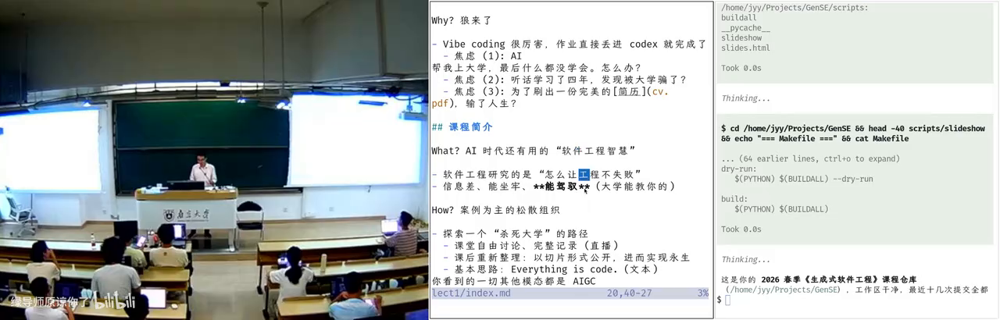

背后是一个名为 `make-slides` 的 skill：

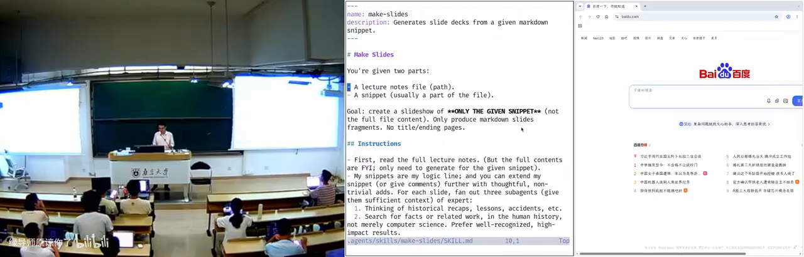

它的工作方式很有代表性——从一份写好的演讲稿 Markdown 出发，生成三个 subagent，赋予它们不同的 personality（人格），让它们在隔离的上下文中各自干活；最后主 agent 回来汇总。**这就是"用算力换智力"：付出更多算力，就获得更多智力。**

主讲人还展示了提示词的迭代方法：每换一版提示词就重新生成一次，再用另一个模型做**盲评**，比较哪一版生成的幻灯片质量更高，直到调出一个相对满意的质量水平。

### 3.3 上课是表演，表演要复盘

主讲人对"教学"的定位非常直白：

> "上课是一种表演。我是一个演员，要调动大家的情绪，根据预先设定好的剧本做一场演出。"

演出结束之后还有一件重要的事：**review 今天的表演**。哪个例子举得不恰当、哪个案例换一种讲法更能让人感同身受——即兴的部分尤其需要事后复盘。课程内容会被重新切片、重新整理后再发布。

---

## 4. 课程政策：Token、考核与简历

*(参考时间: 15:07)*

### 4.1 Token 自费

课程的第一条政策是 **Token 自费**。主讲人原本想拉一些 Token 赞助，但看到选课人数后放弃了。他甚至说了一句狠话：

> "如果你们手上没有付费的 Token，就应该立即退学。"

当然这是夸张的说法——他的意思是，在这个时代，Token 就是生产资料。课程演示会尽量使用**足够便宜但智能尚可**的模型：除了幻灯片生成用了更聪明的模型，课上几乎所有演示（讲义、资产、实时操作）都由 **DeepSeek V4 Flash** 完成。

他还给出了一个实用的省钱建议：同学们是"夜猫子"，喜欢在夜里工作，而 DeepSeek 在夜间低谷时段更便宜——**白天上课正好是电费的"峰时"，晚上回去做作业正好是"谷时"**。每位同学去 DeepSeek 充 100 块钱基本够用；实在有困难可以联系老师想办法。

### 4.2 考核难题：通过/不通过？

主讲人申请课程时把考核方式填成"通过/不通过"，但教务反馈：专业选修课一般不这么做（通常只有形势与政策这类课才用）。

这背后是一个真实的时代难题：**评判标准是什么？** 同一个任务，用 Claude 做就是比用 DeepSeek V4 Flash 做得好，而课程没办法限制大家用什么模型，那该怎么评分？


他给出的建议是：课程网站后续会更新，建议同学们**实现一个自己的 eval 管理系统**——老师通过一个专用邮箱给你发邮件，你把邮件回回来；你可以做一个常驻的服务，跑在宿舍里一台一直开着的小电脑上。这本身就是一个不错的 Vibe Coding 实验，有人做得复杂些，有人做得简单些。

### 4.3 分数不重要，简历才是唯一的考试

> "到底什么叫做得好、做得不好，该给多少分？我觉得在这个时代，分数已经变得不那么重要了。"

真正重要的，是最后找工作或保研那一刻，**你投出去的简历上有什么东西**。对同学们来说，其实只有那一次"考试"。

比较糟糕的是，为了走到那一刻，你还需要一个不错的 GPA，还得去 **reward hacking**、去 **overfit** 那些考试题目。但最终检验你大学阶段的，是那一份交出去的简历——它能不能带你到下一个更高的平台。

课程的最终期望是：每位同学的简历上能写上"我在生成式软件工程里实现了 ABCDE"，附上链接，每一项都做得漂亮，都能说清楚设计与实现中了不起的地方在哪里。

### 4.4 一个恐怖的思想实验

主讲人开了一个略显黑暗的脑洞：如果每个人的电脑上都装了监控，那么 AI 就能知道你大学四年干的所有事情——你摸的每一次鱼、你看的每一个不想让人知道的内容，都在你的电脑上发生。这样的 AI 可以评判你度过了一个怎样的大学四年。

"当然这是非常恐怖的事情。我们不知道人类社会什么时候会演绎到那个程度。但是——**保持 open，这是我们课程的 policy。**"

---

## 5. 认识大语言模型：一个概率分布

*(参考时间: 20:32)*

### 5.1 大语言模型就是概率分布

"我今天不讲什么是大语言模型——大语言模型就是一个概率分布。"

主讲人用概率统计课上的抛硬币问题作类比：已知抛了六次硬币、点数之和是多少，求第一次抛出 1 的概率——大家在概率课上都做过类似的题目。大语言模型没有任何区别，它就是一个**学到的概率分布**：给它一本书（一段很长的文本，可以是文字，也可以是图像），书读到末尾结束了，你可以在书的后面再写几个字——比如"能不能帮我总结一下这本书"——接下来，大语言模型就不断地预测下一个 token 的概率。每次输出可以理解成吐出一个字符。

这个模型很大，它见过世界上几乎所有的东西；训练它很难——这就是为什么今天的前沿实验室（Frontier Labs）如此强大。

但这门课**站在使用者的视角**：你们只需要知道存在一个叫大语言模型的东西，打开 DeepSeek 的网页或 API，问一句"什么是大语言模型？"，它就会告诉你，而你此刻就在体验大语言模型。**你不需要任何大语言模型的先验知识。**

### 5.2 第一次被大模型"按在地上打"

主讲人第一次被大模型震撼，是 2023 年 GPT-4 时代，他给 5 岁的孩子解释什么是扫描电子显微镜。当时的 prompt 写法还很朴素："用朴素的语言，打一个合适的比方，帮助他理解这件事。"

GPT-4 给出的比方让他震惊：

> 你面前有一座山，你闭着眼睛看不到它的形状，但你想知道山长什么样，怎么办？你就对着山扔石头：朝这个方向扔，石头穿过去了；朝那个方向扔，石头弹回来了，你能听到声音。通过哪些地方穿过去、哪些地方弹回来——就像 ray tracing（光线追踪）一样——你就可以推测出山的形状。

小朋友大概听懂了。主讲人事后特意去查了资料：**这个比方在科学上是对的**。要知道，GPT-4 是一个幻觉非常严重的模型，但在这个例子里，它既有这个知识，又给出了一个恰当的类比。而到了 GPT-5.6，因为有 reasoning（推理）能力，它还能给出更严谨、更好的解释。

### 5.3 从 Prompt Engineering 到"一句话的事"

GPT-4 时代，人们用 prompt engineering 让模型生成各种奇怪的东西——主讲人举例：一个 prompt 要让模型给某个程序找到 150 个问题，需要反复调整。而到了 GPT-5.6 时代，同样的工作**就是一句话的事情**，不再需要为模型做任何特别调整。

---

## 6. 从模型到 Agent

*(参考时间: 24:10)*

随着模型能输出越来越长的文本、也能接受越来越长的上下文，**Agent 出现了**。路径很清晰：

1. 先有了**推理模型**（reasoning model）；
2. 然后有了 **ReAct 式的 coding agent**。

原理其实很简单：语言模型本来只会输出下一个 token，那就让它输出一个**特殊的 token**——比如"调用一个 bash 程序"。这个 bash 程序会被真正执行，执行结果再重新送回 agent 的循环（loop）里。这样 agent 就可以自主运行，你就可以交给它一个比较复杂的任务。

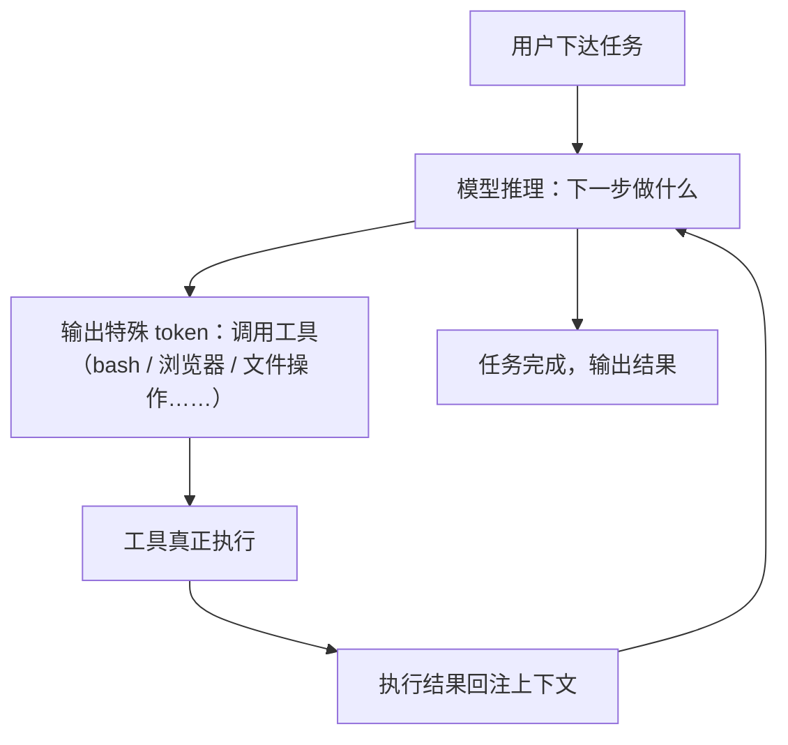

*(参考时间: 29:17)*

未来会变成什么样？主讲人坦言无法预测：到底哪一条技术路线会胜出、哪一种模型会胜出，没有人知道。**但可以预见的是，这个世界肯定会变得非常不一样。** 在这个世界上我们该怎么办，是每一位同学都值得好好考虑的问题。

---

## 7. Agent 入门：原则与第一课

*(参考时间: 29:44)*

"吓唬人的事情说完了，我们可以吸一口气。"接下来进入课程的主要内容：**怎样实际操作一个 agent**。主讲人假设大家其实并不太会用 agent——除了"帮我把这个作业做了"以外。

上学期期末考试，他出了一道题：*如果你要用 agent 给我的课出一张期末考卷，应该怎么办？* 从阅卷结果看，大家使用 agent 的方式"可能需要稍微解锁一下"。

### 7.1 课堂演示：一个配置了 AGENTS.md 的 Agent

课上选择的 agent 工具，只要跟它说话就可以干活，并且支持配置文件，比如 `AGENTS.md`：

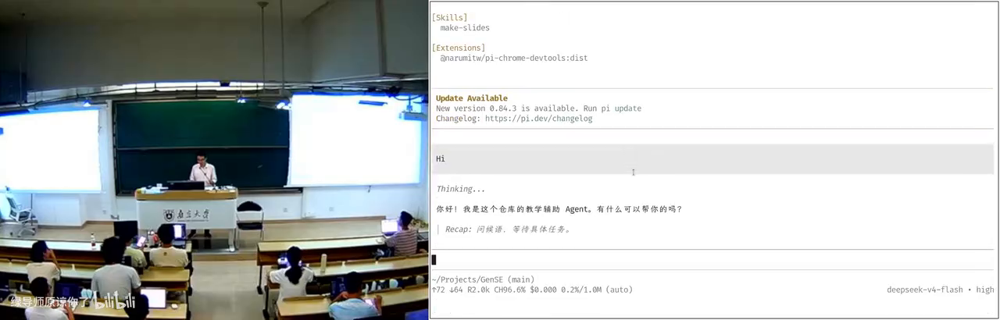

你可以问它："你是谁？"它会回答自己是《生成式软件工程》的教学辅助。再追问："你不就是个模型吗，为什么还知道生成式软件工程？"它会告诉你：它之所以知道这门课、这个仓库，是因为读到了 `AGENTS.md` 的配置。

由此引出使用 agent 的前两个原则：

- **原则一：现在就开始用；**
- **原则二：随时问它。**

在此之上，还有更本质的一条：**你的想象力，限制了你的 agent 的上限。** 课间的时候，大家可以想一想：你用 agent 做过的最酷的一件事是什么？

### 7.2 案例一：整套上课系统都是 AI 装的

主讲人的第一个例子，就是他当天上课用的整套系统——**所有配置和安装全部由 AI 完成**。

他教操作系统课一直有个传统：带一个 U 盘，里面装一个 Linux 系统，插到教室电脑上直接启动（有一年他不小心把教室电脑的硬盘抹掉了，"教学事故"）。装机曾经是很痛苦的事，他自称"装机仙人"，2021 年前后在知乎上发过各种定制系统的帖子。

而现在，"装机仙人"已经彻底被 AI 取代——他只用了**一句话**：

```text
你去 mirrors.nju.edu.cn 上找一个 Debian 13 的镜像，
把它装到我的 U 盘上，确保这个 U 盘可以启动，
然后用模拟器验证。
```

点睛之笔是"**用模拟器验证**"。Agent 装完之后，真的在 QEMU 里启动系统，看到登录界面，创建用户、设置密码，确认登录成功，然后汇报"验证完成"。

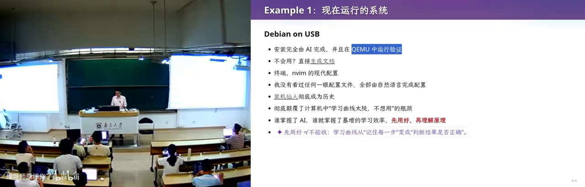

当然，主讲人自己是有"脑袋"的——他知道这个安装是怎么完成的。但这不妨碍整个流程由 AI 执行。

### 7.3 案例二：平铺窗口管理器与"从不看配置文件"

同样的方式，他让 AI 装了一个平铺式（tiled）窗口管理器：

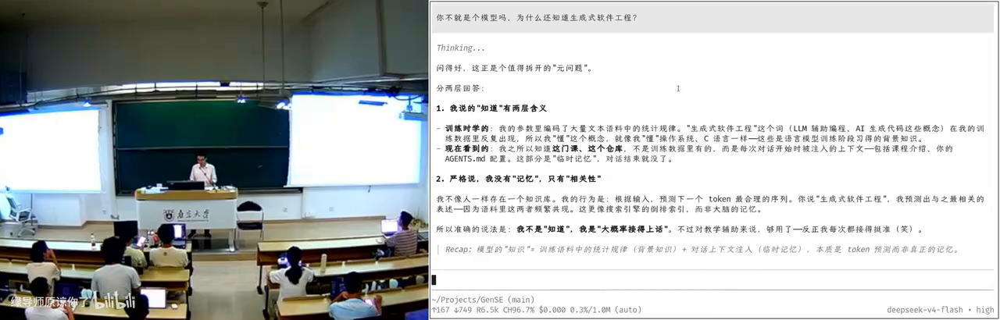

操作非常顺滑——Win+Enter 在右边新开一个窗口，Win+空格把窗口"摸"出来。不会用怎么办？他直接让 DeepSeek V4 Flash 生成了一份文档："看一下我系统现在的设置，我要做各种事情，怎么办？"模型告诉他：Super+Enter 是打开终端，Super+D 是打开应用启动器。

> "所有的文档，包括你看到的 Neovim 的现代配置，我没有看过任何一眼配置文件。所有的一切都是用自然语言完成的。我只是让它'包交付'：我要什么，你帮我再检查一下——就全部完成了。"

主讲人感慨：他大四的时候就捧着 Intel 几千页的 CPU Specification 逐条研读。而在这个时间点，**有一个"人"可以跟他沟通，把这些东西全看了、都懂、能做对——他需要做的，是解锁它的能力。**

> "你学习知识的方式变了。你更多时候需要知道**它能做什么、能做到什么程度**，然后带着它去做一件更大的、它自己做不到的事情。**人现在唯一的功能，就是带着 AI 做 AI 现在做不到的事情。** 一旦你没有这个能力，你就已经被淘汰了。你没有 Token，就可以立即退学了——这是我自己的观点。"

---

## 8. 案例集：Agent 的日常操作

*(参考时间: 36:44)*

Agent 彻底颠覆了计算机科学的学习曲线。主讲人举了一个大家都有共鸣的场景：配置终端。

### 8.1 终端配置：从"一改就出错"到"情绪价值"

你们都在 B 站上看过别人花里胡哨的终端，自己也想搞一个——结果 `.zshrc` 一改就出错，非常痛苦。有了 agent，一点也不痛苦：它不仅可以帮你改，还能事无巨细地解释为什么要这样改；你有什么新想法，它立刻说"好好好"，**还给你情绪价值**。

主讲人前几天在小红书上发了一个帖子：**为什么 Token 比学生好用？因为可以骂它，它不会还嘴。** "我肯定不能骂学生，但是我可以骂这个 agent。"

> "所以，谁掌握了 AI Agent，谁就掌握了暴增的学习效率。"

他推荐的学习方式是：**先把东西搞出来，再回头复盘理解。** 这个效率比从零开始一点一滴学要高得多。但危险在于：你的理解可能与"比较好的理解"存在差距——这个差距有多大，我们并不知道。

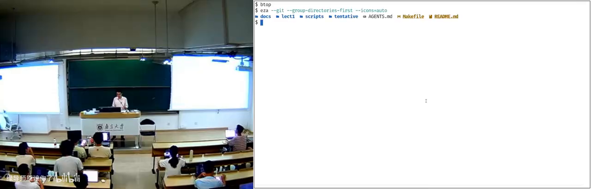

顺带一提，他现场展示的现代化终端——漂亮的进程监控（btop）、`ls` 自动替换为 `eza`、`find` 自动替换为 `fd`——全部来自一条 prompt："帮我把命令行终端和系统都配置成现代的样子、比较好用的样子。"模型用的还是 DeepSeek V4 Flash。

### 8.2 收发邮件、写草稿、管发票

主讲人有一个自己的邮件 skill（现场没有展示细节）：他的数据库里存着历史上回过的所有邮件。每当收到一封新邮件，agent 会：

- 自动把它标记为已读；
- 自动用**他的口吻**写好回复草稿（他坦言目前做得还不够好，简单邮件可以直接发，大部分还得改）；
- 把重要附件归档——比如收到一张发票，自动保存到指定的归档位置。

这些全靠事先写好的 instructions。更有意思的是与待办系统的联动：他像大家用 OpenClaw 或 Hermes 那样，但用的是自己 Apple 的 Reminders——在手机的备忘录/提醒事项里加一句"帮我把今天的发票打印出来"；他还有一个叫 "bot" 的地方，加一条"把我收到的上一张发票打印出来"，点勾、commit，就多了一个 to-do 事项，就像在 Telegram 里跟 bot 聊天一样。

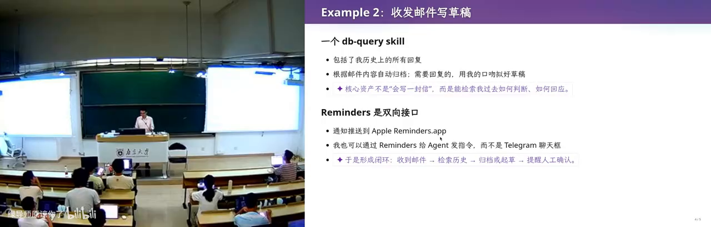

之后只要等。后台处理完毕后，agent 会推送一条通知，通过 Reminders 送到他的手表上——手表告诉他可以去打印了。**所有的日常事务都可以交给它处理。** 这个流程还在不断进步：在 OpenClaw 出现之前他就这样做；他认为 OpenClaw 和 Hermes 只是**个人 agent 产品的中级形态**，还可以做得更好，未来还有很多空间。

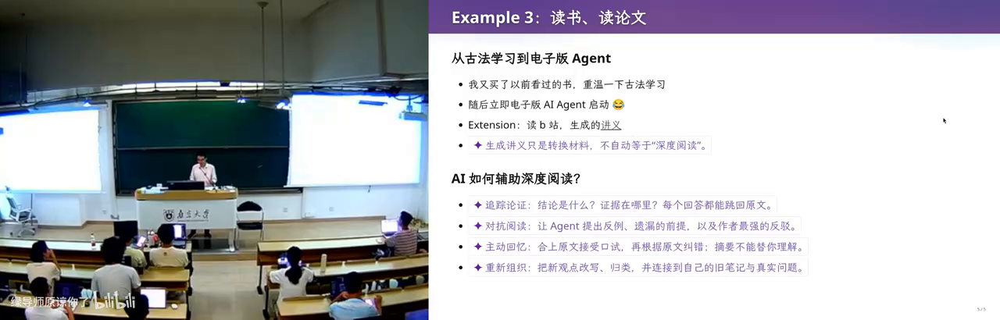

### 8.3 用 AI 读书、读论文

"你们还读书吗？还看论文吗？看论文痛苦吗？"——主讲人自认是一个很爱看书的人，年轻时每年光教科书就看几十本。而今天，**他已经不看书了**。但为了这门生成式软件工程课，他又买了几本，都是当年仔细读过、甚至读过不止一遍的经典：

- **Fred Brooks《人月神话》（The Mythical Man-Month）**——"这个标题起得非常 misleading：什么是'人月'？什么是'神话'？这本书应该叫《人月鬼话》。"
- **John Ousterhout《软件设计的哲学》（A Philosophy of Software Design）**——"这本书非常紧凑，里面有很多软件工程的、真正的智慧，非常好。"

他的读书方式是这样的：自己读完第一章，然后——**agent 启动**。他会怎么读书？他的"AI 梗同学"（他的专属 agent 工作流）甚至比 GPT-5.6 更强、更 harsh 一点。以制作幻灯片为例，他会让 GPT-5.6：

1. 回看人类历史：在相关案例中有没有值得借鉴的 lessons；
2. 根据当前主题寻找相关工作，不限于计算机科学，并且 **prefer high-impact results**（因为上课要讲经典）；
3. **Thinking from first principles**（从第一性原理思考）；
4. 多个带 personality 的子 agent 随机"抽卡"、各自发表观点、互相讨论、出现分歧后再送回讨论，**直到收敛**。

读论文时，他的 prompt 思路是：**从人类已有的知识出发，假设所有已知的东西都是"已知的"，把这篇论文里真正新的、最少的东西剥离出来。** 这样一篇 12 页的论文基本剩不下多少，会变得非常短——"所以我现在读论文的效率非常高。"而且他会拿着原文、总结、分层次的总结跟模型 chat。

> "我仍然是读论文的。我不是那种只看微信公众号学习的人——我现在声明，我不是。"

### 8.4 用 AI 看 B 站视频

"我不仅用 AI 读书、读论文，我还用 AI 上 B 站。"当然，如果是纯娱乐，就不要用 AI 读了。他的流程是：

1. 给一个 BV 号（比如上学期的一节课，1 小时 27 分钟）；
2. Agent 把它整理成**自动的图文时间轴**——文本质量比字幕更高；
3. 图片密度由他控制：当两帧图片之间的间隔大到一定程度，就截图——这些截图就是视频的 ground truth；
4. 然后"AI 梗同学"上线，结合**他的记忆**来消化这个一个多小时的视频：把所有对他来说 trivial 的内容去掉，剩下的才是需要看的。

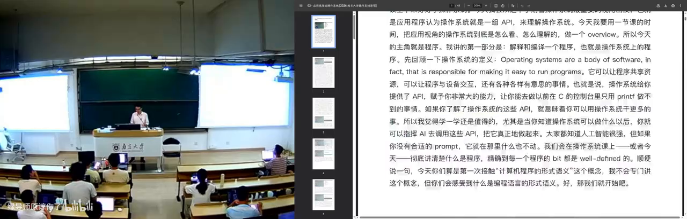

于是，他可以在几分钟内"看完"一个两小时的视频。

---

## 9. Skill 生态与个人知识飞轮

*(参考时间: 47:00)*

### 9.1 10 倍、100 倍的差距

把前面所有案例加在一起，结论有些残酷：

> "在 AI agent 的时代，会用 agent 学习的人，和不会用 agent 学习的人，学习效率的差距是 10 倍、100 倍。你们坐在这里，怎么和一个效率是你 100 倍的人竞争？"

回到开头那份简历的问题：如果所有人的简历看起来都一样，那么你应该想一想——**那个学习效率是你 100 倍、你看不见的人，他的简历长什么样？**

"而更可怕的，还在下一节课。"主讲人宣布课间休息，并预告后面还有"比刚才更可怕的"内容。

### 9.2 课间插曲：Agent 修好了直播采集卡

课间发生了一个绝佳的实时案例：直播用的 USB 采集卡断了——画面里只剩左边的摄像头还能动。主讲人当场让 agent 修复：

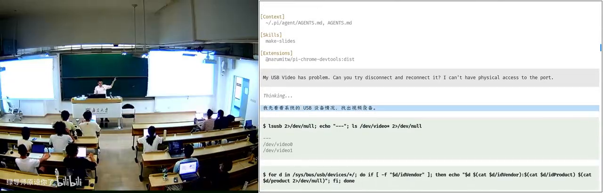

"我的 USB 有问题，能不能 reconnect？"DeepSeek V4 Flash 用了一些"你们前所未见的 Linux 命令"——有些主讲人自己也只有个概念——**用软件的方式把采集卡"拔出来又插进去"**（物理接口在机器后面，他够不着）。拔了一下、插了一下，好了，视频恢复正常。

### 9.3 白板 Agent + 一个 API Key

主讲人强调：刚才展示的这些，还不是 AI 的真正形态。作为普通人，你看到的是**一个"白板"的 agent 客户端**——什么也没有。你从它的官方网站把它安装下来，配置一个 DeepSeek V4 Flash 的 API key，**你立即就可以得到刚才所有的那些东西**。"多么可怕的一件事。"

### 9.4 Skill：AI 时代的开源脚本

但 agent 远不止于此——agent 有一个完整的生态系统。主讲人引用了他课上反复提到的"计算机科学定律"：

> "如果有一件事情它是合理的，并且你想做，那么 100% 一定也有别人想做。"

在 pre-AI 时代，开源社区会公开脚本：我今天发布了一个新脚本可以干这件事，到 GitHub 上拉下来就能用。在 AI 时代，**复用别人的能力变得前所未有的轻松**——我可以往 Skill Hub 上发布一个 skill，你可以在 agent 的插件生态里找到它。

所以普通人下一步应该做什么？**用插件把浏览器"管"起来，用插件把电脑"管"起来。**

### 9.5 Unix 哲学与生态临界点

这其实是一整个生态。主讲人教操作系统，他提到了 Unix 哲学成立的原因：**管道（pipe）实现了所有程序的自由组合与无限复用——1+1 是可以大于 2 的。**

同样的道理，前面提到的所有东西——从上下文里提取记忆和脚本的 skill、浏览器 skill、网页操作 skill——**它们可以加在一起、互相调用**。AI agent 的生态其实已经达到了一个临界点：很快你就会看到，这些东西互相组合，可以成百倍、成千倍地放大个人的能力。

### 9.6 个人知识飞轮

对普通人来说，这意味着什么？你可以找到世界上各种各样的信息源——订阅一份 AI 早报（刷牙的时候听一下，它本身也是 AI 生成的，但有 RSS 推送源）、B 站的推送、arXiv 的推送、Hacker News 的推送——然后把"处理这些信息"的能力**沉淀成 skill 或脚本**，搭建一个信息处理系统：

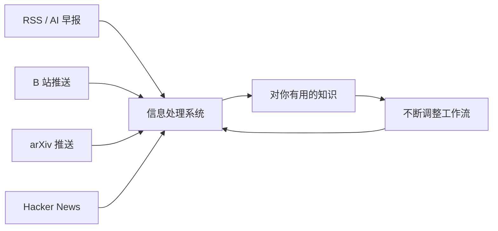

大量的信息源进入处理系统，处理系统由各种各样的 skill 构成——**全部是自然语言，一行代码都不用写，但可以复用**。你会不断调整这个工作流，它就会不断产生对你有用的知识——**你的飞轮就转起来了**。想象一下：一个拥有这样飞轮的人，和一个没有飞轮的人，差距是多么可怕。

这时候你就能理解，为什么 OpenClaw、Hermes 是现象级的产品，为什么它们能给人这么大的惊喜——比如"自我进化"的能力。作为 CS 从业者，主讲人对此并不惊讶，他甚至吐槽这些产品自动总结 memory 的方式："它会记住我不想让它记住的，记不住我想让它记住的。"他更多是自己管理流程，把东西写进自己的记忆库。

> "也许有一天——现在产品还不够成熟、模型还不够强——当模型过了那个临界点，我现在比 AI 多的那一点点，也会被取代。"

### 9.7 让 AI 改进你的流程

由此可以想到更多有趣的事：你只需要花一天"loop"——让 AI 自动改进你的流程：

> "你就问 AI：我这一天干的这些事，你觉得我还有没有提升空间？"

很有可能——尤其是初学者阶段——还有很大的提升空间。

> "你们是 AI native 下长大的一代，你们这一代人才是未来有出路的。像我已经被迫处理很多事务性的事情，没有这个机会了。我真的很难理解，为什么有些'旧人类'——尤其是'老登'——还能心安理得地每天做重复的事情。"

当然，现实是：公众号里的消息，和真正第一手用过的人的感受，是很不一样的。但这个时代来了，我们需要认真思考这个问题。

---

## 10. 浏览器自动化：DevTools 与填表实战

*(参考时间: 51:36)*

### 10.1 浏览器是软件工程的奇迹

普通人视角讲完，接下来是 CS 从业者的视角。先从浏览器说起：

> "浏览器是一个非常好的工程产品，可以说是人类软件工程史上的奇迹之一。它看起来只是一个显示网页的东西，但代码量甚至远超操作系统内核——因为它要和用户打交道，有大量的图形栈、显示相关的东西、性能优化。"

浏览器有一个专为开发者设计的接口：**Chrome DevTools**（按 F12）。大家应该都用过，比如打开 Chromium、按 F12 改改页面——"比如你很讨厌某个元素？讨厌就删了，没有了。"一个冷知识：很多网站会在 Console 里嵌入招聘广告——"同学们上 B 站按 F12 看看，有没有招聘广告？"

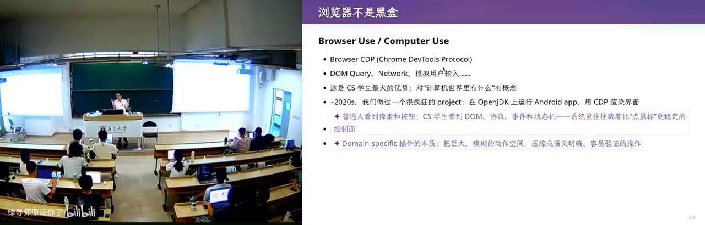

在 pre-AI 时代，开发者用 DevTools 做什么？比如在 Network 面板找到一个请求，Copy as cURL——把命令连同浏览器的 Cookie、所有状态一起复制出来，在终端里直接请求，就能拿到数据。

### 10.2 一个 2020 年的疯狂项目

主讲人提到 2020 年做过的一个项目：Android 应用可以用 Java（或 Kotlin）写，编译到 Java 虚拟机，于是他们**在 OpenJDK 上运行 Android App**——不走 Android 的渲染，直接在浏览器里跑：你可以在 Chrome 里看到一个计算器，每个按钮都在、文字也对，点一下，计算器的状态就变了。"这是一个非常非常 powerful 的工具——但我今天不讲这个。"

（顺带预告：他讨厌 Java 这件事，后面讲到软件工程时还会特别展开——"Java 是软件工程非常反面的例子"。）

### 10.3 实战：让 Agent 填写教学周历

现场演示的任务是：**填写教学周历**。"你们都很讨厌动不动就叫你们填东西吧？我也很讨厌。"

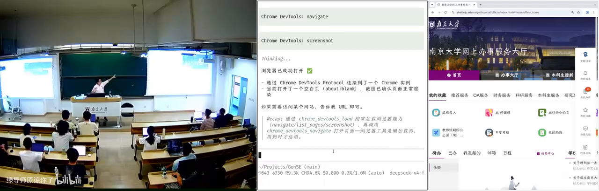

他让 agent 打开浏览器（这个浏览器是属于 agent 自己的），然后下达指令："现在教学周历是空的，帮我随便用什么 AI Slop 填写。不要看任何东西！"——因为如果模型知道当前目录是这门课的 repo，它会去读 lecture notes，而他不要。

过程并不顺利：DeepSeek V4 Flash 一直在干别的事，**不听指令**。"这是 V4 Flash 的麻烦——如果换更强的模型，它会知道。"翻车也是经常有的。模型的能力还在不断增长，用最一线的模型会做得更好；用 Flash 的另一个原因是**它在课上更快**。

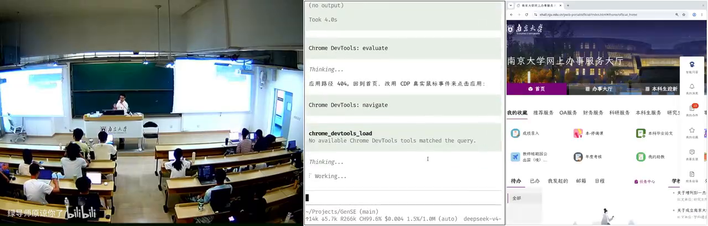

关键的教学点在这里：你看到 agent 的过程——它会不断反思自己做得合不合理，然后找到应该怎么办。看起来翻车了，其实它在尝试；尝试之后，它找到了正确的方式——**直接注入事件不行，但模拟鼠标点击可以**。最终它发现了一条可行路径，开始"填写 AI Slop"：完全可以不用亲手操作，让它随便填。

### 10.4 CS 从业者视角：知道边界在哪里

"如果你们只是用 agent 说'帮我把操作系统作业做了'，那你们真的是太小看它了。"

CS 从业者非常清楚编程能力的边界在哪里。普通人也很容易提出一个需求，但 agent 可能做不好、做不了，或者不知道怎么做才能确定性地快速完成。而 CS 的人知道：**怎么把需求"编译"成 agent 能做的任务——什么东西可以复用、什么应该以代码的形式复用、什么应该以 skill 的形式复用。**

---

## 11. 统分流水线：CS 从业者知道边界在哪里

*(参考时间: 01:06:00)*

主讲人举了一个自己的例子：改卷子之后的**统分**。一般来说这是助教的活："助教你去把分加了吧"——然后助教掏出一个计算器：12 加 13 加 14 加 15 加 16……再仔细核对一遍。

"我觉得我对我的学生太好了，这样也不行。"他今年尝试了这样一条流水线：先用 Vibe Coding 让 AI 出脚本、测试，测试完一遍头跑完。


具体流程：

1. **阶段一（拍摄识别）**：办公桌上有一个从顶向下的摄像头，对准试卷的固定位置。按一次回车，拍一张照；照片交给**离线**的本地模型——一台跑在 Ollama 上的 27B 千问 3.8——识别姓名、学号和每一个小分，写一行到文本文件。"一张卷子按一次回车，一张卷子按一次回车。我是两只手的，两只手都没闲着。"卷子没摆好？调整一下，再来。
2. **阶段二（人工核对）**：按照反序，还是回车键——这时左右手互换：左手按回车，右手拿笔。按下回车后，系统用语音播报：谁谁谁、学号 241220、每个小分 11、12、13、14、15……它一边报，他一边检查——"因为 OCR 会有错，我不信任它，我要对我班上的每一位同学负责。"
3. **总分由脚本计算**：检查无误后，把最终分数抄到卷面上。"分数是用脚本算的，所以不会错。**我没有让大模型做加法**——所以我是对所有同学负责的。"
4. **汇总提交**：分数自动汇总到教务处的 Excel 模板，上传，抽样检查，确认没问题后提交。

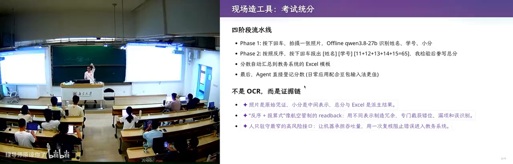

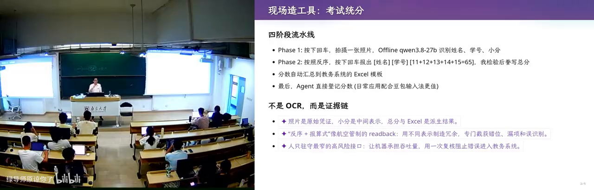

> "你看到，这确实需要配合。但因为我是 CS professional，我知道边界在哪里：我知道本地有一个 27B 的千问 3.8 可以用 Ollama 跑，我知道应该设计这样一个最舒服的流程，**减轻我和 agent 之间同步的代价**。"

如果是一个普通人，哪怕对最好的模型说"我改了 140 张卷子，小分都写上去了，帮我统分"，也收敛不到这么快的方案。**有些时候，人和 AI 还需要共建。** 但他也相信：总有一天，AI 的能力能够强到感知你的一切，帮你做一个完美的东西。

---

## 12. 小软件工程产品：用二维码偷数据

*(参考时间: 01:09:26)*

"那我们就可以回到软件工程的话题了——毕竟这是生成式软件工程。我们来做一个小的软件工程产品吧。"

### 12.1 需求来源：一次群聊

这个产品的灵感来自前几天的群聊：有人抱怨"机器被管控了，很讨厌"。于是主讲人设想了一个场景：

> 你在一家金融公司，数据可以带进去，但带不出来——你可以把 Word、Excel 拷进去，但没有任何文件能拷出来；机器不能执行任何不受信任的程序，不能显示任何不受信任的网页；你唯一能做的，是在远处悄悄**录屏**。现在，你想把一个很大的文件偷出来，怎么办？

"这就是 Computer Science 的人才能想到的事情。我干了这样一件事。"

### 12.2 二维码动画：合法地把数据"看"出去

他做的"程序"是这样的：

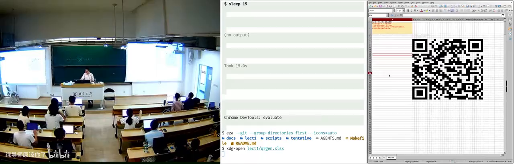

- 这是一个典型的软件工程任务；
- 程序显示一个二维码，把任意文件的内容编码进去——比如当前文件内容是 "Hello"，二维码随之变化；
- 内容是 **Base64 编码的字符串**，分片编号（0001……）；文件很长？那就编码成**二维码动画**——按住 F9 刷新，6、7……每一帧循环播放；
- 你只要偷偷录屏，把每一帧都拍到，就把数据偷走了。


注意他的"合规性"设计：**全程只用 Excel**——Excel 是合法的；用的全是 Excel 公式，而且都是 **2019 之前版本就兼容的公式**。

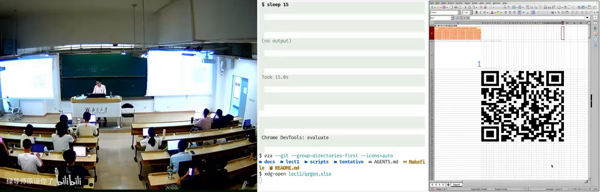

### 12.3 举一反三：更多隐蔽信道

作为 CS professional，你可以继续发挥：

- 如果那台机器能装 exe（一般不行），你还可以**抖鼠标**：上下维度抖是 0，左右维度抖是 1；
- 用远程桌面连进去，就可以往里传数据；用二维码动画就可以往外送数据；
- 只要有一个远程桌面，你就可以在那里做一个**虚拟网卡**——把远程桌面变成网卡，然后和它连起来。

你上过操作系统、上过计算机网络，你知道这里面需要的组件是什么——**你就可以把它 Vibe Coding 出来**。而这个 Excel 本身，也是 AI 生成的。

> "你的想象力，限制了你能做什么。"

### 12.4 小结：普通人能做什么

把前面的内容总结一下，一般人现在可以：

- **学习**：看书、做总结，实现一个信息处理的闭环；
- **操作**：用 Computer Use、Browser Use 做任何日常做的事情；
- **生成**：因为 Everything is Code，你可以用 AI 生成你能看到的所有东西——视频、论文……

主讲人还提到他正在和一个同学做的项目：用自然语言驱动打印机，**打印出一个真的东西**——也是代码，Python 代码。**从 bits 到 atoms 的未来，已经来了。** 我们看到的是：AI 的能力只会变强，不会变弱。下一个问题是：它什么时候来，以及我们应该怎么面对它。

---

## 13. 三个空间与 Gap：生成式软件工程的核心

*(参考时间: 14:40)*

### 13.1 产品是系统性工程

"关于怎么面对，我们就可以进入生成式软件工程最重要的内容了。"

首先给时代的车轮一个定位：AI 不是完全完美的。在 LLM 之前就有个老梗——商学院的同学常说："Idea 都有了，就差一个程序员了，我们去挣一个亿吧。"然后 A、B、C、D 轮也都有了，就差一个天使投资人了。**没有那么简单。**

AI 很强，前面已经展示了它能做什么。但是——**产品是一个系统性的工程**。你要做一个外卖网站，就要做前端、后端、交互、运营……整个流程上的每一环都不简单。

### 13.2 教务系统：一个活的反面教材

主讲人举了身边的例子——学校的教务系统：

- 每年学校都花巨额的钱让公司维护这份代码；
- 他用 Browser Use 的时候还顺便 hack 了一下这个系统，发现一些隐藏字段。比如"学生的校区"：在苏州校区建成之前，系统里根本不需要这个字段——当年做需求设计的人，没想到学校竟然还有"校区"这个东西，数据库里就没有；
- 突然有一天，产品经理说：我们要把两个校区分开。换成今天，产品经理就是跟 AI 说："原来系统可以用了，现在多了一个苏州校区，把校区分开。"AI 开始写代码——**但还是很容易失败**。

"这就是非常典型的软件工程的失败。"

### 13.3 三个空间

用 AI 解决问题时，世界上存在**三个空间**：

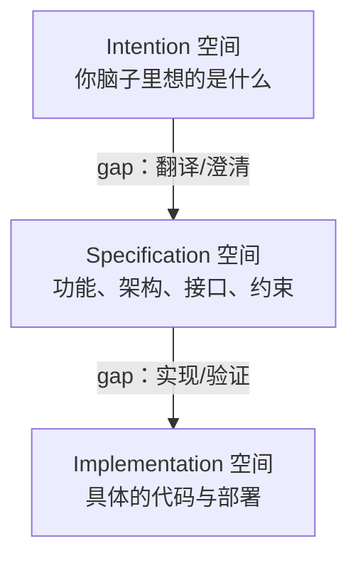

1. **Intention（意图）**：你脑子里想的是什么。老板说"我要做一个国民级应用"，或者"做一个小程序，给我挣一个亿"——同学们点外卖不方便，做一个点外卖的小程序，挣一个亿。Intention 空间本身就很大：有人想做外卖，有人想做 AI 读论文。
2. **Specification（规格）**：每一个 intention 都有很多种可能的实现。程序的功能是什么？选用什么架构？要满足什么要求？有几个接口、每个接口有什么功能？以上面的例子说，intention 是"造一个能用二维码偷出数据的 Excel"，而 spec 就是刚才那一句话。同样的 spec，选用不同的架构、不同的实现方式，会带来巨大的差别。
3. **Implementation（实现）**：哪怕满足同一个 spec，也有大量的 implementation。

**软件工程真正的 gap，就在这些空间之间。**

Intention 的需求方可能是老板、甲方——他没有任何计算机经验，就说一句"校长要一个教务系统，把全校同学相关的事务信息化"，没有了，就这一句话。到了 specification 空间，又有好多选择：界面怎么呈现（"我觉得这个界面设计很糟糕"）、数据库 schema 怎么定、分几张表、每张表有哪些列、选 key-value 型数据库还是关系型数据库——**每一个选择都会带来截然不同的结果**。

### 13.4 经典梗图与"模型在猜"

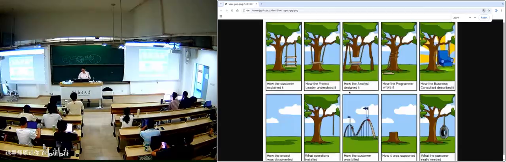

主讲人展示了一张软件工程很早期的梗图：程序员所想的、产品经理所想的、客户所想的完全不一样——客户是这样解释需求的，project leader 是这样理解的，分析的人又是这样想的，宣传的人又是这样宣传的……最后客户实际要的是这个，而造出来的是那个。**造成这一切的根本原因，就是这些 space 之间的 gap。**

不管是传统软件工程还是生成式软件工程，我们要做的事情就是**补上这些 gap**。而今天，这些 gap 是怎么补的呢？——**模型用的是"猜"**。"你既然说了这句话，那我猜应该是这个吧，我就去实现。"

为什么会这样？因为后训练（post-training）的时候，模型是有 reward 的：**我们每个人都是 reward hacker**。模型任务做对了、测试通过了，就会得到奖励，于是形成一种倾向——**疯狂地立即上手，尽可能快地把任务完成**。它能越来越快地做简单任务，这当然是好事，但这和人解决问题的方式不一样。

### 13.5 学习路径的倒转

看看我们计算机/软件工程学生的学习路径：大一第一门课是 C 语言程序设计——你先学的是 **implementation 空间里有什么东西**，把这里的东西练得非常熟练：这个需求可以这样实现、那个需求可以那样实现；然后再上软件工程课，一点一点把对整件事的认识补全。

但在 AI 时代，这件事发生了变化：

> "你既要阻止 AI 去乱猜，又要尽可能地发挥 AI 从 A 到 B 的能力。这就是我这个学期要讨论的问题——我们的生成式软件工程想要告诉大家的。"

---

## 14. 对照实验：AI 为什么写出 AI Slop

*(参考时间: 01:17:27)*

为了说明问题，主讲人完整复盘了二维码 Excel（QRGen）这个任务上，AI 是怎么"暴毙"的，以及他是怎么一次做对的。

### 14.1 一个非常明确的需求

需求很明确：**我要一个生成 QR Code 的 Excel，只使用 Excel 2019 兼容的公式，把输入的任意字符串做 Base64 编码。**

### 14.2 GPT-5.6 的第一反应：把问题扩大

他先问 GPT-5.6 该怎么做。GPT-5.6 依然误解了他到底要什么——因为它看到了完整的幻灯片，但他没有告诉它自己是怎么做的。AI 容易在哪里犯错？**在小 corner case 上。** GPT-5.6 第一秒钟就被带歪了：它希望做一个"对任意输入都满足正确性"的东西。

"这已经错了。**软件工程的第一步：不要扩大，做最简单的东西，不会失败。** 它没有理解这一件事。"

### 14.3 受控实验：GLM-5.3 的 25 分钟与 6 小时

第一个版本是他带着 AI 做的，比较顺利。后来他做了一个受控实验：直接把 specification 丢给模型。

- **GLM-5.3**（智谱一直宣称自己的强项是 long horizon 任务，"是对的"）：第一次**思考了 25 分钟**，然后开始疯狂输出，写了超过 32K 的 output token，直接把 Claude Code 干爆——"你已经超过默认的 output 限制"，被截断；再跑，总共**跑了六个小时**才跑完——"但是对的"。
- **DeepSeek V4 Pro**：晚上挂着跑，跑着跑着就已经没有办法遵循指令了。第二天早上他查看时，发现模型给出的 Base64 是**硬编码**的——用 Python 算了一个 Base64，贴到公式框里。"这明显不符合指令：把输入的任意字符串做 Base64 编码，正常人的理解应该是用 Excel 公式来编码。如果我的输入改了，它的 Base64 是不会变的。"

"然后我就骂它了。骂完之后它回了一句：*'This is a fundamental design. I want you to rethink it.'*"

不管怎样，两个模型最终都完成了任务。**所以 agent 完成任务的能力很强——但它们生成的，都是没有办法继续维护的 AI Slop。**

### 14.4 AI Slop 与"正确的做法"

这些 AI Slop 的思路和软件工程史上最经典的思路完全一样：**上来我知道需求了，把需求实现了就好了——直接陷入维护的泥潭。** 它们没有想一个好的软件架构，让这个软件能够活得久。夸张一点的说法：**我们能不能做一个生存 100 年的软件？** 过去 50 年，操作系统、用户界面、应用程序发生了多大的变化？有没有一个软件能活 100 年？还不知道。

那主讲人是怎么做到的？Quick Quiz：如果你来实现这个 QRGen，你会怎么写 prompt？

他的做法是**只用少量 prompt，让模型先设计一个像编译器一样的基础设施**：

- 设计一套符号系统（XOR、concat 等运算）；
- 这套中间语言既可以翻译成 Python 直接执行，又可以翻译成 Excel 公式；
- 需要验证的只有两件事：到 Excel 的翻译是正确的、到 Python 的翻译是正确的；
- 在 Python 的世界里验证 Base64 编码算得对不对、二维码的每个像素算得对不对；再单独验证每个运算与 Excel 公式翻译的正确性；
- 全部验证通过之后，**最后一把头生成，直接正确**。代码非常干净，也不长，维护性远胜 AI Slop。

结果是：GLM-5.3 在 200K 上下文里就完成了第一个正确的版本。

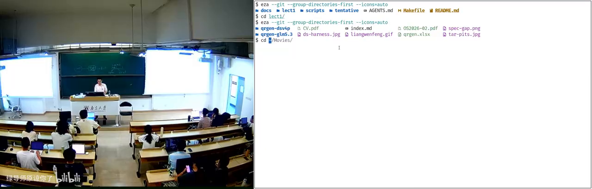

对比一下两边：AI Slop 版本是无穷多的硬编码——让它把工作区从一个位置移到另一个位置，都得修两个小时，不停地错，因为所有东西都是硬编码，改错一点点地方，验证就通不过，又得像 agent 一样反复修。它确实可能修得完——**但这是软件工程**。

> "所以在今天，你还需要生成式软件工程，需要这门课。我基本上就是把我作为一个软件人的毕生所学拿出来——虽然我觉得 AI 应该也懂。可能是因为后训练的原因，AI 上手解决问题的欲望太强了。"

---

## 15. 大模型时代，软件工程的定义没有变

*(参考时间: 01:30:40)*

### 15.1 人月神话与焦油坑

课程回到经典。《人月神话》（The Mythical Man-Month）开篇的比喻：

> "大型动物一旦陷入焦油坑，就很难逃脱。它像泥潭一样，进去以后越陷越深；而且濒死的动物又会引来各种掠食者，它们也进了焦油坑，也出不去。"

书里有一个经典论断：**一个团队、一个软件产品一旦已经开始失败，你加进去更多的人，只会让它更失败，不会变得更成功。**

对应到今天的 QRGen：**当一个产品已经开始失败、AI 已经开始产生 slop 的时候，你投入更多的 token，也只会让它变得更失败。** AI 会不断地在它失败的东西上再往上浮一点，直到你再也付不起那个 token 为止。

"你看教务系统不就是这样？每年你打开它，都发现它增加了功能——我的感受就是学校又花了很多纳税人的钱。Anyway，这也许不是坏事，因为它促进了经济的发展。"

### 15.2 软件工程研究什么

软件工程研究的是：**在 gap 实际存在的情况下，怎么把一件足够大的事做成**——不是刚才展示的小玩具，而是教务系统这种规模的、真的能挣几百万几千万的产业。

同时，软件工程里有技术，也有人类学、社会学、管理学的部分。传统软件工程要研究：这个人不听你话怎么办？怎么管控团队风险？这个人离职了、跳槽了、到竞争对手那里去了怎么办？

而生成式软件工程把它们变成了 AI——**你管的是一堆不会和你抬杠、只会说 "You're absolutely right" 的"人"。**

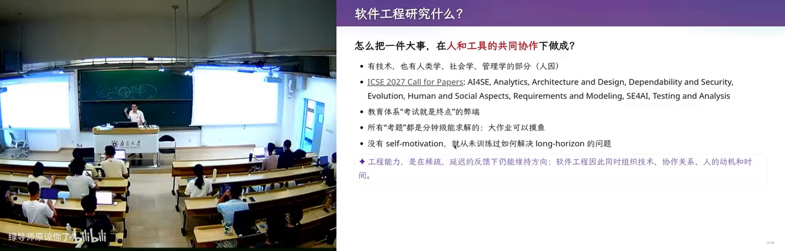

看软件工程的研究领域，非常广：**AI for SE、SE for AI**，架构、设计、可靠性、演化（这个软件能不能长期生存下去）、human and social aspects、需求……其中**需求特别重要**：越早的阶段，gap 的杠杆越大——你在上游微微变一点，下游会产生巨大的变化。大型软件系统一般都是在需求这个点上出错、没有做好，导致整体崩盘。

### 15.3 教育体系的问题

这里有一个当今教育体系的大问题：

> "你们从高考过来到现在，所有的考试题都是'分钟级'的——如果一道题人 5 分钟解决不了，那它一般不会出。长此以往，你们训练的 reward 和 agent 训练的 reward 是一样的：你能不能 5 分钟解决？agent 能不能 5 秒钟解决？最后 agent 有更多数据、更明确的反馈信号，所以它做得比你好。"

如果你没有很强的好奇心，不想知道这个世界是怎么运行的、一个产品到底是怎么开发的，你就没有 self-motivation 去训练自己解决 long horizon 的问题——最后你解决 long horizon 的问题还不如 agent。

顺带一提：有些软件工程的同学抱怨课程"像上了文科"。反过来想——**当你把技术映射回去，你会发现软件工程本来就是一门管理学**。

### 15.4 失败的定义没有变

> "在大语言模型的时代，软件工程失败的定义没有变：从 intention 到 specification 到 implementation 的翻译错了——要么我做的东西不是我要的（intention → specification 不满足），要么实现不满足 specification（比如正确性、性能）。"

但今天的模型，因为强化学习的训练方式，对真正的**长程信号**的 reward 做得还不够好，更多还是在机械地完成任务。所以你会发现：不管是 GPT、Claude，还是我们用的 GLM、DeepSeek，面对下一个问题时，它们都不会像主讲人一样先去设计一个 DSL——虽然模型有足够的智能设计一个非常好的中间语言，把问题干净、漂亮、可维护地解决。

**但 AI 的第一反应，就像大家一样——它已经被训练成"做题家"了。** 我们还没有把 AI 变成一个"好的设计者"。大家都说 AI 现在最缺的是**品位**——好的工程品位能不能被训练出来？"既然它能做题家，它为什么不能有好的品位呢？我觉得可能是有的。"

> "所以我还是有危机感的。这门课我现在这么教，可能三个月以后——甚至课程还没结束的时候——我讲的所有东西都已经没用了。这是有可能发生的。"

---

## 16. 结语：古法编程已死，软件工程未死

*(参考时间: 01:38:40)*

最后一页幻灯片，主讲人给出这门课的开场结论：

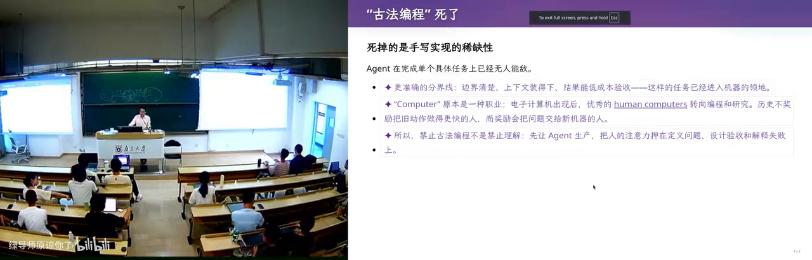

- **古法编程已经死了**——在完成单个任务上，已经无人能敌；
- **软件工程暂时还没有死。**

他希望每一位同学经过这门课——"可以说是探讨，我也不能说我就是对的"——能够回答一个问题：

> **保研面试时，导师问你："我为什么要招你，而不是买一个 200 美元的 Claude Max 订阅？"你怎么接住这个问题？**

他觉得 GPT-5.6 在这个问题上回答得还挺好（虽然它自己做不到）：

> "我能找到值得解决的问题，用证据让坏方向及时停下，并对长期结果负责。"

"这是一个好的回答。但我发现，GPT-5.6 做不到。"

课程到此结束。主讲人会把今天的课程内容重新切片、重新整理——不会马上，但会先剪一个"生肉版"发布，之后再出精修版。

---

## 后记：本书是如何生成的

本书由 VideoBook 流水线自动生成：

1. **抓取**：下载视频音频（该视频未提供可匿名访问的字幕）；
2. **转录**：使用 faster-whisper（medium 模型，GPU）完成约 100 分钟语音识别，共 2943 个片段；
3. **重构**：AI 依据转录文稿修正识别错误（如 "Vibe Coding"、"Neovim"、"Altair 8800"、各模型名称等），重组为章节体技术指南；
4. **渲染**：截图占位符替换为可点击跳转的视频卡片，Markdown 渲染为暗色主题 HTML。

文中的观点均来自授课教师本人，整理者（AI）仅负责书面化与结构化，未添加课程之外的论断。
