# 软件仓库管理（2）：Traceability、jj，与为 Agent 时代重设计版本控制

> **原视频**：[Bilibili · BV1Q6en6NEUo](https://www.bilibili.com/video/BV1Q6en6NEUo/)（时长约 98 分钟）
> **课程**：南京大学《生成式软件工程》（2026）第 04 讲 · Raw 版
> **整理说明**：本书由视频 AI 字幕经 AI 重构而成，口语已转写为书面语，并修正了转录中的明显识别错误；关键时间点均标注 *(参考时间)*，点击截图卡片可跳转视频对应位置。

---

## 目录

1. [开场：Lab 1「会成长的个人助手」](#1-lab-1)
2. [回顾：项目是文件的集合，intent → spec → implementation](#2-intent-spec-implementation)
3. [文件系统的历史包袱与技术债](#3)
4. [Traceability 与 repo.db：软件应该是一个有环的图](#4-traceability-repodb)
5. [content as code：为"这一小步"生成一个 VIEW](#5-content-as-code-view)
6. [再也不看代码？以及为此焦虑的人](#6)
7. [一条评论：contributing.md、新人类与斩杀线](#7-contributingmd)
8. [Git 回顾：merge 的作者权困境与 rebase 的代价](#8-git-merge-rebase)
9. [jj（Jujutsu）：把 change 变成 first-class citizen](#9-jjjujutsu-change-first-class-citizen)
10. [肌肉记忆与学习顺序：直接记住最正确的设计](#10)
11. [人是单线程的：VCS 的隐藏假设](#11-vcs)
12. [提交的速度：从 10 分钟到秒级](#12-10)
13. [一个 agent 一个容器：tmux 多 agent 与监工范式](#13-agent-tmux-agent)
14. [git worktree：更轻量的并行协作](#14-git-worktree)
15. [告别 blame：agent 是你的克隆体](#15-blameagent)
16. [乐观 vs 悲观：用事务与锁重设计并发控制](#16-vs)
17. [版本控制是工具，团队管理才是真正的困难](#17)
18. [受限汉诺塔与挣钱的 playground](#18-playground)
19. [GPT 的正统设计 vs 我的设计：先 git commit，再谈数据库](#19-gpt-vs-git-commit)
20. [现场实验：把 lab 需求直接丢给 agent](#20-lab-agent)
21. [prompt 的舔狗：过度遵循与 intent 的 gap](#21-prompt-intent-gap)
22. [MVP 与以不变应万变](#22-mvp)
23. [复盘 agent 的产出：早期的 prompt 决定项目的走向](#23-agent-prompt)
24. [后记 Postscript：本书是如何生成的](#postscript)

---

## 1. 开场：Lab 1「会成长的个人助手」

*(参考时间: 00:00)*

上周讲了一点版本管理，这周继续。讲者先发布了 Lab 1：按照这门课的惯例，**所有作业都是选做、自愿完成**，但最终会验收（也许学校要求提交成绩）——大家交链接，由他的机器人来评分。

第一个 lab 的需求听起来很时髦：**一个会成长的个人助手**。要求不限，想怎么做就怎么做，最好还是 vibe code 一个。讲者预告：今天课上会留时间，他自己当场 vibe code 一个，并告诉大家"直接让 AI 去做"会遇到什么样的小坑。另外因为调休，这周日还有一次课，讲软件架构。

### 1.1 需求示例：每个人都需要的那个助手

作业里给了一些供参考的需求方向：

- **个人学习数据库。** 这学期大家在上的专业必修课——计算机网络、概率论之类比较困难的专业课——可以把资料放进个人数据库；参与研究组课题时，也可以把论文、相关文献、教科书整理进去。
- **个人信息的自动填表。** 大家填表已经填得很烦了：每次给你一个 DOC 表格，要填姓名、学号、身份证号，有时候还有个人简历。讲者说他已经把这些事情全部交给 agent 了——"一句话，把这个东西填了"。

讲者讲了一个故事：疫情的时候他招过一个研究生，在他这里做了三年，做的就是一个**自动填表系统**——因为觉得填表很烦。等到毕业的时候突然有了 ChatGPT，学生很慌，觉得自己做的事情马上就要被替代了。讲者说：不要紧，你赶快答辩，就可以毕业了。**这世界就是发展得这么快。**

- **把数据库和 email 邮箱关联起来。** 比如讲者两周以后会在半夜给大家发邮件，而你的 agent 可能会把邮件回给他——实现一个 **always on** 的后台助手。你们也许可以买一个一两百块钱的很小的嵌入式设备，在宿舍里持续地跑你的 agent loop。
- **用你的信息办理一卡通的事务。** 就像上课的时候那样，一句话、一次对 agent 的子进程式的调用就可以。
- **手机端联动。** 也许是一个网页，也许是苹果的 app 或 Android 的 app——你只要让 agent 去做，它会自己帮你下好所有需要的东西，把你要的东西做出来。

### 1.2 为什么要布置这样的实验：让你亲自踩一次焦油坑

看起来所有的任务都在 AI 的能力范围之内，对吧？**但是**——如果你直接把实验要求丢给 AI 去做（讲者今天会试，他自己也没试过），它在一开始就会做出很多"看起来也合理"的决定，而这些决定会让项目的维护变得越来越困难，直到陷入**焦油坑（tar pit）**：

> 当你的 AI slop 开始不断消耗你的 token 的时候，你终于会有一天下定决心：好，我要把这个项目删掉、从头重做；或者回退到某一个很早期的版本，从头做。

**这就是这个实验想让大家体验的事情。** 讲者相信这个项目对每个同学都有用——这也是他设计实验的初衷。他还提前预告：下一个 lab 会和这个 lab 有非常大的关联，而且你们暂时猜不到——你会发现 Lab 1 的要求都做好了、它已经成为一个非常舒适的个人助手之后，他再给你加一个需求，**这个需求和前面所有需求都关联、并且有一定的冲突**，你一点一点去改，越改越崩溃。

所以如果你 Lab 1 选择躺倒、或者让 AI 直接做完、下一次再把它删掉重做，那可能就没有这个软件工程的体验了。

## 2. 回顾：项目是文件的集合，intent → spec → implementation

*(参考时间: 05:01)*

回顾上节课：软件的项目管理。**项目是各种文件的集合**——你的 intent、一些设计文档、你的 README，都在你的项目里。

讲者重申了他对 README 的偏好：**不喜欢 AI 写出来的非常非常长的 README**。对他来说，README 应该写的是：

- 你设计这个项目时最初的初衷：你想做一个什么样的产品；
- 这个产品能达到什么样的效果，可能配两个 screenshots；
- 你最重要的那些设计。

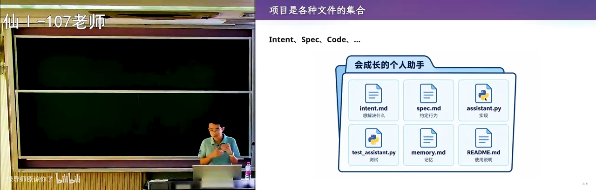

他打了一个比方：有一天你突然想了一个非常好的点子，真的想用它去挣一个亿。要挣一个亿，你就要组建一个创业团队，要说服 computer science 里的人——比如说服讲者出来干。这时候你其实**只需要一个比较短的 README**：这是你的 intent，"我想做这个东西"。

剩下的东西——我有架构的能力、我有写代码的能力——我可以补出来。你不需要知道这个软件系统是怎么样的：它的 specification 是什么、用什么样的数据库、怎么样支持用户从 1 到 10、到 100、到 100 万、到 1 亿——这些 computer science 的知识你可能没有，**但你不需要有**。你只要有一个最原始的设计，那个 intent。

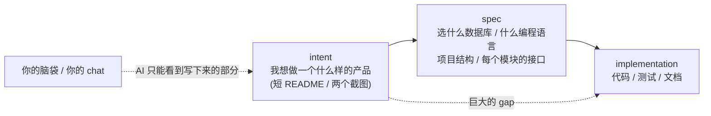
```mermaid
graph LR
    A["intent<br/>我想做一个什么样的产品<br/>(短 README / 两个截图)"] --> B["spec<br/>选什么数据库 / 什么编程语言<br/>项目结构 / 每个模块的接口"]
    B --> C["implementation<br/>代码 / 测试 / 文档"]
    A -.->|"巨大的 gap"| C
    D["你的脑袋 / 你的 chat"] -.->|"AI 只能看到写下来的部分"| A
```

然后再到 spec：我要选什么样的数据库、甚至选什么样的编程语言、项目的结构是什么，小到每个模块的接口——都属于 spec。再到 code implementation。**现在它们都在这个项目里。** 有了这样的项目以后，很自然地你就需要一个容器，把这些各种各样的文件管理起来。

## 3. 文件系统的历史包袱与技术债

*(参考时间: 06:02)*

大家用文件系统来管理项目，**其实真的就是图方便**。回到 1950、1960 年代，操作系统给你的存储功能就只有文件，没有别的——那个时候关系型数据库还没有发明出来。所以所有程序员别无他法，只能把项目以文件的形式存进来。这更多是一个历史的原因：历史不停地往后长、往后长，导致了今天。

讲者自己觉得：**文件系统可能不是组织项目的正确方式**，因为文件系统丢失了很多文件不适合表达的信息。

有些信息其实是比较容易表达的：我的 intent、spec，"这个地方我是怎么想的"的一条文档；或者这个测试用例是什么——输入是什么、输出是什么、我要 assert 在程序运行过程中什么东西不能被违反。**但你马上就会发现，项目里有很多隐藏的关联是没有地方放的。**

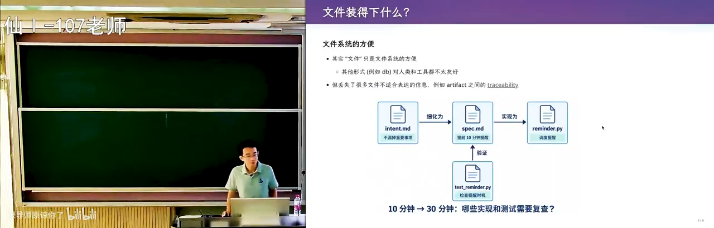

举一个你们经常会在 AI 写代码时遇到的例子：

- 你发现性能不够了，要让 AI 把 linked list 换成一个更高效的 tree 结构去优化性能——这是一个很常见的需求；
- AI 啪啪啪给你把代码改了；
- 但你没有想到的是：你可能在某一个 markdown 文档里写过一句"我这个项目的数据是用 linked list 管理的"；
- 于是在项目当中，**你的文档、你的代码、你的测试之间就形成了一个关联**；
- 你写文档的时候可能还没有代码，所以你随手一写"这是个 linked list"；一旦代码实现了，这个关联又**没有强行地联系上**。

**这就是一个技术债（technical debt）。** 因为以后随着文档和代码不断地向前推演，它们的不一致只会越来越多、不会越来越少，然后这个软件就陷入一个维护的泥潭了。

后面你拿出一份代码——甚至 AI 拿出一份代码——那到底是文档说的对还是代码说的对？你跟它聊天的历史没有了：那个 chat 已经消失了，你换了一台电脑；你的 git repo 里面可能还有一些 change 的日志，但到最后你真的不知道到底是代码对还是文档对。

## 4. Traceability 与 repo.db：软件应该是一个有环的图

*(参考时间: 09:11)*

其实在软件工程里面，这是一个研究了非常非常长时间的问题，叫 **traceability（可追踪性）**。讲者展示了一篇 2014 年的 review，里面 review 的是更老的文章：所谓的追踪，就是——在一个软件项目当中的各种各样的测试用例、文档、哪怕文档中间的一行代码，**它们之间的关联是什么？我们能不能在这个软件系统的演进过程中仍然维持它？**

这是一个非常软件工程的问题。所以很多时候我们觉得蛮有意思：文件系统将错就错了。但大家最后总有一天会发现：你用文件系统来管理代码，你受不了了——打个压缩包发布、打压缩包发给你的合作者——这件事情已经维护不下去了。**所以就有了 SVN，有了 git。那下一个是什么？** 大家有没有想过下一个是什么？讲者今天会讲另外一个、可能甚至比 git 更好用的版本控制工具；但他同时也觉得：如果以后我们再也不要写代码了，那软件就不应该是现在 git repo 里这样管理的。

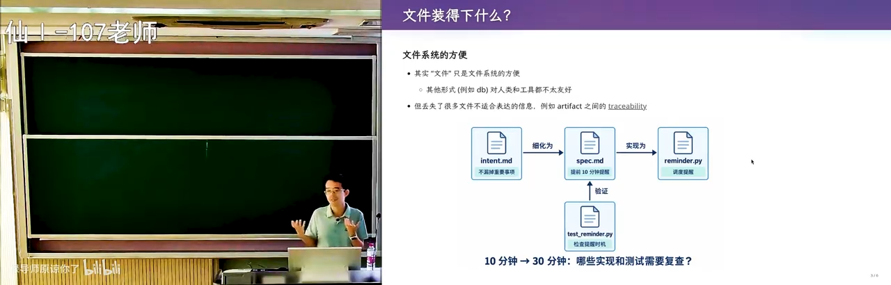

### 4.1 把软件变成对象与关系：一个有 cycle 的 graph

我们一直在想：等这个未来到来，软件或者说部件之间——也许我们还是需要文档，但我们的文档可能是好多个**切片**：把它们变成好多的对象（object）或者实体（entity）。然后：

- 这个文档和这个实现之间有一个关系：**这个代码实现了这个文档**；
- 我可能有一个测试用例，这个测试用例也关联这个文档；
- 这个测试用例又和代码的这部分实现关联起来；
- 这个文档又和那个文档关联起来。

**你看，这是一个完全结构化的东西，没有办法在文件系统里以一个树状的形式表达**——这是一个随便连接的、有 cycle 的图（graph）。

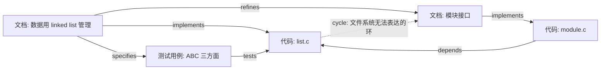
```mermaid
graph LR
    D1["文档: 数据用 linked list 管理"] -->|implements| C1["代码: list.c"]
    D1 -->|specifies| T1["测试用例: ABC 三方面"]
    T1 -->|tests| C1
    D1 -->|refines| D2["文档: 模块接口"]
    D2 -->|implements| C2["代码: module.c"]
    C2 -->|depends| C1
    C1 -.->|"cycle: 文件系统无法表达的环"| D2
```

这个东西比如说我可以把它放到一个数据库里，叫 **repo.db**。那显然人类就没有办法用现在 UNIX 世界里面的工具去维护这样的一个 repository 了。但不要紧——**用魔法打败魔法**：人类理解不了的东西，我们只要训练 AI；它只要有强化学习的反馈信号，我们就可以训练 AI，AI 能够理解这个 repo。

我们要干的是什么？这是一个非常大的项目：什么 Linux 内核、数据库，或者你们想做的一个价值一个亿的产品。每次你就说：好，AI——你也不太可能一下子说"我要把这个产品直接变成另外一个产品"；当这个软件系统已经在工作了，你一般来说就是要给它**增加一个功能、修改一个功能**。

## 5. content as code：为"这一小步"生成一个 VIEW

*(参考时间: 13:14)*

这就跟 git 的 philosophy 很像：git 管理了文件目录的快照和快照之间的关系，它希望我们**小步前进**——我每做一件事情、我 fix 一个 bug、我改一个文档，我都产生一个 commit；这样我就可以在多个人之间协作，每个人可以自己产生自己的 commit，然后我们可以用 rebase、merge、fast-forward 或者普通的 merge，来创建一个可追踪的、整个项目的修改历史。

那如果我们以后也不要文件了——也许还可以用文件系统来管理——我们要的是：**让 AI 自动维护所有的软件 artifacts 之间的一致性。** 比如说：

- 代码和文档必须要一致：我文档说这是 linked list，我的实现里面必须是 linked list；
- 我的文档说我要有 A、B、C 三个方面的测试，那我的 test case 就必须要有 A、B、C——它们都是关联起来的。

从 git 里面我们知道：我们希望小步前进。而当我们谈"要做一小步"的时候，其实我们知道这一小步是干什么的——所以你可以 chat：你跟 AI 说"我现在发现它有个 bug"，或者"我做了一个产品，今天对这个幻灯片样式不满意"——**这其实就是一个小步**。

这个时候，一个大型软件系统里面绝大部分的内容跟这个小步都是没有关系的。比如讲者自己的 repo：顶层有 assets、有 `.cache` 缓存系统、有 P1 P2 P3 P4 P5、有一些脚本等等。**任何一个软件系统，当你只做一小步的时候，你就只需要看到这个软件系统的一小部分，大部分东西应该是无关的。**

那既然是无关的，我们就可以让 AI 根据我们的 chat，把和我相关的东西给摘出来：它可以知道"哦，我现在需要的是这个文件、这个 test case 和这个文档，其他的东西都不需要了"。然后你想 AI 有什么能力？**AI 有动态生成任何内容的能力——everything is code，content as code，code 可以表达任何东西。** 所以 AI 可以根据我的 chat，生成一个和我要改的这一小步相关的 **view**。

你看，你们学到的各种系统里面的概念还是有用的——就因为不是所有的同学都学过数据库：数据库里面有一个叫 **view** 的概念——我们的数据就在这了，但我可以创建一个不一样的查询，把它以另一个形式展示出来。就是这个很简单的想法：**我希望把这些数据以另外一个形式展现出来。**

### 5.1 从 V0 到 V1：看板、修改、再落回 repo.db

比如说当我看到的时候，我看到的不是这些代码、文档，而是一个**可视化的看板**：看板上面列出了和我这个小步相关的一些东西，然后问我要改什么。我一把改完了以后——同样的，从一个 V0 到 V1，它还是一个 repo.db——但是这一小步就会把这些相关联的东西都改掉：比如说我要增加一种类型的测试用例，它就会在这些地方加一些测试用例、那些地方加一些测试用例、有些地方要改掉。

**它就从一个个各种错综复杂关系的一致状态，做一次小步的修改，到下一个一致的状态。** 这样，软件工程就彻底变了。

## 6. 再也不看代码？以及为此焦虑的人

*(参考时间: 17:16)*

我觉得这是一个未来有可能发生的事情：**在 AI 内部它是这样生产软件的，然后从此以后我们也就再也不要看代码了。**

讲者顺便批评了现代的 IDE：比如 Cursor，他现在打开默认就是 agent mode，然后 agent mode 就是——原来我们熟悉的那个 IDE 就没有了，强迫你用一个类似 chat 的方式去跟它沟通。"但因为我还是相对来说比较精通古法编程的，有时候我还是对代码有一些掌控欲——呃，可能是不好的、可能是不对的。" 但未来可能会是这样一个途径。

同学们肯定会焦虑：如果未来这件事情真的有可能发生，而且可能一两年以后就真的有一个公司把这东西做出来了，**那我们学那么多东西还怎么办？**

然后你会发现：在我们思考、创造这些东西的过程当中，**用的都是你们学习的这些经典、集大成的 computer science 课程**：

- 我刚才说的数据库里的**视图**——我借用了数据库的概念：**实体和关系**；
- 我借用了 **git**：这个模型没有变——git 长期的开发经验说我们要一步一步向前；如果在这个模型底下我们是大步向前呢？那就惨了。

当然也有可能发生：模型非常非常强，一个非常大型的项目，一步啪就变成下一个了——这个怎么做我们现在还不知道。但至少在初期，我们可能还是要沿用过去大家积累的软件工程智慧，**小步向前，通往那个极乐的世界**。我还是相信这个极乐世界有可能确实能到。

## 7. 一条评论：contributing.md、新人类与斩杀线

*(参考时间: 19:20)*

这里讲者引了一条他觉得蛮有意思的评论。这位同学应该已经毕业了：因为上上节课讲者问同学们 git rebase，大家都不知道什么是 git rebase；然后他 raised a valid point——**学生时代大多数人是不会和他人共同合作的（也就是做作业），所以 rebase、merge 用的场景就很少。** 这个 point 是对的：你们做作业的时候确实不会。

讲者的回应大概是这样的：但是如果你真的往外面的世界去走一走，这个互联网开发者社区铺天盖地都是文档，所以你一定会在某一天留意过别人的项目里有一个叫 **contributing.md** 的东西。

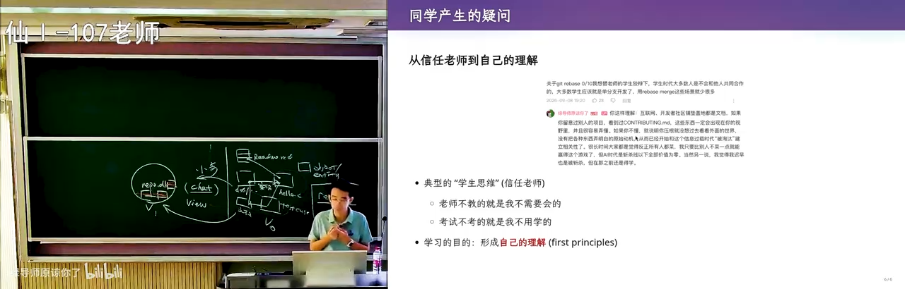

一般来说 contributing.md 是仓库根目录下的一份**贡献者指南**，通常回答"我怎么参与这个项目"。你看它里面就有：项目的总体结构、分支、提交信息、PR 的规范和流程。如果你看过很多项目的 contributing.md，随手打开看一眼：如果里面东西你都知道了，那你就知道了；如果你不知道——比如说有一天你一定会看到一个项目里面说"你必须要在你自己的分支上 rebase，我们禁止你创建那种分叉的 merge，**我们要保持线性历史**"——你就会知道 rebase 是干什么的。

### 7.1 新人类与旧人类之间的 gap

现在我们的社会变得太快了。有一种学生——不是批评——因为你们上高中的时候就是这样的：**在高中时候老师不教的就是你不需要会的，考试不考就是你不用学的。** 为了升学的利益最大化，这个是正确的，没有错。但到大学以后如果还带着这个思维，就会有这样的 gap——**一种新人类和旧人类之间的 gap**。

当然我相信每一个同学也还是可以成为新人类的：你只需要有一些注意力，去注意到更多的东西。因为现在我有一个危机就是：**AI 时代的斩杀线以下的价值就全部归零。** 当然我觉得现在斩杀线可能还斩不到各位 985 大学 computer science 专业的同学，但是可能比如说那些低级的智力劳动——比如会计从业者，我看过一个报道说中国可能有一千万还是多少会计从业者——这个行业里面顶端的人肯定暂时还是没有威胁的，但在底下的大量的人都面临被 agent 替代、斩杀的危险。

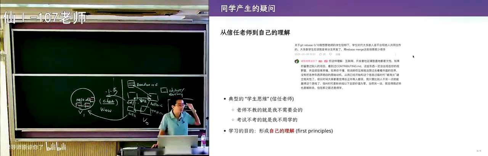

所以你们需要在这些经典的课程上——不管是什么操作系统、编译器，还是软件工程——学到一些经典的东西、里面有些软件工程的智慧，然后最终形成你们自己的理解。

## 8. Git 回顾：merge 的作者权困境与 rebase 的代价

*(参考时间: 22:22)*

继续回到软件工程。不管是畅想未来会发生什么，还是就用 git：git 管理的是**快照**——也就是一个目录的快照。我可以在快照上面做开发，它要求小步。现在有一两个开发者，一个是 A 一个是 B，就可以独立地在这两个快照上面做开发。

如果你想把它们合起来，那在 git 的原始模型里面，**rebase 相对来说是不那么提倡使用的**：它说好，你会创建一个两路的 merge，它有两个 parent，继承了这两个的修改。但是这又带来一些问题：

- 比如说这个 merge 是由 A 来干的，那这个 merge 里面的一些由 B 写的内容，**它的作者就变成 A 了**——它其实有一个隐藏的作者修改；
- 比如说 B 在这儿加了一行，如果发生冲突、在 resolve 的时候，那冲突完了以后这个称职就是"由 A 完成的"——**B 改的代码最后 ownership 又归到了 A**。这会带来一些相对来说小小的麻烦。

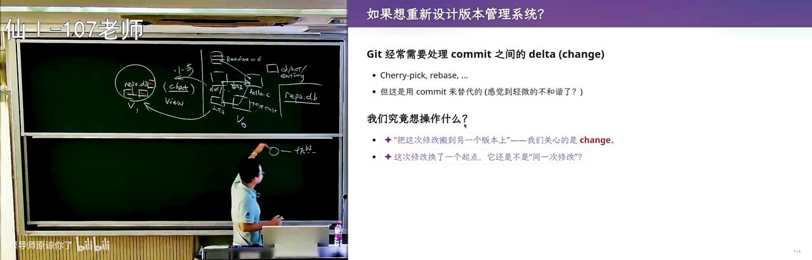

### 8.1 rebase 做了什么，以及它的风险

rebase 解决了这个问题。（讲者横过来画：第一排的同学有点看不到。）如果我现在有两个历史：A 同学改了两次、做了两次提交，得到两个快照——delta 1、delta 2；然后另外一个同学 B 开始改：B 加了一个 feature，又加了一个测试。

rebase 做的事情是：**我不是直接把这两条线路并起来创建一个 merge 提交，而是我试图先试一试——有没有可能把这个 feature 加在 A 的后面？** 如果加上了，OK，那就成功了。但这是有一个很大的风险的：因为我可能在这个里面加入了一个测试用例，然后这个测试用例和这个 feature 就是不兼容的；或者甚至他们就改了同一个地方、做了两个完全不兼容的东西——那这个时候它是有可能失败的。

如果成功，这就比较好：我再把 test 放过来；如果成功，那它就一路相当于——**也就是说这两条线上那边的修改完全没有任何冲突——我就可以一路把它合并过去，变成一个线性的历史。**

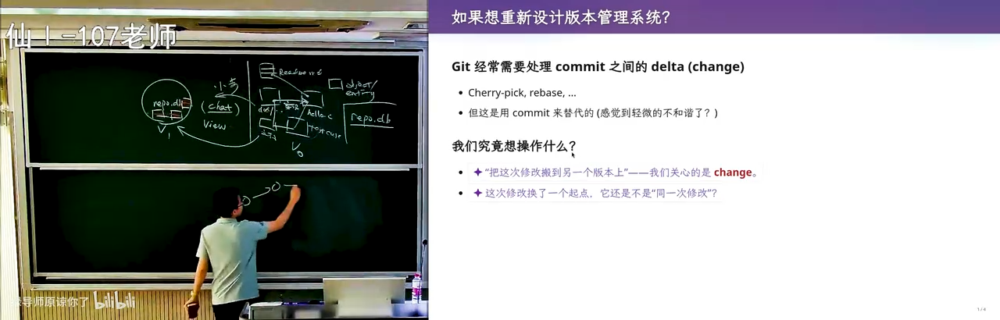

**但一旦发生冲突，这就非常危险了。** 为什么呢？一旦冲突你就需要 resolve，你会进入一个 rebase 的模式——你们如果进入过这个模式，会发现瞬间自己就不知道应该怎么办了。然后这时候你就打开你的 agent 说"哎我现在发生了什么"，agent 会细心地解释给你。更麻烦的是：你就算是把 feature 搬过来了，搬 test 的时候可能又要失败，然后你还需要再把 test 搬过来。

而且每一次你都会创建一个新的提交：commit 有 id，每个 commit 都有 id。如果你是一个两路的 merge，那所有的这些 id 都保留了，你会创建一个新的 id；**但是因为你是 rebase，每次这样的 rebase 就会创建一个新的 commit**——因为这个快照的 base 在这，所谓的 re-base 你就知道：哦，base 要改掉，要把这个 base 改到这里来——那你会创建一个新的 id，每次会创建一个新的 id，然后这个历史就变了。

然后你会感觉到这里有一点点轻微的不一致：就觉得你好像不是完全想要这样去管理软件。**因为我们关心的是修改**——我希望的是把这个修改搬过来、把这个修改搬过来；而在 git 里面，修改是用 commit 来替代的：好，我现在有一个 commit，然后这个 commit 和它的 parent 之间的关系就叫一个修改。**它没有一个专门的叫 change 的对象。**

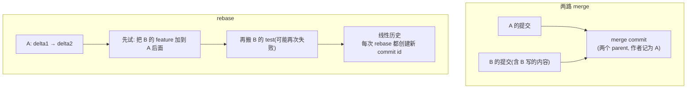
```mermaid
graph TD
    subgraph M["两路 merge"]
        A1["A 的提交"] --> MG["merge commit<br/>(两个 parent, 作者记为 A)"]
        B1["B 的提交(含 B 写的内容)"] --> MG
    end
    subgraph R["rebase"]
        A2["A: delta1 → delta2"] --> R1["先试: 把 B 的 feature 加到 A 后面"]
        R1 --> R2["再搬 B 的 test(可能再次失败)"]
        R2 --> R3["线性历史<br/>每次 rebase 都创建新 commit id"]
    end
```

## 9. jj（Jujutsu）：把 change 变成 first-class citizen

*(参考时间: 27:23)*

在 git 里面，修改是用 commit 来替代的，绝大部分情况都能满足。**但是如果我们把 change 也变成 first-class citizen，会发生什么呢？你就发明了下一代更好用的版本控制系统。**

这就是 **jj（Jujutsu）**：它的底层（机器组）和 git 是完全兼容的，你可以直接把它当 git 用；但它在上面增加了一个叫做 **change** 的概念——每一个这样的东西、每一个 change，都可以被看见、被携带。

- rebase 的时候，它会**把 change 直接搬过来**；
- change 还是有可能冲突的——冲突是解决不了的；但如果我在 rebase 的时候要冲突，因为它有 change 这个 object、change 这个概念，所以它可以把这些 change 一路带下来，直接 rebase 到这里——但里面引入了好多冲突；
- 它还是运用了 git 的那个冲突记录，但你看它里面有一套自己的记录方式，**把所有这些 change 的冲突也都塞进去**；然后你可以在这里相当于把它们搬过来，在这里再 resolve。

**它的底层模型没有变，但是你用起来会舒服很多。**

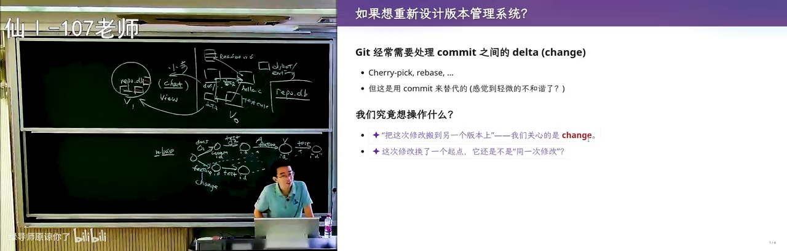

### 9.1 没有 staging area：hello.c 改到一半，导师来电话了

它还有一个很好的特点：**它不需要 staging area。** 你在 git 里面最讨厌的是什么呢？讲者在操作系统课上会讲这个例子：

- 你现在有一个工作区，有一个 `hello.c`，你把它改、改、改到一半——这个时候项目还不能编译、测试也通不过；
- 突然导师给你打电话："哎呀我现在有一个很高优先级的项目，有个 bug，马上客户就交不了差了，这个赶快给我一分钟修了！"
- 那你怎么办？**你不应该 commit**，对吧？你需要的是：把它加到你的 index 里，然后 `git stash`——它会压缩起来；
- 然后你去修那个 bug；刚修了一半，导师又打电话："这个 bug 别修了，我还有一个优先级更高的 bug，你去把它修了。"
- 你这时候要再把它 stash——然后 `git stash` 是一个**栈**，它里面就会有好多个提交，你需要去管理那个 stack。

想象一下：如果你**随时随地都在编辑这个 repo**——这不就是一个 change 吗？你现在把 `hello.c` 改一改、加一行减一行，它都是 change。

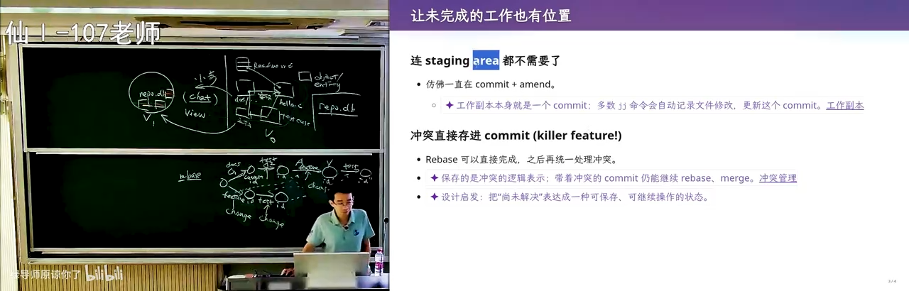

### 9.2 jj 的做法：每改一个字节，立即提交并抹掉上一次

所以 jj 好像在干一件什么事呢？**你但凡改了一个字节，它都会立即做一个 git commit**——当然这个 commit 不会产生好多线性的历史：它先把上一次的那个提交抹掉（你改了一个字节，那上一次的提交就被抹掉了），然后重新用当前这个修改去替代这个提交。

也就是说：**你永远处于一个提交的状态、一个 change 提交的状态。** 那你就很舒服了——你连这个 staging area 也不需要了。这就是一个非常好的设计。

从"我要把 change 作为 first-class citizen"开始再往后推，你就可以发明自己的版本控制系统。当然这不是它的全部，还有一些别的路线可以推导出来。你们适当的时候可以质疑一下：比如说 git 有没有哪里做得不够好？如果可以做得更好，还能做怎样的设计？——这是非常有趣的一些设计。

## 10. 肌肉记忆与学习顺序：直接记住最正确的设计

*(参考时间: 32:28)*

讲者给了一个学习建议：你们可以在 agent 的带领下——或者说他开了一个头、给一些 motivation——把这些最重要的 prompt 交给 agent，说："我如果要学 Jujutsu，我想从 change 开始理解。" 如果你看 jj 的 tutorial，它其实一上来就会告诉你：它没有 staging area，管理版本更自然，**它对人类更友好——然后实际上它可能会对 agent 也稍微更友好一点。**

我觉得这就是为什么你们作为 AI native 的人类能够淘汰我们这一代人：**我已经形成了 git 的肌肉记忆了；然后比我更老的一代人，他已经形成了 SVN 的肌肉记忆。** 一旦人形成一个肌肉记忆以后，要把这个习惯掰过来就很困难了。

比如说我现在对 git 是有肌肉记忆的；但是我即便能够理解 jj 的概念——甚至我可能理解得比你们作为初学者还要更好一些，我还是可以从 first principle 去思考它、自己相当于 virtually reimplement 这个系统——**我即便能够理解，我也没有足够的时间再去训练另外一个肌肉记忆。**

所以你们是反过来的、跟我正好是反过来的：**你们应该在现在还没有形成记忆的时候，就直接去用那个对的东西。** 人类历史都是积累的嘛：SVN 实在用不下去了才用 git；然后发现了 git 的缺点以后有了 jj。所以你们可以的是：**先用肌肉记忆记住一个最正确的设计，然后再去理解这个设计是怎么样。**

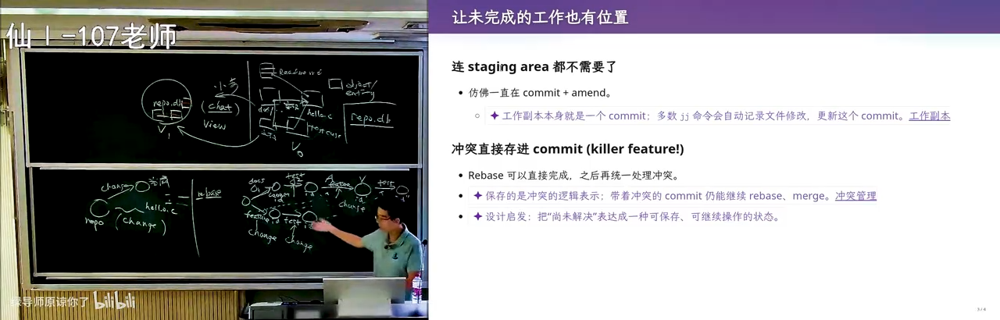

你再回去想的时候：哦，原来 git 这么蠢？——在 git 出现的时候大家会想"哦 git 这么先进，它是一个 persistent data structure"；SVN 从一开始从纯 delta 那条线就走错了；到 git 的时候大家觉得很先进；然后到现在你再回去看：哦，原来 git 也犯了一些设计上的错误。当然这是因为它最早的时候没有想过 rebase 会有这么大的 impact——它有 merge 就已经很好了、就能解决它手上的问题了，所以它可能没有把这个概念模型想得更加的清楚。

这是一些有意思的 comments，也是给你们学习的一些建议：**在学东西的时候，尤其在 AI 的辅助下，可以不断地往前走、往前走、往前走。**

## 11. 人是单线程的：VCS 的隐藏假设

*(参考时间: 36:30)*

好，但这门课不是"软件工程"，这门课是**生成式**软件工程。所以我们要真正做的事，是在 agent 的时代再次重新设计版本管理系统。你当然可以让 agent 去用 git、让 agent 去用 jj——jj 对人类来说是一个很大的进步，但对 agent 来说进步相对会小一些（因为它好像很会 rebase 这些）。这个时候你看：我们一路走过来，SVN 有局限、git 有局限——**那在 agent 的时代，我们的局限和我们要破掉的改进是什么？**

刚才所有的 version control system 都有一个假设：**这个 version control system 的使用者是人类。** 人类有什么特点呢？**人类是 single-threaded 的生物。**

讲者一直在上操作系统课的时候讲并发程序，打的比方是：把线程想象成是一个人，你的线程可以访问共享内存；访问共享内存的时候两个基本的操作是 **load 和 store**（或者说 read 和 write）：我可以从一个变量里读一个值（把 X 读到我的临时变量里），或者我可以写 X 等于一。**然后这个操作是不能同时进行的**——我不能说既读一个又写一个，你这样就需要一个原子指令了。

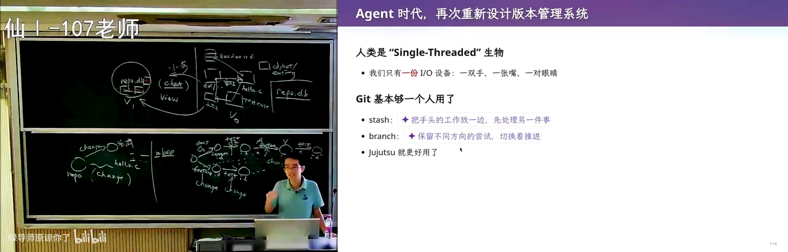

绝大部分的 shared memory access，你能想象成人是什么呢？**如果我想要观察这个世界，那对不起，我手要背在后面，我只能看。** 等我看完了——比如说我看到这个同学在这，我想要对他施加一个效果，我想用这个粉笔导弹射击他——那当我真正要 write、要写一个变量的时候，**我必须要把眼睛闭起来**。而我把眼睛闭起来扔的时候注意：**我读到的那个值其实已经失效了**——那个值已经是旧的值，是我上一个时刻读的。在上一个时刻到这个时刻之间可能经历了很多的事情：可能我被换 CPU 换下去了、我被中断打断了、然后换了另外一个线程上来执行、执行了一秒钟以后我才恢复过来；我恢复过来以后，我在寄存器里面看到的 X 值是我上次读的 X 等于一——然后这个时候我就把那个粉笔扔出去了，**那很有可能就扔的是错的**。

多线程共享内存就带来了无穷的问题。其实人类也是的：**人和人之间是有这个无法逾越的物理屏障的**——你不能理解我的思想，我也不能理解你的思想；我就是一个独立的个体，由分子把我很强地连在一起。OK，所以我们只有一份 I/O 设备：一双手、一张嘴、一对眼睛。

## 12. 提交的速度：从 10 分钟到秒级

*(参考时间: 38:30)*

那么我们以这种方式编辑代码库、产生 change，那就是**以小时为单位**的。一个软件公司负责一个模块的开发，可能多也就十几个人——十几个人已经是一个不小的团队了。那十几个人每个人以小时为单位开发，那最多这个也就是**以 10 分钟这样的单位产生一个提交**。

10 分钟为单位产生一个提交，意味着这个速度会比人和人之间沟通的速度要慢很多：尤其是一个 team 工位都在一起——你们研究生的工位都在一起——你要写一个东西要一两个小时，你在写之前肯定跟师兄说一声："哎师兄我要干个这个，行不行？" 二三十秒钟，师兄说行，你去改吧。**我们现在不再改**，对吧？或者你们如果去厂里面打工了，厂里面可能每天早上都要开会：每天早上的 leader 都会把任务分出来——今天我们要干什么事情，然后你做什么、你做什么、你做什么——你就提前在半小时的时间里划分了一个 scope，把这个项目切开了，你领了其中一部分走，然后你就去产生 commit。**当然这是古法编程。**

在古法编程的时代你就看到：比如说 stash 是一个合理的设计——因为我刚才说的那个情况（导师给你打电话）是可能发生的，但是**在你修到一半的时候导师再给你打电话这件事情是不太可能发生的**，发生概率是很低的。绝大部分时候你的这个 stash stack 里面就一层；如果有好多层，你关起来其实挺麻烦的；还有一点麻烦：你还需要去 rebase stash。所以你会尽可能地保证这个 stash 不要太深——因为你可以拒绝一个工作，或者说"我手上有一个更高优先级的工作，我现在对不起我不能干这个事"，然后等你干完了以后，你自己可以排一个队列。

**所以 git 是给人用的。但是在 agent 的时代这件事情变了。**

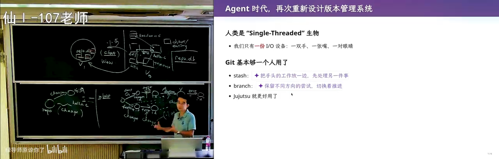

如果是一个 agent team：单个 agent 首先生产 AI slop 的速度就远远快于人——它生成 slop 以分钟级为单位甚至更快；有时候你让它 fix 一个东西，它在上下文是热的时候可能就几十秒钟；DeepSeek 的 Flash 档干活的时候就几秒钟就做了。**那以秒级——当 agent 工作的时候以秒级可以产生一个原子提交——并且你可以轻易地得到一个 10 倍、100 倍的 agent team 的时候**，git 或者 jj（它举起来是跟 git 兼容的、这样一个为人设计的模型）就有点跟不上。

确实是有一点跟不上这个速度。就算是可能大型的项目它有一些门控：当我写完了、改完这个部分以后，它必须要经历一个测试的流水线，那这个测试可能本身就要运行几分钟——那可以放缓 agent 的提交速度。但是毫无疑问地，**agent 加速了软件开发的过程**。那如果 agent 加速了软件开发的过程，我们应该怎么样为 agent 设计这个版本管理的系统？

## 13. 一个 agent 一个容器：tmux 多 agent 与监工范式

*(参考时间: 41:33)*

首先我们可以让 agent 沿用人的模型：每个 agent 你就想想——每个 agent 都有一个它自己的开发计算机（可能是个容器）；那你就把 single-threaded 的人类和 agent 做一个严格一一对应的类比，你就让它有一个独立的电脑。然后你把它放到 `git.nju.edu.cn` 上，你就直接 instruct agent 说："好，我的这个 remote 仓库是在 git 的……你现在就是一个单人开发者，你现在可以从 tmux 里面收到命令；如果你收到命令就可以开干。"

**所以这件事情其实是非常容易实现的。** 比如说：fancy project，好——我可以这样，嘶，这样也可以——好，我就直接让 agent 开干。然后我现在就是……agent 时代有点什么好呢？**每个人都是领导。** 你就是这个领导。

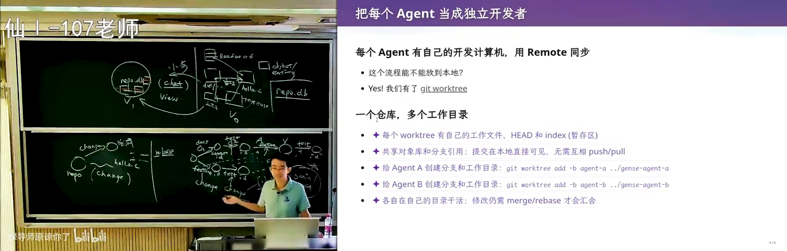

### 13.1 现场演示：两个 tmux session，master 与 slave

现在由两个 tmux session——你可以想象，实际开发的时候这两个 tmux session 都是位于两台不同的机器或者不同的容器，**它物理上隔离开的，它看不到世界上其他的人**。然后故意用一个"可能在中国现在还能用的词"：master。"我现在就是 master。""哎你看你这个名字改过来了？""slave。""好好好，我可以给他每一个都起一个名：哎，coding agent。好，那我可以让他干什么呢？"

Okay, anyway, it doesn't matter. 你看他们两个就开始工作了。**当 AI agent 变快的时候你想一想：如果你的指挥发生一点点差错——或者哪怕甚至指挥就是对的——** 现在一个流行的 paradigm 是：你有一个**监工的 agent**，然后你有好多个子 agent；有些比如说为了最大化模型的智力、防止 AI 生成你不想要的东西，你会放两个比较强的模型：**比如说由 Codex 来设计，然后让 Claude 来 review，然后让他们互相打架、达成一致**——你只要开两个 tmux 就行了。然后你的主座位呢，就负责协调：观看他们的输出、或者总结报告，然后往里面 inject prompt——然后这个多 agent 就这样转起来了。然后我看一下这个 report status。

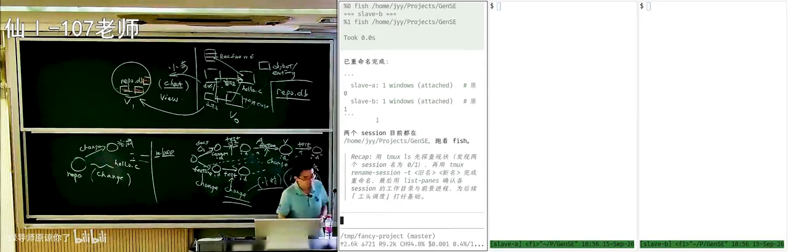

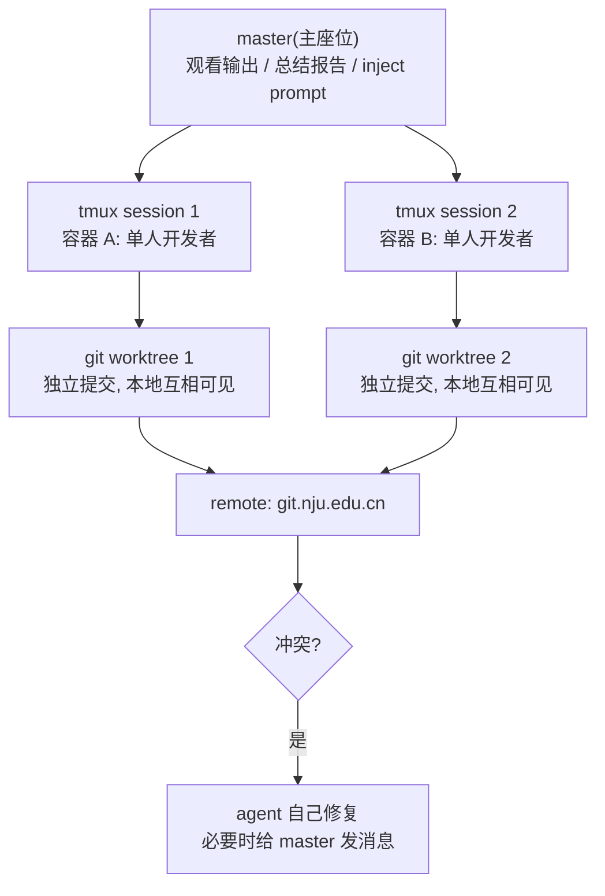
```mermaid
graph TD
    M["master(主座位)<br/>观看输出 / 总结报告 / inject prompt"] --> T1["tmux session 1<br/>容器 A: 单人开发者"]
    M --> T2["tmux session 2<br/>容器 B: 单人开发者"]
    T1 --> W1["git worktree 1<br/>独立提交, 本地互相可见"]
    T2 --> W2["git worktree 2<br/>独立提交, 本地互相可见"]
    W1 --> R["remote: git.nju.edu.cn"]
    W2 --> R
    R --> C{"冲突?"}
    C -->|是| F["agent 自己修复<br/>必要时给 master 发消息"]
```

然后你就发现：**如果大家工作在同一个 git 仓库上，就会有一些麻烦；但如果他们工作在不同的 repo 上，就是完全完全可以的**——他们可以合：去远端拉取别人的提交，然后冲突了？如果冲突了就会自己修复；甚至在必要的时候，它甚至还可以给这个 master agent 发消息。**你们立即就可以构建出一个这样多 agent 的系统。**

## 14. git worktree：更轻量的并行协作

*(参考时间: 45:40)*

那么相应的，我们今天也有一些 work around：比如说 git 就有 **worktree** 这样的功能。所以你看我可以问他："我的老师说 git worktree 可以改进这样并行的工作方式——那么能不能让这两个 tmux session 都工作在 worktree 上？"

**提问其实是关键的。** 你们可以在各种信息里——甚至比如说你今天早上走到教室的时候在看微信公众号，然后这个微信公众号上面说"来也 git worktree"，或者它提了一个什么样的 sandbox container——你就可以立即让 agent 来帮你试一试。然后我来看一看它在做什么：诶，这不是一个相对来说比较容易的任务吗？OK，它确实是在写脚本——哎你看它把 pad 推出来了，哦应该 OK 了。

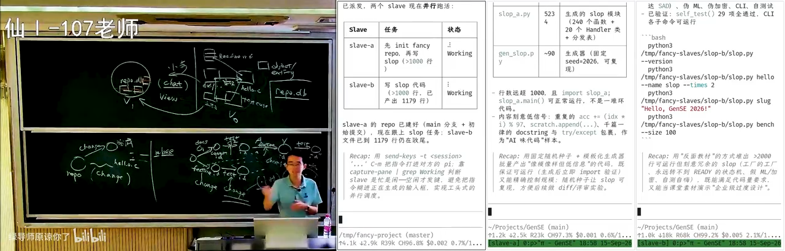

### 14.1 worktree 的原理：.git 可以是一个文本文件

这是当前的答案：**git worktree 允许我们创建一个工作树**——你可以想象成就是连接到了一个 remote、就是一个 git repo——然后我可以在这里面做独立的提交，在一个隔离的环境里面做独立的提交。

然后大家都知道 `.git` 是什么：`.git` 是一个目录，对吧？比如说我现在……大家都知道我的 `.git` 的是一个目录，然后它里面有一些比如说 logs、还有 objects——三种类型的对象。**那 worktree 里面的 `.git` 是什么呢？** 点开就是一个普通的文件、是一个文本文件。然后你如果继续追问 agent 的话，agent 会告诉你——这个也是我才知道的——就是：**除了 `.git` 可以是一个目录以外，它还可以是一个这样的、只有这个格式的文件**：这个文件说 `gitdir:`，然后它指向了一个 worktrees——这就是文件系统里面的一个文件。

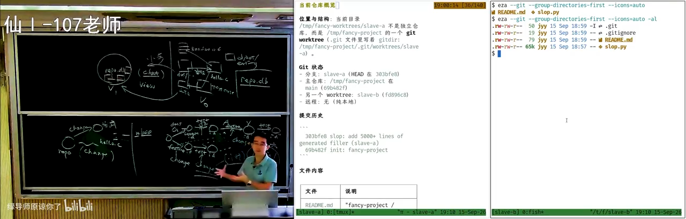

所以你看到：**git 最大程度上复用了操作系统里面的机制。** 这个 tree 就是一个小型的 git 目录——它是个小型的 `.git`，它依然有 head、index、locks 这些——一个微型的 git 目录；但它还是依附于原有的那个 git 目录而生的这样一个特性。这个特性在 AI 时代突然间变得诶好像有点有用：**我们可以在这个里面提交，直接在本地互相可见，不需要互相的 pull 和 push。**

就如果你像刚才我说的：我开了好几台虚拟机、然后在每台虚拟机里面放一个 agent、然后我直接往那个 tmux 里面注入——那当然是可以的，这完全可以完成；**但是 worktree 提供了一个更轻量的合作的方式。** 但是——如果有比如说有冲突的修改，它仍然需要 merge 和 rebase 才能合并。

## 15. 告别 blame：agent 是你的克隆体

*(参考时间: 51:04)*

那我们回到这个 agent team / agent swarm：除了今天的 work around（比如说 worktree 这样的机制）以外，还要回头来想——**为什么我们需要版本控制？**

也就是说我们人类的限制：我刚才说 10 分钟——一个小的 team 哪怕是一个团队都要 10 分钟产生一个 commit——所以是因为**人的限制塑造了这个工具**。人之间的 communication 导致了你每天早上都要开一次会议、同步一下各个人的进展、然后再把这个任务给分下去。而且就算是人做了这样的沟通，你也都知道：有的时候你的室友向你请教一个数学问题，明明你会做，你就怎么都没办法给他讲明白——除非你是一个很好的老师、能够共情别人在哪里会、能站在别人的角度去思考。**沟通的成本就是很高的。**

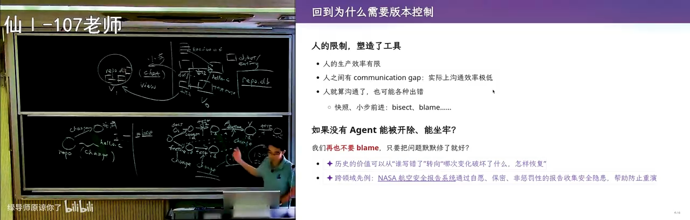

所以也是大厂和小厂、尤其是初创公司初创团队为什么效率可以更高：当软件系统大了、人多了以后，它沟通的效率变低了以后，它产出的速度也就降下来了。所以可能你一个 100 个人的团队，它不可能达到一个十人团队效率的十倍——**可能有两倍三倍就已经挺不错了**。团队没有办法变大。所以我们需要 git 的各种各样的 best practice：快照、小步的前进——你改一个 title 也要做一个 commit，你做一个什么也要一个 commit——然后这些小的 commit 每个都可以追溯：因为一旦出问题了以后，你需要回溯到那个人做事的 commit 那个时间，然后**那个人是有记忆的**：开发者会回想起来"哦，那天我们当天早上开了一个会，然后我收到要做这个需求，然后做这个需求时候沟通发生了一个问题"——大家找到那个时候的沟通记录文档，再说"啊我们这个地方应该怎么修正"。

所以你看，有了 `git bisect`、`git blame` 这些——**专门为人来设计的特性**。但是你想一想：如果是由 agent team 或者 agent swarm 来实现你的项目，**我们还需要 git blame 吗？**

就是因为人可以 blame："这个事情我 blame 你；多了你就该被开掉了；实习生你就背锅了。" 但 **agent 没有坐牢的、被开除的能力的时候，这个模型就变了**：我们再也不需要 blame 了，我们的项目只要前进就可以了。我们前进有的时候也不需要知道到底是哪一个提交引入这个错误——我只要知道这个地方错了；我也不要再管它历史上是怎么造成这个错误的，**我只要把这个错误修了就行了**。

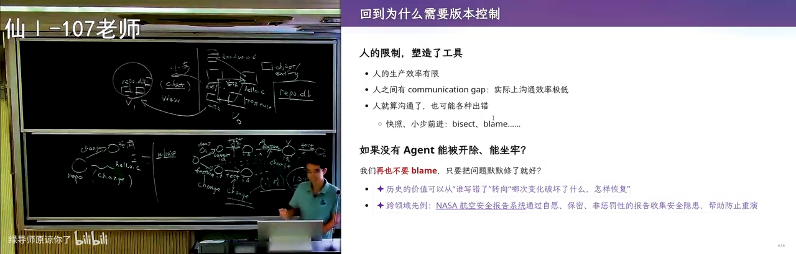

因为 agent 之间的 communication——尤其现在更好玩的是：**我们的每个 agent 都是相同的模型**。这也就是说它们是完全相同的克隆体：同一个事情让他们来做，他们大概率会收敛到——虽然模型还是有不确定性——还是会收敛到相同的结果。同样的 prompt 做同一件事可能有点细微的差别，但是最终的那个方向性的东西可能收敛到相同的结果。

所以我们再也不要 blame 了。那我们的 git、或者说我们的项目，就永远就是一个向前进的过程：每次——我现在在——快照肯定还是需要的：因为比如说这个方向走错了，如果你没有保留历史上的某一个 snapshot，那一下子往前走了好多以后再回去，可能它的代价比你一点一点再往前修要好——**所以保留快照肯定还是需要的**。那我们就是不断地大步向前、也几乎永远不要看过去：git 的 commit 里面只是留了一些 lessons——或者我们这个项目到底经历了什么样的演化——然后不停地往前走、往前走、往前走，合并、合并、合并。

> **所以历史的价值可以从"谁写错了"变成"我怎么把它修好"。** 只要保存——我只要能知道我从现在开始怎么样能够往前进——这件事情就可以了。

## 16. 乐观 vs 悲观：用事务与锁重设计并发控制

*(参考时间: 55:06)*

所以你再想：这个时候你在计算机学科学到的那些知识又起作用了。我又回到讲操作系统的时候讲并发、讲数据库：**现在的 git 的模型更像是数据库里面的并发控制。**

比如说我们有两条 SQL，然后这个 SQL 都是一个 transaction——它是一个很大的 SQL，中间可以混任何代码：你可以先比如说一个 select、select 一个什么；我这里也可以 select；然后我先读完以后我可以做代码的计算——比如说我就是 Python 代码或 JavaScript 代码，然后这个代码是图灵完备的，**你永远不知道它会根据我看到的结果算出什么**——我甚至也可以从外面、比如说根据我当前的时间再算一个什么东西；然后算完以后我再 update。然后 update 的时候就会产生冲突：这也就是说这个就可能产生死锁、也可能产生冲突——就是说如果这个 update 要读它，那就会产生一个循环依赖：有可能是产生这种数据的依赖，也可能是"我要锁你、你要锁我的对象"产生死锁。然后这个时候就会导致这个 transaction 的 abort：比如说这个 transaction 说"这个就不能进行下去了，对不起，因为我检测到一个循环的依赖，所以对不起我这个就不能做了，我要回滚"——相当于它要 roll back。

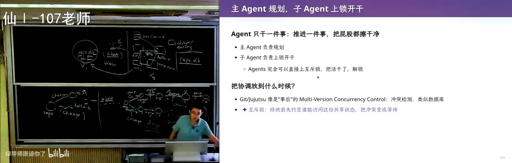

### 16.1 git 是乐观并发控制

然后其实 git 的模型有一点像这种**乐观的并发控制（optimistic）**。为什么它是乐观的呢？它就说：**我假设这两个 transaction 不会冲突。** 我在执行的时候我会假设大家是不会冲突的。这个假设在数据库系统当中是大概率是成立的：为什么呢？我们想想教务系统——你们每一个同学读写的都是你自己那块数据：你选课选的是我的课、我查看课表查看的是我的课表——所以说一个全局的冲突是不太可能有的；我两个同学哪怕同时开始选课，我也是读我的、写我的，这两个就可以过。

git 也是这样：就说我假设——我们这样开发，我们已经事先开过会了、今天早上开过会了——所以我可以顺着这条路先做这个、另一个人做那个，然后我合并的时候大概率不会产生冲突：不管是 merge 也好还是 rebase 也好，这个都能顺利完成。

**但是啊——这是古法编程时代的。** 就像我用 SQL 来做一个比方：但如果我们 agent 快了 1000 倍，那如果我们的主 agent 又没有可能协调的时候，就一下子又分了好多任务出去——他们就真的有可能会更频繁地触发这个 transaction 的 abort。触发 abort 在 AI 时代也不是什么大问题：agent 反正出错了或者出了 conflict 它就修、它能修好。**但是是不是在 agent 的时代，我们可以换一种并发控制的方式？**

### 16.2 一把大锁保平安：悲观锁的版本控制

你想想我们在操作系统里面——这是在数据库里面做的——我们在操作系统里面学的并发控制，你们是用什么做并发控制啊？**上锁。** 锁和数据库里面的 transaction 是有点不一样的：你是 lock 一个。我上课时经常说：**一把大锁保平安。** 做实验你们就知道了：当我想要访问可能冲突的资源的时候，我会先把它锁住——说我先要 acquire 一把锁；然后这把锁一旦 acquire 时候，别人想要再 lock 的时候，那对不起，这个上锁的就必须要等到——等到 release 以后。acquire-release 的关系建立起来就**必须是先一后二**，而不是这种 optimistic 的"大家先往前跑、跑了再说"。我必须是在使用这个资源之前，我要 declare 对这个资源的使用——用上锁的方式。

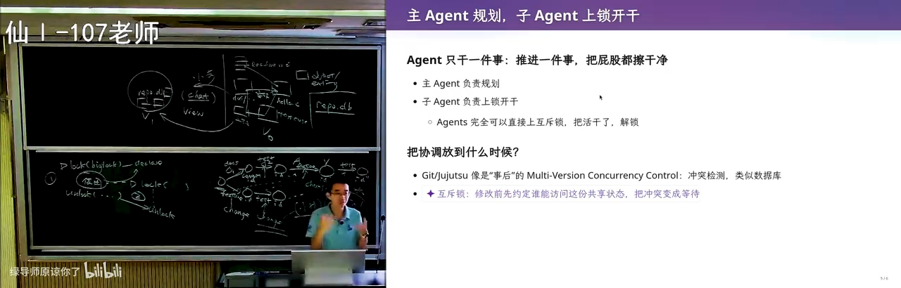

所以你看：只有你在这个操作系统课、数据库课你真的把这些东西学会了，你回来想的时候：软件工程里面哦，这些概念又再做一次。

所以想想现在：如果 agent 它的动作非常快，我们其实应该用更加偏向这种**悲观的并发控制**。也就是说：我今天要做什么事，或者我有个主 agent 我规划；然后规划完了以后，我就立马把这个项目的某一个部分给锁上——我可以在这个 git repo 或者一个快照上支持一个锁的操作：把这些 scope 说好——"我现在锁住了，我要做一件事需要这些"——先上锁；然后上锁以后做、做完以后 commit；然后另外一边也可以上锁，但是如果一旦它想要干的事情被另外一个人锁上了，**它就必须等到这个锁前面人释放了，它才能再上锁**。这样不就几乎避免了所有的冲突嘛。

比如说打个比方：我可以在**文件级上锁**——我就避免了两个 agent 会同时往同一个测试、或者一个配置里面做更改。然后但是又因为 agent 数量足够多、这个速度足够快，我还是可以保证整体项目的进度可以往前推——因为也许还有别的 agent 可以继续运行。

这也就跟操作系统里面我们实现并发程序一样：我经常说"如果你一把大锁保平安了"——或者你哪怕是锁拆拆桥了——**互斥锁它的本质是不要并行、不要并发，它和多处理器并行是根本矛盾的：它就要把一个能并发的程序退回一个串行程序。** 但是当这个系统里面有好多独立的、不冲突的线程在运行的时候，我即便每一个线程都持有了一把锁，它还是可以继续高效的——**即便是悲观的，它依然可以是高效的。**

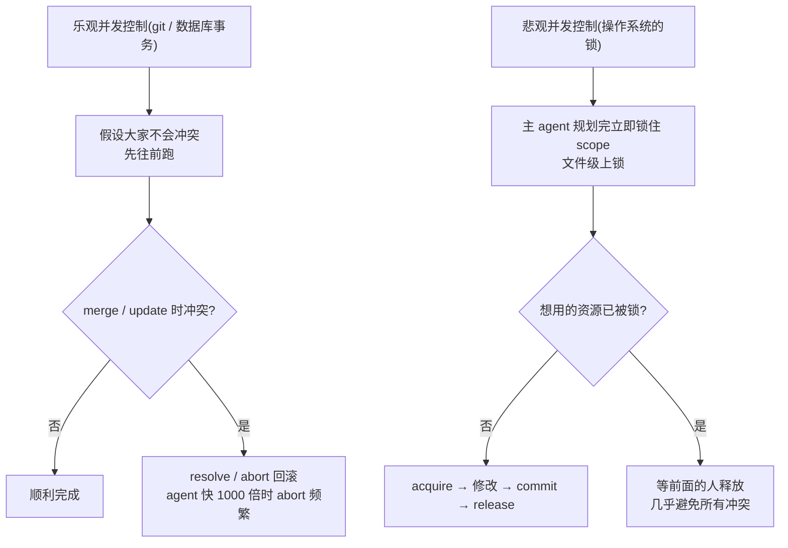
```mermaid
graph TD
    O["乐观并发控制(git / 数据库事务)"] --> O1["假设大家不会冲突<br/>先往前跑"]
    O1 --> O2{"merge / update 时冲突?"}
    O2 -->|否| O3["顺利完成"]
    O2 -->|是| O4["resolve / abort 回滚<br/>agent 快 1000 倍时 abort 频繁"]
    P["悲观并发控制(操作系统的锁)"] --> P1["主 agent 规划完立即锁住 scope<br/>文件级上锁"]
    P1 --> P2{"想用的资源已被锁?"}
    P2 -->|否| P3["acquire → 修改 → commit → release"]
    P2 -->|是| P4["等前面的人释放<br/>几乎避免所有冲突"]
```

就是这些知识关联起来让你看清楚：可能对吧，**在 agent 的时代我们又可以重新设计一个版本控制的系统**。所以我觉得这就在 agent 时代，软件工程肯定是要发生很大的变化的：从 first principle 出发——我们要管理快照、我们要管理版本、我们要管理 change、我们还要管理飞快的 change——那答案是什么？可能 git 是一条线；如果我们用一种像这样（锁）的方式来管理软件，那可能又是另外一条线。

所以你发现：这个学操作系统、学数据库，这些东西有用。你还是——虽然痛苦、对吧你怀疑"在 AI 时代我学这种东西、AI 都会写了、数据库 SQL 查询我早就不写任何 SQL 了"——**那我们还有没有可能学数据库是有用的？答案是有用的，你还是去好好学习。** 当然数据库里面也有这种 advisory lock 这样的机制。也是为什么我喜欢上课的原因：如果我不来上操作系统课、我不上这个生成式软件工程课，可能就不会让我去——我在备课的时候会把这些事情在脑袋里面再过一遍：是不是地球上所有人都错了？因为我要讲给你们的时候，我必须要共情我的听众、要考虑到你们是一个只能接受比较平实朴实逻辑的听众，不能直接就说"哎这个什么系统是怎么设计的"——我必须要把那个最顶层的 idea 提炼出来，然后试图让大家共情。当然这可能我做的也不够好，你们可以在 AI 的帮助下再来重新理解一下。

## 17. 版本控制是工具，团队管理才是真正的困难

*(参考时间: 03:18)*

OK，好，版本控制、版本管理基本上其实我就讲完了：从历史动机、到过去的 git、讲到现在、这次再讲到未来可能发生的事情。但是——**版本控制本质上还是一个工具**：不管是不是哪怕是我刚才那种比如说基于乐观或者悲观锁的版本控制。**真正困难的实际上是在进度，也就是团队的管理。**

我们为什么现在觉得还需要软件工程？就是因为我们现在没有办法做到一句话就直出一个高质量的产品。如果斩杀线到了——到了这个：老板有一个想法，就说"我要做一个 agent 用的微信"，随口说一说；或者说做一个 AI 时代的微信，然后这个微信是一个社交爆款，以后这些人社交可能也就不要用微信了、就用它——当然你可能有个更具体的想法、为什么你有一些思考——**然后如果这时候 AI 直接就能出那个微信级的产品，那软件工程就已经死了**，对吧？那我们就都死了。但是呢，现在这个斩杀线暂时还没有到——至少没有到这个团队管理这一层面——所以我们可能还要学。

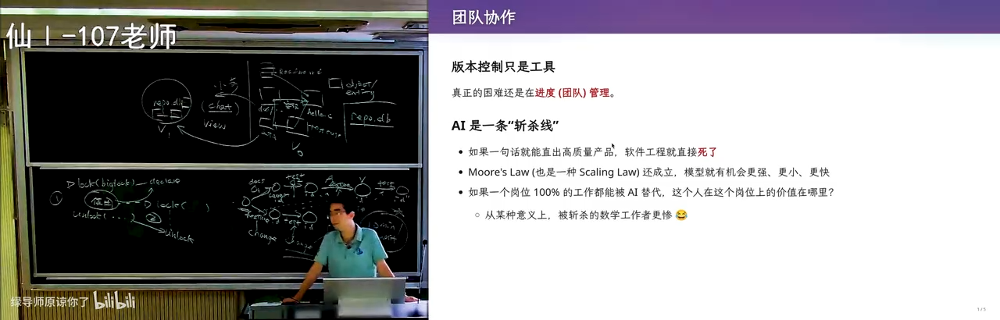

真的，我也要被拆掉：因为摩尔定律本质上也是用 scaling law，它现在还是成立的——模型肯定会更强、更小、更快，然后也许算力就有一天能够唤出我们的智能。**但今天至少 AI 还不知道怎么做团队的管理**：因为每当你多一个人的时候，这个沟通的关系都是平方级的上升的。因此现在软件工程团队里面最难招的其实不是码农，是**那个能把任务分解的 team leader**：最难招的是那种能把"国民级的应用"——他说我要去造一个微信——然后那个微信他还能够分出来：我一个 100 人的团队能分出十个小团队，然后十个人、十个 team leader 干，最后加起来我拼起来还能成为一个团队——**这个人最稀缺**。然后下一个：那个能够带领小团队的人，其实也很稀缺。

《人月神话》里面那里面就是：人与人之间两两之间就是平方级的沟通关系。就算是你能把你份内的事情做好，就因为这个平方级的沟通关系——别人也在做他的事、你不百分之百知道别人在做什么事的时候、或者你对这个整体的团队了解不是很好的时候——你还是会就这样，最后就会各种冲突："然后你写的测试我过不了"——就经常会发生这样的事情。

那么如果我们想要管一个团队的话——或者说你们在今天想要在毕业的时候能够具有一定的团队管理能力——**你现在就可以当成是那个主 agent**：就像我刚才那样（当然刚才我给了一个不好的示范：我说我今天创了两个 slave）。你现在也可以立即拥有这个 DeepSeek V4 的 slave；然后你可以去想：如果你要尽可能最大化两个、或者三个、或者更多 agent，你应该怎么把这个任务给分解？然后你应该怎么样确定一个提交的策略——什么时候你的 agent 应该提交、什么时候它应该合并？然后你就可以把刚才我们讲的所有的版本控制的概念带到你的开发流程里。

> **重要是这句话：版本控制是工具，它是由蒸馏了人类过去软件工程很多年的经验得到的——"我们人类要这样开发"。然后在这个工具上，你可以开发出属于你自己的软件工程的直觉和经验。**

## 18. 受限汉诺塔与挣钱的 playground

*(参考时间: 67:22)*

最近我看到一个蛮有意思的题目：大概就是这样的——我又带了这个模型——作为一个面试题（这好像是我不知道为什么就在网上刷到了），说是**小学生考级的题目**：汉诺塔，都会；递归，都会；好，现在有个额外的要求：**你的所有的盘子的移动只能往一个方向。**

就比如说我现在简单一点：两个盘子。我现在移过来——这个方向移是可以的、这个方向移是可以的、这个方向移也是可以的——就是只能往一个方向移动；当然折过来、折回去，我不允许。两个盘子的时候还行；**三个盘子的时候就可以看出问题了**：如果我要移三个盘子的话，我希望的是先把两个移到中间——假设两个已经移到中间了——那这时候我下一个就是把这个盘子从这里移到这里，对吧？这是汉诺塔的正常移法。**但是在这个限制下你是做不到的**：在这个限制下你不能把它移到这儿，你只能往一个方向移动。

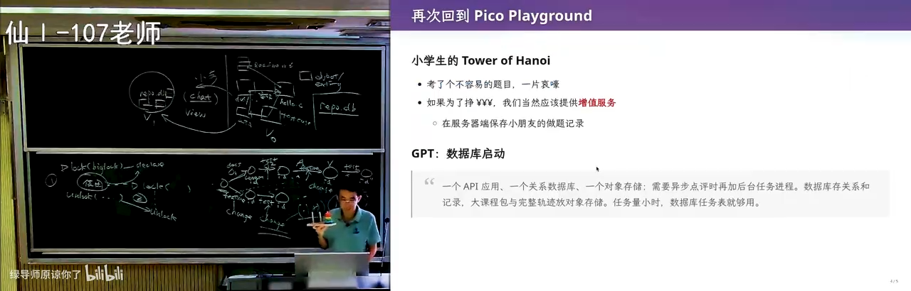

好，你很难想象小学生要做这样的题。然后他要输出这个方案、或者输出这个数字。反正 n 也不是很大，但是你确实需要一个方案、需要理解这个问题。

当然我讲的不是这个汉诺塔的故事。这个汉诺塔的故事是：你递归的时候，你现在要把它移过来——为了移过来，你还是先要把它移到这里，然后让这个最大的盘子向右移一个，然后再把它移到这里、再让向右的盘子移到这、再把它移到这里。所以就相当于是：**你考虑最大的盘子——那个最优解，它考虑最大的盘子总是向右移一个、再向右移一个。**

我拆开来讲是因为：我准备了一个小例子。我写了一个这样的程序：好，没问题——就是我刚才说的：如果我的下一个目标不是目标的话，我只有最大的盘子总是向右移一个、再向右移一个，所以它是最优的——就是我最大的盘子的那个移动是最少的、是不可避免的；然后剩下的也就基于 inductive、归纳法，我这个也是最优的。有点难，对吧？你很难想象小学生那样可以做这样的题。**但这不重要。**

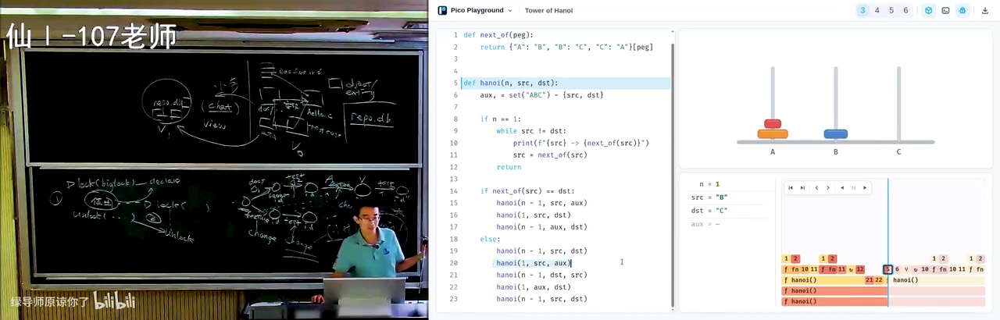

### 18.1 增值服务：AI 助教与开始燃烧的 DeepSeek token

重要的是：我们现在要推出这个产品。比如说我现在要把这个东西卖给小学生，那我怎么样才能最好的把这个产品卖给小学生呢？**当然是提供付费的增值服务。** 比如说这个小学生，他可以在这里写代码——我这个代码是可以随时编辑的：比如说我可以再写一个，对吧？他就错了。啊，我的可视化是随代码来运动的：比如说错了，我就可以找到——比如说找到我这条语句"试图把一个蓝色的（小的）移到大的上"——然后同学们就能找到 bug。

那如果我要挣钱的话，我要提供增值服务：现在现在还只是一个纯粹的 playground——你可以写代码、可以运行它。然后到这个时候我就要提供一个 **AI 助教**：比如说这个小朋友——当然这个是不是不太好啊，这个开玩笑的——我们还是尽可能以一个便宜的成本提供给小朋友们：当你实在做不下去的时候，你就可以点一个这个叫"我要助教"——**然后这个时候 DeepSeek 的 token 就开始燃烧**。然后这样我可以收取比这个 DeepSeek 原价更贵的 token 费，记在你的账户上。

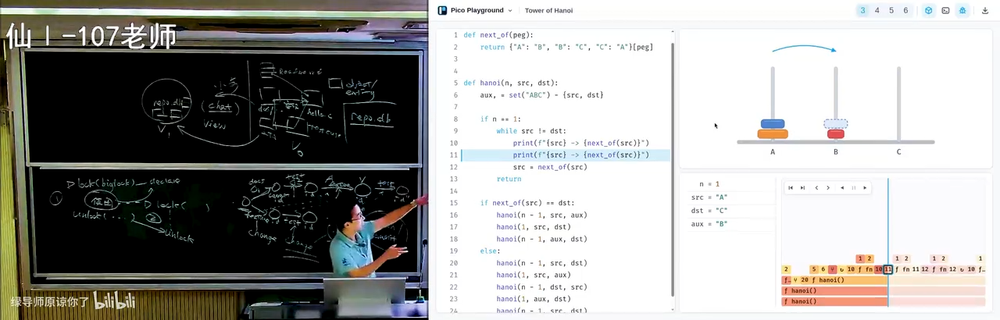

因为我的 prompt 是我独门的：我作为一个有经验的老教师，我可以把我自己蒸馏成 prompt，然后我可以敏锐地知道这个小朋友的问题在哪里，然后给他提供一个个性化的指导。好，我就这个时候我就涉及到**要做一个信息系统**了。那做这个信息系统啊——因为我有学生来做这个事、我自己没有时间——我竟然有这么大的这个市场的钱、我竟然都不想挣——然后学生在设计；然后我看了那个学生和 AI 聊完那一版设计，然后我也让那个 GPT 起来就是大概梳理了一下需求。好，这个是 GPT 的原话，他说：

> 一个 API 应用、一个关系数据库、一个对象存储；需要异步点评时再加后台任务进程。数据库存关系和记录，大课程包与完整轨迹存放对象存储；任务量小时数据库任务表就够用。

## 19. GPT 的正统设计 vs 我的设计：先 git commit，再谈数据库

*(参考时间: 74:10)*

这是一个非常正常的——就是如果是你们上软件工程课，那太正常了。你看 GPT 嘛，它是一个语言模型。**但我不喜欢这个设计。** 为什么呢？

我不知道你们有没有用过 **Overleaf** 就跟别人协作过文档：Overleaf 是有一个功能的，它可以把它当成是一个 git repo 导出；然后你可以直接——这个时候我最喜欢这个功能是因为我要给学生改论文——我就可以直接 agent 启动：我可以把那个论文克隆到本地，我就不需要忍受那个网页界面了；然后我就可以打开我的 Codex，让 Codex 去帮我直接起 subagent，给每一个 `.tex` 文件都去修复里面的这个语法错误；我可以给一个很长的 prompt 让它遵循质量——论文就改好了。我说：学生，好，文化结束了、这个改也已经改好了。

然后我们说这个 playground：我难道不是应该——**我的学生每改一次**（比如说我现在 edit 了、或者我点运行了、或者我切换了）——**我就自动做一个 git commit 嘛**？然后我就可以把 AI 的点评——比如说当我申请 AI 助教的时候它转圈圈——我就可以在这个 git 提交上面产生一个分叉，对吧？这是一个 comment。**咳，GPT 没有算的是：我产生一个这个东西的成本，远远大于把剩下的东西 persist 下来的成本**——就这个成本是忽略不计的。

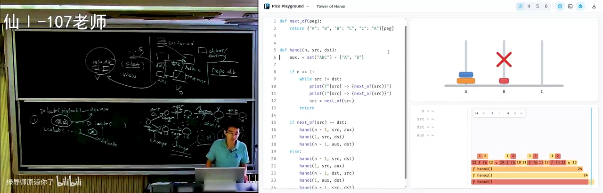

而当我用这个数据库的时候，我确实得到了一些好处：比如说总体压缩的可能更小了、性能更高了。**但是这其实不是我想要的：因为我的本质、我的需求是版本管理。** 所以我甚至在最早期的时候，我可以把我的代码库和这个东西连在一起：把它放在我的代码库里——小朋友的代码就直接存在我的代码库里；然后我可以探索性地在这上面创建 git 的历史记录；然后直到我认为整个的——比如说文件目录的格式、commit message 的格式、然后我怎么样使用这些文件——都收敛了，然后我再把它迁移到数据库。**这都是可以的。** 我觉得这个就还是挺好玩的：你们学任何东西都是有用的——你学 git 是有用的、你学这个 multi-agent 的管理你会——你就能够有一个机会去想到一个和别人不一样的、不太一样的设计。

## 20. 现场实验：把 lab 需求直接丢给 agent

*(参考时间: 77:44)*

好，那么接下来就是我们真的可以干一件事了。**项目的早期阶段你肯定不能用 multi-agent**：项目的早期阶段，你就是包工头——你先找一个相对来说能力比较强、你能够用到的最强的 agent，然后你可以跟它多轮的对话。所以我我要告诉大家：**你们现在开始干，就比什么都要好。** 我决定现在就开始：直接打开课程作业。好，我不知道会发生什么，完全没有事先准备过。我还要不开两个？

我们有两种办法：第一种是直接然后直接回车——对吧，这个其实我觉得对于每个同学来说你们都可以体验一下，当然我今天来替大家体验。啊我觉得更好的方式是……这是什么啊？我们来观察一下它会做什么。

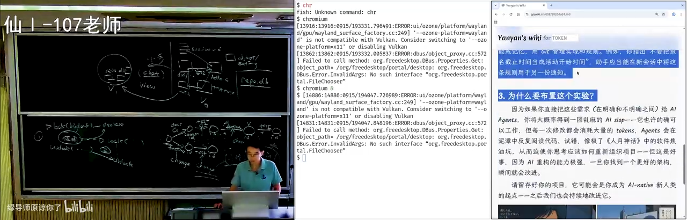

就是——有时候 AI 的直觉和人的直觉就有点不太一样：像一线模型，它会进入一个 **plan mode**，它会跟你再确认、可能会再确认一些事实，然后它再会生成一个 workflow。然后如果你们看过——其实挺好玩的：比如像 Claude Code，当它需要执行一个比较复杂的任务的时候，它会生成一段 JavaScript、一段 TypeScript，然后这个 script 里面有一个函数叫 `agent`，然后这个 agent 它里面是一个自然语言；当它用这种方式来组织 workflow，它甚至可以有循环：就是说我有好多任务，然后它可以在循环上面来解决这个 workflow。

然后你看到它这就直接开干了吗？**用魔法对我，对吧——只能用魔法打败魔法。** 这个 300 token/s 实在是太恐怖了。好，嗯 OK，嗯不管了，先让它搞一会。

然后你发现：**这就是我前面上面说，上下文工程或者提示词工程里面最危险的一点——你提示词里面的每一句、每一个词，self-attention 都会看到它。**

## 21. prompt 的舔狗：过度遵循与 intent 的 gap

*(参考时间: 81:51)*

然后看到它的时候，因为 AI 现在已经被训练成了 **prompt 的舔狗**，所以它有一种无可——就是没有办法往外拉的倾向——需要遵循你的指令。所以当你把这个需求——尤其这可能是一个讨论稿的需求，对吧？像我这是一个比较开放的需求——丢给它的时候，**它会过度遵循这个指令，最终导致它会生成一个确实满足了指令、但是其实不是你想要的东西。**

你回头看那个实验的要求：这个实验要求其实是言外之意——其实是这一句话叫"**实现一个持续为你工作的个人助手**"——这句话最重要；其他的话相对来说就没有那么重要，这些只是一些解读。

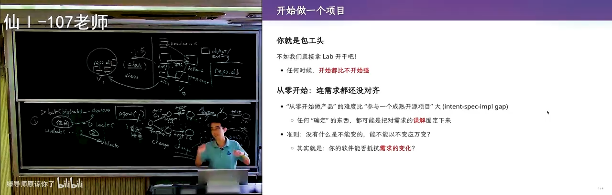

那你们觉得——当然每个人都有自己的观点——对你们来说，如果你想实现一个你的个人助手，什么最重要？就你实现的第一个 feature 是什么？你想实现什么？最大的、就是你在可能一个月以内遇到的最大的痛点问题？**学习**：嗯，对吧，高效的学习和复习——因为你们要卷成绩，所以这毫无疑问是最重要的。一个学习排版方案：你可以最好是这 agent 能够自动从外网上面收集数据，然后把它以一个层次化的方式归档，然后最终并且给我一个比较好的界面。**对吧，这是你最想要的。然后你看，我估计它十有八九没有。**

我来看一下：我要问他——"其实我想要的是一个比较好的学习助手：能收集外部信息、然后综合总结、根据我的进度学习看哪部分——能实现我这个功能诶？" 对吧，读一读、读一读……然后它在做 database。你看它在做 database。嗯，可以可以这样说啊：**就是在没有你精心设想过、讨论过的这个时候，AI 基本上就只会生成 slop。** 你看它 email 没有——也就是说其实你要的、就你脑袋里所想的那个东西——**这就是我说的你的 intent、你的 specification，是有巨大 gap 的。**

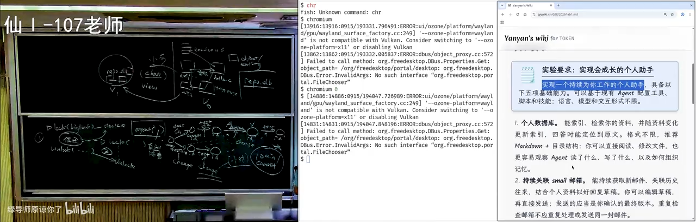

然后但是当你一旦——对吧这个模型看到说"你要实现这个"的时候，它就真的是真的去实现它了。然后我觉得肯定是做了一些不好的事情：比如说虽然当我提一卡通的时候，我真正需要的是一个 **browser use agent**——它能帮我在各种网页上面处理一卡通，只是作为一个测试的出口——它能把我的个人信息到一卡通上面；所以我可能第一步实现的就不需要去在你的教务系统上面做太多的设计：**你作为过渡设计反而不好。** 然后这个就是和刚才我给大家看的那个例子非常相关的：**你看起来它做的所有的事情都是对的——从 README.md 来看它做的所有的事情都是正确的，没有一个错误——但最终它得到了一个你不想要的东西。**

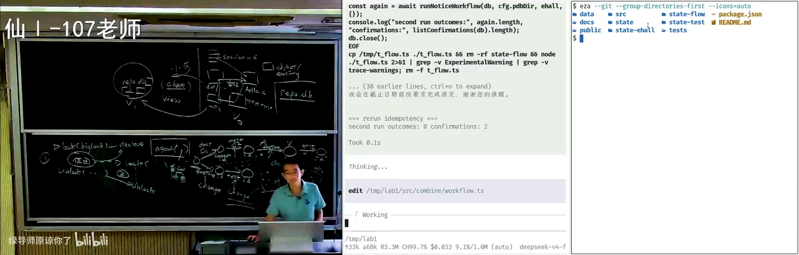

所以我看现在有没有 git 提交了：**它甚至都没有创建一个 git repository。** 对吧，这就是你看，你不跟它讲。当然我觉得可能如果是 Codex 的话，它可能还是会初始化一个目录、或者它会问你这个项目应该怎么管理。就如果比如说我是一个成熟的产品经理的话，老板跟我说这个以后，我肯定会跟我的团队去沟通一下项目怎么管啊——**这个就在甚至在我写下第一行代码之前，我都要讨论好协作怎么做啊、项目怎么管啊、每天什么时候开会啊。** Agent 很好玩：它就直接上手，就做它觉得 OK 的。这就是一个用一次就丢掉的一个东西的感觉。它烧了我不少 token——也无所谓了，我参与 DeepSeek 的内测，它送了我 1000 块的额度，到现在还没有完全用完。

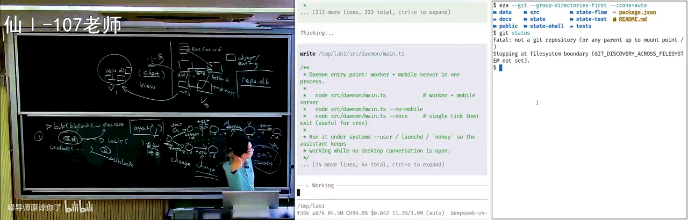

**所以你们在刚开始的时候，还是回到项目管理：脑袋里面要有一个这样的模型——你不能直接把任务就丢给 agent。** 你现在想的是：先，第一件事一定是创建一个空的这个（repo）；然后创建完了以后你就会想：你的下一步要迈向哪里？对吧，下一步我也给大家展示了：不能这样。下一步不能是这样的——**你需要的是往前再迈一小步，慢，往前再迈一小步。** 所以你发现：现在 AI 从零开始做一个东西、做出来 slop 的难度，比它到一个成熟的项目里面去做一个维护性的任务要大很多。

## 22. MVP 与以不变应万变

*(参考时间: 88:00)*

我们对软件工程的真正的要求——或者说如果我要跟一个 team 或者跟一个学生去谈论我们要设计一个什么软件的时候，我的问题是：**你能不能以不变应万变？** 也就是说：你现在软件设计一个架构、或者设计一个流程方法，**能不能抵抗未来需求发生根本性的变化？**

所以你马上就看到在刚才那个例子里：数据库……说我要生成一个挣钱的产品、去挣这个宝妈们的钱——然后我真正需要的是一个**能扩展的架构**：当未来有别的需求来了、AI 模型发生了变化——我其实我在想这软件工程的时候、或者说我的合作模式发生了变化——AI 助教对吧，AI 助教有可能是文字的助教、有可能是图像的助教、有可能有交互、有可能没有交互——它各种各样的需求在不断变化的时候，**我还有没有可能我的架构以最少的变化去应对需求的变化？**

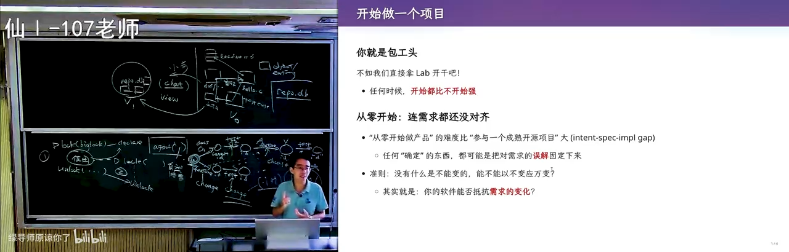

而这个恰恰是：大家在软件工程课也不讲这个、这个数据库课、这个操作系统课也不教——大家都说"好，这个操作系统是长这样的"。你啊，为什么会今天你会看到一个这样的操作系统、为什么会看到一个这样的数据库、数据库为什么要这样做并发控制——都是有这样的一个原因。**但软件工程说的最不一样的地方，就是对未来需求的变化。**

所以如果你们要——比如说这两节课跟大家讲版本管理的时候——你要记得：**版本管理做的三件事——记住现在、记住历史、记住教训。** 这个是在 agent 的时代和古法编程的时代都成立的。

- **你需要现在**：就是你必须要有一个 repository——不管是这个形式，还是现在的一个 C、或 C++、或 JavaScript、或 Python 的项目，你都需要把文件管起来；
- **记住历史**：是为了有一天你这个东西不要了、或者你删掉的一个东西，你最终发现对你是有用的，你还可以把它捞回来；然后在这个提交的历史过程当中，你能看到你是怎么演进到一个点、然后发现这件事情失败了——然后这个失败了可能你会留在这、然后你会回到另外一个点再开始另外一个正确的路线；而这些东西都是在版本控制里的；
- **记住教训**：然后这些 lessons 不停地都在警示你：你需要怎么做、你需要怎么样从第一步开始迈出向后的一小步。

## 23. 复盘 agent 的产出：早期的 prompt 决定项目的走向

*(参考时间: 90:03)*

那肯定显然不应该是……看，哦，他已经实现完了吗？"提交人民奖学金申请""准备退课"——看有没有 git？哎，他倒是做了一个提交：**直接一个提交**——引擎全部是真代码、手机端是真 HTTP 服务、派是集成的模拟的部分、邮箱是没有的。哎好啊：它有一个入口层、它有一个编排层、有一个能力层——还是个非常非常典型的架构啊——数据层。我就不试图 review 了啊。但显然它把它当成是一个业务逻辑系统来做，然后这其实是有非常大风险的：**就是它看起来已经像一个教务系统了**——哈哈，这个软件已经看起来像一个教育系统。我下节课就会讲教务系统。

而其实现在更符合主流的 best practice：如果你真的要从零开始构建的话，你要用一个叫 **MVP** 的 paradigm：**minimum viable product / minimal viable product**，有一个最小的验证版本。然后这有一句话叫：

> **The biggest risk in product development is building something nobody wants.**

就是你做的东西——你看它做的东西就是我不要的：这个东西绝大部分其实不是我要的。

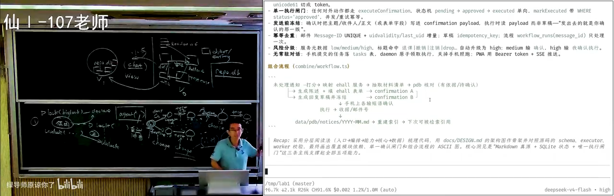

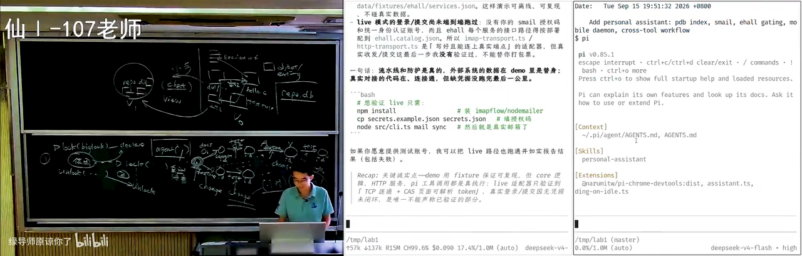

我刚才在它登代码的时候我解释了：诶，我其实想要的是什么。所以如果你要做一个最小的版本，其实它逼迫的是：**你要想清楚什么样的需求才是你绝对要的。** 刚才我已经说了：如果我要做一个个人的助手，我最想要的是它能有让我提升学习效率的能力、和提升我工作效率的能力。**你总结出了这两条以后，你可能在第一个 MVP 里面没有任何的数据库**——因为你会想到：在任何时候当你文件系统膨胀的时候，你都可以跟 agent 直接说"好，按照这个数据的组织帮我提炼出一个数据库"——这个问题就结束了。所以你不需要在刚开始的时候就做数据库：**因为一旦你带上一个数据库，你每次数据库重构都需要让 agent 做这个 database 的迁移。**

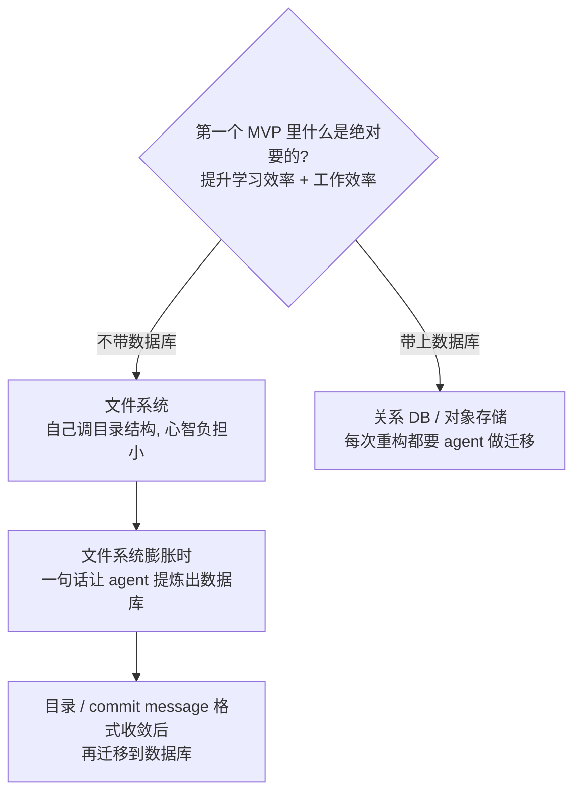
```mermaid
graph TD
    Q{"第一个 MVP 里什么是绝对要的?<br/>提升学习效率 + 工作效率"} -->|不带数据库| F["文件系统<br/>自己调目录结构, 心智负担小"]
    Q -->|带上数据库| D["关系 DB / 对象存储<br/>每次重构都要 agent 做迁移"]
    F --> E["文件系统膨胀时<br/>一句话让 agent 提炼出数据库"]
    E --> G["目录 / commit message 格式收敛后<br/>再迁移到数据库"]
```

但文件系统不一样：文件系统你自己就可以在你的文件管理器里去调整它的目录结构，逐渐梳理到你舒服的一个结构上。你看看：你在里面调文件、和你去调这个 database 的 schema，**你的心智负担是不一样**的：人类已经训练过——对人类直观的的东西已经训练得非常舒服了：文件目录在计算机里面操作，你从小、从你小学的时候上电脑课开始你就做这件事了，所以你对这个模式非常习惯。但一旦你说你要操作一个 database schema 的时候——你们很多同学还没有学过数据库课，你根本不知道它是什么——在你面对一个未知的东西的时候，你仍然需要强行地做一次概念的翻译："我这个东西脑袋里面是这样的概念，我要翻译到数据库里是这样的。" **那你不如用一个你已经适应了、熟悉了的这个 system**，用最简单的方式帮你把比如说这个文件的学习资料的管理、学习资料的进入、通知消息的进入——管起来。

### 23.1 讲者自己的邮件 agent：云盘同步 + 多级流水线

甚至到我现在：我自己回邮件的那 agent 都没有用任何的数据库。我的流程大概是这样的：我的那个 agent 会收我的邮箱，然后会把那个 email id 放到我的一个共享的云盘同步上；然后那个 email id 里面会有它的这个 agent 解析出来的——比如说我回复的草稿啊、然后这个邮件的分类啊、是不是垃圾邮件啊这种；然后再由下一级的流水线去处理。也就是说：**我先要明白的是我的系统里面有哪几级流水线，然后这几级流水线之间他们应该怎么协作、哪些东西通过云盘。**

比如说那么因为我很喜欢我的云盘——是不是引入云盘要做一些架构的修改？我希望邮件和资料等都和云盘保持同步——**对吧，这就叫需求的更改。** 我现在不知道它的价格做的好不好啊，我让 agent 帮我来看一看。也就是说：**什么是一个好的软件架构？** 你当然在当前时候你是有一个需求的、这个现在实现可能是满足这个需求的；**但是当你的需求发生变更的时候，你相应的做出的那个变化是摧毁性的、还是背上一个技术债、还是别的——那就不知道了。

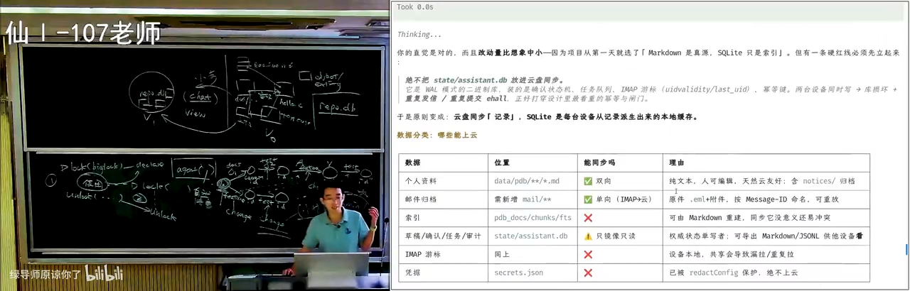**

然后我们来看一下它的这个设计：它有一个 `assistant.db`——它要把个人资料放到这里、邮件归档也放到这里、索引草稿仍然在 DB。现在看起来还不会引起很大的问题——因为绝大部分都是这样的，数据库确实应该不会引起特别大的问题。但是随着这个项目的不断的进展，你就会发现：**你有一种开发方式是这样——你上来就是一个大的、好几大步就把需求都实现完了，然后就拖着这个技术债不断地往后迭代、加功能加功能；还有一个是你从最小的、就得到一个特别精巧的架构。**

我为什么要举刚才那个例子：就当你发现我用 git 管理这个学生的提交以后，很多事情都变得非常容易，而且我自己控制起来也会轻松很多——**直到我遇到性能瓶颈之前，我都不想要把它迁移到任何的一种数据库。** 啊，然后这也意味着：**其实你早期的 prompt 对整个项目的走向的影响是最大的**——你每一次、你最早的那个"我直接把 README 给它"、还是"我要做一个 MVP 啊"——这都会对项目造成很大的影响。

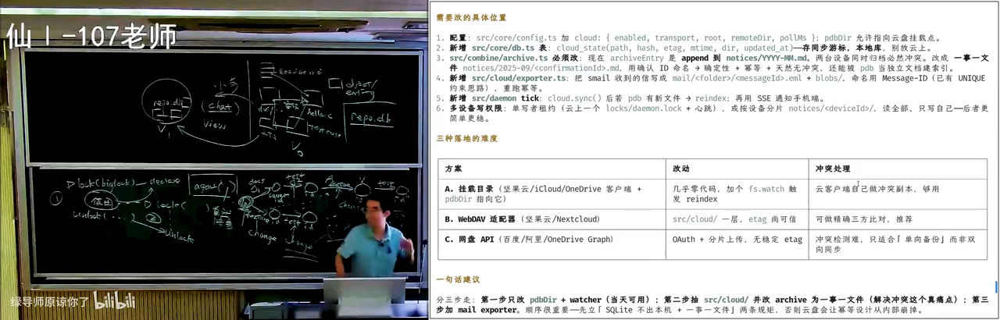

那我下一节课——就周日——就会进入软件架构和构造的内容。好，今天下课。

---

## 后记 Postscript：本书是如何生成的

本书由 B 站 AI 字幕（`ai-zh`，覆盖率 99.9%、2427 段）经 AI 重构而成：口语转书面语、按内容逻辑分 23 章（另加本篇后记）、绘制 6 张 Mermaid 图、插入 40 个截图锚点；截帧管线在已登录的浏览器里逐个 seek 到锚点时间、隐藏播放器 UI、锁定顶码率流后截取纯视频帧；最终渲染为带截图放大（lightbox）与 Mermaid 交互的 HTML。

与视频逐句对照的订正稿见 `transcript.corrected.txt`：先由脚本按本讲错词 MAP 修正（如 `web code→vibe code`、`A证/A政→agent`、`交流坑→焦油坑`、`瑞贝斯→rebase`、`t max→tmux`、`get it report→git repo`、`句句词/JJS→Jujutsu/jj`、`deep pick→DeepSeek` 等），再由 AI 通读全文做一轮行级订正（保留讲师原始字词与有意重复，仅修明显识别错误）。
