# 软件仓库管理：从“作业 V1、V2”到 Git 的第一性原理

> **原视频**：[Bilibili · BV1kybV6DE47](https://www.bilibili.com/video/BV1kybV6DE47/)（时长约 100 分钟）
> **课程**：南京大学《生成式软件工程》（2026）第 03 讲 · Raw 版
> **整理说明**：本书由视频语音经本地 ASR（faster-whisper large-v3）转录后，由 AI 重构而成，口语已转写为书面语，并修正了转录中的明显识别错误；关键时间点均标注 *(参考时间)*，点击截图卡片可跳转视频对应位置。

---

## 目录

1. [1. 开场：GPT-6 发布了，但品位还没学会](#1-gpt-6)
2. [2. AI 时代还要不要学操作系统和数据库](#2-ai)
3. [3. 一个软件工程项目从哪里开始](#3)
4. [4. 什么是软件：需求在信息世界的投影](#4)
5. [5. Git 之前：U 盘、压缩包与邮件](#5-git-u)
6. [6. 惊人的注意力：从 GitHub 上学会品位](#6-github)
7. [7. 从需求推导出版本控制：你也能发明 Git](#7-git)
8. [8. Git 简史与它的 First Principle](#8-git-first-principle)
9. [9. Git 上手四件套：init / add / status / commit](#9-git-init-add-status-commit)
10. [10. Commit Message 是项目的历史轨迹](#10-commit-message)
11. [11. 空提交与 tag：finalize 一个版本](#11-tagfinalize)
12. [12. `git add .` 的代价：什么不该进版本库](#12-git-add)
13. [13. 让 AI 当代码审查员：从批评到重写历史](#13-ai)
14. [14. 高血压时刻：dist、log、.DS_Store 与活着的 API Key](#14-distlogds_store-api-key)
15. [15. Hook：把规范固化成自动检查](#15-hook)
16. [16. Git 的底层数据结构：blob / tree / commit](#16-git-blob-tree-commit)
17. [17. Vibe Coding 一个 Git 仓库可视化工具](#17-vibe-coding-git)
18. [18. 可视化分支、冲突与合并](#18)
19. [19. 把 Python 教给小学生：架构自己把关，其余外包给 AI](#19-python-ai)
20. [20. 工程细节：Conventional Commits 与中英文空格](#20-conventional-commits)
21. [21. Commit Often, Perfect Later：小步提交的工程理由](#21-commit-often-perfect-later)
22. [22. 总结：Git 是用 Atomic Change 推进的快照](#22-git-atomic-change)
23. [23. 附：讲者自己的多 Agent 工作流](#23-agent)
24. [后记 Postscript：本书是如何生成的](#postscript)


---

## 1. 开场：GPT-6 发布了，但品位还没学会

*(参考时间: 00:00)*

前几次课讲的是如何把 AI 整合进自己的生活流程。人在生活中会遇到无穷多不顺心的事情，而 AI 是一个足够强大的 assistant：你只需要把真实的意图告诉它，它就能把这些不顺心挡掉，你甚至还可以把这套流程蒸馏成 skills，让下一次更平顺。

在这个过程里，模型本身也在不断进步。GPT-6 真的发布了，讲者用过之后的评价是“有惊喜，但编程上的提升有限”：

- **AI 学会的是完成任务，还没学会品位。** 有经验的软件工程师身上最值钱的东西是品位（taste），品位能指导 AI 做出更好的东西；而现在的 AI 更多时候只是把任务做完。GPT-6 似乎还没学会这种品位，“所以我经常还要骂它，我觉得我可能还能再苟活几个月”。
- **但复杂任务上确实更快、更省 token。** 讲者特意 measure 过，这一点是真的。
- **AI 写的代码，人类越来越难读了。** 从 GPT-5 到 5.6 再到 6，思维链变得非常紧凑，写出来的代码也越来越紧凑，人已经没办法 review。曾经我们会用各种 prompt 要求 AI“写出符合人类工程规范的代码”，但现在大家的默认心态是：反正我们再也不会看 AI 写的代码，随它去吧，它能把代码弄对就行。


GPT-6 给讲者的最大惊喜是**空间感知和理解能力**。他借此讲了自己对 OpenAI 的 AGI 路线的理解：

1. **AI 要先学会数学。** 数学是人类世界里最难的语言，但它拥有全世界所有人都认同的推理系统——一个定理被证明出来，全球的人都会认可这个证明是对还是不对。
2. **数学的方向和软件工程正好相反。** 软件工程里存在 Intent / Spec / Implementation 之间的 Gap；而数学是全球共识，是一个非常好的可以 grounding 的东西。
3. **数学的逻辑推理能解释人类生活中的行为。** 比如“今天中午去几食堂吃饭”，看似是灵魂才能回答的问题，其实大脑一直在投票：讲者会选择在逸夫楼订饭，因为对他来说这是最快的选项——下午还要开会，如果时间来得及，中午还能小睡一会儿。这就是在各种因素之间投票，其中还包含“A imply B”这样的离散数学关系。

### 1.1 空间感知解锁了什么

有了空间感知能力，一些原本很难的事情突然变得可以做了：

- **3D 打印模型的对话式生成。** 讲者的组已经做了小半年 3D 打印的工作。在 GPT-5.6 空间感知能力很差的情况下，只能靠反复对话才能生成一个像样、各方面都符合规范的 3D 打印模型。
- **光栅玩具。** 他们有一个比较 killer 的应用：那种从左边看和右边看是两个不同图案的光栅玩具。以前需要很长的搜索才能做出来，而这次 GPT-6 **one shot 直接搞定**——“然后我们现在还在想，想怎么样解决这个问题”。
- **具身智能赛道。** 有了空间感知能力又有数学能力之后，模型在具身赛道上明显可以做得很好。第二天小红书上就有很多人发：直接用 GPT-6 控制机械臂做抓取、叠衣服这样的复杂动作。

值得注意的是，GPT-6 在这里**只是一个语言模型**：它虽然有视觉能力，但就是一帧一帧地问“下面要干什么”，提示词工程都还没有解锁，就已经达到了 state of the art 的能力范围。

> **所以模型一定会进步的。** 讲者说，也许上到某一次课的时候，他突然就可以说“这个课不用上了”，这样也好，大家就可以去做产品了。

## 2. AI 时代还要不要学操作系统和数据库

*(参考时间: 06:47)*

有人问过讲者：在 AI 的时代，还要不要学数据库、学操作系统这些东西？他的答案其实并不特别确定，于是打了一个比方。

回到一百多年前汽车刚发明的时候，汽车开一两公里就会出故障，所以每一个 driver 都必须对汽车的工作原理了解得非常清楚——车一旦出故障，你得知道它是怎么工作的。在那个时代，“你要开车，就需要掌握汽车基本原理”是理所应当的事；同样，你要学 computer science、要进软件工程的工厂，就要去学操作系统、学数据库，把这些技术知识做好。

但今天我们怎么开车？在地下车库直接说“帮我开到什么地方”，自动驾驶汽车就出发了。作为一个人，你已经不可能理解整个系统之上是怎么工作的了——虽然最终动力还是传递到一个机械装置，和一百多年前的汽车还有点相似，但中间经历的所有东西你都不需要知道，就可以把车开起来。

人工智能也可以想象成类似汽车的东西，当然它比汽车更强：它替代的不仅是人腿部向前走的能力。


**今天的答案仍然是“要学”**，因为学了以后你可以更好地解锁 AI 的创造力——AI 解锁的是你的执行力。但“以后应该怎么学”，讲者坦言自己暂时还不知道，欢迎同学一起探讨。至少在当前阶段，学习是有好处的：你理解了正确的概念，就能从别的地方借鉴知识，来创造更好的东西。

## 3. 一个软件工程项目从哪里开始

*(参考时间: 09:03)*

从这里开始进入真正的软件工程。如果要开始做软件工程、开始 vibe coding，你干的第一件事是什么？

做作业的时候，你一定是从课程网站或老师要求的地方下载一个东西，然后从那里开始工作。但如果今天你真的想做一个项目，第一件事一定是**先建一个目录**，给它起个名字，可能就叫“我的最酷的 guild game”，然后开始 vibe coding。

那么，面对一个空目录，你们还记得自己是怎么学会“应该放什么”的吗？

- 你可能看到老师上课时打开了一个工程项目，里面有一些文件，你就在不经意间记住了这个项目该有的样子；
- 老师或同学推荐“某某东西发布了，你可以去看看”，你拿到一个 GitHub 或 Gitee 的链接，打开是一个**对人类非常 friendly 的网页**，网页上有一些文件，于是你知道了“我的目录里面应该要有一个这样的文件”。

所以当我们说要开始一个软件工程项目时，你会建一个目录，里面有一堆文件，这堆文件共同构成一个**可以交付的东西**——它最后会变成你的产品。这个目录可能直接在你本地运行：你神秘地跟 agent 说“请你帮我运行”，窗口或网页就弹出来了。

> 一个著名的笑话：GPT-6 太牛了，我又做了多少个 killer 级的产品——它们是 `http://localhost:5173`，然后发一个 Twitter。

**所以你还是需要知识的。** 在你本机可以打开它，但世界上其他人打不开它，因为你不知道 localhost 是你的本机。


当然，你可以把 intent specification 说得更清楚一点：在文档里说明“我的这个东西要被全世界人看到”。如果你不说，GPT 可能会把你当成一个开发者——而开发者最正常的做法一定是先在本地调试、先起一个本地 development server，看到结果，直到你觉得 ready 了，才把这个东西送到远端去。

这些都是知识。你们是 computer science 的学生，上各种各样课的时候反复学习这些知识：从最开始学编程时在 Visual Studio 里一键编译运行，到后面你会知道 build 目录里所有的东西都是由某些命令行工具创建出来的；大二开始用 GCC 这样的命令行工具，把一个 `hello.c` 变成 `hello` 的 binary——这就构成了一个软件工程的项目。

## 4. 什么是软件：需求在信息世界的投影

*(参考时间: 12:08)*

“什么是软件”是一个很好的问题，以前老先生喜欢问。软件是如此基础、无处不在的东西：没有软件，你今天看到的这个屏幕是黑的；不光看不到投影，连这个台子也启动不了——这间教室还不错，有一个可以升降的桌子，如果没有软件，这个升降桌都升不起来降不下来。（讲者现场展示了桌边的高度显示：现在是 106 厘米。）


软件到底是什么？有一个标准定义：**代码、文档等等，一切和软件相关的东西的集合**。但讲者一直说：

> **软件是人类世界的需求在信息世界的一个投影。** 而这个投影今天看到就是一个目录，目录里面有各种各样的东西。

你知道目录里面应该有什么：比如有个 `hello.c`，你可以编译出一个 `hello`，你就已经在做软件了。当然这可能不符合现代软件工程的 best practice，但古早时期——甚至十年以前——大家真的是这样的。

## 5. Git 之前：U 盘、压缩包与邮件

*(参考时间: 13:12)*

讲者讲了他第一个 PhD student 的故事。这位学生 2012 年入学进入南大，大一的时候发现了一个非常好的学习方式：经常去机房。那时自己的笔记本屏幕小、也不舒服，不像现在——讲者建议大家都买一块屏幕，不贵，甚至淘一个二手的只要小几百块钱，就能在宿舍获得非常好的编程体验；但那个时候的标准答案是去机房。

去机房就要来回拷贝代码，比较麻烦，所以他想出了一个妙招：**把代码保存到 U 盘上**。你们多多少少可能也干过这样的事，或者中学上电脑课时把作品保存在 U 盘上。

结果到大二的时候，这个 U 盘坏了。代码全部都没有了，作业不见了，他珍藏的那些启蒙时候的作业也不见了——有一点伤心，但好像也没有太大的关系。

**我们很长时间都是这样管理代码的。** 讲者上学的时候交作业的方式是打一个压缩包发邮件；现在你们会在一个网页上上传。这都是管理项目的方式。


但是软件工程——当我们谈软件工程的时候——今天是有标准答案的：**你应该去用 Git**。

Git 除了能够保存一个目录（项目就是一个目录，里面有 `hello.c`、有 hello 的 binary、还有文档等等），它还能**保留、比较和恢复历史的版本**。这是一个很重要的软件工程特性。

有了 Git 以后，很多事情都变得很容易：

- **再也不需要发邮件了。** 讲者说很难想象过去——今天是 agent 的时代，他有了十倍一百倍的生产力，只要让 agent 去写一个投诉信，就什么也不用管了。“如果我是用我的 Codex，我就真的选择信任它，我真的就不管了，这事就过去了，我甚至看都不会看，我让它结束以后把浏览器关掉。” 但过去，我们真的还在用邮件管理项目。
- **`git clone` 从远端获取作业。** 作业更新了，只需要在远端更新，不必给每个同学都发一份；上课时说一句“我的作业更新了，你们用 `git pull` 去下载”。
- **`make submit` 自动打包上传。** 一个脚本把包打好，上传到课程网站，非常方便——这有点像现在的 CI/CD 流程（CI/CD 会专门有一次课来讲）。

## 6. 惊人的注意力：从 GitHub 上学会品位

*(参考时间: 16:13)*

这里引出了讲者几乎每节课都要讲的事情：**当今天学习变得容易了以后，这门课上讲的知识都不重要，重要的其实是你们的学习意识。**

你们都看过很多 Git 项目——哪怕只是打开课程作业，也会看到一个 GitHub 链接。那么你们有没有留意过不同项目之间细微的区别？有的项目有这个文件、有的项目没有那个文件；有的项目文档是这样写的、有的是那样写的。在这种信号不断进入的时候，你就能判断出“我们应该怎么用 Git”。

### 6.1 别把自己强化学习成“只听老师话的 AI”

大家是不是总有一种感觉：老师说的事情实在太多了。这跟中学有关系——在中学，你必须听老师的话才能把所有事情做完；不听老师的话，你就不可能把事情做完。

但到了现在，比如你去 GitHub 学习的时候，如果还带着这个心态：老师说你把作业拉下来，你就只做这一件事，绝对不多碰一点点，因为这是最省时间的——**那你就有点像 AI，像新鲜干活的 AI，你被强化学习成了那个样子**（AI 也被调成这样了）。

如果你愿意多花一点点时间点进去看一下里面的各种东西，可能突然间就有一个灵光一现：“这个文档写得很好。”

> 今天你看到满世界 GitHub 上的项目，全部都是巨长无比的 README，里面有各种 Unicode 字符组成的目录结构框图——就是这种 AI Slop 的感觉。而在你看过这么多 AI Slop 之后，突然发现一个十几年前开始维护的老项目，点进去，文档清新舒服，README 很短，但看完以后你想看的东西，三个链接就跳过去了。**你不需要看那么长的 AI，你就学会了文档应该这样写。**


### 6.2 路牌与 UI 设计：从对比中学到的 lesson

讲者不知道大家有没有机会去对比不同城市的路牌，他觉得这很有意思。为什么我们有时候觉得中国是一个 developing country、意味着提升空间很大？

很多年前他在香港找路的时候特别 impressed：每当他有不确定性的时候，比如前面有三个路口，**正前方一定有一个路牌告诉他三个口是什么**，从来没有例外（当然它有一个非常复杂的地下系统）。而回到南京，你在地铁站里不知道下一步该走哪个口的时候，需要环顾四周去寻找，甚至要移动比较远的距离找到一张地图再去看。


这其实是一个学习的过程：如果有一个范例比你做得好，你就学到了。讲者从这个对比中学到的 lesson 是——如果我要做一个 UI 设计，我就应该站在人的角度：人站在这个页面上的时候会想什么？不同的人要的 A、B、C 会指向不同的方向，我希望用最少的方式把 A、B、C 全部呈现出来。

所以，就一个 README：你们都会用 AI 生成 slop README，但当你看过几个好的以后，你就会写 README。而且你有 AI 以后马上就可以问它：“这个 README 为什么比那个好？为什么我看到这个项目的 README 没有 AI Slop 的感觉？”它就会告诉你。

### 6.3 为什么“上课耽误学习”是真实存在的

这也是讲者理解的、为什么很多同学怨气很大觉得上课耽误学习：**现在课外的信息量和信息密度，已经远远超过任何一个课堂可以做的事情了。**

当你打开一个成熟的 GitHub 项目，它是工程师十几年的心血；甚至在某个时间点，这个项目崩溃过一次、做过一次大版本重构，他发现以前的 practice 不够好——你才呈现到你面前的是现在这个好好的东西。但我们传统的教学方法没有教过大家怎么把这些海量、信息密度巨大的东西用好，大家也没有准备好去拥抱这样的知识。

讲者说，可能这也是他现在在做老师的原因：**他有这种“惊人的注意力”**，而大家要训练的也正是这种惊人的注意力。

### 6.4 Virtual Implementation：一种适用于任何课程的学习方法

如何训练？看到任何东西之前，先把看到的东西都忽略掉，问自己：**如果我要自己来解决这个问题，我会怎么做？** 然后立即比较“我看到的东西”和“我脑袋里所想的东西”谁更好：

- 如果我做得更好，就认为这是一个 slop；
- 如果我发现他做得比我好，就很惊喜：“哎，他为什么做得比我好？”

养成这个习惯以后，这是一个非常恐怖的习惯——你在任何时候都在疯狂地从外面接收信息，能留意到生活里各种小细节，就不停地在提升。

很早的时候大家就有推荐：如果要读一个 research paper，应该怎么读。有一个非常好的学习方法，其实也适用于学任何课程，包括高等数学、计算机系统基础，叫 **Virtual Implementation**：

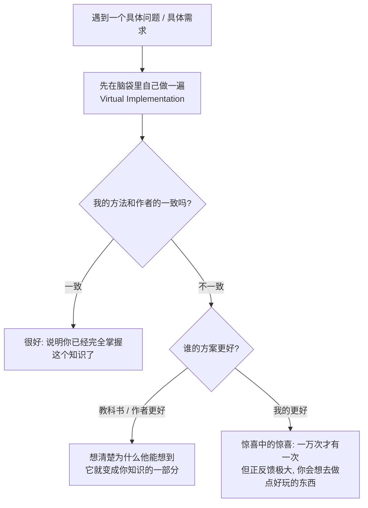


讲者早前还展示过 AI 是怎么被注意力机制带到作者的逻辑陷阱里去的。所以在 AI 时代，你们更可以对细节保持注意力：比如 Git，你看到各种各样的 repo、读别人的东西甚至 AI 生成的东西，都有感知细节的方式。

## 7. 从需求推导出版本控制：你也能发明 Git

*(参考时间: 24:17)*

这只是开一个头，接下来讲 Git 的具体细节。首先，**为什么要 Git**？

肯定有 GitHub 以后，分发代码变得前所未有的方便。这件事他们创立 GitHub 的时候可能就想到了，但他们没有意识到：这竟然成为了今天 AI 时代的一个底层技术设施——npm、你的各种 Neovim 配置，全部都在 GitHub 上。

### 7.1 推免面试里的三个 Git 问题

上周末讲者参加了推免面试（你们一两年以后也会来到这个场合），他问了大家三个问题：

1. **什么是 Git？** 大家多多少少都能说两句：从 GitHub 里下载分发代码；有的同学能讲到 Git 管理的是项目目录的快照——挺好的。当然也没必要把所有人都挂掉，能讲一些就可以，取决于你讲多少来给一个评估。
2. **Git rebase 什么时候是 no-op？** 这个也意料之内。
3. **如果 Git merge 发生冲突以后，你会观察到什么？** 这个比较意料之外。

你们有观察到过吗？比如老师发布了一个作业更新，但你本地已经把这个东西改得面目全非了，这时候你还是会让 agent 说“来吧”，然后 agent 自动就啪啪啪啪啪给你修好了，跟你说“好了，测试都通过了”。我看一眼这个东西看起来 OK——就过去了。讲者说他自己现在也是这样：“反正 merge 出错了帮我修。”


**这个时候“惊人的注意力”就有用了。** 如果你愿意在冲突的时候停下来——尤其大家作为学生的时候总是想“我再学一点，反正这一秒钟我学一下也没有坏处”——你会看到一个非常神奇的东西：有好多等号、有好多尖括号，有些地方有 incoming、有 HEAD 这样的标记。

冲突不是立即就被 resolve 掉的，而是**责任到了每一个开发者手上**：如果开发者发现了冲突，他就有义务把冲突解决掉；那他要解决，就需要能看到这个冲突。

站在 Git 设计者的角度想：一个文件原来是 `1111`，有一个人把第二行改成了 `2`，另一个人把第二行改成了 `3`——那到底是 2 还是 3 呢？Git 不能说“对不起，冲突了，我不能合并了”，然后躺在那里，那对人的负担非常大。所以它的需求是：**至少把冲突的两部分代码同时显示在这里**。

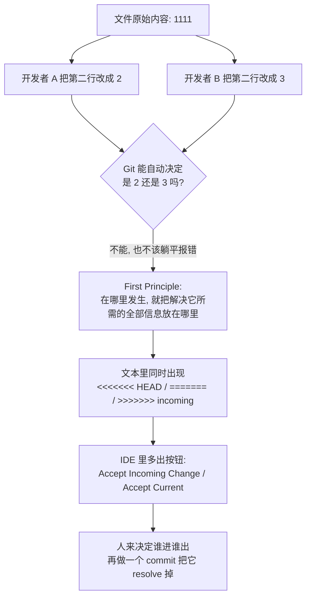

如果你们用 IDE 的话，还可以看到上面会多出一些按钮，叫 `Accept Incoming Change`，你就可以在 IDE 里自己决定谁进谁出；完了以后再做一个 commit 把它 resolve 掉。

你只需要一点注意力。其实只要有一两次，你就会有一个印象：至少能说出“两边冲突的代码都会显示在一起”。比较吃惊的是大家都答得不好，那肯定是：**第一，没有用过**（大家没有开发过；当然就算用 agent 开发你也很容易遇到 conflict，比如你让 agent 在不同分支开发）；**第二，没有留意**。所以比较重要的是：多用一用，以及试图拥有更好的注意力。

## 8. Git 简史与它的 First Principle

*(参考时间: 28:40)*

那我们就来讲一讲 Git 是怎么来的。在 U 盘上放一个目录的方式肯定是不行的——每次打一个包。但据讲者观察，他上学的时候同学们确实是这样（可能比较早了，那时 Git 还没有 get popular）：**作业 V1、作业 V2、作业最终版**，每次复制一个目录。

没问题，这是一个非常直觉的体验，这个方式可以找回旧的文件：万一有一天手滑了、不小心改错了——尤其你们在新手阶段，误操作是非常正常的——你想要回到上一个版本看看“我上一版本是怎么写的”。

**这不就是一个需求吗？** 从这样一个需求出发，你自己就能发明一个像 Git 这样的东西。

因为本质上所谓的版本管理：什么是项目呢？项目就是一堆东西——你的代码、文档、各种东西、测试用例，全部都搅在一起，没问题，就是一个目录。那你会想：如果我们能够把目录的版本管理起来呢？如果我不再叫作业一、作业二、作业三，而只有一个“作业”的目录，但是我可以提供一个命令行工具：

- 我能不能 list 一下作业的版本有哪些？
- 我能不能把当前的版本变成另外一个版本、回到过去的某一个版本？

你不就发明了一个简化版的 Git？虽然你还没有使用任何分支、合并、冲突这些概念。而在你用的过程中，你会自然而然地去发明那些：比如你要跟室友同步了，就会出现你们俩一起改同一个文件的情况，你就坐下来想“一起改了同一个文件应该怎么办”——你就可以发明 Git。

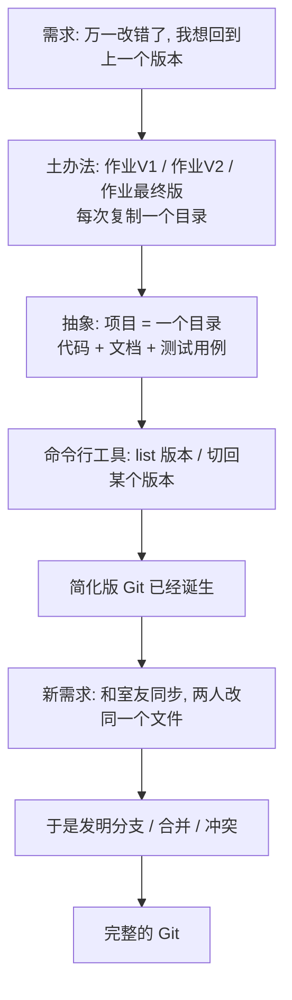

### 8.1 SVN：一个高效却走错路的实现

当然，这体现了人类的局限性——在 Git 之前我们还用过一个你们可能听都没听过的东西，叫 **SVN**（check in / check out）。SVN 和 Git 的设计不一样：

- **SVN 存的是项目的变化。** 假如你有一个最初的版本，每次文件改了一行，我就存一个 patch；再改一行，再存一个 patch。好像没有问题，而且这是一个**非常高效的实现**。
- 但就是这个高效，随着项目的增长把大家拖入了泥潭：你想要回到过去的某一个版本，就得一个一个往回退。当然你可以用一些缓存之类的方法来优化它，但这就有种“确实是走错路了”的感觉。
- **Git 的模型要干净得多。** 大家从 first principle 出发：我想要先回到过去的某一个版本，**一秒钟就给我回去**。如果你每次存的都是一个 delta，这就做不到。


### 8.2 Linux、邮件列表与 BitKeeper

Git 的作者是 Linux 的作者。Linux 是一个非常简单干净的模型，但他们在 1991 到 2002 年维护 Linux 的方式，用的恰恰就是“作业 V1、作业 V2”的方式：**在邮件列表上发补丁**。

相当于我改了一个 `a.c`，我说我有一个 `a.c` 的新版本，往邮件列表一发，会有一个 maintainer 看到邮件，把它放进核心仓库里，再去 release 这个版本。直到后面他们还用过一些其他工具，比如 **BitKeeper**。

直到 Linus 终于受不了了：他觉得我们就应该要一个**绝对简单、但又非常好用、概念正确**的版本控制工具。所以 **2005 年做出了 Git**——它比我们想象的年轻一点。

有兴趣的同学可以去看 **Pro Git**（当然直接让 agent 看就可以了，不需要自己去读；讲者读书的时候是看过这些文档的）。

我们需要项目级的时间回溯，我们都会犯错误，所以只要能从 Git 的历史里把它捞回来就可以了。你们可以试着用这种方式：从已有的经验，你知道什么、我想要什么，然后推出下一个概念它应该是什么样的——**你会发现这就是数学的推理**。

讲者说自己上课这样讲下来的时候，每一句话和之前都是有逻辑关联的，而这个逻辑关联多多少少都有一些数学的联系。所以 OpenAI 认为要把数学先训好，训好以后所有的问题可能都能解决。“然后这件事情可能就真的要能成真了。我自己是觉得品位上可能也还是能解决的。”

## 9. Git 上手四件套：init / add / status / commit

*(参考时间: 34:23)*

什么是 Git？讲者建了一个空的 terminal。今天要开启一个项目，那就是：

```bash
git init
```

它会告诉你一些奇怪的信息。这时候你有两种选择：**第一种是让 agent 来帮你做**，帮你解决、帮你回答你不懂的问题；**第二种就是把它忽略掉**——那显然是更高效的学习方法。

你得到了一个空的目录，以及一个 `.git` 目录（默认是隐藏的，所以你看不到它）。**这就是全部了。** 当你做完 `git init` 以后，你的项目就变成了一个被 Git 版本管理的仓库：你可以从远端下载代码，可以把代码推到远端。


然后是最基础的命令。假设你有一个 `hello.c`：

```bash
git add hello.c
git status
```

`git status` 可以看到我现在的工作区里面有一个 `hello.c`，这里还有一些提示。

**最重要的是创建项目的快照，使得你可以在任意时间之间穿梭。** 我们可以创建一个带消息的快照——这很重要，这体现了软件工程的智慧。


之前我们用复制粘贴的方式，命名为“项目版本 V1 / V2 / V3”、“作业 V1 / V2 / V3”。**Git 的世界里面不是这样的。** 讲者看到很多同学把 Git 当成“作业 V1、V2、V3”来用，但这不是 Git 推荐的 practice。在长期的软件工程实践经验中：

> **每一次你对这个项目做了任何的改动**——比如改了一个文件，修了一个 bug，或者给它增加了一个功能，或者调整了某一个脚本、调整了某一个文档——**你都应该立即做一次 `git commit`。**

```bash
git commit
```

“哎呀，这怎么是 nano？” 你可以有一个文本编辑器，写上我这是做了什么，保存，这个提交就成功了。


这些你们都可以在现有的项目里看到他们是怎么协作的：有些 commit 可能比较大，放了一个 feature；有些就比较小，只 fix 非常少的东西。**所以当你面对一个新鲜工具的时候，你去理解它的 best practice 还是需要花时间的。**

## 10. Commit Message 是项目的历史轨迹

*(参考时间: 38:29)*

所以讲者还是觉得，你可能不能把所有的事情都交给 AI，你多多少少还会要知道：我们为什么要做这件事？什么时候应该做 `git add`、什么时候应该做 `git commit`？commit message 应该怎么写？

你真正需要的是**在任何时候学习**。碰到新东西的时候追问一下：“你刚才做的是不是符合 best practice？” 比如“我刚才做了一个 `git commit`，这个符合 best practice 吗？”——加上问一句 AI，真的就是一秒钟的时间，但它会给你很多解释。

Git 本质上虽然存储的是版本的快照，但我们的项目本质上还是从一个版本 V1，经过一次修改变到 V2。**Git 鼓励的是：你需要在 message 里面描述出你改了什么。**

> 相当于你如果一直看，你就知道项目是怎么发展、一直走到现在的：修了多少个 bug、加了什么需求、经历了什么样的重构。**你可以在 message 里面看到这个项目的历史的轨迹。**

这也是一个好的软件工程 practice，使得别人能够更容易地理解你的项目。

反过来想：如果你有一万个提交，每一个的 commit message 都是 `I did some cool stuff`，那这个 commit message 就变成 slop 了。如果是这样，这个特性就不应该存在——你不要叫 commit message，你就从 V1 到 V2 就行了。

## 11. 空提交与 tag：finalize 一个版本

*(参考时间: 40:29)*

你会在各种时候用不同的 commit message。比如这个版本要收尾了，你可能会有一个 commit message 讲“我要 finalize 这个版本”。

甚至 Git 还允许你在不改任何代码的时候——V1 和 V2 完全相同的时候——再做一个提交。这件事情可以吗？

**它拒绝提交你的空的、没有修改的 commit，但是 agent 可以。** 讲者让 agent 做一个提交，并要求它在不做修改的情况下提交——“你看它知道，它有知识。”

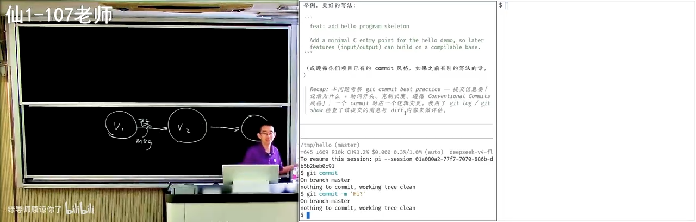

所以你们需要的就是**惊人的注意力**，然后尝试问：“从理论上说应该可以的。” 比如我就要有一个提交说“我要发布一个版本了”。但这不是 best practice，所以尽量不要做。

你确实看到了一个 empty commit，确实是空的。那它在什么时候有用？

- **可以在无改动时产生一次提交，触发 CI 或流水线。**
- **区分 bug fix 与 finalize。** 比如上一次我修完了最后一个 bug，得到了一个可以 release 的版本。Git 是可以在这放一个 tag 的，比如 `v0.1`；但我也可以强行做一个提交说“我要 finalize”——这是一个没有改动的 finalize，就是为了 `v0.1` freeze 所有的东西。这样我就把 bug fix 的提交和 finalize 的提交分开了。

这件事情在偶尔的情况下还是可以允许的，但你显然不能创建大量这样的空提交。

所以你会看到：在 Git 里面，虽然它有模型——OK，你学了 `git push`、`git pull`，你就可以用 Git 了，都会用了——但**其实真正水面下的冰山，是各种各样的 best practice，而这每一个 best practice 其实都是血和泪的教训**。

你反过来想“为什么 message 要这样写”，转手问 AI，可以跟更有智力的模型讨论一下“这样做有什么好处”。讲者说很多时候模型的表现比他好：这个知识他知道、内化在脑子里，如果给他两个小时去想，他可能也能写一个非常好的“为什么要做这件事”，但是——

> **我的智力是有限的，我的精力是有限的，我的注意力也是有限的。** 比如说我现在在上课的时候，我为了专注地和大家上课，我大脑里面做思考的那部分就有点不够了，容量都有点不够了。所以我很多时候觉得我上课讲授一个概念的时候，我讲的是 suboptimal 的，不是最好的。

如果你回头把这些问题（比如“为什么 commit message 要这样写”）拿去跟 ChatGPT 聊，就像他开头说的那个比喻：你求助一个你无法掌控的东西，但它知道这个世界上所有的东西，它能很好地把这些概念给你讲清楚，包括这些约定俗成的 best practice。

## 12. `git add .` 的代价：什么不该进版本库

*(参考时间: 44:33)*

讲者故意来做一点不是 best practice 的事情。这是你们非常常见的事情：这应该是可以编译的代码，这时候你有一个 untracked 的 file，然后你在 tutorial 里看到一个很好的命令叫：

```bash
git add .
```

这样如果你改了三五个文件，你不需要 `git add a.c b.c c.c`，你就 `git add .`，然后把它提交上去。

**Git 是不阻止你做这件事情的，这是完全合法的。**

那就再问问 Git：“我这个提交有什么不符合 best practice 的吗？” AI 会看一看，**按严重程度排序**——“还是很聪明的”：


1. **提交信息毫无信息量。** “它已经开骂了：主观废话。” 它会告诉你应该怎么做：用祈使句、现在时描述变更动机，例如 `fix off-by-one in strlen check`。常用的约定 **Conventional Commits**（以前缀区分类型）也值得考虑——你可以在更多的项目里看到这样的 commit 方式。
2. **提交粒度过大、内容混杂。**
3. **`hello` 是编译产物，根本不应该进版本库**，应该加进 `.gitignore`，由构建系统产出。


为什么 Git 的使用方式和“作业 V1、V2”不一样？因为你的作业 V1 里面那个 `.exe` 一定在里面，作业 V2 你的 `.exe` 也在里面。但 Git 要**防止版本库的膨胀**，尤其是当你的项目里有一万个文件、有一百个合作者的时候：

- 每一个合作者的环境都是不一样的，他们 build 出来的东西也是不一样的；
- 你们可能不知道，你们编译出来的那个文件可能带一个日期，甚至带 hash、带你本机的指纹，每一次的二进制文件可能都不一样；
- 如果你把这个东西放进去了，下一次就会产生冲突：你这里有个 `hello`，对方有个 `hello`，哪怕是一样的源代码编译出来都可能不一样，更何况是不一样的源代码；
- **而二进制的冲突是很难合并的。** 如果不是程序而是生成的图片呢？图片怎么合并呢？合并就是有重复的。

所以这里面有很多很多的 best practice。

不过**也没有绝对的规则**：不是所有的 generated file 都不应该提交。比如你可能有一个 `package-lock`；又比如你可能会 generate 一个 header——这个 header 确实是可以 generate 的，但你把它放进来就可以方便编译：别人在不需要下载很多依赖的情况下依然可以编译这个项目；你可能用另外一套工具链去生成了这个 header，但别人可以在一个没有这个工具链的地方去编译。

> 我们看过很多软件——因为讲者自己是做软件工程研究的——一个非常标准的软件工程研究就是：去研究你的 Git 项目满不满足这些 best practice，在不满足的时候给你一个 warning。比如 `.DS_Store` 这种东西就需要一个规则，好多好多规则，最后做一个小工具，在 Git 提交之前告诉你 OK 不 OK。
>
> **但所有这些东西都被大模型杀死了**——因为大模型可以如此耐心地给你检查，还给你一个 emoji 让你开心一下，缓和你的情绪。

## 13. 让 AI 当代码审查员：从批评到重写历史

*(参考时间: 47:40)*

讲者继续看 AI 会怎么处理，结果它“可能会出乎意料”（中间网络还断了一次，AI 花了比较长的时间思考）。

它的方案是：**丢弃空提交和编译产物两端的历史，新建 main 分支，重写为两个有意义的、单一职责的提交。** 它还贴心地发现——**历史没有 remote**，也就是说这个仓库没有和另外一边同步，不会有别人持有它；如果别人也持有的话，那就是一个比较糟糕的事情了。既然没有别人，它就把整个项目的历史给改了。


如果你的注意力注意到，你会发现它换了一套 commit 的方式：会有一个 headline 的 message，然后在 headline 的 message 后面还有一些内容。这里面还有好多好玩的：

> 如果你在 message 里写一个 `fixes #3`，GitHub 会自动把你的这个 issue 给 close 了。

这里面有很多很多好玩的东西，你只有反复地使用才能获得。**这就是初学者和有一定经验的人的区别。**

### 13.1 Agent Native：git status 已经是古代手艺了

当然现在是 agent 时代，你们都是 agent native 的人，肯定也不会用古法。讲者觉得 `git status` 这种都已经成为了**古代手艺**：你们现在一定是用 agent，你不需要知道具体的命令是什么，但你只要有概念——我的 Git 能干什么——你就可以让它用符合 best practice 的方式去干。

当然这带来一个问题：**你其实根本就分不清，是你自己真的能干，还是你托付的 agent 就干不了。** “但也许我觉得这也不重要。”

### 13.2 一次演示：提交一个编译不过的代码

为了增加大家的学习效率，其实可以这样：**在做任何 Git 操作之前，都要逐个检查文件的变化。**

讲者随便试了一个不能编译的代码，然后让 agent 做一个提交。“我也不知道模型会给我什么。你看它很聪明，它比你聪明。” 我们在改作业的时候都会有这种倾向：“改一个字不要紧的，就改了就提交吧。” 你一定会这样想，**但是模型有工程经验，它见过很多好的工程项目，也读过很多软件工程的书**，所以它知道当前不建议直接提交——它还给你修好了，还给你解释。


> **Git 提交应当是一个完整、自洽的快照；提交编译不过的代码，相当于让仓库处于坏状态。**

（这里面可能还有几个 prompt 在起作用，比如讲者的 system prompt 里可能写了“说中文”或者“我在上课，所以你可能要讲得更详细一点”。）它给了很多很好的解释，有些是讲者自己都没想到的——“这就是我知道，但我在上课即兴的时候是想不到的。”

它还提到了 **`git bisect`**，以及 Git 另一个很有意思的功能 **`git blame`**——讲者很喜欢这个功能：比如对 `hello.c` 执行 `git blame`，它会告诉你每一行代码都是在哪一次提交、哪一个地方改的。

也就是说，哪怕是一个线性的历史，我都可以干很多有趣的事情。你看，AI agent 的一句话就把 Git 给打开了。

### 13.3 bisect：在提交历史上做二分查找

大家都知道二分查找吗？你们可能会在保研或者工作面试的时候手写一个二分查找：如果你有一个很长的数组……**你也可以把 Git 提交的历史想象成一个很长的数组。**

你在当前版本上发现一个 bug，但这个 bug 可能不是由我的代码引起的，可能是过去的某一个地方引起的。这时候你有一个测试用例，或者任何一个能够检查出这个 bug 的东西，你就可以对整个 Git 的历史记录做二分查找。

因为本质上 Git 的历史是：有一些提交是 OK 的，有一些提交是不 OK 的；应该是在某一刻引入了一个 bug，从那个时刻开始这些提交就都不能通过了，而在这之前的每一个提交应该都是 OK 的。

> **这不就是在一个所有前缀都是 0、后缀都是 1 的数组里面找第一个 1 吗？** 这就是二分查找能做的事情。

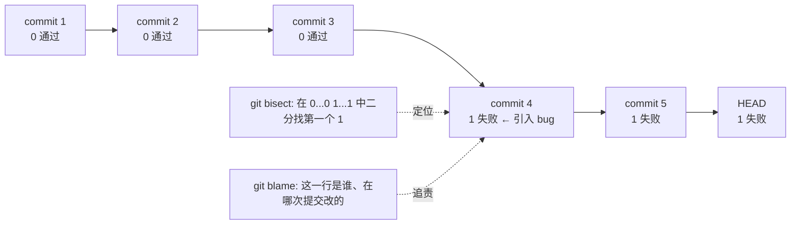

所以：你可以做二分（bisect），你还可以 `git blame`——在你知道错了以后，可以知道是谁改了这一行代码、然后发生了什么。

Git 有很多软件工程的实践。**所以软件工程，我一直觉得可能不需要在课上讲那么多的东西，你要把时间留给你们自己在实践当中、由 agent 来告诉你：每次提交的代码应该能够通过构建和测试。** 这其实是一个非常基础的要求，大家也会觉得“OK，应该是这样”，但你反复地强化、潜移默化以后就 OK 了。

然后它又说 `AGENTS.md` 是可以提交的，这是符合 best practice 的——“所以我就不再做了。”

## 14. 高血压时刻：dist、log、.DS_Store 与活着的 API Key

*(参考时间: 53:49)*

好消息是：以前在 LLM 之前，一般来说有新同学进组，都会有一些**高血压时刻**——因为使用 Git 的 best practice 是要教的。

有时候我们要做一个研究项目：“欢迎你加入这个研究项目，你去开一个 Git repo 吧。” 你大概第一周会有一个非常简单的任务：打一个架子，把一两个东西跑起来。然后一般来说，讲者在打开这个 Git 项目以后就会进入一个高血压环节：

- **`dist/` 或者 `log/` 会被交上来。** log 也是生成的文件，所以它不应该交。
- **个人的配置**，比如 VSCode 你个人的设置；甚至 VSCode 里面会有你 C 盘下的某个硬编码路径——显然在任何一个其他地方都是没有办法复现的。
- **更高血压的是：审稿的时候能看到一些处于 active 状态的 API Key。** “当我发现这个 API key 是 DeepSeek 的时候，我就知道这应该是一个中国兄弟。”
- **用 Mac 的同学不经意之间会提交上来 `.DS_Store`。**

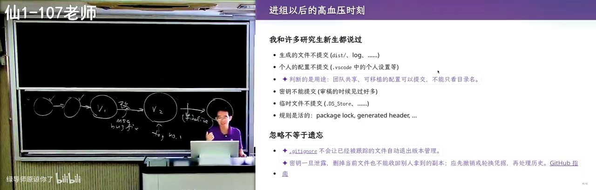

`.DS_Store` 是这么来的：在苹果系统上，如果你用 Finder 去打开一个目录，它会自动留下一些索引——大概是你把哪些子目录展开了——放在一个叫 `.DS_Store` 的文件里。

但这个文件因为是点开头的，所以默认是隐藏的。你看我的 `ls` 还很贴心地给它一个苹果的图标，但你是看不到的。你看不到的时候你就会 `git add .`，然后 `.DS_Store` 就被 Git 追踪了。

当然这也是合理的，因为点文件有可能是一些约定俗成的东西，比如 `.config`、`.github/workflows`，所以默认带点的都会放进来。但这个临时文件就有一点糟糕，因为你可能会经常变，它就不应该被提交进来。

## 15. Hook：把规范固化成自动检查

*(参考时间: 58:56)*

“真的我觉得 AI 很强。” 讲者最近在一个更严肃的项目里、希望把每一个细节都做好的时候，面临一个选择。

我们在 Git 提交之前有一个技术叫 **Hook（钩子）**。大家用过吗？你可以 hook 程序的一个函数调用，在这个函数调用结束的时候干一件事；你也可以在你的 agent 里面加入一个 hook，在某件事发生的时候干一件事。

比如讲者有一个 hook：在 agent 完成、需要他输入的时候，它会播放一个声音，“叮”一声。你现在也可以直接让它说：“帮我配置一个全局的 hook，在 agent 需要输入的时候叮一声提醒我。” 完全没问题——你在任何一个 Claude Code、你的 Codex 上都支持这样的钩子。

同样，我可以在 Git 的 **pre-commit hook** 上面做一些检查，因为这个项目的工程标准会更高一些。

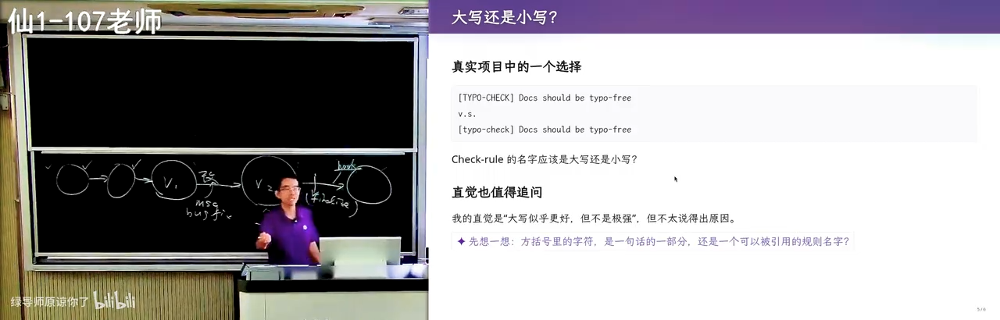

然后他就面临一个选择：我要给我的各种规则——可能我有几十个这样的 checking rules——命名，那我应该选大写还是小写呢？

首先从使用的角度来看都没有问题，两个都是好的，只要这句话里没有 typo 就是 OK 的。但到底是大写还是小写？**这是一个两难的问题。而你在学习和生活的过程中，又面临无穷多这样两难的问题——如果你的每一个问题都稍微问一句，你就会有很多很多的长进和知识。**

他让 AI 配置好 hook 之后，检查了一下 typo：AI 说 `TypoCheck` 是一个固定规则的标识，还从 **RFC** 里给了一些引用，并分析了讲者的心理——为什么他会觉得全大写会更强一点。

> **如果你们能在学习的过程中，比如在学习 Git 的过程中多问几句，把每一个细节都做好，那你们一定会成为 an a lot better person。**

## 16. Git 的底层数据结构：blob / tree / commit

*(参考时间: 63:02)*

接下来你就要开始学习 Git 了。`AGENTS.md` 也有了，那么接下来就是想要学一学 Git 到底是怎么工作的、Git 的底层原理。

讲者推荐大家去看他在计算机系统课上讲 Git 的那一段，这里就只讲一个头。这个头是什么呢？

> **Git 是一个持久化的数据结构。** 所以它就是一个数据结构。那 Git 持久化的是什么呢？**目录树。**

因为我们说就是快照：不停地版本一、版本二、版本三、版本四。你就从这个最基础的想法出发：如果我要存一个目录树，比如有一个根 `/`，根下面有 `a.txt`、`b.txt`，还有一个目录叫 `d`，`d` 里面有无穷多个文件（这个太多了，doesn't matter）。

现在我有一个非常大的项目树，今天这个已经快照了，比如说这就是一个 V1。**我现在要创建 V2，我需要把所有的文件都复制一份吗？我不需要。**

比如现在我改的是 `b.txt`，那我肯定需要创建一个 `b.txt` 的新版本。那如果我想要以最小的代价记下一整棵树，我应该怎么办？

- 我要把**它到根的路径**复制一份；
- 但根里面的 `a.txt` 我就可以用一个**指针**指过来；
- 根下的 `d` 我不能指向旧的（因为指向旧的就意味着我要用旧的 `b.txt`），所以它到根的路径都要复制一份，然后我有一个指针指到这里；
- `d` 我也可以有一个指针指向原来的位置。

“虽然不太好看，但是这就是 V2。”

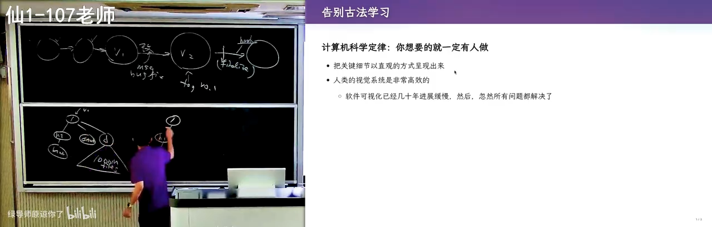

所以**即便你的项目很大、里面有一百万个文件**：首先目录本身就不可能很深——没有人会去想建一个一千层深的目录，你也没有必要去建一个巨大无比的目录。只要你每一级索引都是指数级地增加，你很快就能把所有的文件给分完。**那么你只需要创建一个非常小的增量，你就得到了一个版本的快照。**

所以在 Git 里面，底层大家看到 `.git`，在 `.git` 里面有各种各样的 **objects**。这些 object 就是一个普通的文件，你看是带 hash 索引的，就是这种节点：目录的节点、文件的节点，甚至有 commit 的节点。

它一共有**三大类型的对象**：

| 对象类型 | 存的是什么 |
| --- | --- |
| `commit` object | 一次提交：指向一个 tree，带 author、message、parent |
| `tree` object | 一个目录：条目列表（mode + name + 指向下级对象的指针） |
| `blob` object | 一个文件的内容：blob 就是 binary，就是字节的序列 |

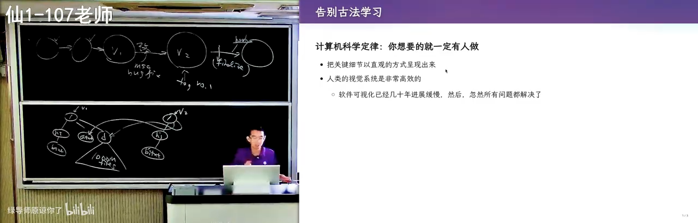

然后它就是一个数据结构，这个数据结构可以不断地向后生长。**“向后生长”就把这个问题解决了。**

> 所以你们如果从 first principle 出发，一个大学生想设计出这样的一个东西，是完全有可能的。

好，下一个问题：这是纸面上的讲解，讲完以后你有没有觉得有点不踏实——**我们的 Git 真的是这样实现的吗？** 老师上课说 commit object、tree object、blob object，真的有这样吗？然后如果发生分叉呢？首先我可以这样创建快照，我也可以从 V1 版本创建另外一个 tree（比如 V1'），那我的世界就分叉了；分叉以后合并到底会发生什么？你就自然而然地想想象这些问题。

**那么根据计算机科学定律：你想要的东西就一定有人做。**

## 17. Vibe Coding 一个 Git 仓库可视化工具

*(参考时间: 68:10)*

“所以我开一个浏览器。” 讲者以前上课的时候也会用这个网站——他相信这是**古法编程的巅峰之作之一**了：`learngitbranching.js.org`。它以可视化的方式展示了 Git 是怎么工作的，甚至模拟了各种各样的命令：

- 你看 `git status`，它都有——现在有一个改了的；
- `git commit`，看到右边的动画了吗？它就多出了一个版本；
- `git checkout`，点这个版本的时候，可以看到版本的变化。

它就是用这个方式来教你 Git 是怎么工作的。

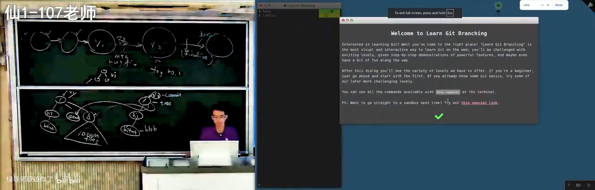

**而到今天，我觉得就可以直接 vibe coding 这些东西了**，虽然 vibe coding 的质量还并没有那么好。讲者直接 vibe coding 了一个可视化整个 Git repo 的工具，给的提示词是：

```text
实现一个 Git 可视化命令行工具，把一个真实的 Git repo（你可以使用 Git 命令）
里面的主要概念彻底完整地可视化展示。
任何对象都从文件系统里的真实文件、原始的 byte 出发，展示一步一步如何解析成了什么。
并且要求它可视化、持续监听目录中 Git 的变化，
发生变化后用动画效果来展示 repo 发生的变化。
```

> **注意这是和刚才那个 `learngitbranching.js.org` 不一样的地方：它是模拟出来的**，它建了一个 Git 的模型；但是今天你是有办法在真正的、live 的 Git repo 上面直接看到它发生什么。我从真实的文件、原始的 byte 出发，展示一步一步如何解析成了什么。

GPT-6 虽然有视觉能力，但一遍直出还是产生了一些 slop。

### 17.1 现场演示：从真实字节读出 blob 与 tree

讲者先来把它删掉——直接删除，你看右边的文件没有了。然后我们来看这棵树，这是 main 分支，它就像我画的这个一样：

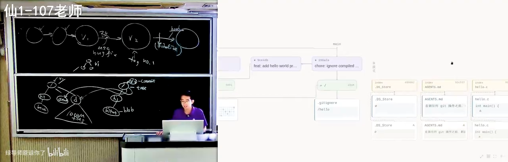

- 最早的一次提交是一个 `I did some cool stuff`，里面有一个空的 `hello.c`；
- 这个空的 `hello.c`，你看到它的文件是来自 `.git/objects` 下的一个 object——**这真的是一个 blob object**；
- 你能看到它的字节序列，看到这个字节序列以后它会帮你解压缩。**你会发现对于很小的文件来说，这个压缩反而是浪费：它 31 字节解压出了一个 23 字节的东西。但这不要紧，这是一个 blob。**
- 你看 blob 大小是 15，内容是 `int main(void)`；
- 除了这样的 blob 以外，还有 `hello` 的一个二进制文件：blob 158 字节，开头是 `7f`（ELF 可执行文件的头），你也能够看到它；
- 它也有 **tree object**，tree object 同样可以看到它在磁盘上面的原始数据：52 字节解压出 43 字节。

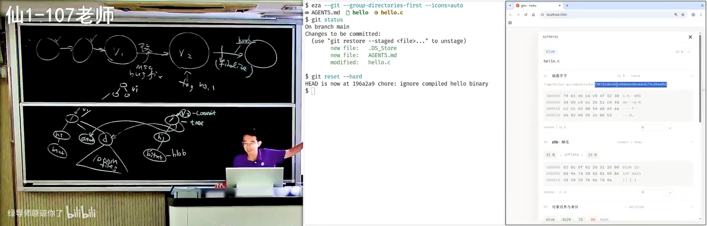

然后你看这个 tree 是这样的：`644` 代表这个文件访问的权限，然后它有 `hello.c`，真的是以文本的形式——解压完了以后就以文本的形式存储了 `hello.c`。然后你看它的树的结构：blob object（`mode 644`, `name hello.c`）、tree object；这个 tree object 指向根 `/`，在这个版本里面的根就有两个文件，一个 `755`、一个 `644`：`755` 是 `hello`（可以执行的），`644` 是 `hello.c`。这个指针链接可以拖过来一点，指向这里、指向它。

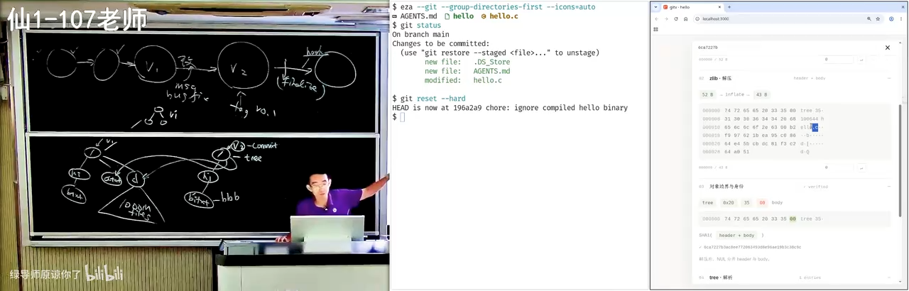

“这个视觉效果不完美，是因为我没有调，就是 one shot 直出没有改。我可能第二个 prompt 让它去掉了一点东西，就这些，所有的问题都没有修好。”

## 18. 可视化分支、冲突与合并

*(参考时间: 74:15)*

然后我们可以在这里探索 Git 的方方面面。比如你现在可以创建分支——讲者让它创建两个分支，然后你就直接看到动画效果了，**左右是实时同步的**。

### 18.1 分支就是指针，HEAD 是指向指针的指针

你看这里有一个东西叫 `refs/heads/A`：

- **分支就是一个文件，叫 refs，它就是指针。** 所谓的分支，就是指向这些东西的指针；
- **HEAD 是指向指针的指针**；
- 它在磁盘上就是这些字节，而这个字节就指向了一个 tree object；
- 我们来看 `a`：`a` 就是一棵树，树里面有一个根 `/`，根里面包括了新的 `hello.c`（`int main(void)`）；`b` 同样，指向了它改过的版本。

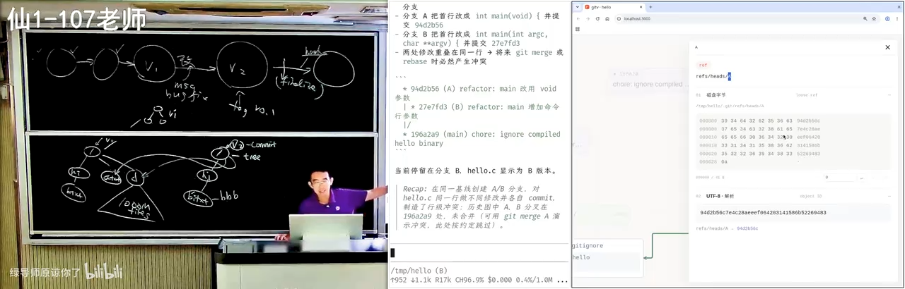

“带两个内容的视觉效果不是很好，但我相信我跟它对话几轮以后应该就能搞定了，就得到了一个近乎完美的 Git visualization。”

### 18.2 merge conflict 的现场

讲者说：我可以让它给我展示 merge conflict 的状态。这时候你看就很正常了——

假设两个开发者在开发的时候，一个人做了这个修改；你和你的团队成员每个人都对这个代码有想法，你们两个都提交了，那就会进入冲突状态：**A 在这，B 在那**。当你把那个 A 拉到本地的时候，你就会看到这个冲突状态。

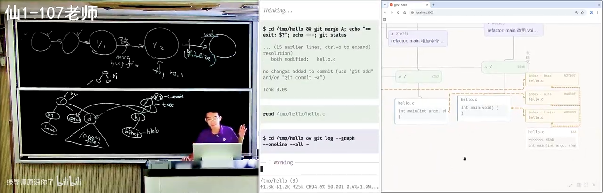

你看冲突现场：`hello` 的内容是这样的；然后你可以看到现在未提交的区域——在 **index** 里面有好多东西。`hello.c` 这是你看不到的：**Git 悄悄地在这里面留了三个版本，叫 `base`、`ours`、`theirs`。** 而它给你看到的那个 `hello.c`，是这样的一个带冲突标记（尖括号）的。

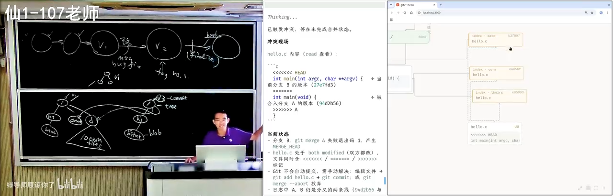

然后你可以让它 resolve。你看那些临时文件没有了——这个 merge 创建了一个 **commit object**：它的 tree 是这个，**它有两个 parent**，然后它有 author；你看到这个指向的关系被正确地保留下来了，它的 tree object 选的是这个版本。

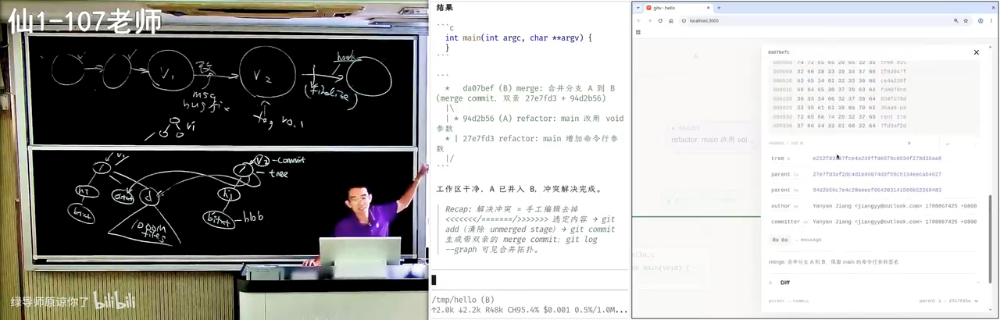

> 所以看到 vibe coding 很好用。我觉得你们这么大的年纪、尤其是你们有时间的时候，**你们最大的乐趣就是 vibe code 一个这个，然后 vibe code 完了以后就各种调，跟着它学习，很快你的知识就爆炸式地增长。**

## 19. 把 Python 教给小学生：架构自己把关，其余外包给 AI

*(参考时间: 78:17)*

我再举一个例子。你们做 CS、上 SICP 的时候，有没有用过这个（应该是官方的）`code.cs61a.org`？

这是一个 Python IDE——放大一点，这还是很好用的。**这是一个如假包换的 Python IDE**，你可以运行它（可能它在加载一个 Python 的 runtime 库到本地，但这个库在我这里访问出来并没有很快）。基本上是一个完整功能的 IDE，它可以完成作业。

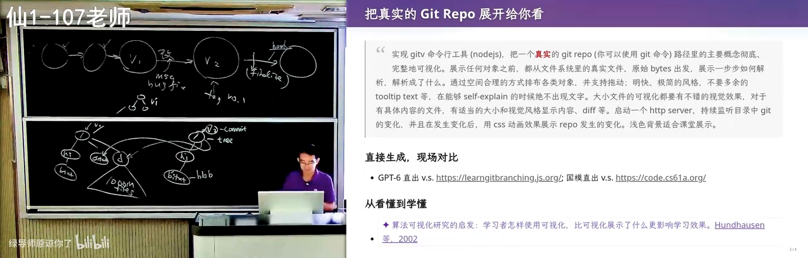

最近因为有一个小项目，所以讲者也被迫 vibe code 了一个类似的东西。你已经看到这里面有 slop——这些 slop 都是直接让 AI 一句话去生成的；它可能也不是一个 IDE 级别的东西，但效果还是不错的。

**在架构设计上他稍微做了一点自己的把控，把了关**，所以这个系统的架构还算比较好：

- 它既可以作为一个**网页应用**去教大家编程；
- 也可以作为一个 **Electron** 的、像 VS Code 一样、一个 `.exe` 双击就能打开的应用；
- 它可以**可视化任何程序**。

因为要给三四年级的小朋友教 Python，这是一件很有挑战性的事情：**第一节课如果你教他们 PyCharm 的话，就全完蛋了。**

所以要做一个极简的界面。“整个都是外包的，就是都是 AI slop 了，我也不再管控它的代码质量，但我对它的架构其实有把控。”

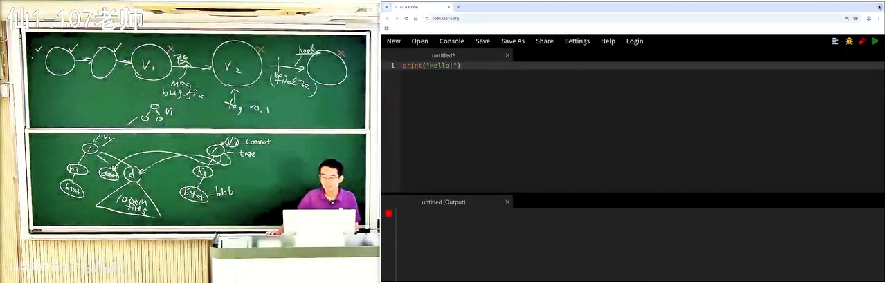

### 19.1 第一节课：Python 很好玩

第一节课要给小朋友讲 Python，就要给他一个印象：**Python 很好玩。**

- 我可以把一个整数变成一个字符串（这是你们熟悉的）；你们没有想到的是，我把一个 Unicode 字符编码成一个整数，然后再把它 decode 回来；
- 我还可以 `hello * 10`，就可以打印 10 份。

这就是上的第一节课。

如果你经常讲汉诺塔——**我有 debugger**：这是我的调试器，每次在递归之前我会告诉你它应该怎么移动，然后我可以往后播放，它就会真的移过去；我可以换一个多一点的，可以往前拖也可以往后拖，看起来就是一个不错的可视化。“这也是外包的，完全外包的，上课的负担就轻多了。”

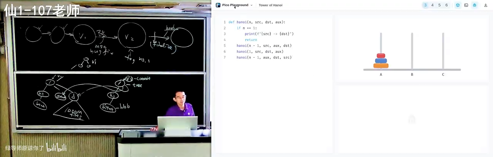

但这还不是我们真正觉得好玩的。你想，三四年级的小朋友能编什么程序呢？就这种玩——**我给他一个 API、给他一个世界，然后他可以玩起来。** 我也可以挑事。

这是一个 flat、完全 flat 的程序：你可以看这个程序运行的过程，一个 X、Y、Z 的循环，你会看到这个方块从上往下掉，每一次都是真实的；我可以往前走、往后退。视觉效果稍微调了一下，所以看起来就不那么 slop 了，包括左边这个坐标轴也是正确的——“我还骂了一下 AI，第一版它实现的坐标轴不符合我的预期。” 最后还可以 play，动画是平滑的，左右拖的时候是平滑动画。

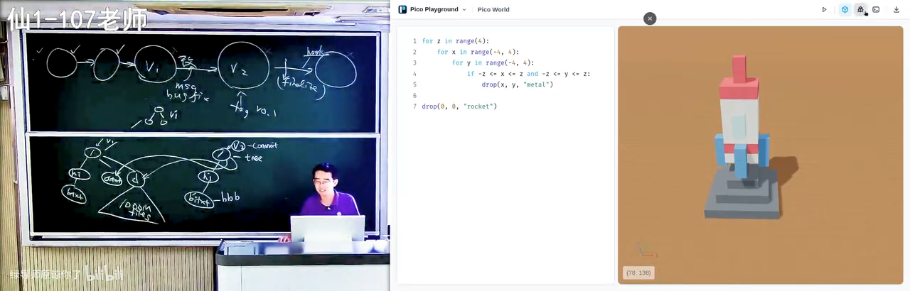

> 你想我们的快乐来自于哪里？你们刚开始学编程的时候就一个二重循环，打一个星号打一个三角形，你不就很开心吗？我现在一样：你学 Python，然后你就可以 3D 打印了——这是一个 3D 打印的程序，你可以叠块、可以挖，人就创造了一整个世界。

剩下所有东西都是直接 AI slop，管都没有管：比如 Fibonacci number 的递归、insertion sort——回到头上开始播放，插入排序是怎么样一个一个比较的，你看到就太容易了。

当然讲者有一个 **skill** 可以把它编译：有一个编译的 skill，可以把任何一个你想要的东西编译成可执行文件。在模型的能力下，他还试了更便宜的国产模型的 Flash / Vision 版本，就可以出效果。“反正我觉得效果已经达到一个完全可用的状态，然后我就可以去挣钱了。”

### 19.2 今天真正有价值的品质

**在今天，你们真正有价值的品质，就是你们愿意去花一点时间学习。**

然后你很快就会发现在求职的市场上面，“把细节做好”的这个 bar 不断地会提高——因为一旦有人学会了，招人的单位就会用这个标准来衡量你。

你想，我在面对一个研究生的时候问他“Git merge 了以后会发生什么”，他没有任何的概念；和另一个人——他在学每一个专业课、每一个算法、每一个细节的时候，都在 AI 的指导下巩固了这个概念、真正消化了这个概念，可以从零开始构建这些概念——**这两个人在 job market 上面的竞争力**……

当然我觉得可能还有一件事情会发生：反正 AI 太强了，所有的人都没有竞争力了，那也许这是最好的状态。否则你想一想你们的危机感：这个世界上有很多那样的人，你们如果不成为那样的人，你上了这个 job market 你就死了。

> **所以我说“上课耽误学习”是真实存在的。** 因为你们的很多老师，真正好的东西打开都没有打开过——那些真正好的代码、真正好的项目、符合工程规范的项目——他就对着那个课本讲一遍。和今天你看到的这个 AI 直出的东西：刚才那个整个的框架，大概我就是两天的碎片时间就全部完成了，包括视觉效果的调整，就没有任何的成本。**做这些事情已经没有任何的成本了。** 所以我说我马上就淘汰了。我自己学习的时间是非常有限的，我很想学很多东西，但我不像你们有那么多时间。

## 20. 工程细节：Conventional Commits 与中英文空格

*(参考时间: 86:18)*

大概是这样。虽然我好像在讲 Git，其实我讲的是 **best practice**。这里面的 best practice 还有好多。

刚才如果你有注意力，会注意到 AI 给了我们一些东西。其实 AI 还是挺 slop 的：你看前面的 commit message 都是英文，都是一行加上一个详细解释；然后你看这 AI 就开始自由发挥了，它开始混了英文和中文了。但还好，它还是遵循了这样一个格式：**先有 scope、我干了什么，然后一个总结，再有 message body。**

你们看了很多就知道这个东西存在，它实际上是有标准的。今天你已经可以找到 **Conventional Commits**，它告诉你——这个文档很短，这个 specification：**commits must be prefixed by a type**，包括 `feat`（我如果要引入一个 feature）、`fix`（我要 fix 一个 bug），一定要有一个冒号，一定要有一个空格。这些都是规范。


有的时候，比如我和同学合作的时候，高血压时间还是比较多的。比如文档：**一般来讲，Markdown 的文档，英文和中文之间要有一个空格。** 这是不知道什么时候大家开始用的一个 convention，但好像大家都会用这个。比如“你好，这是 `hello.c`”，对我来说这是肌肉记忆。

**但我最难受的是：一个文档里面有一些是这样、有一些是那样。** 你们注意到了吗？当我看到这个时候，我就是浑身难受。你哪怕全部都不加空格，我都会认为好像你是在遵循某一种 convention，你是保持一致的；但是如果你不一致的话，我真的是有点头大。

这里有很多，所以 AI 会把这些细节给做好。**而这些工程细节其实都是为了工程师在面对更大项目的时候有一种一致性和规范**：比如说你的代码要以同样的方式排版，很自然地你的文档也要以同样的方式排版，这样的东西人维护起来会更好。

虽然我觉得在 AI 时代可能也不重要，AI 都会帮你——所以 AI 我还是很喜欢的：所有用 AI 的学生都不会生成那样的 slop，至少不会生成那样的 slop。

## 21. Commit Often, Perfect Later：小步提交的工程理由

*(参考时间: 89:24)*

Git 还有很多很多的 best practice。比如说你可以在网上找到各种 **"Commit often, perfect later"**。这里有很多，这些其实都是有工程实践经验的，你们回去读一下这些文档、让 AI 帮你，你就会学到更多。

**比如说为什么要及时 commit？** 因为在复杂的项目里面，随着你修改的东西越多，你错的东西就越可能多。

- 你在小项目刚开始的时候其实不要紧，你一次提交个两三千行代码都 OK；
- 但是一旦这个项目里面有错综复杂的关系以后，你的一个大的 commit 可能会 break 这个项目里面多处的东西，引入多个 bug，后面再要引入多个 fix 来 fix 它。

这时候你有一个很大的 commit：比如你有一个一万行的提交，然后后面你修了一百个 bug，你都说“这是那一万行产生的”——这就很糟糕，甚至修不过来，你也不知道它修好没有。

而如果你每一次的 commit 都是很小的、都只做一个修改，那**冤有头债有主**：这个 bug 就是你写的，我修完了也就修完了。**这两个 commit 是可以配对的，它给了我们审计的能力。**

它也给我们一些保障：比如说你改了很多，然后不小心你自己的电脑就损坏了、物理损坏了，而你还没有来得及推到远端——你做一个小的提交立即 push，那么你就可以得到一个互联网上的备份，你的电脑马上坏了也好。

这个 AI 是很清楚的，它知道你可以 `revert`、可以 `bisect` 二分查找，然后还有一些我后面可能会讲，比如说 **Hooks 和 CI**。

### 21.1 gh 与 glab：Git 之外的那些东西

以及你们如果还有惊人的注意力，应该观察过：你们的项目可能托管在 GitHub 或者 GitLab 上，那么你会看到你的 AI agent 会试图调用一些 `gh` 或者 `glab` 的命令，然后你会看到一个 `command not found`，**然后它就回退到古法编程，又开始写 git 的命令**。

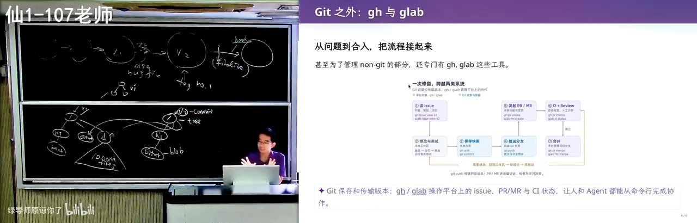

是因为 GitHub 实在是太 popular 了、太好用了，那么就值得做一个命令行工具，把 **non-Git 的部分**管理好：

- 好多代码的快照 Git 管了，但是 GitHub 上还有 **issue**——我今天可以发一个文本，我还可以对你的代码做 **comments**，而这些东西都是**不随着 Git 的 tree 做 persistence 的**；
- 那么如果我们想要管理它，就做一个命令行工具：我可以去 fetch 一个 issue，可以找 assign 给我的 issue（你要登录），找到以后我还可以把这个 issue close 了。

那这个命令行工具的 agent 就很好用：你装了 `gh` 以后，我就可以在 agent 里面设置一个 goal，说“给我完成一个什么”，可以设置一个很长的任务。我会要求它做**小步的提交**、做**可以审计的提交**，然后是分支的规则、线性的历史等等。

你可以看到我的这个项目就有大量的这样的提交——从我开始撸代码开始，大量的这样的提交，然后我很多时候都不管他们。

## 22. 总结：Git 是用 Atomic Change 推进的快照

*(参考时间: 93:26)*

讲了很多 Git，其实这门课讲的还是软件工程。所以最后这小段总结是今天更重要的：

> **Git 本质上是一个软件，它说：我们要把项目组织成用 Atomic Change 推进的快照。**
>
> 这是你们今天要记住的事情，然后所有的一切都是从这句话里面推出来的。

你组织一个软件的项目，你要管理很多的快照，这样就可以**随时开启一个新的分支做一些尝试**：如果失败了你就可以把它安全地扔掉，如果成功了你就可以把它合并进来；然后你甚至可以**同时推进多个主线**，而以合并的方式让它完成，而不会互相干扰。

因为如果你们做大作业、自己古法做大作业，肯定有这个感受：你如果要改好几个地方的时候，改着改着很可能就改乱了，你这个部分和那个部分冲突。

> **所以项目管理的本质是：人类没有办法处理一团混沌**——很多需求、很多代码，一次做一大波。

所以很自然地，我们要把需求分解成**可以理解、可以审计的小任务**，一小步一小步地。这样：

- 出了问题就可以 `bisect`、可以 `blame`；
- 协作的时候可以 `blame`；
- 发生冲突也容易解决：两个小任务发生冲突，即使我在一个公共的祖先上面做了好多事，如果每一个都很小，那么发生冲突时我可能能知道哪一个小的提交是冲突的，剩下的不冲突的部分合并起来可能会比较容易。

### 22.1 Linear History：一个当下的选择

包括有些项目会要求 **linear history**。我们做可能更严肃的项目也会要求所有的 main……我们的合并可以是这样：我把这个提交合上来，就像刚才我们看到一样，我的一个 commit 可以有两个 parent；然后当然它可能又继续分叉、又合并，最后会变成一个很典型的 Git 的结构。

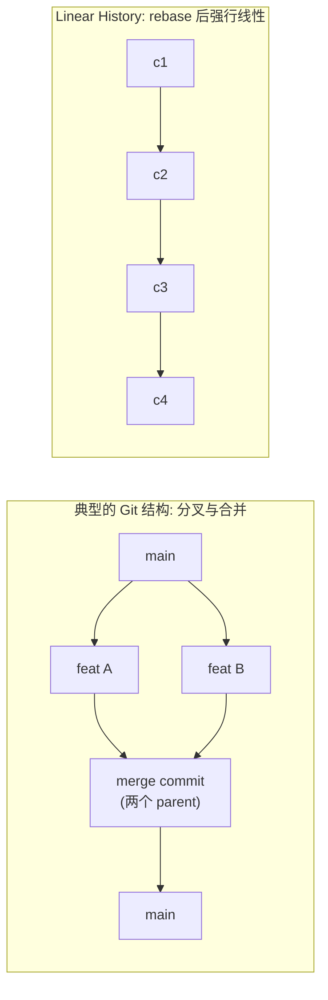

但是现在好像大家更流行一个 **Linear History**：因为反正都是 AI，反正它 resolve、它 rebase 都很容易，我就强行要求我的整个 commit history 都是线性的，好像是线性的一样。

当然这个也不完全是所有的都是好处，但至少对于现在我们维护项目来说：

- 它会让**历史更易于追溯**；
- 它对 **cherry-pick** 和 **blame** 也更友好。

**在无限大能力的模型到来之前，这件事情都是好的**：你把 Git 记录拆分得非常好，你很容易找到这次修改是由谁引入的，那么 AI 维护项目的效率也会高一点，也会省 token 一些，有些文件它就可以不用去读了。

## 23. 附：讲者自己的多 Agent 工作流

*(参考时间: 96:31)*

还有一些经验可以分享。虽然我们知道是要小步向前进，但**我们怎么管理一个项目**呢？

**第一阶段：架构设计用单线程，用一个智力比较高的模型跟它讨论。** 这个其实很重要，因为如果你的软件设计得不好，你后面就是无穷的迭代。

第一次课的时候就给大家展示过这个例子：我会把组件库的接口定得非常好。为什么这么信任 AI 的代码呢？看起来这个项目里面有很多互相关联的组件：我们的程序会运行产生结果，然后我拖动这个进度条，它不仅要关联到我的程序的编辑器，还要关联到这个上面。

但我做了这些约束：

- **绝大部分的接口都设置成 functional 的，就是 pure function**，包括我的 trace 是程序的一个 pure function；
- 我有一个标准的程序 **derivation graph**，要求按照这种方式来展开；
- **所有全局互相影响的状态都注册到一个全局的地方**：比如光标的位置会怎么样影响这个可视化、包括菜单条——这是非常干净、非常小的状态。

所以你看到的这样的一个 playground，基本上核心的共享状态也就只有十几行：十几行的共享状态，然后一个十几行的组装，**剩下所有东西都是黑盒子**。

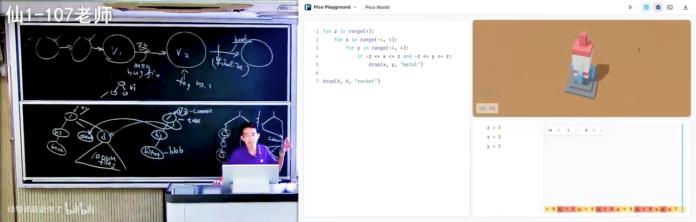

我还会直接要求 agent：在设计这些 visualization 的时候，**禁止看任何库函数的实现，只看接口**。所以它非常省 token——就几万个 token 就可以做一个这样的 playground。

**第二阶段：架构完成以后，开三个（或几个）terminal 并行。**

`AGENTS.md` 里有一个明确的协作规则，比如：

- 不需要调用视觉模型去检查（agent 很喜欢做这件事，然后花很多 token）；
- 也不调用浏览器任务——我在边上另外一块屏上放一个浏览器，它是及时刷新的。

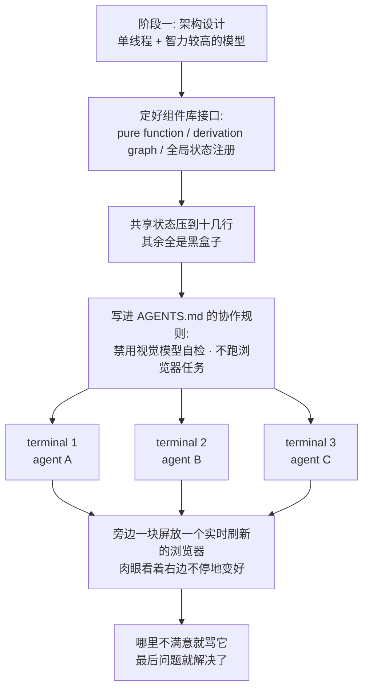

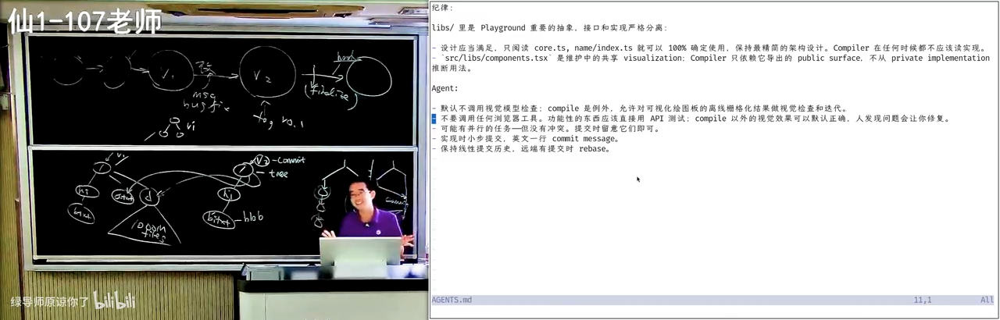

然后我就开始开三个 agent，**哪里不满意就骂它**，然后你就可以肉眼看着右边那个东西不停地变好、变好、变好，最后问题就解决了。

这是一个 agent 能力之内的项目。而讲者非常确信的是：**Agent 能力会不断地增长，越来越多的项目能够被 Agent 以这样的方式完成——一个比较轻量的讨论，然后剩下全部完成。**

> **这是一个非常可怕的事情：如果 Agent 快了 1000 倍，我们还怎么样管理这个版本控制？我们可以下一节课再来讨论。**
>
> 好，今天下课。

---

## 后记 Postscript：本书是如何生成的

这本书的生成过程和之前的几讲有一个重要区别：**这个视频在平台上没有任何字幕。**

上传当天抓取时，B 站的字幕接口返回的是空列表——既没有作者上传的 CC 字幕，AI 字幕也还没有生成（`--list-subs` 里只有弹幕）。所以这次走的是一条新的兜底路径：

1. **只下载音频轨**（`yt-dlp -f bestaudio`，约 90 MB 的 `audio.m4a`），不下载任何视频流；
2. **本地 ASR 转写**：faster-whisper `large-v3`，CUDA + `int8_float16`（RTX 3050 4GB），VAD 过滤，配合一段领域术语 prompt（Git / 版本控制 / Conventional Commits 等）来压制同音错词并让中文输出自带标点；
3. 100 分钟的音频约 21 分钟转写完，切成 **2907 段**、覆盖率 100%，写成与平台字幕同构的 `transcript.json`；
4. AI 通读全文，建立术语表并重构为本书：口语转书面语、按内容逻辑分 23 章（另加一篇后记）、绘制 6 张 Mermaid 图、插入 38 个截图锚点；
5. 截帧管线在已登录的浏览器里逐个 seek 到锚点时间、隐藏播放器 UI、锁定顶码率流后截取纯视频帧；
6. 渲染为带视频卡片、截图放大（lightbox）与 Mermaid 交互的暗色主题 HTML。

本地 large-v3 的识别质量整体高于平台 AI 字幕，但仍有少量专有名词需要人工订正（例如 `GPT-6` 被识别成 `GP6`/`GP16`、`AGENTS.md` → `agency.md`、`int main(void)` → `interment`、`convention` → `考案神`、`外包` → `外部`、`Conventional Commits` → `confessional commits`）。与视频逐句对照的订正稿见 `transcript.corrected.txt`。
