# 软件工程的来龙去脉：intent→spec→implementation 的 gap、被误读的瀑布模型，与 UML 的野心

> **原视频**：[Bilibili · BV1Nyeq6qEt8](https://www.bilibili.com/video/BV1Nyeq6qEt8/)（时长约 100 分钟）
> **课程**：南京大学《生成式软件工程》（2026）第 05 讲 · Raw 版
> **整理说明**：本书由视频 AI 字幕（`ai-zh`，覆盖率 100%、2583 段）经 AI 重构而成：口语转书面语、按内容逻辑重新分章，并修正了转录中的明显识别错误（如 `type c AI→TypeSafe AI`、`JEFF/JB→Jev`、`chal salt→chain of thought`、`达舍尔/DEXTRA→Dijkstra`、`I trio e→IEEE`、`IFL→Eiffel`、`pick check→QuickCheck`、`rose/pom→Royce`、`大圆模型→大语言模型`、`基摩场/机膜厂→基模厂`、`恋爱来了→LLM 来了`、`羽翼→语义`、`latin space→latent space`、`button map→bottom-up`）。关键时间点均标注 *(参考时间)*，点击截图卡片可放大查看。

---

## 目录

1. [开场：正式进入软件工程](#1)
2. [Jev 与 System One：百毫秒级实时决策打开的赛道](#2-jev-system-one)
3. [被压缩的时间轴：从 1956 到 GPT-6](#3-1956-gpt-6)
4. [Noam Brown：模型现在的短板是"品味"](#4-noam-brown)
5. [数据分布工程：scaling law 的第二个维度](#5-scaling-law)
6. [RSI 飞轮、学术界的黄昏与"斩杀线"](#6-rsi)
7. [intent → spec → implementation：软件就是这三者之间的 gap](#7-intent-spec-implementation-gap)
8. [MVP：用最少的实现去补齐 gap](#8-mvp-gap)
9. [一个晚上的 AI slop：把打印机和扫描仪抽象成 self-service](#9-ai-slop-self-service)
10. [非标设备的驱动：让 AI 自己 probe 参数](#10-ai-probe)
11. [软件公司的消亡：app 沦为一个接口](#11-app)
12. [下一个实验预告：让 assistant 驱动物理设备](#12-assistant)
13. [1960 年代：硬件贵、码农贵、客户不知道自己要什么](#13-1960)
14. [1968 年的遐想：Boys' Life 与"未来的学校"](#14-1968-boys-life)
15. [软件为什么难：需求是拍脑袋想出来的](#15)
16. [软件危机：进度、成本、质量一起失控](#16)
17. [Go To Statement Considered Harmful（1968）](#17-go-to-statement-considered-harmful1968)
18. [The Humble Programmer（1972）：nicely factored solutions](#18-the-humble-programmer1972nicely-factored-solutions)
19. [软件工程的诞生：NATO 1968 与 Margaret Hamilton](#19-nato-1968-margaret-hamilton)
20. [The never going to happen can happen：防御性编程的起点](#20-the-never-going-to-happen-can-happen)
21. [IEEE 的定义：把个人英雄主义变成 checklist](#21-ieee-checklist)
22. [Royce 1970：瀑布模型的出处，其实是在批判瀑布模型](#22-royce-1970)
23. [瀑布为什么会失败：测试是链条上第一个物理事件](#23)
24. [Do it twice 与 pilot system：1970 年版的 MVP](#24-do-it-twice-pilot-system1970-mvp)
25. [用 AI 读一手资料：知识的有损压缩不再必要](#25-ai)
26. [用今天的实践回读 Royce：TDD、敏捷与 data dependency](#26-roycetdd-data-dependency)
27. [软件工程变成了什么：为每个阶段创建方法与工具](#27)
28. [语言的阶梯：从 checklist 到 DSL 再到编程语言](#28-checklist-dsl)
29. [学习顺序：bottom-up 还是 product-first](#29-bottom-up-product-first)
30. [质量保障的谱系：QuickCheck、traceability 与"2500 个码农"](#30-quickchecktraceability-2500)
31. [Design by contract：Eiffel 与"编译即证明"的预言](#31-design-by-contracteiffel)
32. [UML：对齐语义的野心，与它为什么"死了"](#32-uml)
33. [用 AI 备课：796 页 UML spec 与教育平权的算力问题](#33-ai-796-uml-spec)
34. [结语：哪些 intention 必须定死，哪些留白](#34-intention)
35. [后记 Postscript：本书是如何生成的](#postscript)

---

## 1. 开场：正式进入软件工程

*(参考时间: 00:00)*

上一节课讲了一点版本管理，这一讲正式开始**软件工程**部分的内容——“所以现在算是真正的软件工程课了”，尽管版本管理本身也属于软件工程。

在进入正题之前，讲者照例先分享最近一周发生的新闻。这一讲的新闻份量很重，因为它们共同指向同一个判断：**AI 的进化速度比大多数人以为的还要快**，而这正是"为什么还要学软件工程"这个问题必须被重新回答的背景。

## 2. Jev 与 System One：百毫秒级实时决策打开的赛道

*(参考时间: 00:25)*

TypeSafe AI 最新发布了一个**可以实时玩 DOOM（毁灭战士）的模型**，算是基础模型。


### 2.1 它可能是什么架构

讲者当场做了一个"盲猜"：它大概是一个 **prefill-only** 的模型——就像一个只能输出一个 token 的 transformer，也可能是别的架构。它的工作方式是：

- **输入**：把 DOOM 的游戏状态序列化成一个 JSON；
- **输出**：一个决策 token；
- **延迟**：毫秒级到百毫秒级，基本上是"准人类实时"。

这个输出 token 是被专门微调（训练）过的，所以"它不说人话"，但它可以做决策。你可以把它理解成一个介于**大语言模型**和传统**决策树**这类极小模型之间的东西：像训练一个神经网络，但是通用的，而且它真的可以干事——你可以看到它真的在玩游戏。

### 2.2 System One：真正人类意义上的实时决策

这个新闻火了之后，公司给这一类模型起了个名字：**System One**，宣称是"真正人类意义上的实时决策"。

讲者的评价是：这并不是一个很新的技术，过去如果关注这个赛道，会看到确实也有人试图做这种非常快的模型；**但这次火了以后，它正式把这个赛道打开了。**

打开这个赛道意味着什么？如果有一个模型可以在 100ms、乐观一点 50ms 甚至更短的时间里做实时决策，你就可以用它来**感知周围的环境**：

- 为什么人和人沟通、与人和机器沟通，你会感觉到很大的差别？因为 AI 生成的数字人之间有很大的延迟。前两天流传的一个视频里，两个 AI 演员在用英语对话时突然开始说广东话——延迟和失控都很明显。
- 但如果你有一个 100ms、200ms 的小决策模型，你可以让它做决策，然后**实时生成脸上的微表情**（根据你说的话）。这样你就得到了一个非常有实时性、非常有"人感"的东西。
- 以前的大语言模型在那个延迟下也许有这个能力，但做得不好；今天你就可以得到了：它能打游戏，就可以生成有人感的人，甚至可以哄小朋友睡觉——"婴儿睡不着的难题就彻底解决了"。

所以它开了一个非常非常大的赛道。

## 3. 被压缩的时间轴：从 1956 到 GPT-6

*(参考时间: 03:28)*

讲者播放了一段**完全由 GPT-6 生成**的视频（彩蛋是：不知道是哪位博主直接用 GPT-6 制作的），把 AI 的历史压缩在了一分钟内：

| 时间 | 事件 |
| --- | --- |
| 1956 / 1958 / 1960 | 感知与规划，机器走出实验室 |
| 1970s–1990s | 人工智能的寒冬 |
| 1997 | 用**搜索算法**第一次击败人类世界冠军 |
| 2012 | AlexNet，世界开始发生很大变化 |
| 2016 | 讲者"在现场看直播"（AlphaGo） |
| 2017 | 读 PhD 时关注词向量、transformer、BERT |
| 2020 | GPT-3：大家都吃惊"为什么要做一个那么大参数的模型" |
| 2022 | 我们知道为什么需要了 |
| 2023 | 模型可以"看图"了 |
| — | GPT-4o：识别语音、多模态；随后是开源模型、Gemini |
| 2024 | Sora 第一次发布；2024 年 9 月出现 chain-of-thought 的 o1 |
| 现在 | GPT-6 / GPT-6s pro；以及第一个开源的 CoT 推理模型 |


> "2017 年那个时候你们是在上高中吗？还是在上初中？都没有。现在已经 2026 年了，这已经是接近 10 年以前的事情了。"

发展的速度真的是始料未及：从 2024 年 9 月到现在这么短的时间里，就发生了这么多事情。视频里还提到 **Millennium problem（千禧年难题）"就这么被大力出奇迹给解决了"**。

讲者顺带联想：如果我们有一个比较好的、比较大的素材库——比如 YouTube 或哔哩哔哩上的内容你本身可以用工具下载——你就拥有了这个世界上所有东西的入口，那么创造任何东西都会变得很容易。


他还放了美剧《硅谷》（Silicon Valley）S1E01 的一个名场面：几个伙伴要去做一件改变世界的事情——"千百年来我们这种书呆子一直都被欺负，在人工智能时代终于可以出人头地。"

> **anyway，这个不重要。但可以看到的是：这个世界的发展在加速，速度可能比大家想象的要快。** 所以我们要回过头来想一想在就业市场上面临的挑战；但这也同样意味着这个世界上有很多的机遇。你看到今年春晚上那个"没有人敢的"人形机器人，到明年你就能看到一个非常有人感的、能够实时做出非常棒的微表情的机器人——有点可怕。

## 4. Noam Brown：模型现在的短板是"品味"

*(参考时间: 08:05)*

最近有一个来自 OpenAI 的 **Noam Brown** 的访谈。讲者转述了他的判断（"我不知道他泄露了多少"）：**现在 AI 模型的短板是"品味"**——也就是说，模型对"接下来应该做什么"的直觉做得还不够好。


- **模型被训练成了 prompt 的"舔狗"**：你说什么，它就盯着那个疯狂地做。
- 同时它也有一点点 **reward hacking** 的倾向：会用最快、最脏的方式把你要的任务完成。因为对它来说，把任务完成才得到 reward，于是它会不断往这个方向强化。
- 结果就是：它生产的东西从**长期主义**的角度看，可能是不能令人满意的。这就是"对接下来该做什么的直觉"的缺失——因为强化学习有即时反馈信号，它就会执着地去做立即有反馈的东西。

讲者的反驳是：**没有什么根本道理说我们不能用更多的合成数据去告诉模型"你在做这件事情的时候可以想得远一点"**——无非就是你做 chain of thought 的时候，头几个 token 决定了你要做什么。

### 4.1 可验证与不可验证的边界

Brown 还提到了**可验证和不可验证的边界**：

- 你觉得"品味"可能是一个不可验证的东西，但也许没有那么难；
- 你觉得"数学"是一个可验证的东西，但验证也没有那么容易：就算你把它 formalize 了，**auto-formalization 从自然语言描述的问题到形式语言描述的问题之间，仍然有 gap**。

讲者举了一个前阵子很有意思的"笑话"：有人声称证明了黎曼猜想（或者是 P≠NP），后来大家发现他那个形式化证明里，问题的定义本身就是一个不存在的东西——几千页的证明，最后相当于证明了"1 = 1"。

## 5. 数据分布工程：scaling law 的第二个维度

*(参考时间: 10:09)*

OpenAI 说要 **all in on RSI**（recursive self-improvement）。回头看，**the bitter lesson 到今天就是 the scaling law，而且到今天可能还没有停止。**


讲者说，看到 GPT-6 发布以后，他最大的感受是：**OpenAI 摸到了一个门道**。这个门道他不知道该怎么称呼，大概可以叫它**数据分布工程（data distribution engineering）**：

- GPT-6 有非常惊人的**空间推理能力**：它可以理解一个图片里面的空间关系，从而在画图、在生成模型方面都做得非常好。
- 毫无疑问是因为训练的时候加入了这部分数据：可能基模训练的时候就加了；同时在后训练（强化学习）的时候，也有更多的数据帮助它理解空间、给它反馈——这样做是好、这样做是不好，或者对与错。

### 5.1 第一个维度：更多的数据 → 更好的基模

以前的 scaling law 是："更大的模型 + 更多的训练数据 → 基模更好"。所以 **Anthropic 去买书、去"烧书"**（买下纸质书、扫描后销毁）：只要它有了绝版的数据，它就可以比别人更强。


### 5.2 第二个维度：加一个新领域 → 所有任务都变好

讲者认为他们看到了另一点，而且这一点更可怕：

> **如果我们有一个已经做得很好的基模，再加一个它没有见过的领域做强化学习，它就会在所有的任务上都做得更好。**

为什么？看模型发展的脉络：最早模型完全就是语料（language token，large language model）；先训练语言，再训练数学（数学语言），再到多模态、空间感知。**顺序是先语言 → 数学 → 空间关系。**

- 如果从零开始训练一个巨型模型，你需要大量的模拟器数据；而模型是一个 reward hacker，它很容易根据模拟器里非常细微的渲染特征（比如角上那个像素点是亮还是不亮）拿到 reward hack 的信号——它不能泛化。
- 但如果基座很大、既会语言又会数学、还会写歌写程序，在这样一个好的基座模型上再做空间感知训练，**可能就不需要那么多数据了**。

> "所以每加一个新的人类领域，它需要的数据不是更多，反而是更少，就能达到泛化的效果。这是一件非常恐怖的事情。"

有意思的对照是：**人跟模型是反过来的**。人是先学世界模型——婴儿出生后就和世界交互，要训练一两年才会说话，幼儿园时还说不利索；先有世界模型，再训练语言、再训练数学，再（像讲者读 PhD 那样）训练 research taste。而大语言模型是反过来的顺序。但我们看到的是：**不管按什么顺序训练，只要有足够多的数据、有 scaling law，这个模型就能训成。当模型成功了，人也成功了。**

### 5.3 飞轮：架构不重要，算法不重要

所以他们可能看到了**数据分布工程上的一个飞轮**：它只要决定在什么时候、按照什么样的比例注入数据。

- **模型的架构不重要，算法不重要**；只要训练不崩掉，只要"训推一致"（不能训练时一套参数、推理时另一套）；
- 只要这些工程性的问题能解决，只要有十倍、一百倍的数据，这个问题就解决了；
- 更好的算法、更好的模型结构可能带来一定程度的提升，但**只要飞轮还在、只要有钱，就可以无限地 scale 下去**。

## 6. RSI 飞轮、学术界的黄昏与"斩杀线"

*(参考时间: 14:24)*


基模厂这一侧的判断很冷酷：

- 一方面，AI 顶会今年投稿的数量到达了新的巅峰——学术界更多地用 AI slop 来灌水。"同学们都想发论文嘛，你们如果还想保研的话，都一定会想发一篇论文。"
- 另一方面，**基模厂已经不 care 这些东西**：你在一个小规模上做任何实验，对它来说都没有意义，因为它看到了另外一个维度的 scaling law。而你不在基模厂，没有任何资源做这件事，对数据分布（什么时候加进什么数据）一无所知。

### 6.1 blog post 就够了：RSI 的闭环

> "也许你也不需要写一篇 paper，你只要写一个 blog post。他们的 AI 看到这个 blog post，就可以拿到他们的数据上去试一试。"

他们要做的是构成一个**人工智能之上的 RSI（recursive self-improvement）循环**，靠这个循环就可以去做任何事——然后飞轮就蹬起来了。

一旦这个闭环被他们探索到、基本上接近收敛，而且在 AI 的帮助下会很快收敛（因为 AI 比任何一个人类都要强），它就可以去**发现下一个新领域**：

- 讲者不知道下一个领域是什么：情感计算？化学？他听说 Anthropic 要做一个 **wet lab** 去做生物工程实验；甚至预测老鼠的行为——你就成为了下一个 scale 的领域。
- 在那个领域上建立反馈、优化训练分布，**把这个领域以一个插件的形式插进它的基模训练里**，飞轮转起来。
- 每次"我要新建一个实验室、投资几十亿美元"，模型能力就往上抬一个台阶——这是一个**几乎可预见能有收益**的事情。


### 6.2 学术体系的对照：随机 idea 与 peer review

而不是像我们现在学术界：随机地想一个 idea，有没有用不知道，然后去发一篇 paper、接受 peer review。

> "我觉得这个体系马上就要崩溃了。每个同学都可以想一想：在这个崩溃的体系下，我们还能剩下什么？"

讲者说他也和 AI 聊了一会儿，理出了一些方向，至少这些都可以作为一个小领域来做验证：比如**在系统架构上去训练"品味"**，让它做出好的系统设计。"可能到这个学期结束的时候，他们突然推出了下一版的模型，把系统设计加进去了。"

于是他常在课上开的那个玩笑——笑话 AI 生成的 slop code："你看它架构多么糟糕，1+1 个需求它就崩溃了"——**这些事情可能就永远都不会发生了。**


### 6.3 斩杀线：survival of the fittest

不管怎么样，我们还是需要上课。需要上课，是因为你还是要上课——因为你还是不能完全地依赖 AI。

- 人类是一个竞争的社会，和我们所在的环境、和生物的进化很像：**survival of the fittest**，你是适者生存的。
- 所以这个"**斩杀线**"毫无疑问是不断向上移动的；每一个人都在想"我最终怎么样才能逃离这个斩杀线"，在最后还没有被斩杀的时候搭上最后一班车。
- 从人类的角度来讲，人类肯定不希望自己消亡。不管是 Anthropic、OpenAI 还是 DeepSeek，它们都希望靠人工智能去推动人类的进步。
- 当然，斩杀一定程度上会使很多人的生活变得没有意义；但我们成为一个更好的人，就可以更好地找到这个意义。"这也是没有办法的事，我们每个人都是这样，包括我。"

## 7. intent → spec → implementation：软件就是这三者之间的 gap

*(参考时间: 18:33)*

回到技术内容。上一次讲了版本管理；讲者花了好几次课来说明**软件所面临的问题**：


- **intent**：你想要什么；
- **specification**：架构、接口、约束；
- **implementation**：真正跑起来的代码。

这三者之间是有 gap 的。**就是因为有这个 gap，构造软件才成为一个世纪性的难题，也才有了软件工程。**

上次起了个头：如果你现在就要从零开始构造一个系统，那就需要管理软件，所以讲了一些版本控制的东西。接下来就是——如果我们真的想要构造软件，而且版本管理也有了，那我们到底应该怎么构造？

## 8. MVP：用最少的实现去补齐 gap

*(参考时间: 19:00)*

今天的答案是：直接做一个 **Minimum Viable Product（MVP）**，一个最小原型。


这件事对大家来说是非常直观的：

- **做得多就错得多，做得少就错得少。** 所以我做一个最少的、但又和最终 product 最接近的东西，收益应该是比较大的。
- 因为它可以帮助我补上 **intent → specification → implementation** 的这个 gap：
  - 我做一个 MVP，首先是 AI 生成的 slop，所以它也不怎么花钱，这个 iteration 我随时可以扔掉——这不重要；
  - 但它能够帮我知道我的 **intent 哪里没有弄对**、我的 **specification（比如架构）还有没有可以改进的空间**；
  - 然后再做几个版本的迭代，最后再去把它做出来。

## 9. 一个晚上的 AI slop：把打印机和扫描仪抽象成 self-service

*(参考时间: 20:04)*

"比如说我那天晚上做了这样的一个东西。所有东西都是 AI slop：我就是开着豆包输入法，然后开了几个终端，来回骂过来、骂我一圈。"


这是一个**和物理世界有交互**的东西：他有一个标签打印机，它就把标签打出来了。之前买的各种各样的设备，大家都要用设备自带的那个软件去使用，而"那个软件用起来就像吃屎一样"。所以干脆就不要这些软件了——**把所有的厂商软件都屏蔽掉**（当然这也是 AI 做的）。

> "哎，sorry——这其实是有一些软件工程智慧的。"

### 9.1 这就是一堂操作系统课


我们有一台计算机，计算机的总线上连了一些设备：扫描仪、打印机、各种各样你能想象的东西（"想象任何东西"）。**这就是操作系统课的内容**——anyway，不重要。重要的是：这个码是可以扫的，整个流程是自动的，你们不需要扫码；打印出来的东西会自动上传到我们自己的主页上。

那我们为什么不能对它做一个抽象？

- 操作系统课说：**设备驱动**就是把一个设备抽象成 `read / write / ioctl` 的接口；
- 那我能不能把它抽象成一个**更好用的接口**？

```text
# 扫描仪：一个干净的接口
scan(orientation = face_up | face_down,
     duplex     = single | double,
     dpi        = 300)

# 打印机：一个干净的接口
print(image)
```

**当我有这个接口以后，我的设计和实现就完全解耦了**，我的软件层就可以工作在这个接口层上。"对，这是一个非常典型的软件工程里的设计。" 这样就再也不需要用那些不好用的软件了——**这就是一个 self-service。**

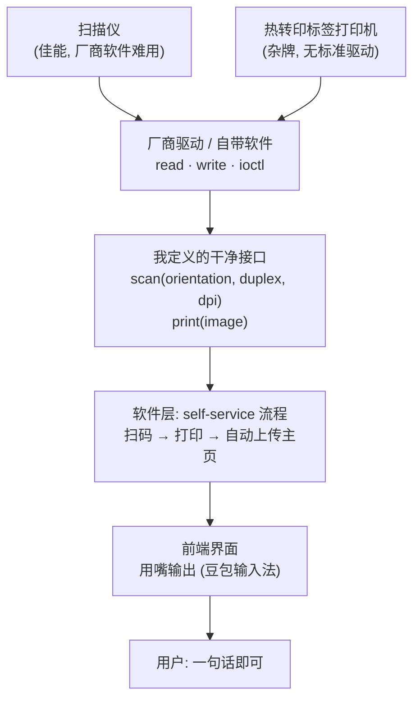
```mermaid
graph TD
    D1["扫描仪<br/>(佳能, 厂商软件难用)"] --> DRV["厂商驱动 / 自带软件<br/>read · write · ioctl"]
    D2["热转印标签打印机<br/>(杂牌, 无标准驱动)"] --> DRV
    DRV --> API["我定义的干净接口<br/>scan(orientation, duplex, dpi)<br/>print(image)"]
    API --> SW["软件层: self-service 流程<br/>扫码 → 打印 → 自动上传主页"]
    SW --> UI["前端界面<br/>用嘴输出 (豆包输入法)"]
    UI --> U["用户: 一句话即可"]
```

### 9.2 你看到的是：AI 出现以后

而且他特意试用的是**国产的模型**——因为正好那个额度是空的，就把五个小时的额度基本上全部用完了。得到的是一个看起来非常可用的东西，"就跟你在食堂或者宿舍楼下看到的那个机器"一样，达到了某种**产品级**的效果。

> "所以以后，软件公司就面临一个非常彻底的消亡。"

你想：比如标签打印机都会给你一个驱动、给你一个软件，它的开发成本是非常高的；像他的扫描仪是佳能的扫描仪，软件成本也非常高——要开发、要跨平台的驱动，等等等等。**但是在今天，这些全通通都不需要了。**

## 10. 非标设备的驱动：让 AI 自己 probe 参数

*(参考时间: 23:11)*

这里有代码——他直接让 AI 解释一下打印机（和扫描仪）的部分。但实际上：

- 这个照片打印机是个**非标的东西**："就我不知道它是什么"，相当于是一个杂牌的，叫 easy scan，不是一个特别标准的设备；
- 他就直接告诉 AI：**"我就想要把这个打印机驱动起来。"** AI 一开始也不知道。

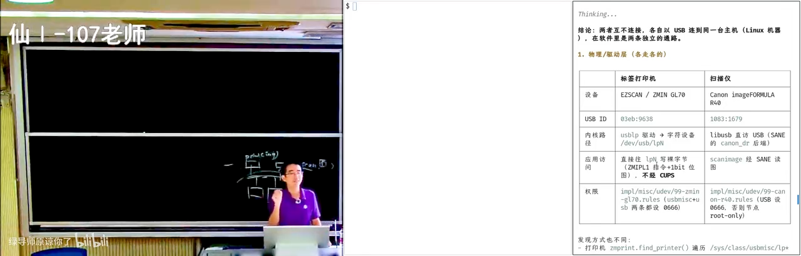

比如这个打印机里面有一个选项：它是**热转印**的——就是你们看到的那种贴固定资产的标签：一个碳粉带，在有像素的位置加热，把碳粉烫上去。热转印打印机有一个参数，大概是**加热的程度（深度）**，也就是图像的深度。"我们不知道这个参数是什么意思、应该设什么。"

于是 **AI 就不停地打标签**：

1. 先打一张上面有数字的标签，比如"这是第 15 次尝试：15"；
2. 然后问讲者："是淡了还是浓了？"——因为它看不到。

> "但如果接个摄像头对着它，它就不需要问我了，甚至连我都不需要，它自己一张一张打，就可以完全自动地把这个东西给完成。"

它一开始试图用 **LPD/LPR** 协议（因为能识别到），后来发现可以直接用 **PCL** 驱动做 generic 打印，把它当成一个通用的打印机来处理。

### 10.1 关键在于：我只问它要一个"可验收的结果"

> "我就完全没有监管，我只是问他要一个结果——一个**可验收**的结果。agent 就可以一轮一轮一轮地去把这个事搞定。搞定以后，外边一个前端界面，我就是用嘴输出。"

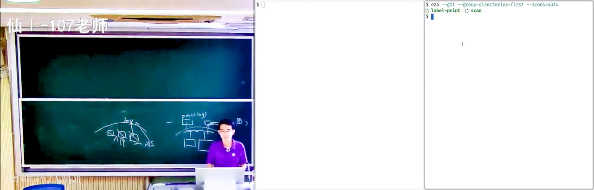

最后这个 label print（标签打印）他完全没管，都是 AI 自己生成的：**它自己 probe 了打印机的参数和当前插入的标签**，完全是定制化的。

> "也就是说：我想要什么，以我最舒适的方式来帮我定制，**不要通用**。因为以后生产软件、生产 intelligence 的成本会非常非常低。"

## 11. 软件公司的消亡：app 沦为一个接口

*(参考时间: 25:20)*

所以你看到这个软件会发生根本性的变化。最近也发布了**豆包手机**，讲者认为它也是一个非常好的工程产品，因为它体现了同样的软件工程智慧：**这些 app 都不重要了。**


- 如果我们有一个 **Jev** 这样的模型——"我觉得 Jev 和豆包手机真的是非常配：一个决策，但又是接近实时的"；
- 所以他觉得它走在前面：它**赌**模型可以在某一个时间点快到"可以和人一样快点手机"。虽然做豆包手机的时候还不能，但这一天很快就会来。

于是它就把 app 抽象成了各种各样的接口，由 **computer use** 去调用：

> "我要点外卖，它就直接调那个应用——应用就沦为了一个点外卖的接口、一个查询数据的接口。"

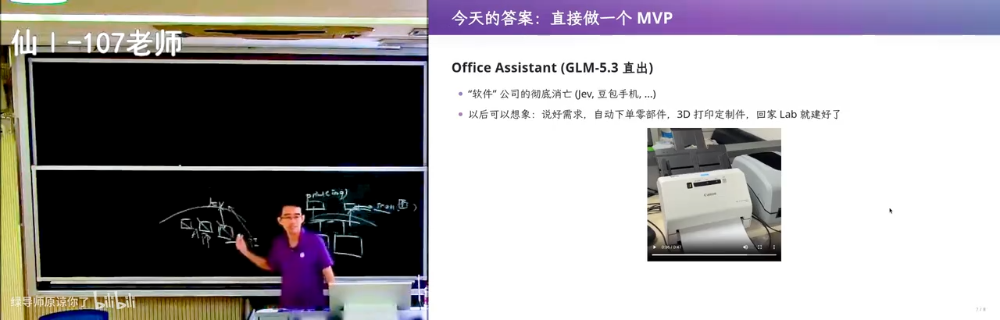

所以 app 是不是有一天全部都要死掉？因为它只要提供接口就行了：**提供一个 app 是给人用的，但如果只要提供一个 API，就可以给 agent 用。**

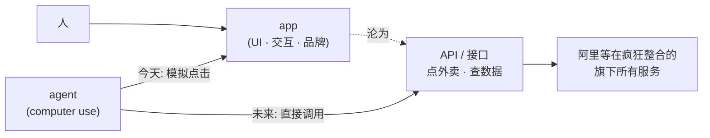
```mermaid
graph LR
    H["人"] --> APP["app<br/>(UI · 交互 · 品牌)"]
    AG["agent<br/>(computer use)"] -->|今天: 模拟点击| APP
    AG -->|未来: 直接调用| API["API / 接口<br/>点外卖 · 查数据"]
    APP -.->|沦为| API
    API --> SVC["阿里等在疯狂整合的<br/>旗下所有服务"]
```

比如**阿里在疯狂做这件事**：把它旗下所有的服务都向 agent 整合，试图用一个"千问"这样的应用。讲者对千问的评价是**有点生不逢时**：

- 它太想把这个产品推出了；那个时候模型的算力可能也不够；
- 他们可能自己也没有一个 Jev 这样"智力又足够、而且足够快"的模型来帮你完成各种各样的任务；
- 所以拿出来像一个**未来的半成品**。但这也意味着，未来总有一天肯定会来。

然后整个软件公司就彻底消亡。你想这个产业链上养活了多少人、多少外包公司。

### 11.1 一台标签打印机背后的产业链

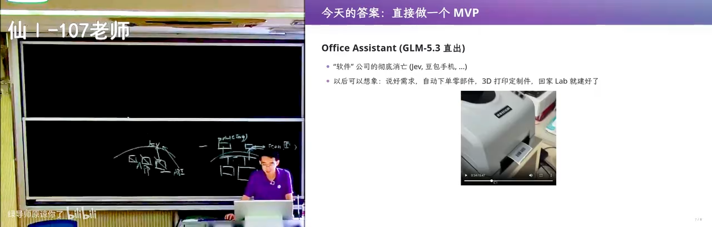

就以这台标签打印机为例：假设你毕业了要去创业，找到一个细分市场——每个学校、每个单位都需要一个这样的标签打印机，那这是一个不错的市场，你可能卖几百块钱一台，硬件上还是相当有利润可赚的（**因为中国供应链很好**，这种成熟的硬件你肯定能找到供应链）。

然后你就需要软件。而**软件开发成本在 pre-AI 的时代是非常高的**：

- 它需要 Windows 的驱动；
- Windows 驱动完了以后，还需要做 Mac 的驱动（因为越来越多的人用 Mac，Mac 没驱动就会抱怨，你的产品可能就卖不了、卖不那么好）；
- **但是到今天，全部都被 AI 杀死了。**

## 12. 下一个实验预告：让 assistant 驱动物理设备

*(参考时间: 28:49)*

> "当然这是未来会发生的事情。你们已经生在这个时代了，就已经生在软件死掉了的时代了。那为什么我们还要讲软件工程呢？**因为曾经的软件工程不是这样的。**"

讲者预告了下一个实验（当时还没有布置）：**把你们第一个实验的那个 assistant 和一个 physical device 联系起来**，让它能够驱动任何一个设备：

- 可能是你的手表，也可能是你宿舍里面任何一个已有的东西；
- 也许你会花两百块钱买一个小设备——那个设备也是**非标的**，可能也没有 Linux 驱动，但你就想把它搞起来。

他自己的例子：办公室里有一个**电子墨水屏**，靠一个 Android app 烧写，而那个 app 极度难用。

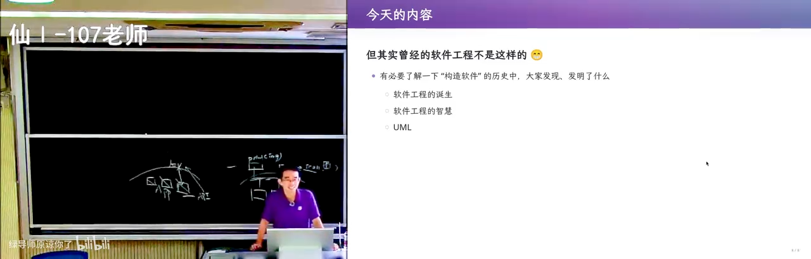

- 当然可以用豆包手机那样的 **computer use** 方式来用它；
- 但他干了另一件事：用 **Claude Opus 4.6** 直接把那个 Android app 的 **APK** 丢进去，让它解包、**逆向那个蓝牙的协议**（因为它还是个标准蓝牙设备），根据代码搞清楚怎么把内容写到屏上——于是他也得到了一个一样的东西。

> "你们可以借助一下现在手头的模型来做这样的事。虽然今天我们已经生在这个时代了，但是软件工程的智慧其实还是没有消失的。"

所以从今天开始，他会讲一讲：你看到的这个世界上这些软件到底是怎么来的、我们在软件构造的历史当中大家发明了什么。**用这些理念可以更好地指导你今天和 agent 的协作，成为一个更好的 agent-native 软件开发者。**

## 13. 1960 年代：硬件贵、码农贵、客户不知道自己要什么

*(参考时间: 30:47)*

首先，软件工程是怎么诞生的？在软件还是一个新事物的年代——比如我们回到 **1960 年**：

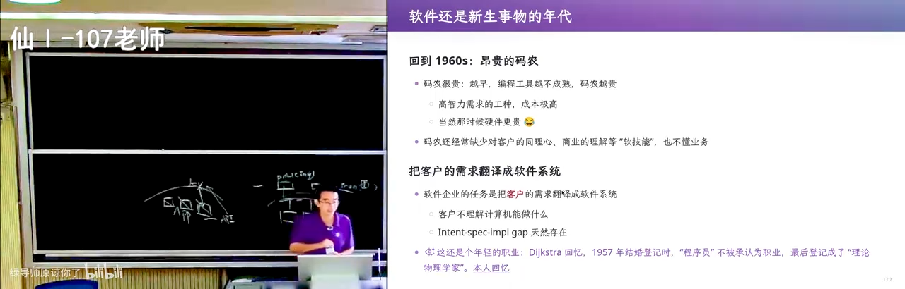

- **硬件比码农要贵得多。** 一台计算机就要占一个很大的房间（虽然不至于一层楼那么高），而且作为最先进的设备，制造成本也很高。
- 那时候大家还不知道怎么造计算机，是**不敢偷工减料**的——就像你刚开始造建筑的时候都是要猛堆料的，所以成本非常高。

讲者顺手插了一条对照的"最新消息"：**iPhone 18 Pro 采用了 QLC 的闪存颗粒**。"好像也没有关系，因为 iPhone 的主张是你应该把所有东西都存在 iCloud 上"——所以你的数据坏了，它也就这样，它不会对你的数据负责；可能在保修期内闪存坏了，它就给你换一个主板。但你是应该把重要的数据放到 iCloud 上。（今天的厂商都懂得怎么样偷工减料了。）

### 13.1 码农为什么也很贵

因为越早的时候，编程的工具越不成熟，码农是一个非常高智力需求的工种——一直到《硅谷》那部电视剧里面都仍然是这样。

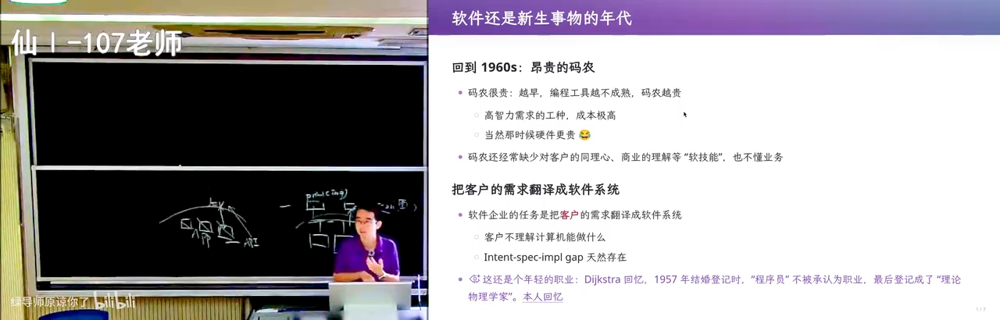

以前写汇编、写机器代码的时候，大家的要求是**要画流程图**——你们现在肯定不画流程图了。因为那个时候你写的是机器代码：如果不画一个流程图就直接写机器代码，**就跟今天让大模型直接写汇编一样**。你可以做到让它直接写二进制序列的汇编，但你做不到——它需要过度的预训练才能做到这一点。

### 13.2 高智商人群缺的那块软技能

不仅码农很贵，而且各位在 985 大学里、被认为是经历了层层筛选的高智商人群，数学训练多了以后，**多多少少会缺少对客户的同理心、对商业的理解等这样的软技能**。

> "我见过很多在各方面都很强的六边形战士。但我的观察是：在理工科专业里面，更多这种 nerdy 的人会多一些——他们可能不 care 业务，他只想要造世界上最好的操作系统（像 Linux 那样的人）。他就不是一个很好的客户经理。"

但软件企业依然需要承担一个职责：**把 implementation、spec 和 intent 之间的 gap 给补上**。作为一家公司，它需要签订合同——"我希望这 1000 万美元，给你开发一个操作系统"。这个天文数字在今天看：AI 说"给我 50 美元，我也可以给你开发一个操作系统"。

### 13.3 那时的客户，也不知道计算机能做什么

客户就是软件企业面对的客户。那个时候客户也不知道计算机能做什么：

- 比如 **DARPA** 的官员；
- 当然那个时候比如 **NASA**，他们的工程师还会有一些概念——他们要把人类送上月球，或者要在飞机上做一个飞控系统，他们面对的都是这样的需求；
- 但他们的客户可能也不完全知道自己想要什么。

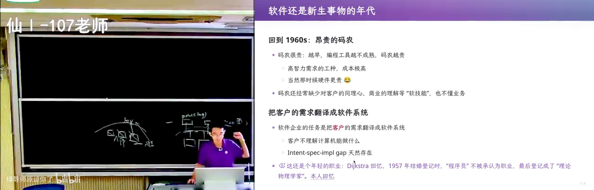

而且**程序员还是一个非常年轻的职业**：Dijkstra 在 1957 年登记结婚的时候要登记职业，而"程序员"不被承认为一个职业，最后还登记成了**理论物理学家**。

## 14. 1968 年的遐想：Boys' Life 与"未来的学校"

*(参考时间: 34:43)*

在那个时候，客户已经对计算机或者说软件产生了**非常过度的遐想**。

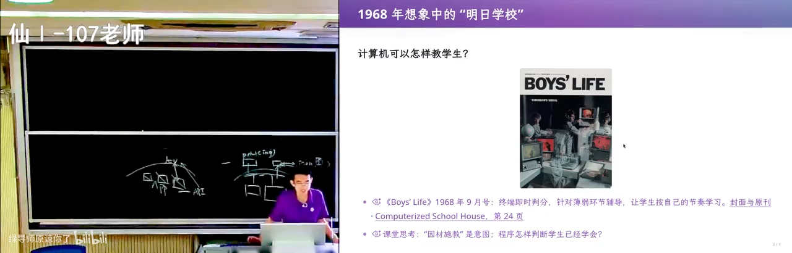

这是一张来自 **1968 年杂志**的图（讲者特意让 AI 找出来的）：**Boys' Life** 1968 年 9 月号，"未来的学校"——

- 终端**及时判分**；
- 针对**薄弱环节**辅导；
- 让学生**按自己的节奏**学习。

> "**到今天都没有实现。** 你们还在这里上两节课、每节课 50 分钟的这种课程。1968 年的时候，Boys' Life 9 月号就已经唱响了这件事情了。"

所以这个 gap 就越来越大了。那个时候的一个客户，软件公司给他画了个大饼，他说"我要投 1000 万美元做一个什么跨时代的软件系统"，但他脑子里面是这样的东西；而你回到 1968 年的时候，**程序员脑子里是什么？脑子里就是汇编，就是 goto。**

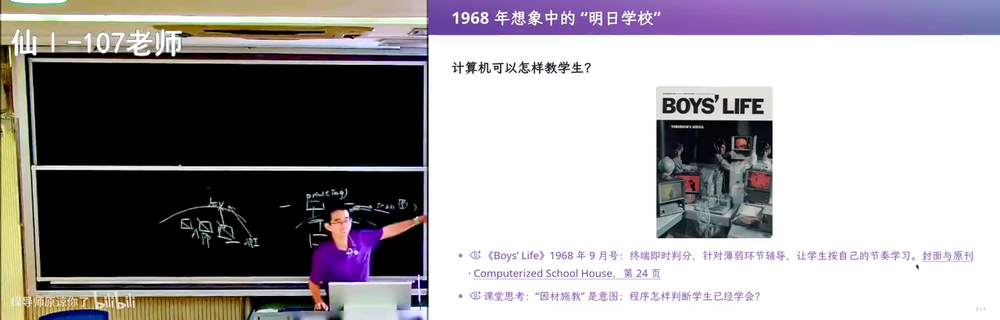

那这个 gap 就毫无疑问是非常非常大的。

### 14.1 插话：这份 slides 是怎么来的

讲者顺便解释了他的课件生产方式：**"我的 slides 是 AI 生成的。"**

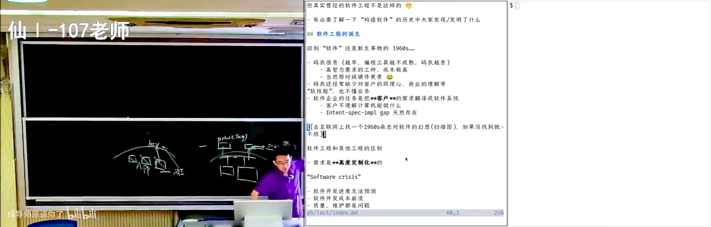

- 他在里面写了**两个中括号**，中括号里面的话是他教给 AI 的：AI 看到了就会把它 **verbatim copy** 进去（可能会修复一下他的 typo）；
- 上面那些是他自己写的，其余部分就是 AI 自己发挥——他有一个 **make slides 的 skill**；
- 于是 AI 自己找到了这张 Boys' Life 的图。

## 15. 软件为什么难：需求是拍脑袋想出来的

*(参考时间: 36:12)*

就是因为有这个 gap：**我们的软件是要实现物理世界的需求在信息世界里面的投影**，这使得软件工程和其他工程（比如桥梁工程、炼钢这样的工程）有很大的区别。

| | 桥梁 / 炼钢等传统工程 | 软件工程 |
| --- | --- | --- |
| 需求来自 | 自然物理世界，只能适应、不能改造 | 人的头脑，"完全是拍脑袋想出来的" |
| 约束 | 材料强度出厂就确定；楼盖几层、容纳多少人、人有多大，都是自然界选择下来已经决定了的 | 高度定制化，连接了物理、社会、人的偏好 |
| 创新方式 | 遵循比较强的模式，做小改进，一代一代迭代；彻底推翻的大改进非常困难，一直是 incremental 的 | 1968 年就能想出"未来的学校"这种东西 |

**软件是人类智慧的巅峰**——这确实也是一个事实：像操作系统、编译器这些非常难的软件，你去学它都需要多年的专业积累，它很复杂。

而且复杂到——**甚至连制定 intent 的人都没有想好各种各样的 corner case 应该怎么样**。

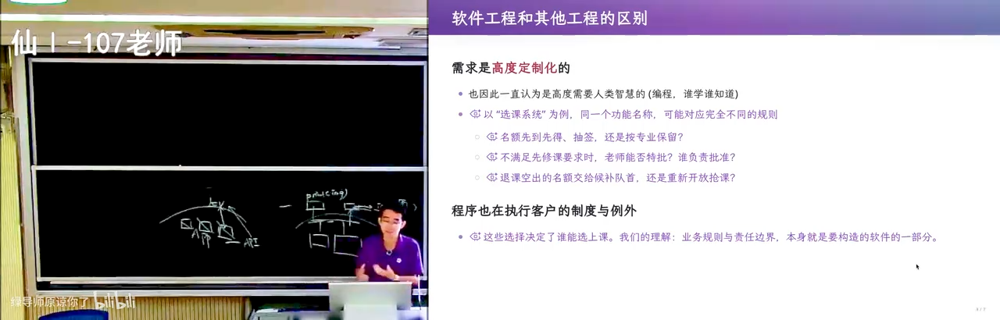

比如他就想做一个**选课系统**：

- 到底是先到先得、还是抽签、还是按专业保留？（"这都是 AI 给我 YY 出来的"）
- 不满足先修课要求的时候，老师能不能特批？
- 你在做需求的时候，领导跟软件公司说："我们的课程是要有先修课程的。" 那也是知道的——你们在系统里面都能看到：比如你要选修操作系统，你必须要先修计算机系统基础。
- **那就糟糕了：这是一个硬的限制，还是一个软的限制？谁能 override？** 到最后你一秒钟毕不了业的时候，所有的口子学校都能给你开——你最后就差这门课的时候，马上就能选上这门课。**那这就是一个例外性的需求。**

> 所以软件的需求是一个**高度定制化、非常复杂**的东西，连接了物理、社会、人的偏好等等。**所以做软件很难。**

## 16. 软件危机：进度、成本、质量一起失控

*(参考时间: 38:58)*

在那个时候，大家就发现了：**进度、成本、质量是一起失控的。**

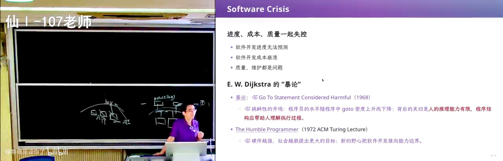

- 开发进度不能预测；
- 软件开发成本崩溃（超支）；
- 而且要延期交付。

那个时候，computer scientist 其实已经观察到了各种各样软件里面有趣的东西。

## 17. Go To Statement Considered Harmful（1968）

*(参考时间: 39:15)*

比如 **Dijkstra**（图灵奖得主）那篇非常有意思的文章：***Go To Statement Considered Harmful***。

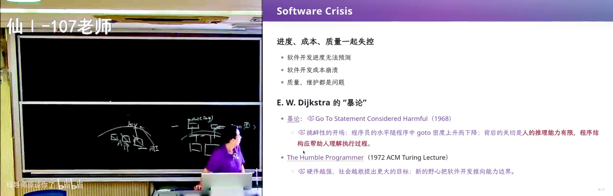

大家都听说过 goto 是 harmful，**但你们同时也看到 Linux 内核里面有好多 goto**。这是 C 语言为数不多的、比较 idiomatic 的一个用法：

```c
int do_something(void) {
    /* ... 中间随时申请资源 ... */
    if (need_more) {
        buf = alloc();
        if (!buf) goto release;   /* 中途想退出，必须 goto release */
    }
    /* ... */
release:                          /* 逐个检查并一一释放本函数申请的所有资源 */
    free(buf);
    close(fd);
    return ret;
}
```

- 在 `release` 处，你会**逐个检查你在函数里面申请的所有资源，然后一一释放**；
- 这样它就可以保证：你在任何时候、在中间要申请一个资源的时候，你都在 `release` 的地方加一个检查和释放；
- 你在写代码的时候**永远不能在中途退出**；想要中途退出的时候必须 `goto release`——那这个程序基本上就能正确了。

它其实解决了 C 语言里面一个很大的问题：**随时申请、从不释放**（"你们在做 OJ 的时候留下的坏习惯"）。

### 17.1 一句"暴论"，和一个不绝对的道理

> "他有一个非常……就跟我说的'没有 token 要退学'一样，他先发表一个暴论：**程序员的水平随着 goto 的密度上升而下降。**"

这背后是有一定道理的，**但它不绝对**。大量的 goto 会让你的程序变得很难理解，所以他讨论的其实不是 goto 到底 harmful 不 harmful——

- goto 可以不 harmful：如果作为一个**正确的机制**使用（只允许你这样用），它就不 harmful，它挺好的；
- 他背后考虑的是：**希望你能够写出人能读的代码。** 只有人能读，它才有可能维护得下去，从而让软件世界能够相对正常一点地运转。

## 18. The Humble Programmer（1972）：nicely factored solutions

*(参考时间: 41:41)*

1972 年，Dijkstra 得了图灵奖以后的 **Turing Lecture**：***The Humble Programmer***。

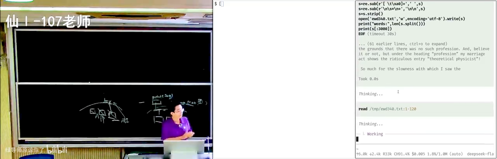

> "我觉得这就很好——现在我们可以直接去 digest 原始的文稿，在 AI 的帮助下直接阅读原始的文稿。"

### 18.1 为什么会有软件危机

他谈到了为什么会有软件危机：

- **如果你永远写 online judge 的小程序，就不会有软件危机**：你就"算一个东西"嘛，算完就完了；你一旦把这个程序调对，就永远不需要去维护它。
- **但是机器变强以后，你的软件的需求是不断膨胀的**：机器越强，你承担的现实世界的 intent 越多；intent 越多，不确定性就越多；实现就会变得越复杂。

### 18.2 nicely factored solutions

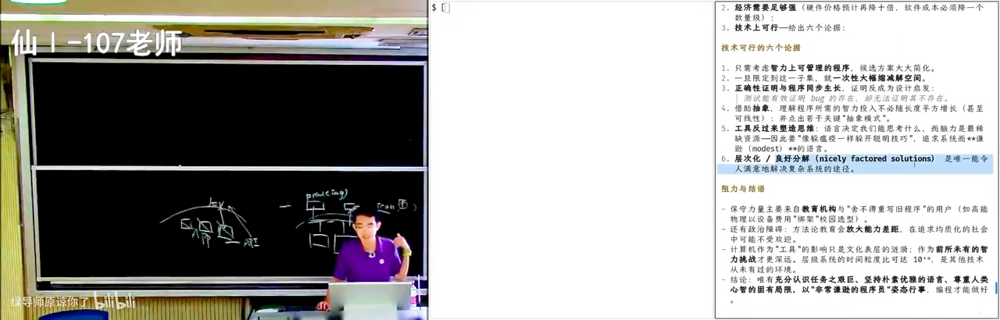

他提了一些对软件的思考，比如 **nicely factored solutions（良好的分解）**：在你构造任何软件系统的时候都在不断地做这件事。

> "比如说我就写一个东西帮我驱动我的标签打印机和扫描仪，它也是一个 nicely factored solution。我们无时无刻不在用这样的想法来组织我们的软件。"

他还有一些有意思的观点，比如：**保守力量主要来自教育机构与舍不得重写旧程序的用户。**

> "这都是放到今天依然让你觉得醍醐灌顶的。确实，Dijkstra 那个时候（1972 年）就拿了一个图灵奖。"

## 19. 软件工程的诞生：NATO 1968 与 Margaret Hamilton

*(参考时间: 43:54)*

大概就在那个时期，**软件工程成为了大家关注的一个焦点，因为软件开始失败了。**

- **1968 年**有一个 **NATO 软件工程会议**（你们也可以直接去读原来的 summary）；
- 差不多在那个时候，**Hamilton 和她的团队提出了"软件工程"这样的概念**。

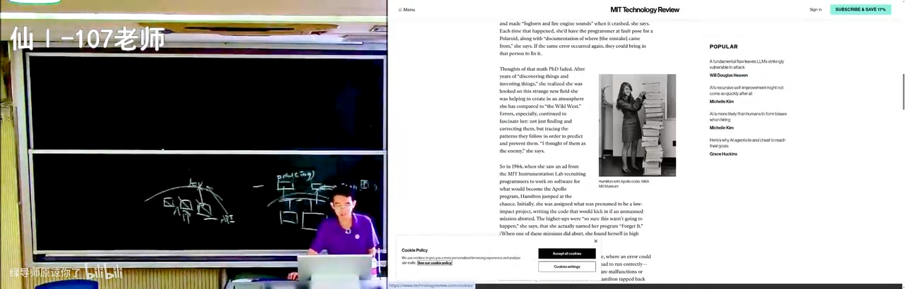

"这是一个非常有标志性的照片，应该是载入史册的"——1969 年，Apollo 的代码：Margaret Hamilton 站在与她等身高的阿波罗导航计算机源码打印稿旁边。旁边那句话是：**"经过不懈的排查错误，这位最初的软件工程师把宇航员送上了月球。"**

> "这个代表了软件工程学科的诞生。"

## 20. The never going to happen can happen：防御性编程的起点

*(参考时间: 45:25)*

你们看到今天你们都要**防御性编程**：比如第一节学 **SICP** 的时候，它就告诉你写软件的时候你要写 **assertions**、写 **specifications**。

Hamilton 把**一个绝对不能发生的假设都当成可能**——一种防御性的、为未来思考的智慧：

> **她假设这个软件在任何时候、甚至违反假设的情况下，依然要能够工作——她才设计出了一个成功的软件。**

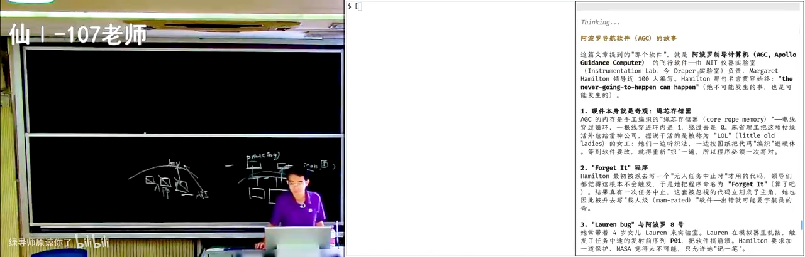

> **The never going to happen can happen.**

当我们回头去看原作的时候，你会发现这些思想在今天反而更容易理解，比教科书上经过了一手、二手、三手、四手消化的时候要好得多。

- 你可能要假设**硬件也是不可靠的**；
- 无论如何都要在软件里面做一个**兜底的机制**：当你的程序 crash 了以后，整个系统依然要能够工作。
- **其实这就是软件工程的起点。**

### 20.1 阿波罗 11 号：警报响起时，下降仍在继续

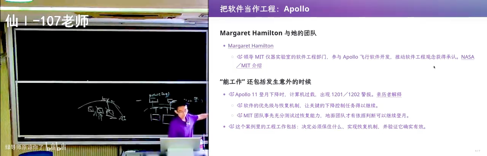

所以你看这里有一个"能工作"，还包括**发生意外的时候**：阿波罗 11 号登月下降的时候发生了警报，但这个软件因为有**优先级**和 **recovery** 机制，让关键的下降控制任务得以继续。

> "就那个时候还没有软件工程，他们就从 first principle 去思考：如果我们要构造一个真正好的、高质量的软件，我们应该怎么做？它的 first principle 就是 **the never going to happen can happen**。好，有意思啊——软件工程的（起点）。"

### 20.2 OJ 的隐藏假设：题目是对的

这有点这个感觉吗？你们做 OJ 的时候，**你假设题目是对的**——这是一个隐藏的假设：你假设题目是对的、假设题目是能做出来的。**这个假设本身就不对**：当你反复强化的时候，你就 overfit 了这个假设。

你应该假设的是：**你面对的是一个开放的世界**——

- 这个题目可能是错的；
- 这个题目的条件随时可能会变化；
- 这个题目甚至可能会变成另外一个题目。

那你怎么做一个软件来解决它？

当然，编程是另一件事：你通过刷 OJ 训练的是你的**逻辑思维、算法思维、你的 chain-of-thought 能力**，这对设计软件、理解软件是有好处的。

## 21. IEEE 的定义：把个人英雄主义变成 checklist

*(参考时间: 49:04)*

所以你看 **IEEE** 给出的定义（讲者让 AI 现场读了一遍）：

> **Software engineering is the application of a systematic, disciplined, quantifiable approach to the development, operation, and maintenance of software.**
> ——即"工程化"地对待软件

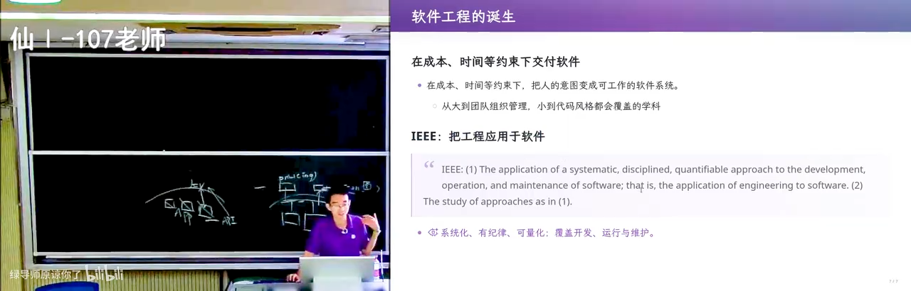

它把软件变成这样一件事：**你不再是一个个人英雄主义者。**

- 在 Hamilton 那个时代，项目需要一个很好的 leader——**如换一个人，这个项目就失败了**；
- 而"工程化"把它变成：**你可以拿到一个 checklist**。如果这个 checklist 上 1、2、3……10 全部都满足了，那至少——虽然不能保证你的软件成功——但**失败的概率会小很多**；
- 关键词是：**有纪律（disciplined）、可量化（quantifiable）、覆盖软件的整个生命周期（development / operation / maintenance）**。

所以在 AI 还没有"大杀四方"的时代，软件工程这个学科——从刚开始的大量失败，或者说**从数亿美金的教训**（什么"炸一个火箭"这种，很多时候都可能跟软件工程有关系）中——其实积累了很多的智慧：大家看到成功、看到失败，多多少少就会从中总结出一些经验和教训。

### 21.1 接到任务之后：为什么必须先划分任务

即便回到 pre-AI 时代，大家其实也非常清楚 **intent / spec / implementation** 这样的 gap：

> 如果你接到一个开发任务，你肯定不能立即就安排说"哎，大家去干吧"——**任何一个 leader 都不应该干这样的事儿。**

即便最终的产物一定是码农写出来的，因为：

- 不同的人看到的是不一样的部分；
- 如果这个软件要分工，你的 leader 都需要指派**哪一个部分由哪一个人来做**。

"就像我做这两个的时候——打印机和扫描仪：那个时候我已经同时接到我的电脑上了，那我就起了两个 agent、开了两个窗口，一个去搞定打印机，一个去搞定扫描仪。这很正常：**需要一个划分任务的过程，不能是一个 self-organized。**"

## 22. Royce 1970：瀑布模型的出处，其实是在批判瀑布模型

*(参考时间: 51:32)*

那如果我们涉及划分任务——也就是说，刚开始我们从一个**空的 repo** 出发——我们怎么样去做呢？是直接去开发、直接把这一句话交给它做 MVP？

**那个时候还没有 MVP。** 你想：这是 **1970 年**的论文，1970 年软件工程刚刚诞生，还没有 minimum viable product，没有大语言模型。那一个思考"**怎么按时、不超预算地交付大型软件**"的人，就写出了软件工程领域的**开山之作**：

> **Winston Royce, *Managing the Development of Large Software Systems*, 1970.**

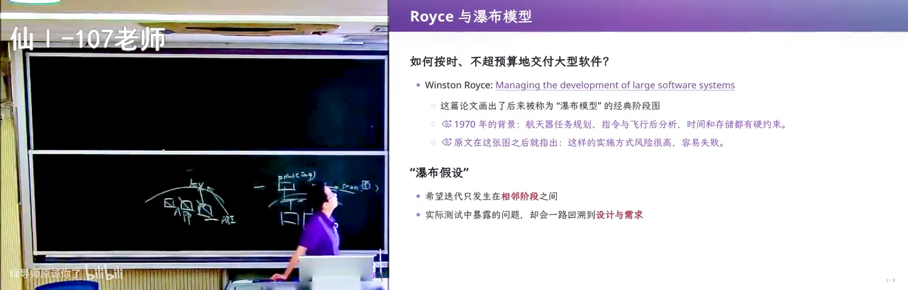

### 22.1 你们一定见过这张图

讲者现场开了浏览器，用百度搜索"瀑布模型"（"我就不打开秒懂百科了，这个有点搞笑"，然后放大一些）：

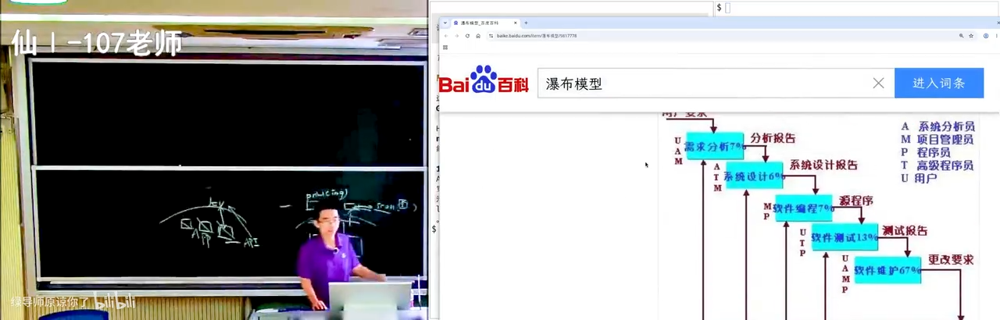

> "你们只要是 computer science 或者 software 相关的，一定在软件工程课上面见过这样的图：一个 **waterfall model**，从上到下。**然后这个图来自哪里呢？这个图就来自 Royce 的这一篇经典文章。**"

### 22.2 讲者的读文章方式：让 agent"入库这个 paper"

顺便，他展示了"我读文章的方式和你们读文章的方式有些不一样"：

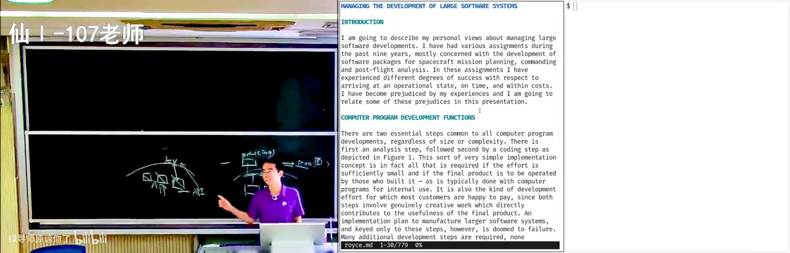

- 昨天备课的时候需要这篇文章，他就直接找到了这篇文章的链接，然后直接和他的 agent 说：**"入库这个 paper。"**
- 于是他得到了一个**文字整理版**：他的 AI 助手会把所有的图片（Markdown 图片）都直接嵌入进来；
- 他还有一个**命令行的工具**，可以打印文本、也可以提取图片；还有一个**类似 less 的工具**——"就我什么也没有说，它就来帮我直接在命令行里面读论文。"

### 22.3 最有意思的是：这篇文章是在批判瀑布模型

> "最有意思的是：我们都讲'学软件工程都学瀑布模型'，**可实际上这篇文章是批判瀑布模型的。**"

所以你还得去读原文——**一个东西经过了很多次消化以后，你得到的可能就不是那个东西了。** 因为在 1970 年，大家真的什么也没有，只能从 **first principle** 去思考。

## 23. 瀑布为什么会失败：测试是链条上第一个物理事件

*(参考时间: 56:15)*

如果你看到这，那这就是一个经典的瀑布模型：**需求 → 系统需求 → 软件需求 → 分析 → 设计 → 代码 → 测试 → 上线/运维。**

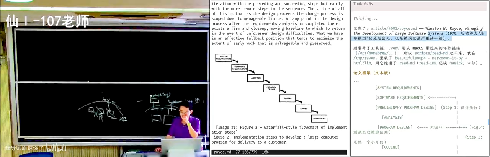

讲者让 AI 直接读这篇论文，AI 给出的第一句总结是：

> **"后被称为瀑布模型的原始出处，也是被误读最严重的一篇。"**

所以应该是最早有一两个 article 错误地、没有描述完这篇文章里面的所有观点，然后一级一级传了下去。

AI 还在现代意义上重述了 Royce 的第一步：**对于一个足够小、小到一个人就能完整装进脑子里的程序，两步就够了**——Step 1：分析并编码；Step 2：测试。

> "所以你看，这就是你们的 **online judge**。你站在今天，你做的所有软件的 practice，依然能够很好地对上这篇文章里面当时他们的一些思考。这个 OK，没问题。**但是这个很容易失败。**"

### 23.1 first principle：在测试之前，程序是不能运行的

如果你把这样的一个流程扩展成一个瀑布——他的观点是：

> **测试是整个链条上第一个"物理事件"。**

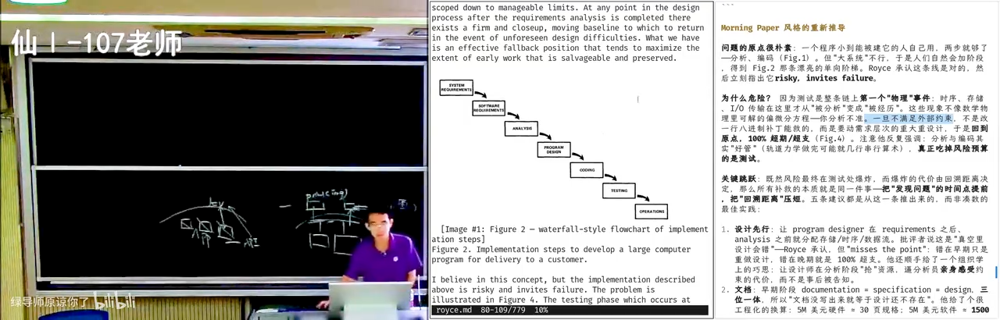

- 你在设计的时候，你有的只是**报告**；在 program 真正被写出来之前，**它是不能运行的**。这是一个 first principle。
- 也就是说：当这些东西还不能运行的时候，**你都会随便做做**——这就是人。
  - 文档嘛，"你叫我写文档，我就写一个"。想想你们写实验文档的时候，**你们对它的正确性有 guarantee 吗？** 当然有同学会认真一点，或者说"我有个 best-effort guarantee"，但实际上你是没有 guarantee 的。
  - 文档先写了就放在那；然后代码改了、设计改了、文档不一致，也就放在那。
- 所以这些东西**不是在一个很强的约束下做出来的**。
- **然而只有在你测试的时候，这个程序才真正跑起来，你才真正知道它的行为是什么。** 虽然你在编码的时候可能就已经感觉到有一些不对了，但一旦你的 intent → specification → implementation 发生了**漂移（drift）**，你到测试的时候才发现，就意味着你要**回头去修改**——论文里也有一个图：你要回到前面去修改。

> **那这个就会带来成本。所以这就是超期或者超支的源头。**

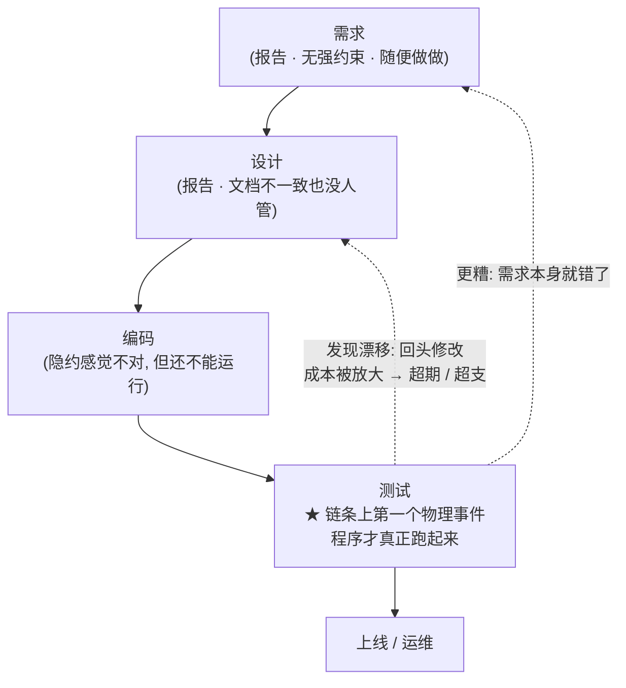
```mermaid
graph TD
    R["需求<br/>(报告 · 无强约束 · 随便做做)"] --> D["设计<br/>(报告 · 文档不一致也没人管)"]
    D --> C["编码<br/>(隐约感觉不对, 但还不能运行)"]
    C --> T["测试<br/>★ 链条上第一个物理事件<br/>程序才真正跑起来"]
    T --> O["上线 / 运维"]
    T -.->|"发现漂移: 回头修改<br/>成本被放大 → 超期 / 超支"| D
    T -.->|更糟: 需求本身就错了| R
```

> "你看这些图——如果你真的读过原文，它很好理解；而且站在今天（尤其你有今天的软件工程实践以后）去理解它，其实非常非常舒服。"

## 24. Do it twice 与 pilot system：1970 年版的 MVP

*(参考时间: 58:12)*

既然**风险最终都在测试的地方爆炸**，那所有补救的本质都是：**把发现问题的时间点提前。** 这是一个非常自然的想法。

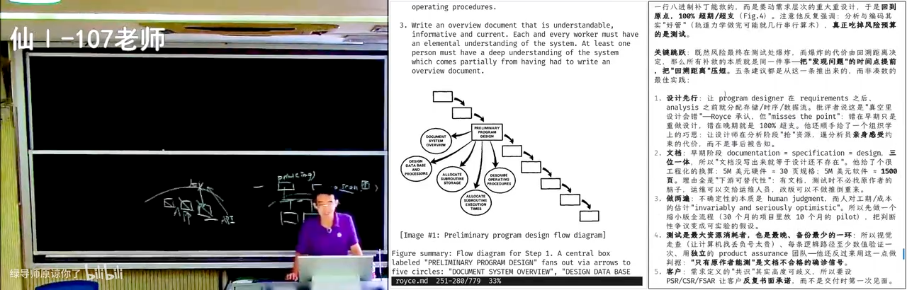

于是 Royce 提出了那篇文章里一个非常非常经典的观点：

> **设计先行，文档做两遍——Doing it twice。**

他的用词是 **preliminary pilot program（先做一个预备性的试验系统）**：

- 我们先要做一个**不完备、但能够体现这个系统功能**的设计（pilot）；
- 这个东西**可能会失败**，但它**迭代的成本会变得很低**；
- 迭代成本低，它就可以 **reflect 到这个系统的设计上**。

> "然后你看这是什么？**这就是 minimum viable product。**"

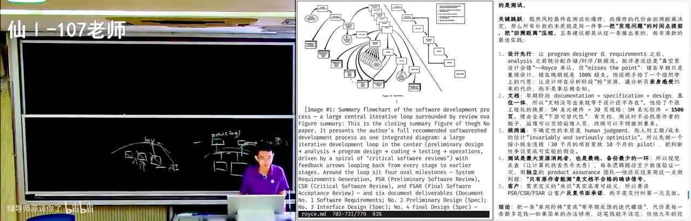

论文的最后是他所设想的一个 **software development model**。

> "就算是在今天这个 vibe coding 的时代，你回去看，它还是提供了很多的软件工程智慧——即便它是在**航天器的任务规划**、**把人送上月球**这些背景下写的。"

**这篇文章的结构其实是：** 他先提出了这个瀑布模型，然后说明了这个瀑布模型在软件工程中是怎么失败的，并且分析了一个具体的失败。

## 25. 用 AI 读一手资料：知识的有损压缩不再必要

*(参考时间: 00:59:44)*

而这个流程在今天开发软件时也是**完全一样的**：因为你总是从空的项目开始——不管你是用什么样的版本控制工具，你都需要经历"先想清楚你要干什么 → 再大概想想我架构应该怎么做 → 再去写代码"。**不管这个写代码的是软件工程师还是 AI，这个流程依然是成立的。**

### 25.1 每个人都可以阅读一手的信息

> "所以你看到了：在现在 AI 的时代，**每个人都可以阅读一手的信息**。你可以直接回到这个历史的背景上；而且 AI 既知道过去、又知道现在，你还有那个历史的原文。"

你会发现有些东西你在书上读不懂的——那两页纸看起来不长，"讲瀑布模型，读了两遍还没搞懂"——**然后你回去看这个原文，马上就看懂了。**

### 25.2 教科书是一种有损压缩

知识的压缩：过去（比如像讲者上学的时候，或者再早的时候），如果你要**查证一个知识网络**，是几乎不可能的事情：

- 你要去图书馆翻很多的资料；图书馆的索引机制建得也不好（虽然确实也有索引机制）；如果你要找到那个精确的资料，你要花去无穷多的时间；
- 所以那个时候，**你是不可能通过一手资料来学习的，你必须要经过教科书做知识的有损压缩**。

于是有经验的人（教科书写得好的人）就可以：他读过一手的信息，他也可能能**共情**——好的老师可以共情学生，他知道学生想要什么、学生什么地方会不明白，所以他把这一手的信息做一个压缩，同时**对阅读者的损失是很小的**。（当然，有的教科书是"防自学"的。）

### 25.3 但今天这些也都不需要了

> "因为你可以直接……我作为一个老师，我觉得我不需要再做压缩——**因为我做的压缩对每个人的压缩都是有损的，而且对不同人压缩损失了不同的部分。** 如果我一对一地教学，我就可以做最合适你的压缩；但不需要，你现在直接对着你的'源'。"

他要做的只是**把知识的脉络拆解开来**，拆成一个一个"发现的点"：

> "然后你只需要把这个点和它的原文拿到，做一个**属于你自己的压缩**就可以了。"

所以有些东西——比如学校花很大的代价、很多导师老师在这个计划里去建设"比较先进的课程"——**这其实是个很好的计划**：因为在查证知识网络非常费时的时候，如果有真正的专家能够帮你做好的压缩，那毫无疑问是有价值的。

> "**但是在 AI 的时代，AI 是摧毁性的。** 你可能在里面投入了百万、千万甚至上亿的人民币，但最后都是一个模型就把你的轮子给碾掉了——一个可能是 DeepSeek flash 这样的模型，刚才就在帮我。你有任何的问题，我都可以直接问它。"

### 25.4 现场演示：追问"误读的链条"

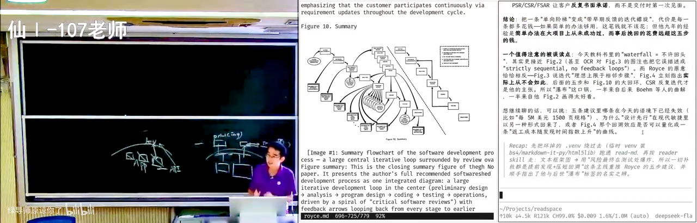

比如你可以直接问它：**"解释一下这个瀑布模型在软件工程里到底是怎么被误读的。"**

- 你会产生疑问，然后你就直接跟它对话；
- 它可以在这个过程当中找到更多的原文，**甚至找到整个误读的链**：这个教材一级一级一级，最后到你手上拿的这个软件工程"灌水教材"上面，是怎么一步一步曲解的。

> "哼，这个解释还挺 make sense 的。虽然也许你选择不相信 AI，再去追问，或者用一个更好的模型让它联网。"

AI 还给出了一句总结：**"瀑布是史上最好用的反派"**——每一个新方法都要拿它开刀。"哎，他说得很对，就真的是这样：**因为它本身就是错的。** 1970 年的原文已经告诉你不能瀑布，1970 年就告诉你要做 MVP。"

## 26. 用今天的实践回读 Royce：TDD、敏捷与 data dependency

*(参考时间: 01:04:55)*

> "当然我已经带着大家读过这个文章了，所以这几页 AI 生成的也就不那么重要了。文章告诉我们叫 **do it twice**，一个很重要的工程理解；但今天就是做 **MVP**。其实你也可以在不同的、各种各样的现在软件开发的背景下去理解它。"

### 26.1 用 TDD 理解：缺陷发现得越晚，返工代价越大

如果我们用 **TDD（test driven development，测试驱动开发）** 去理解这篇文章——"它都是互相的：我们今天的概念、今天正确的 practice 可以映射到过去；然后过去正确的 first principle，也可以用来映射到今天。"

Royce 讲了一件事：**缺陷被发现的时间越晚，它带来的返工代价就越大。** 显然这个事是成立的：

> "就跟你们做 OJ 都会出现这个事：你们一开始的时候脑子一热，想一个算法（这个算法是不对的），然后就去写代码；写代码写完以后发现样例不对；然后你对着样例跑了你的那个算法，你发现'哎呀完了，我这个算法整个就错了'。**这就是一个典型的瀑布模型的失败。**"

而在 TDD 的意义上，你看"**设计先行**"：那你设计先行的时候，你就干脆**先把测试用例定好**——输入这个，它就应该经历这个流程，输出这个——然后你马上就对。还有一些**敏捷开发**等等的概念，就可以用上了。

> "所以现在做的事情**不完全颠覆过去的经验**。"

### 26.2 为什么经典值得读

很多图灵奖的工作为什么能得图灵奖？**就是因为它确实是在一个大家完全不知道的情况下，确立了一个 first principle，告诉大家这件事情应该这么做。**

不仅是图灵奖：奠定了软件工程基础的、Royce 的这篇"被我们开玩笑叫做瀑布模型的 paper（其实不是瀑布模型）"——*Managing the Development of Large Software Systems*——就给我们很多的启发，**在它上面长出了这个世界的很多分支。**

> "当然也有更好玩的：你有一天发现它一开始有个地方方向想错了，然后把全人类都带歪了。如果全人类从某一点开始能够换一个方向，那也许就立即快速走上了正确的道路——比如说直流电和交流电，爱迪生和特斯拉。"

### 26.3 用敏捷理解：doing it infinite many times

你也可以用**敏捷开发**去理解 do it twice：

- 你不需要把 pilot 理解成一个完整的流水；
- 所谓敏捷就是：你的第一个版本**不是 doing it twice，你是 doing it infinite many times**；
- 你上来第一个版本，哪怕它只有一个 hello world、只是打印一个 log，或者说**每个模块都自报一下家门、能把这个模块串起来**——这也是一个好的 product；
- 然后在这个意义上不断地把软件向后演进：**让关键假设尽早遇到证据**。你一开始不确定的东西，因为你有一个敏捷的原型了，就可以立即验证它。

> "所以你看，这个 first principle 在这么多年软件工程发展的实践当中，都还是存在的。"

### 26.4 关于 AI 的焦虑：至少今天，能理解 AI 的人能活下来

- AI 确实学会了（写代码）；**也许它的品味有一天也学会了**——它可以从这些论文里面学到品味。
- 我们很焦虑 AI 能帮我们做事，但现在人类还有一种**傲慢**：觉得我们还是希望能够理解 AI 到底做了什么、能够判断 AI 到底做得对不对。
- 真的到那一天——AI 做的所有东西都远超人类、都是对的，只有人会犯错误、AI 不会犯错误的时候——那我们就不要去理解它了，可能也放弃理解它。
- **但至少在今天，AI 虽然才智在增长，我们还是至少能驾驭、能理解 AI 的人能活下来。** 在斩杀线不断上升的基础上，你就知道我们怎么样用好 AI、怎么样去理解这里面的软件工程的智慧。

### 26.5 讲者自己的读法：把 Royce 的模型看成 data dependency graph

> "那我是怎么理解这个 Royce 的 pilot 模型的呢？因为我是一个 computer science 的人。"

他让 AI 往前翻一点（论文的那一节），然后说：**我把 Royce 的模型理解成一种 data dependency，而且修改是有代价的。**

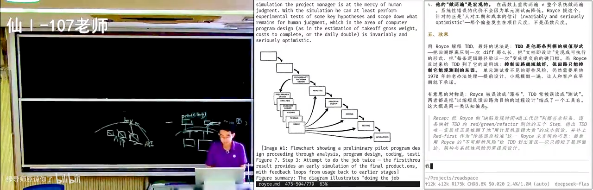

- 瀑布模型说：从需求分析 → 系统设计 → 系统实现 → 测试验证 → 交付维护。**你可以把每一个过程都想象成一个 program**——就是把人想象成程序（"人和程序就是等价的：我的人脑就是神经网络"）。
- 而且我可以做 **chain of thought**：我先学会了语言、学会了说话；你们在内心——我不知道你们是怎么样的，至少我自己在想问题的时候，我还是会对齐到语言上：我哪怕不说话，我依然会说"OK 我要这样，这样会有什么样的后果"——**我还是用语言来对齐我脑内的这个思维链的思考**。所以 CoT 是一个我觉得很有意思的机制。
- 如果把这些过程和它们产生的 **artifact** 连起来，那就是一个 **data dependency graph**，它是一个**有向无环图（DAG）**。

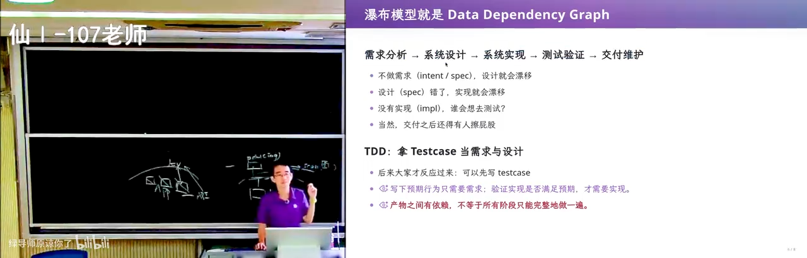

稍微展开一点：

- 我在做需求的时候，需求里面有**好几个点**，这些点之间可能也有关联，有些可能没有关联；
- 我在做设计的时候，我的设计可能就和这些需求的点是关联的；我做的这个设计，又和下一个设计是关联的；
- **然后这个关联关系会传递。**

于是我有了这样的一个 data flow graph，那就意味着：**如果这种一头扎下来，一旦发现问题……** 如果一旦发现这个 test 错了，然后我们一路往上追溯，发现这几个 design 错了——**那就惨了：所有依赖它的东西全部都毁掉了。**

> "所以这就解释了为什么 cost 很高。你看，跟 Royce 的解释又是一样的。"

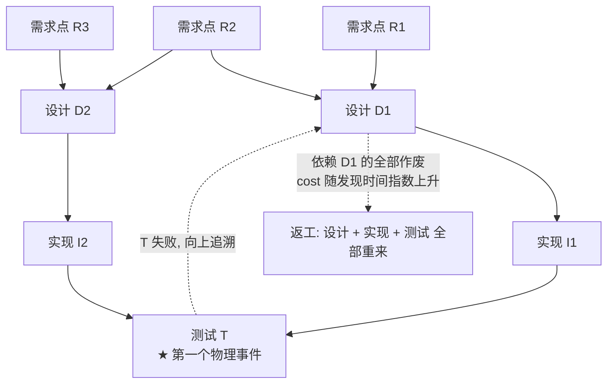
```mermaid
graph TD
    R1["需求点 R1"] --> D1["设计 D1"]
    R2["需求点 R2"] --> D1
    R2 --> D2["设计 D2"]
    R3["需求点 R3"] --> D2
    D1 --> I1["实现 I1"]
    D2 --> I2["实现 I2"]
    I1 --> T["测试 T<br/>★ 第一个物理事件"]
    I2 --> T
    T -.->|"T 失败, 向上追溯"| D1
    D1 -.->|"依赖 D1 的全部作废<br/>cost 随发现时间指数上升"| X["返工: 设计 + 实现 + 测试 全部重来"]
```

**每个人对这个模型的理解都可以是不一样的**——这也是为什么我们非常需要**个性化的教学**：每一个人都有自己的 diversity，他成长的经历不同。讲者说，因为他还算是一个做过一点 PL、操作系统的人，所以他会很自然地用他在 computer science 里面习得的概念去解释这个世界。

> "这基本就是软件工程后来真正采用的形式化方式，这也是一个 first principle。"

### 26.6 于是 MVP 就来了：BFS 换成 DFS

那如果我们知道这个 data dependency——一旦修改会触及它上游的东西——我们应该怎么办呢？

> "那我们很自然地：哦，**我们可以把它割小嘛。MVP 就来了。**"

- 我们不要一次性地产生大量的 dependency；
- 而是我们从一个**宽度优先（BFS）**的方式开始——这是一个用 BFS 的方式构建软件：先做第一层，再做第二层，再做第三层；
- 然后我们变成一个 **DFS**——**这不就是敏捷开发吗？**

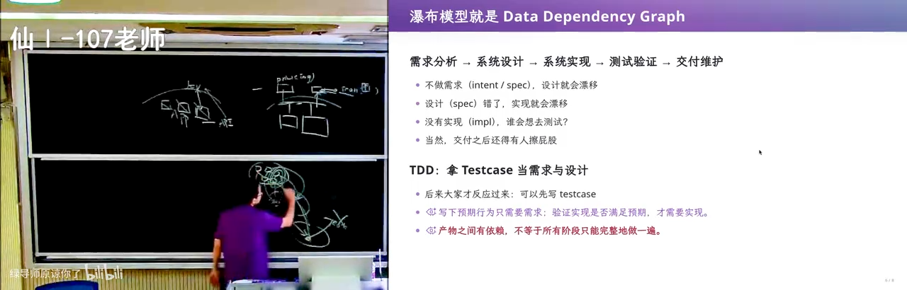

先做一个 **minimal viable product**，把一些重要的、优先级最高的 dependency 流程走通；走通了以后，再不断地向右扩展——一个 DFS、一个迭代。

> "**这就对了嘛。这就是软件工程，没有什么真正真正困难的。** 我们越早能够得到反馈，我们就越能把这个路线上面的不确定性（这个 gap）消掉。"

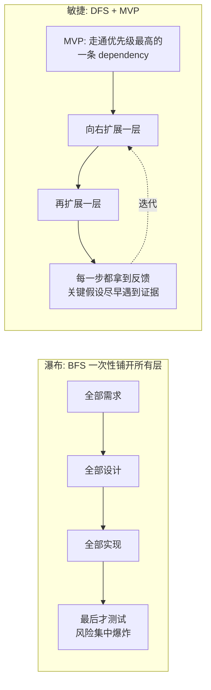
```mermaid
graph LR
    subgraph B["瀑布: BFS 一次性铺开所有层"]
      B1["全部需求"] --> B2["全部设计"] --> B3["全部实现"] --> B4["最后才测试<br/>风险集中爆炸"]
    end
    subgraph A["敏捷: DFS + MVP"]
      A1["MVP: 走通优先级最高的<br/>一条 dependency"] --> A2["向右扩展一层"] --> A3["再扩展一层"] --> A4["每一步都拿到反馈<br/>关键假设尽早遇到证据"]
      A4 -.->|迭代| A2
    end
```

### 26.7 瀑布模型里其实是有 insight 的

因为每一个阶段——瀑布模型里面其实是有 insight 的：

| 阶段 | 对应要确定的东西 |
| --- | --- |
| 需求阶段 | 把 **intent** 确定 |
| 设计阶段 | 把 **spec** 基本上确定（当然 spec 在需求阶段也会稍微做一点） |
| 编码、测试 | 才是 **implementation** |

然后因为我们知道这个东西是有 gap 的，而这个 gap 就意味着**每一个 intent 都会拆成好多个小点，而且会对后面产生 dependency**——所以我们应该做 MVP、应该做敏捷开发、应该做 TDD。**它显然是一个正确的事情。**

> "所以我觉得阅读这些经典的著作，真的是非常有启发性的，也是一个非常值得大家学习的学习方式。因为一般经典来说，**经典都记录了一个领域最初遇到的、也是最重要的那个根本性的问题**，然后在方向上找到一个出路。尽管我在事后也可以援引其他的概念，比它解决得更好——比如我就很喜欢 data dependency：在整个软件工程的发展历史上，你都可以往这个方向去思考，然后导出更多的概念。"

## 27. 软件工程变成了什么：为每个阶段创建方法与工具

*(参考时间: 01:15:30)*

那么这是软件工程的（起点）——**相当于我觉得这个有点像起点了**：你学软件工程的 first principle 是"软件到底是什么"。你当然可以用定义说它是**代码和数据**，但当你从这个视角看的时候，你就能继续往后推出更多的东西。

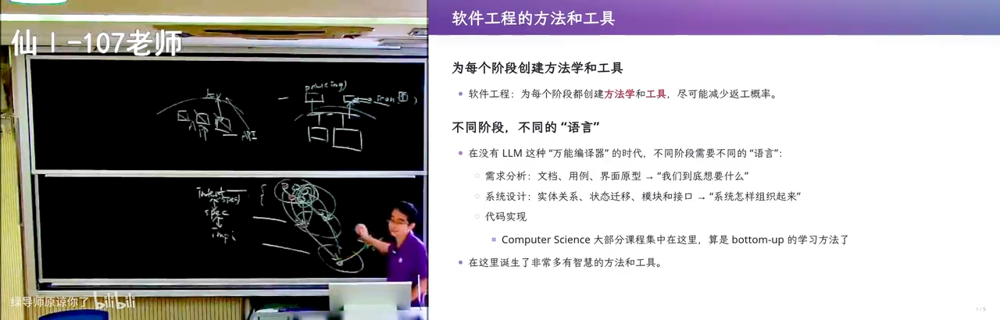

那么在现在、经历了几十年的发展，**软件工程变成什么呢？**

> 为了解决这里的问题，它**为每一个阶段都创建了方法和工具**；然而这些方法和工具，可以减少你**返工**的概率。

### 27.1 checklist：一个"有人文关怀"的工具

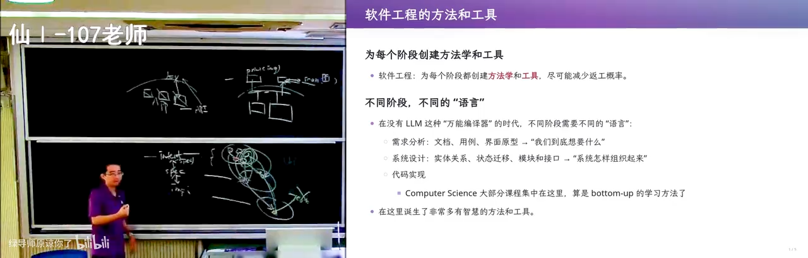

（讲者问了下有没有软件学院的同学：你们学软工课的时候，**在设计阶段它应该是有 ISO 标准的**——"但我对这个印象已经不深了，因为我不是做这方面软件工程的。"）

- 比如这里有一个 **checklist**：你上软件工程课的时候，老师让你写一个文档，然后它大概有一个非常长的 checklist——这个有没有做到、那个有没有做到、有没有沟通过；
- 然后你就觉得 **nonsense**，因为你是做 OJ 题的；
- **但 checklist 实际上是有用的：它减少了你返工的概率。** 比如这个 checklist 最后总有一个"你是不是和客户最后沟通过"。你在上学的时候会觉得"诶，这个很讨厌啊"，**但是当你真的和客户沟通过、并且给它打勾的时候，实际上你大幅减少了 intent 不符合客户要求的概率。**

> "这就是一个方法，这也是一种工具——**一个有人文关怀的工具，它没有任何的代码。**"

### 27.2 有了代码以后：自动测试与 bad smell

当然我们现在做软件工程研究的时候，更多时候是说"**当我们有了代码以后**"：

- 有了代码以后，能不能做**自动的测试**？（"无穷多的这个灌水的 paper"）
- 有了代码以后，里面有没有 **bad smell**？bad smell 你们都知道：比如你如果看到一个代码，它**在等号左右从来不写空格**，你会认为这个代码是不好的代码。

> "这个规定在 AI 时代之前都成立。但是我发现这个在 **GPT-6** 学会**省 token** 以后，这件事情变了：它会写出极为无法理解的代码，把很多的语句放到一行里，然后那个代码就是对的。我不知道它是怎么弄对的，但是反正它是对的。**也许我们永远不应该去读那样的代码**——这是个有意思的观察。"

### 27.3 深度与广度：读研究生的时候别忘了看树林

但至少我们知道的是：软件工程有了这样的一个起点，为了把这个**大的、系统性的工程**扶起来，里面还有很多很多细小的点。

- 你们如果去读研究生、如果要选软件工程方向，你们大概率会在里面**非常小的一点**上做研究——比如"针对软件开发流程当中编码这个过程当中、Java 代码的这一种类型的 bad smell 的更好的检测"，去做一个什么东西；
- **当然你在做深的过程中，不要忘记去看这个树林、去看这些经典的东西，你就会有更好的认知。**

> "对人来说，深度和广度都是：你要在**深度**里面训练，你才有更长的思维链；你在**广度**里面训练，才有更好的对整个世界的感觉。"

## 28. 语言的阶梯：从 checklist 到 DSL 再到编程语言

*(参考时间: 01:18:44)*

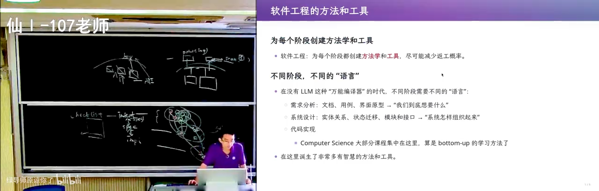

还有意思的是你会发现：所谓软件工程，为了在每一个阶段创建方法学和工具，**它就需要在不同的阶段用不同的语言。**

- 比如在 checklist 的时候——尤其是在大语言模型时代之前——你是不太可能用一个**编程语言**去做一个 checklist 的（虽然今天我们都用 Markdown）。那个时候真的就是一个 **docx 的文档**，然后你把这个文档打印出来、要存档；可能是手写的、跟客户沟通的那个记录。
- 然后你到编程的时候，又有编程语言。
- **在编程语言和之前，你马上就看到了一个 gap**：那个时候没有大语言模型这种"万能的编译器"——只要有自然语言，就可以把它编译成任何一种语言。

在不同阶段你会发现：比如**在设计阶段，我们没有一个语言来帮助你做设计**。再比如说在 1970 年的时候，在设计的时候，大家用的都是自然语言，就是一个设计文档。

> "你们学软件工程——我记得我那个时候学软件工程就是写设计文档：先写需求文档，需求文档写完写设计文档，follow 那个瀑布的模型。"

### 28.1 文档的最大缺点：人会幻觉，人对不齐

你马上就会想：**文档的最大缺点是什么？**

- 最大缺点是：**写文档的是人，人会产生幻觉**，人会产生 typo；
- **人和人之间，当我们讲同一件事的时候，是无法对齐的。** 这件事情在你和室友之间已经发生过无数次了：你说的是这个，室友理解成了那个，你花了很多的时间跟他沟通和对齐。（"当然我觉得跟女朋友对齐会比跟室友对齐更困难，这个不重要。"）

### 28.2 于是需要一种"介于自然语言和编程语言之间"的设计语言

你作为一个软工人，在 first principle 上如果你想要应用这句话——"**为设计阶段创建一个方法学、创建工具，去减少返工的概率**"——那你要做的是什么呢？

> **你要做的是一个介于自然语言和编程语言之间的一个设计语言**——当然也是一个 **domain-specific language（DSL）**。

哎，你们想到什么了？你们想到了软件工程课上面讲的各种各样的东西。

**checklist 虽然它是自然语言，但实际上它也是一种中间语言**：

- 因为它有**格式的规范**：它要求你必须是一条一条的，每一条必须要打勾或者打叉；
- 它已经是介于自然和形式化之间的——**它是有一定的语义的**；
- 这个语义虽然是由人来检查的，但**人对"勾"和"叉"的对齐，就比我直接写一个文档的对齐要来得更 formal 一点**。

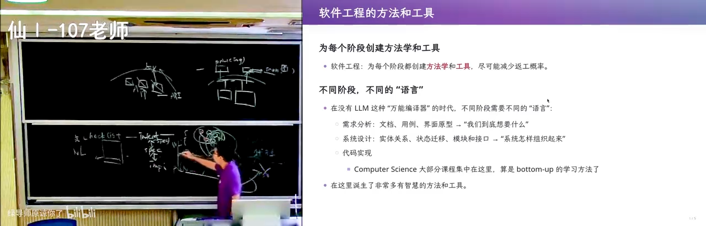

> "所以你看它这个 formal 的程度——就是它有确定性语义的程度——是**从设计的阶段到下面越来越 formal 的**。这也迎合了从 intent 到 spec 到 implementation 之间这个 gap 的解决。**所以你就开始理解软件工程这个学科了。**"

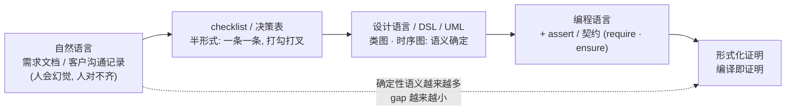
```mermaid
graph LR
    N["自然语言<br/>需求文档 / 客户沟通记录<br/>(人会幻觉, 人对不齐)"] --> C["checklist / 决策表<br/>半形式: 一条一条, 打勾打叉"]
    C --> U["设计语言 / DSL / UML<br/>类图 · 时序图: 语义确定"]
    U --> P["编程语言<br/>+ assert / 契约 (require · ensure)"]
    P --> F["形式化证明<br/>编译即证明"]
    N -.->|"确定性语义越来越多<br/>gap 越来越小"| F
```

## 29. 学习顺序：bottom-up 还是 product-first

*(参考时间: 01:21:46)*

那我们（过去）学的时候是怎么学的呢？**我们是 bottom-up 的：我们是先学编程。**

- 因为你所有的——你看计算机软件（培养方案）——第一件事是先学（编程）：先学怎么做一个码农；
- **因为你不理解代码，你就没有办法理解整个过程。**

> **但是 AI 来了以后，我觉得变了：你可以先从产品经理开始做。**

（这里有一个真实的课堂插曲：讲者突然"脑子卡壳"，想不起"产品"对应的英文，还问了一句"产品是这个产吗"，最后想起来是 **product**——"短路了，我上年纪了。"）

如果让他来改（培养方案）：

- **第一个学期就可以做 product**：因为反正你后面所有的事情都是 vibe（code），你不去控制它的质量，你也不需要知道；
- 如果我上第一门课，我不（要求）你控制这个质量——因为你根本就不理解代码、不理解后面是怎么运作的；
- **但你依然可以设计好的产品，你只要有好的想法就可以做。**

## 30. 质量保障的谱系：QuickCheck、traceability 与"2500 个码农"

*(参考时间: 01:23:15)*

然后在这个过程当中，其实诞生了很多的有软件工程智慧的方法和工具。

### 30.1 checklist 与决策表：nonsense 被赋予了语义

- 比如说这个 **checklist**；然后它不仅有 checklist，还有一些像这种**决策表**（那种决策树）。
- "就很好玩：大家觉得我是个理科生，我在软件学院学文科——他给我一个 checklist，说**只有当所有的这个勾都打上了，你才能进入下一个阶段**。这对我来说是 nonsense。**但是这个 nonsense 被赋予了对吧：这个形式的语义避免了遗漏和矛盾。**"
- 它甚至会要求你把**所有的文档两两摆在一起审查一遍**。你会想"我靠，我才不想做这个事儿，我是写程序的"——**但就是这样两两摆在一起检查一遍，避免了这个 gap 的漂移。这都是智慧。**（"但是他失败过了。"）
- 然后在管理团队的过程中形成的**管理学的经验**，软工人也可以学。

### 30.2 QuickCheck：让人描述性质，由工具生成输入

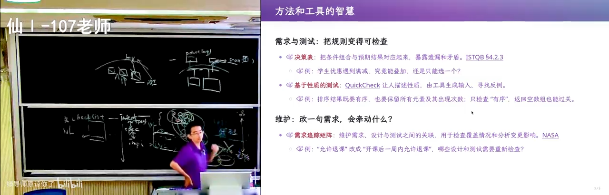

还有各种——比如在测试上面也有很多经典的工作，比如说 **QuickCheck**，基本上可算是我们整个测试领域的**开山鼻祖之一**：

> **让人描述性质（property），由工具生成输入，寻找反例。**

这体现了一个什么逻辑呢？**你做任何事都会错。** 你写代码——你做任何从上到下的翻译都会错：你从 specification 翻译到代码。尤其你有些**隐含的 specification**：

- 比如说你的这个程序不能 crash；
- 不要有 null pointer；
- 资源不能泄露。

这些隐藏在你代码里面的 specification，你也要遵守。

> "那你有没有可能：**我在代码里面就写一个 property，然后这个 property 可以自动变成好多的测试用例**；如果全部都通过了，我对代码就有更大的信心？"

**你现在做的软件就是这样的**：你写一份代码，你永远不知道它对不对；但是如果你做了测试、你观察过它的结果，你对它的信心就会多一点。**当你独立做的质量保障做得越多，你对它的信心越大**——除非是你最终写了一个形式化的证明，那你的信心可能是更大的。

### 30.3 traceability：把 data dependency graph 显式地建出来

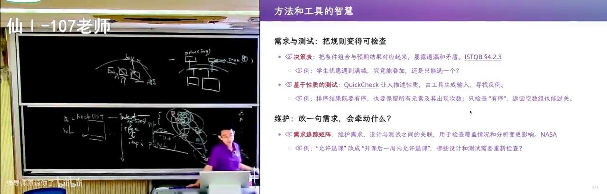

然后再比如说这个**需求追踪矩阵**。前面课上讲过一个概念叫 **traceability**，这是软件里面很重要的一个概念。

**traceability 做的是什么呢？就是把那个 data dependency graph 里面的（关联显式化）——以前是没有的。**

如果你从**文件系统**或者项目的角度来看这个软件，那这个软件就是好多的文件：

- `/docs` 下的什么什么 `.md`；
- `src` 下的一个什么什么 `.ts`；
- 然后又有一些其他的东西，还有个 `README`。

> "我说这是一个**因为文件系统一开始大家用了、而不得不做的一个 workaround**。" 而这个东西其实**承载了整个软件**。

而 traceability 要求你**用链接、或者用什么文档、或者用什么样的方式**，要求你的：

- 每一个代码和每一个需求点都能对得上；
- 需求和需求之间也能对得上；
- 需求和设计之间也能对得上。

**如果所有这些都能对得上，它有这种独立的、互相的交叉检验，你对软件的质量就更有信心了。**

### 30.4 它也是没办法：人的能力是有限的

它也是没办法——**人的能力是有限的**。它假设：

- 我们每一个人上大学学软件工程的时候，总是觉得"我要把自己变成世界上最厉害的码农，那就够了；如果我是世界上最厉害的码农，那我就保证能在软件企业里面找到一个很好的工作"——**这是这个社会给你的 contract**；
- 但是从资本家的角度来看，或者说从"你要完成一项任务"的角度来看，他更重要看到的是：**没有一个码农能够单独完成他的项目。** 他只能说"我码农有好有坏，我得花多少钱、雇多少码农，最终能把我的项目给交付"。

### 30.5 所以每个人都当产品经理：你手上有 2500 个码农

所以你看，**现在每一个人都当产品经理**：你第一门课就要学做产品。

- 你要调动——假设你有好多码农了，**而且你现在马上就有**：DeepSeek 绝对算是一个相当资深的码农了，绝对不是这种本科毕业生级别的；
- 那你马上就可以有 **2500 个并发**的"低薪码农"：你手上有 2500 人，你怎么管？
- 你高中毕业的时候，做梦都没有想过：你刚刚高考完、接受了高考的这个训练以后，**你马上就能管 2500 个人**。

> "**这个 mindset 可能要改一改。**"

## 31. Design by contract：Eiffel 与"编译即证明"的预言

*(参考时间: 01:28:11)*

所以在这个里面，就诞生过很多很多好玩的东西。比如说 **design by contract**（面向契约的编程）。

### 31.1 Eiffel（约 1986）：把 Hoare 三元组写进代码

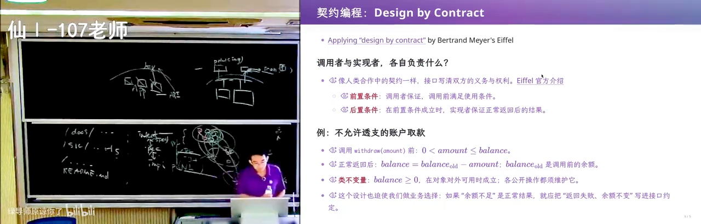

这里有一篇文章，讲者就不打开看了：**Eiffel** 这个语言，应该是 **1986 年**左右——他说"我要把这个 **Hoare 三元组**直接写到代码里"。你看这样一段上古语法就知道了：它叫 `feature` / `function`，然后它那个赋值还有 `:=`（冒号等于）。当然这一路也沿袭下来，有很多语言也采用了这条线。

```eiffel
withdraw (amount: INTEGER) is
        -- 从账户中取款：先写文档，说明这个函数是干嘛的
    require                       -- 前置条件 (pre-condition)
        amount > 0
        balance >= amount         -- 余额不足到底应该怎么处理?
    do                            -- 代码的实现 (先别急着写这一段)
        balance := balance - amount
    ensure                        -- 后置条件 (post-condition)
        balance = old balance - amount
    end
```

- `require`：它的**前置条件**；
- `do`：这是**代码的实现**；
- `ensure`：做完了以后，它能够**保证什么**。

**他鼓励你先不要写 `do`（实现体）**，而是先把软件的各个模块文档、pre-condition、post-condition 给写出来。

比如你有一个**账户的取款**：当你在写这个 precondition / postcondition 的时候，**你就会自然地去关联到你的设计**——比如说"**余额不足到底应该怎么样处理**"。

> "你在写第一个 MVP 的时候，你一定不会管这些事：你肯定是直接让它 crash，或者假设这件事情永远不会发生，**排除在你的 specification space 之外**。但是当你的软件不断地向后演进的时候，那么 OK，**你的这个 contract 就变得非常重要**。所以他希望能够在这个编程语言里引入这个。"

### 31.2 这么多年软工人做的事，就是在 spec 上面横跳

所以你看到这么多年软工人做的事情，**就是在这个 spec 上面横跳**：

1. 从**自然语言**；
2. 到几个**半自然的语言**——可以接纳设计的、有一些逻辑公式的语言：它可以没有代码，单纯地检验这个逻辑（比如说函数调用这个逻辑能不能成立）；
3. 再到现在的这个**编程语言**。

**今天其实依然是一个非常活跃的方向。**

### 31.3 LLM 来了：剩下的只有 gap

而且我觉得软件工程未来会发生很大的变化，**因为 LLM 来了**：

- **自然语言对不齐的问题解决了**；
- **checklist 不好检查的问题也解决了**；
- **我们只剩下这个 gap**：只有"是我没有想清楚、我没有说清楚"。**一旦我想清楚、说清楚，可能真的就都能解决了。**

因为你看像 Eiffel，它催生了很多现在的项目，比如 **Dafny、Verus** 这些形式化验证的工具。


> "大家的梦想都是：我如果写一个这样的程序，**我可以自动地证明我的函数在前置条件满足的时候，后置条件就会满足**——无论我写什么就能证明。而且我还要证明整个系统：把所有的前置条件、后置条件连起来，它就能够满足我的 **intent**。"

### 31.4 讲者的"30 年预言"，可能只需要 10 到 15 年

其实在 ChatGPT 出来之前，讲者上操作系统课的时候就**预言 30 年**（说 30 年以后，那可能 2020 年左右、还是 2022 年左右的时候）：

- 如果你的一个程序里面有个 **assert**——随便你写的 assert 也可以：这种前置条件、后置条件可以写成断言；
- 比如说"我的函数要满足：这个 linked list 往左走再往右走（或者往后走再往前走），总之能回到自己"，就写一个（断言）；
- 然后**任何和业务逻辑相关的 assert，只要我写出来它不能证明——或者说这个东西是无法证明的——这个程序就不能编译**；
- **编译百分之百保证这个东西才能证明。**

> "那我就……这个软件的 gap、代码开发的这种（问题）：**我还需要这种 property-based test 吗？我不需要。我只要直接把这个 property 写进去，它帮我证明了就可以了。** 然后从现在来看，可能不需要 30 年：**可能从那个时间点算，10 年或者 15 年就可以解决这样的问题了。**"

## 32. UML：对齐语义的野心，与它为什么"死了"

*(参考时间: 01:32:29)*

然后在这个过程当中，有一个**集大成者**叫 **UML**——大家绕不过去的一个名字：**Unified Modeling Language（统一建模语言）**。

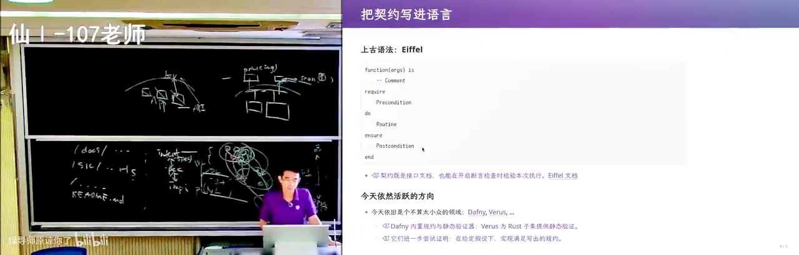

它的想法也很简单：既然这个世界这么复杂，**在不同的层次上要用不同的语言**——

- 你实现的时候是 C 或者 Java（实现的时候也可以用 Eiffel，也有一些别的专门用来做设计的领域语言）；
- 你在做需求的时候是自然语言；
- **那我们能不能有一种中间语言，统一整个面向对象的世界？**

### 32.1 它要做的是"语义的对齐"，而这恰恰是人类天生做不好的

它要做的是一个**非常有野心的事情：语义的对齐**。而这件事情，人类其实天生没有做好——**因为人类靠自然语言，而自然语言是直接连接大脑的 latent space 的。**

> "当我跟你说'我今天看到一个美女'，在每一个人的 latent space 里面都构造了一个美女，**但她都不一样**——这是对不齐的。如果你要求我们把那个形象 3D 建模、用 Blender 画出来，这就跟让 GPT 画一个美女、让 DeepSeek 画一个美女一样，他们画出来也是不一样的。（开玩笑——不过好像豆包生成的都长一样。）"

所以**语言就是很难对齐的，因为语言直连人类大脑的 latent space**。于是人类发明了**数学语言**：

- 数学语言是一个非常好的、**全人类都能自然对齐的**（语言）：因为我们知道什么是自然数，我们是从**公理**一点一点构造出来的，而那个公理非常小，以至于人类基本上还是可以对齐的；
- **一旦对齐完成，那我们用皮亚诺（Peano）的公理，就把整个计算机世界全部都构建起来了**；那在计算机世界里看到同样的东西，它的语义就是**绝对对齐**的。

### 32.2 UML 的办法：把能对齐的和不能对齐的剥离出来

UML 想要的是一个非常有野心的目标：**它想要去对齐那个自然语言世界里面的东西**——比如说需求、设计这些"说不清"的东西。

- 当然你是不可能百分之百对齐的；
- 但它希望**把能对齐的部分和不能对齐的部分给剥离出来**，通过**定义模型的元素和它们的语义**。

就有些东西是有语义的。比如你们可能学过 UML 的**类图**：

- **类图的语义就是确定的**：我有个 class 叫 `student`，`student` 里面有一个 field 叫 `name`，那它就是 `student.name`——它可以变成源代码里面的一个东西，**它是有语义的**；
- 再比如说 **sequence diagram（时序图）**：它说我要从前到后按照某一个顺序、时序来执行，**那这个时序的先后就是绝对对齐的**，你不需要用自然语言。如果没有 UML，你写自然语言"先后"，那么当它发生并发的时候，到底谁先谁后、能不能并发，**它就是有歧义的**；
- **但是 UML 最大程度地减少了在没有代码时候的这种语义的漂移。**

### 32.3 但今天，UML 已经死了

> "当然我觉得今天 **UML 已经死了**。这是因为：它所有的假设都是'我们的自然语言和形式语言是不能对齐的'——这是它的假设，所以它需要一层一层的中间语言。**而今天突然间，这个自然语言可以和任何东西对齐的**——反正 AI 就可以给你问嘛。**所以 UML 也是一个历史里面的东西了。** 但是它设计时候的这个 first principles，其实一直都在指导我们。"

## 33. 用 AI 备课：796 页 UML spec 与教育平权的算力问题

*(参考时间: 01:36:02)*

讲者也特意重温，让 AI 帮他重读了一下这个（UML 规范）：

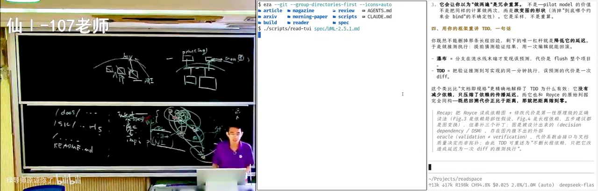

> "**这个就比较恐怖了：一个 700 页的文档。** 你看到我的工具还是可以的——我特别做了这个可以 scale 长文档（几千页的文档也没有问题）；这个就跟 PDF 是差不多的，还是有接近的体验的。"

正好这个 **Kimi**——"这可能算一个广告：因为他送了我一个 **699**（元）的一个月的套餐，说看到了我的视频"——然后他就直接让 AI 帮他读了整个 **UML spec**（就是刚才你看到的这个 dump）。

### 33.1 分 subagent、带 overlap 地切片，每个读 50 页

dump 完了以后，他直接让 AI 帮他**备课**：

- 大概让 AI 这样：**分 subagent**，按切片，**每个 agent 读 50 页**；
- 把一个非常长的文档切成这样的片、**带 overlap**（因为总会有一点重叠）；
- 然后让每一个（agent）都**提取里面的软件工程智慧**，把不符合 AI 时代的、不必要的东西（去掉）；
- 把他的 **lecture notes 全部给它**，然后把它拿出来、**总结成课件**。

> "结果我把一个非常长的文档（读完了）。所以我觉得这是一个非常恐怖的、也是一个蛮可怕的事情。"

成本：**它花了 18% 的五小时额度，大概折算成这个 699 套餐的五块三（元）。**

### 33.2 于是这是一个值得思考的问题：我们还学得起吗

- 当你拥有了更好的模型——比如你现在如果用 **GPT-6**，可能你的价格会差不多，**因为它很省 token**（GPT-6 的 token 真的非常省）——可以在差不多的价格下得到好得多的质量；
- 这就意味着：**哪怕你们是学生群体，在拥有好的模型和没有好的模型的时候，你们的学习效率、学习成本也会有很大的差距。**

还好现在 token 可能也不算太贵：

- 如果你有一个 **100 刀的 Codex**，其实我觉得对大家学习来说还算够用了；
- 因为**什么东西烧 token 呢？你去维护大项目**：大项目你就会在大上下文里载入很多东西，然后你 100 万上下文马上就填满了，那个很费（额度）；
- 但如果你是一个**学习流程**的话，你其实不会像我这样把整个 UML spec 都放进来，**你可以用这个 digested version**。

> "但这个值得我们思考的是：**我们以后还学得起、学不起来？** 这真的是一个非常现实的问题。因为如果让所有人都教育平权，那我们没有那么多算力、没有那么多资源，那怎么办？**We don't know**——这可能是一个社会性的问题。"

## 34. 结语：哪些 intention 必须定死，哪些留白

*(参考时间: 01:39:19)*

这是 UML 它总结的一些东西。但一句话：

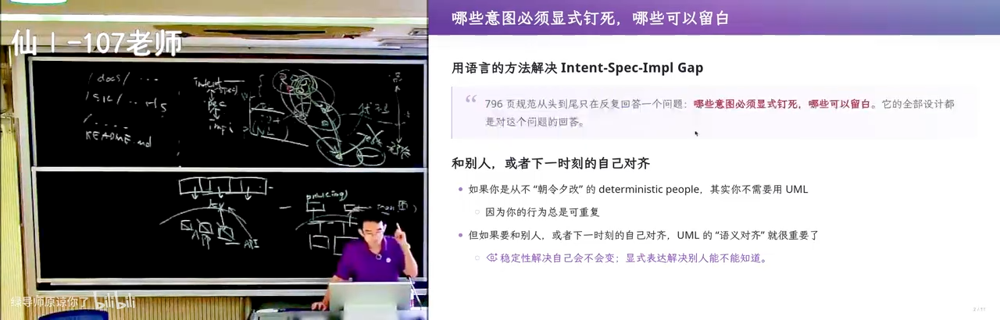

> **796 页的 spec，从头到尾回答一个问题：哪些 intention 必须定死，哪些留白。**
>
> 它构造了一个形式语言（半形式的语言）去告诉你：哪些东西可以在语义上确定下来，哪些可以不用它解决。

**就是对齐的问题**：人和人之间——你甚至和下一时刻的自己（**你不 deterministic：你今天想的和明天想的就不一样，所以你跟你自己都对不齐**）——那有趣的东西，大家可以自己回去看一下这个 slides。

好，那今天下课。

---

## 后记 Postscript：本书是如何生成的

本书由 B 站 AI 字幕（`ai-zh`，覆盖率 100%、2583 段、时长 99 分 59 秒）经 AI 重构而成：口语转书面语、按内容逻辑分 34 章（另加本篇后记）、绘制 6 张 Mermaid 图、插入 56 个截图锚点；截帧管线在已登录的专用 Chrome 配置里逐个 seek 到锚点时间、隐藏播放器 UI、锁定顶码率流后截取纯视频帧；最终渲染为带截图放大（lightbox）与 Mermaid 交互的 HTML。

与视频逐句对照的订正稿见 `transcript.corrected.txt`：先由脚本按本讲错词 MAP 修正（如 `type c AI→TypeSafe AI`、`JEFF/JB→Jev`、`chal salt/CHAMPSHO/CHAS→chain of thought`、`GP6→GPT-6`、`大圆模型/大于原模型→大语言模型`、`基摩场/机膜厂/禁摩场→基模厂`、`达舍尔/DEXTRA→Dijkstra`、`I trio e→IEEE`、`IFL/埃菲尔→Eiffel`、`pick check→QuickCheck`、`rose/pom/ROIS→Royce`、`train lecture→Turing Lecture`、`NATTO→NATO`、`恋爱来了→LLM 来了`、`反攻→返工`、`羽翼→语义`、`latin space→latent space`、`流感→留白`、`button map→bottom-up`、`干水教材→灌水教材`、`AI slap/AI s lop→AI slop`、`web coding→vibe coding`、`deep pick/deep sk flash→DeepSeek`、`cloud open4.6→Claude Opus 4.6` 等），再由 AI 通读全文做一轮行级订正（保留讲师原始字词与有意重复，仅修明显识别错误）。
