# 需求和架构（1）：从教务系统的需求爆炸，到 event sourcing

> **原视频**：[Bilibili · BV1Rch76WEfQ](https://www.bilibili.com/video/BV1Rch76WEfQ/)（时长约 97 分钟）
> **课程**：南京大学《生成式软件工程》（2026）第 06 讲 · Raw 版
> **整理说明**：本书由视频 AI 字幕（`ai-zh`）经 AI 重构而成，口语已转写为书面语，并修正了转录中的明显识别错误（例如 `教务系统→java 系统 / 交互系统`、`架构→价格`、`技术债→技术站 / 技术宅`、`汉诺塔→淘宝号 / TPHONY` 等）；关键时间点均标注 *(参考时间)*，点击截图卡片可跳转视频对应位置。
> **本讲说明**：这是"需求与架构"两讲中的第一讲。讲者用一整节课的时间，把南京大学教务系统当成一个"史诗级需求爆炸"的活体标本现场解剖，然后用十行、两千行、五十万行三个尺度，说明**架构不是玄学，而是跳出问题看问题**。

---

## 目录

1. [回顾：软件危机、Royce，与那张错综复杂的依赖网络](#1-royce)
2. [pre-AI 时代留下的两个概念：traceability 与 UML](#2-pre-ai-traceability-uml)
3. [软件其实一点都不"软"](#3)
4. [被迫从底层学起：今天讲 intent → spec 的那一段](#4-intent-spec)
5. [三段杠杆：需求、产品、架构](#5)
6. [需求工程：学生为什么见不到真正的客户](#6)
7. [教务系统现场巡礼：史诗级的需求爆炸](#7)
8. [让 GPT 爬出一份"真的"需求说明书](#8-gpt)
9. [需求清单里的 traceability，与"tedious 到你不想干"](#9-traceabilitytedious)
10. [AI 的魅力时刻：一份需求文档 → 一个假的教务系统](#10-ai)
11. [行业壁垒：做软件是被迫从零开始的](#11)
12. [定律：需求永远不可能说清楚，而且不是一成不变的](#12)
13. [一次真实的 500 事故：绕过前端校验](#13-500)
14. [There is no silver bullet](#14-there-is-no-silver-bullet)
15. [无处不在的架构：第一步要做的其实是架构](#15)
16. [getopt：命令行参数解析里的架构](#16-getopt)
17. [汉诺塔的四种表达：架构是一种品位](#17)
18. [架构能力从哪来：压缩就是智能](#18)
19. [2000 行的架构：在 Excel 里生成二维码](#19-2000-excel)
20. [跳出问题看问题：这其实是一个编译问题](#20)
21. [50 万行的架构：AI 实现的教务系统长什么样](#21-50-ai)
22. [CRUD 的基本原理：世界是一台状态机](#22-crud)
23. [CRUD 为什么会死：丢掉的历史与无法解释的黑洞](#23-crud)
24. ["南大没系了"：改名引发的数据库迁移两难](#24)
25. [手艺活：一家公司，和一个研究生院的屎山](#25)
26. [如果重做架构：persistent data structure 与三种等价的视图](#26-persistent-data-structure)
27. [Event sourcing：先把干的所有事情都记下来](#27-event-sourcing)
28. [后记 Postscript：本书是如何生成的](#postscript)

---

## 1. 回顾：软件危机、Royce，与那张错综复杂的依赖网络

*(参考时间: 00:00)*

上一节课讲了软件工程的来龙去脉：在什么时候碰到了**软件危机**，大家发现那个时候软件开发不下去了，我们需要一个**工程化的方法**来解决软件里面的问题；也读了 Royce 那篇老 paper。

开场幻灯片把上一讲收成了**三个关键词**：**Intent–Spec–Impl Gap**、**瀑布模型**、**Data-Dependency Graph**；以及一句提醒：需求分析、系统设计、代码实现**各有方法，也需要对齐**——UML 试图“对齐”全世界。

Royce 说，我们希望的大概是这样一个过程：先有一个 **intent（意图）**，然后能够走向 **spec（规约）**，最后走向 **implementation（实现）**，最终产出一个软件。当然有了 implementation 以后你还需要**维护**它——软件的生命周期没有结束。所以很自然地，这一路向下就有一个**瀑布一样**的过程。

而在这个过程里，每一层都会产生制品（artifacts），它们之间织出一张网：

- 在 intent / 需求阶段，你会得到你对这个软件的一些**认识**；
- 这些认识逐渐进入 specification 的空间，形成**依赖关系**；
- 到系统实现的时候，你又会有各种**模块、函数、代码、测试**等等软件里面的 artifacts；
- 这些 artifacts 之间又有直接和间接的 **data dependency**。

于是整个项目就形成了一个**错综复杂的、交错的网络**——这就是软件工程的一个起点。

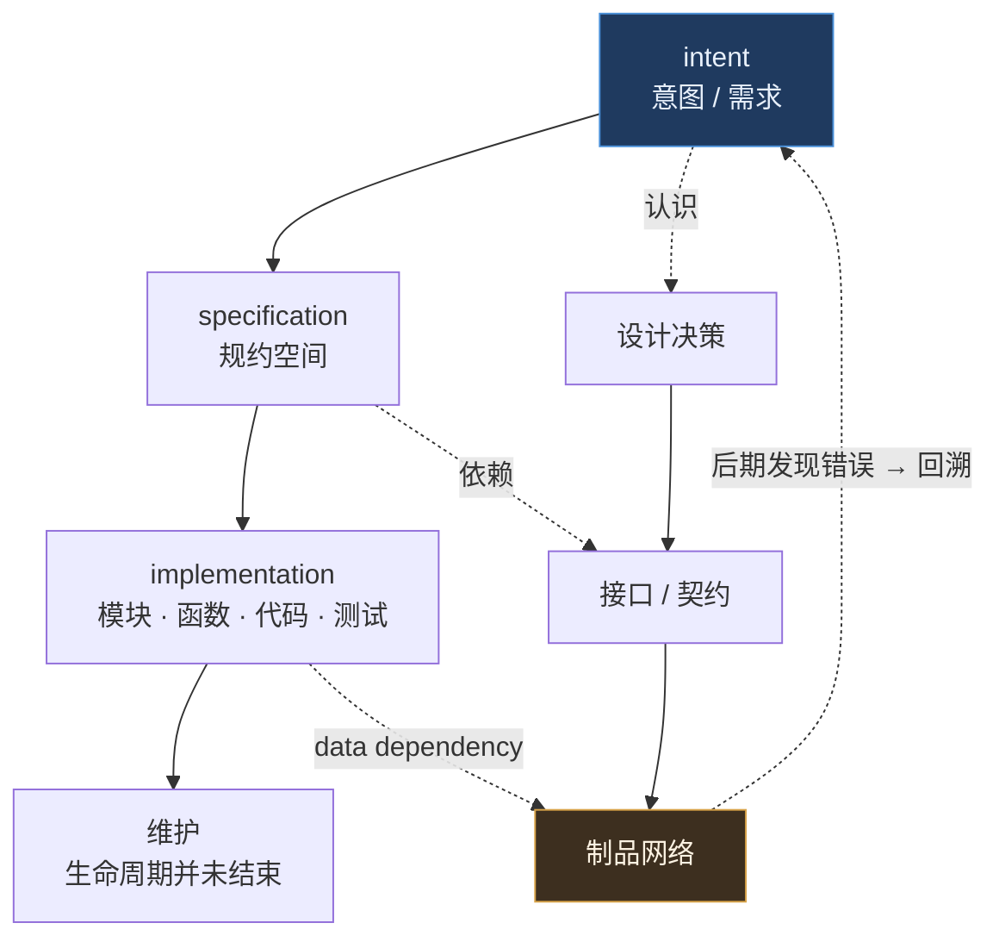
```mermaid
graph TD
    I["intent<br/>意图 / 需求"] --> S["specification<br/>规约空间"]
    S --> M["implementation<br/>模块 · 函数 · 代码 · 测试"]
    M --> O["维护<br/>生命周期并未结束"]
    I -. 认识 .-> A1["设计决策"]
    S -. 依赖 .-> A2["接口 / 契约"]
    M -. data dependency .-> A3["制品网络"]
    A1 --> A2 --> A3
    A3 -. "后期发现错误 → 回溯" .-> I
    style I fill:#1f3a5f,stroke:#4a90d9,color:#e8f0fb
    style A3 fill:#3d2f1f,stroke:#d9a44a,color:#fdf3e3
```

Royce 正是**批判**了这样的一个模式。他说：OK，如果你要按照这样开发的话，很可能你在后面……他的分析其实就来自于这个 **data dependency**：

> 如果我在后面这个时候发现有一个东西错了，这个错一直会**反推、回溯**到前面的某一个东西错了。而前面的某一个东西，如果在事后被证明是错的——一个设计不合理、实现达不到预期、需求或者设计做错了——那它会导致后面一个很大的部分，它**污染**到的部分、**TT（测试）到**的部分都会失效，然后你可能会需要**重做**，会带来大量的成本。

在这样的背景下，**软件工程**就诞生了。所以软件工程研究的是：在各个阶段——做需求分析、做系统设计、做系统实现的时候——我们有什么样的方法。不管是**有人文关怀的方法**（你需要用 checklist，产品经理应该怎么管人，这其实也是软件工程的一部分），到比如说你写代码的时候应该怎么写测试、我们有没有可能做自动化的测试、自动化的分析——展开了一整个软件工程里面的故事。

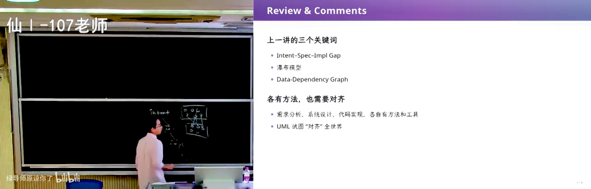

## 2. pre-AI 时代留下的两个概念：traceability 与 UML

*(参考时间: 02:21)*

其中一个比较有趣的、在 pre-AI 时代的尝试，源于两个朴素的痛点：**人和人很难对齐**；而且**如果我不写文档**，很有可能只剩下一份代码——你甚至比如说出错了，都不知道应该去追溯到过去的什么时候。

所以在那个时候，软件工程里面提出了很多重要的概念，比如说 **traceability（可追踪性）**：

- 最理想的情况下，**每一个测试用例、每一个代码片段**，都能够关联到、可以 trace 到一个过去发生的事情、做过的设计上；
- 这样整个系统里面到底发生了什么、**我改它会影响谁**、**我改设计会影响哪些测试用例**，都能维护起来。

然后，如果我们有一个**语言**——一个结构化的、有语义的语言——来表示它呢？那显然是更好的。**所以就有了 UML**：它试图去对齐整个世界上面的软件工程的实践。这当然都是有智慧的。

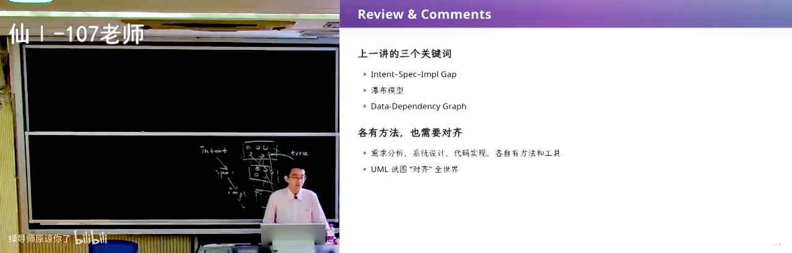

## 3. 软件其实一点都不"软"

*(参考时间: 03:24)*

回过头来再想一下这个过程：实际上软件工程它困难，还有一个**本质的原因**——**软件它不软**。

我们觉得什么东西是软的呢？你们现在坐在教室里面的这个**椅背**，它就是软的。当我们说"软"的时候，它有一个性质：**它有弹性**。你对它施加一个力，比如说你把它摁下去、你一靠，它就瘪下去了；但是你坐起来以后，它又弹回来了，你下次坐的时候它还是好的。

但软件和物理世界里面的这些东西（比如说你的椅背）很不一样：**它是一个纯粹的逻辑制品，这个逻辑制品是容不下任何细微的差错的。** 作为一个程序，它有**形式语义**。

你可以想象：你们在写代码的时候，从来没有考虑过——如果你的程序里面的内存可能会发生一个 **bit 的翻转**，你的程序还对吗？肯定不对了。

想一个具体的程序：从 stdin 输入一个 `N`，输入 `N = 1`，接下来循环就会从数字数组里面读一个元素。这个时候：

- 如果你的软件是运行在**卫星**上的，然后有一个**宇宙射线**击中你的内存；
- 那个 `1`——它的 unsigned integer 的**最高位变成了一**——它突然就变成了一个巨大无比的数；
- 然后你整个程序就彻底地 **collapse** 了：它会无限制地去从输入里面读数，如果没有的话那可能会等；
- 你的程序表现出来就是它**挂了**，也可能在读了一百、一千个数字以后产生一个 memory error。

所以软件其实一点都不软。刚才我说的是一个比较极端的例子——它运行的环境可能是你不可预见的。但其实大家在 **data center** 里面会观察到：比如说你的处理器随着制程越来越先进，它在**热噪声**下，有些指令（那个密度特别大的指令）可能会产生这种 **silent error**——就是这条指令，你在这台机器上执行和在那台机器上执行，**它结果就不一样**；甚至是可能要这个服务器运行一段时间以后才会出现这样的缺陷，就是制造时候的缺陷。

所以软件本身就是一个大家认为是**集成了人类智慧**的东西，然后同时它又要承载客户来的这些需求。就比如说教务系统——我今天会花时间来讲教务系统应该怎么样设计、应该怎么样**防止它堆积成屎山**。那就是软件工程。

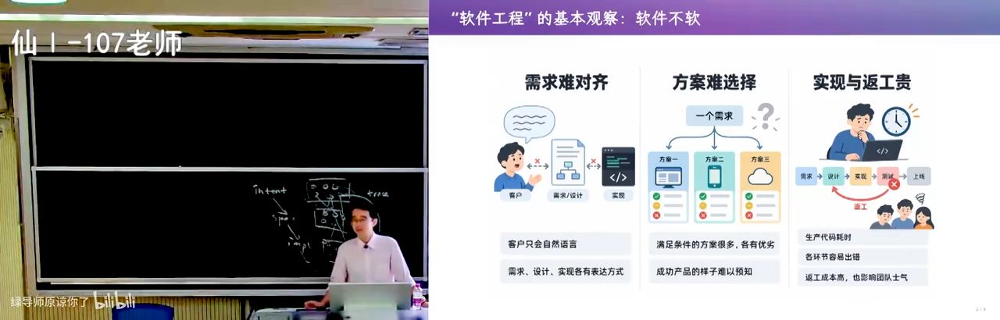

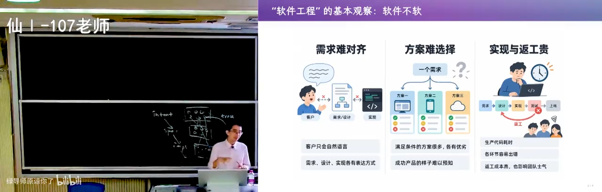

## 4. 被迫从底层学起：今天讲 intent → spec 的那一段

*(参考时间: 06:02)*

在这个背景下我发现：也许你们学习——比如说可能有听课的是软件工程的同学，然后学计算机专业的同学肯定要上软件工程的课程——**软件工程是一个关乎整个软件生命周期的学科，但是你们被迫只能从底下这个地方开始学。**

因为如果你不理解代码是什么、如果你写不出代码、没有体会过码农开发软件的痛苦，那你是不可能做好一个产品经理的。你设想的"这个事情应该可以办到""这个事情花多少成本可能可以办到"——如果你没有一手的经验，你确实是做不到。

所以你们上来以后就先学 **C 语言**：先学一个最基础的、老的、已经过时了、没有人用的（也还算有一些人用的）编程语言。然后在这个基础上你不断地产生新的知识：**知道世界是怎么失败的**，然后新的语言是怎么创造出来的、为什么要有它，然后一点一点去往上走。

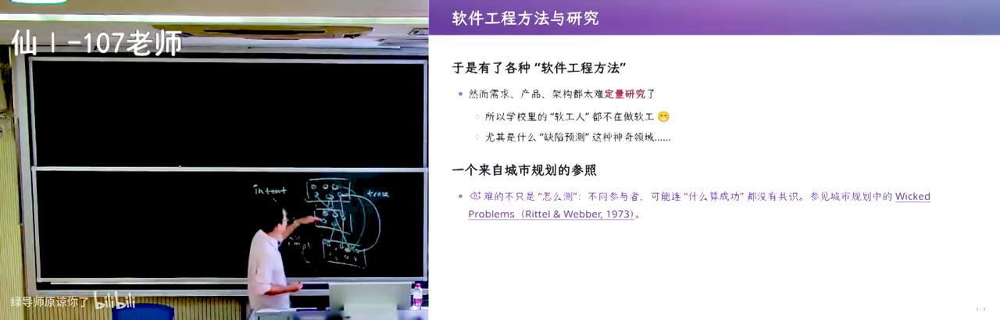

然后你今天看到的是像**需求、产品、架构**——这是我今天要讲的主题：在软件的设计阶段，**从 intent 到 spec 的阶段**。这其实是决定了一个软件系统**从零开始走向**的最关键的部分。

我们前面上课的时候先讲了**版本管理**。为什么先讲版本管理呢？因为你总是要从一个空的软件项目出发——你 `git init` 的时候总是从一个空的出发——那我们先讲一下如何从空的出发、这个软件怎么样往后走。然后接下来下一步，我们就要**把控软件前进的方向**：软件的走向，你的船到底是往东南西北哪个方向开。你一开始的方向选了以后，对后面的影响是非常大的。

但是呢，像**需求、产品、架构**都很难做出量化的研究：教材只能要么给出一些定性的安排，要么给你刷一遍"需求要做 A/B/C，产品要满足什么什么"。

> 然后最让你看到的是：我们的学校里面有很多做软件工程的人——我们号称南京大学软件工程世界第一（在 CSRankings 里面，如果你数那些 ICSE 的文章的话）。但其实他们大部分都集中在这个和**编码**相关、**implementation** 相关的东西。可能有些比如说做 NLP 的，他会说 traceability 在软件世界里面是非常重要的，那我们能不能训练一个神经网络模型直接从数据当中推导出这个？——但它就变成：OK，那可能也许用 GPT-6 就可以做到。

但我今天还是要讲一讲。

## 5. 三段杠杆：需求、产品、架构

*(参考时间: 08:52)*

我今天要讲一讲这里面最重要的、或者说我觉得**尤其在 AI 时代**最重要的东西。

在 AI 时代，**你生产一个目标明确的代码，已经变得非常便宜了。** 而且现在比如说对我来说，我让 AI 生成代码，我只要把它的**边界划定清楚**，我其实真的已经不看它的实现了。一会儿我会给大家看到 GPT-6 昨天写的那个代码——那个（复杂程度）已经超越人类能够理解的范畴了，但是**它是对的**，我还能比较好地信任它。

> 如果我把它边界划定得清楚，并且我能够知道它怎么样做一个好的 **validation**，那么我可以把 agent 的 slop 铺开去帮我实现，还是有一定质量保证的软件。

那剩下的，其实我觉得我们做软件系统的压力、或者说能够决定这个软件系统最后能走多远的，就是**需求、产品、架构**这三段。

### 5.1 MVP：先做最重要的功能，不要研究即将扔掉的东西

我们说总是做一个 **MVP（minimum viable product）**，这个没有问题：因为做 MVP 可以让你快速地找到一个**从 intent 到 specification 到 implementation 的切片**，然后在这个切片上你可以走完整个软件完整的流程——但它不完备。

那你在做这个 MVP 的时候，你一定想的是**先做最重要的功能**。你并不会想着在做 MVP 的时候就去想"那个按钮的样式应该长什么样"，因为这也是 **depend 的**：你的按钮的样式 depend 于你整个界面的设计，而整个界面的设计又 depend 于你所有功能的实现。

> 如果它不确定的话，那你叫我炸（怎么做）。如果你现在就去调那个按钮的样式，当上面的设计发生改变以后，你觉得这个按钮的样式很有可能就不可用了。

所以你会做一个（判断）、你会有一个倾向：**你不要做无用功，不要去研究一个你即将会扔掉的东西。** 每个人都有这个本能。那如果你确实有这个本能，那么你就应该知道：在做 MVP 的时候选哪些最重要的功能，你会得到一个可以运行的版本。

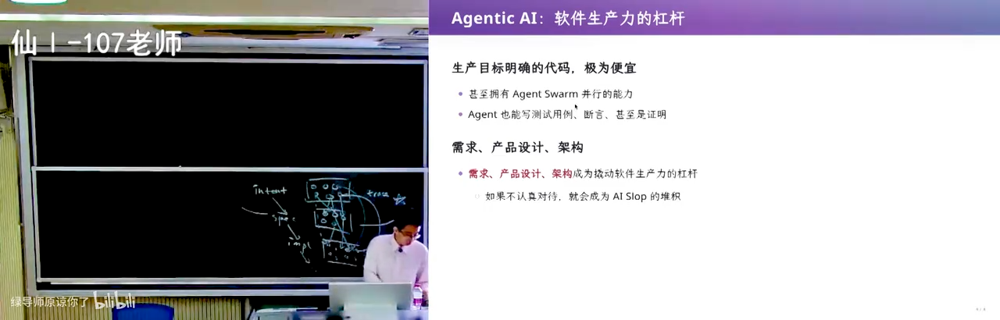

### 5.2 几个字的 prompt，会长出完全不同的 MVP

好，没问题，AI 会给你一个（MVP）。但是 AI 就在今天——至少今天的 AI——**它没有去从需求、产品设计、架构的角度（思考）**，除非你去显式地用 prompt 告诉它，甚至哪怕可能是**几个字**告诉它。

在你从一个零开始的项目（`git init`）的时候，如果你要让它用比如说 **client-server 的架构**，或者你就是让它做一个 **CLI 的架构**：同样的一个 MVP 需求，需求定下来，它加上几个字的 prompt，**你都会得到完全不同的 MVP**。它们可能功能上都差不多，看起来就是都实现了你的（需求）——比如说我要做一个 coding agent，或者做一个你 Lab 1 的那个学生的 agent。

但是你这几个字的 prompt 都会形成一个带有（方向的）膨胀：

- 如果你要 **CLI**，那你这里面可能就有个 `cli.py`，或者是 depend 一个 JavaScript 里面的、像 Claude Code 用的这种命令行的库；
- 如果你先要求这个 **client-server**，那它可能就会先设计这个数据的存储，然后它会给你选一个数据库。

好，它就……只要一旦这个东西——比如说 `db.ts`——**这个文件写了，它就会进入 agent 的上下文**；然后每当你继续想要做下一个需求的时候，都会带上之前的所有的历史。

而这在软件工程里面也有一个术语，叫做**技术债（technical debt）**：你在做任何决定的时候，你就背上了这个债务。因为这个决定你在做 MVP 的时候（并不知道后果）——你的决定其实来自于**需求**。

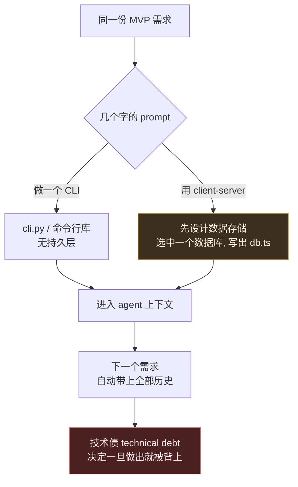
```mermaid
graph TD
    R["同一份 MVP 需求"] --> P{"几个字的 prompt"}
    P -->|"做一个 CLI"| C["cli.py / 命令行库<br/>无持久层"]
    P -->|"用 client-server"| S["先设计数据存储<br/>选中一个数据库, 写出 db.ts"]
    C --> CTX["进入 agent 上下文"]
    S --> CTX
    CTX --> NEXT["下一个需求<br/>自动带上全部历史"]
    NEXT --> DEBT["技术债 technical debt<br/>决定一旦做出就被背上"]
    style S fill:#3d2f1f,stroke:#d9a44a,color:#fdf3e3
    style DEBT fill:#4a2020,stroke:#d96a6a,color:#fbe8e8
```

### 5.3 产品设计：你的产品只有你自己用

然后再加上你的**产品的设计**。我直面一下你最终的产品：**这个产品是只有你自己用的。** 比如我自己有很多自己用的、用得非常顺手的（工具），但是我想给另外一个人用，他就用得不那么舒服了——因为我有些我自己的知识、还有自己的偏好，这些偏好对别人来说可能是不习惯、受不了的。比如说（我）喜欢的命令（行）——内行的工具，普通人肯定不要。

除此之外还有个隐藏的东西，是**架构**：就是这个软件会变成什么样。

> **而这三段会成为撬动软件生产力真正的杠杆。** 也就是说你可能是极端的（几个字）档次，但是会对你的 AI 生成的 slop 的走向、技术债的累积带来一个非常大的影响。

所以我会花两节课的时间来讲这个**需求和架构**。

### 5.4 插曲：现场翻车，以及 AI 从不主动写的日志

*(参考时间: 14:06)*

（录制现场讲者的机器翻了一次车。）那我可以让它诊断一下……我刚才翻车了嘛：

- 我的系统 UI 还在正常工作；
- 我的 OBS 还在正常的推流；
- 但是我不知道发生什么，因为我**所有的设备都不能用了**——我鼠标键盘都没用了，我插上一个新的鼠标也没有用。

所以（这也是）一个软件工程实践：**出了问题你要去看日志。** 这 imply 你在写软件的时候**需要输出足够多的日志**。

> 这个好像 AI——如果你不告诉 AI 的话，AI 也不会主动做，它会生成一个**没有任何日志**的软件系统。它都会留下这样的技术债。

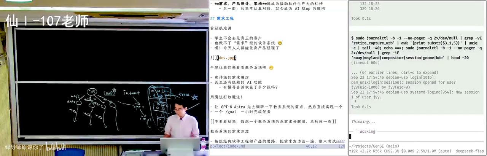

## 6. 需求工程：学生为什么见不到真正的客户

*(参考时间: 15:03)*

回到今天。我们要讲的内容是**需求工程**。

我们说曾经需求工程很难讲，因为**学生不会去见这个真正的客户**，也做不了需求级的软件系统。你们从最刚开始的时候学编程语言，到你毕业的时候，**你的能力的增长不足以让你去面对一个真正的软件客户。**

当然现在这个事情有点变了。你看在 AI 之前，我们有很少量的**精英独立开发者**：你们经历了几年的开源社区的洗礼以后，终于觉得自己可以独立做开发者了，然后会有一些付费用户。

> 然后现在变了：现在这个独立开发者就**爆炸**了，然后付费用户**瑟瑟发抖**。

## 7. 教务系统现场巡礼：史诗级的需求爆炸

*(参考时间: 15:48)*

我们今天要讲的软件系统的例子，是我比较喜欢的这个**教务系统**。我可以称它是**史诗级的需求爆炸**。

我昨天就趁机看了一下。（登录态还在吗？）好，我的登录不在了，让我扫码登录一下……好，我发现教务系统这几年一直都在进步啊。这是我的界面，我稍微放大一点点。


### 7.1 史诗级的更新：可以直接问它

我最近发现史诗级的更新——**我可以问**。

- 我问："**仙林教学楼的灯一直没有解决，我应该打电话给谁？**" 它说"我正在理解您的问题"……我不知道诶，它（回答）就基建处嘛。**基建处。** 但是我在那个平台上面提了，然后基建处就把我打回来了，说这个事情不归我们管。回头再给他打电话。
- 我又问："**我现在在上什么课？**" 我不确定它有没有载入我的上下文——我猜是可以的，因为我登录了。诶，它还是（给了）教师课表（本科）。这是我的课表。

还是一个（能用的东西）对吧。这是一个史诗级的更新，你们竟然……相信大家应该不知道突然有这个功能了，我不知道什么时候加上的，曾经肯定是没有的。因为我不会去搜索——我总是在那个快捷搜索栏里，直接等到它下一个界面弹出的时候，我就点它。

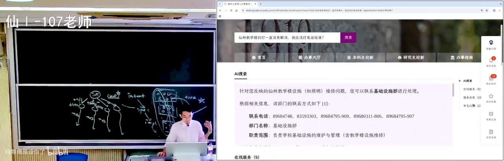

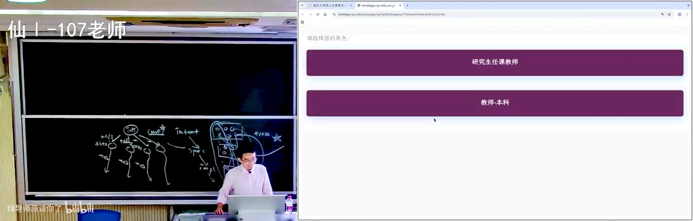

所以这是一个非常典型的**需求爆炸**的系统。这个系统肯定是花了很多钱的。然后这个钱我觉得某种程度上，**还不如变成 token 的补贴给大家**：因为它要购买算力、它要购买开发；不如我刚才如果用 PyAgent 去找一下的话，可能就一毛钱两毛钱。

> 所以把 token 送给大家、然后不要实现任何的功能，可能是更便宜的。

### 7.2 一个非常典型的业务系统

需求——我是讲需求——那这样的一个系统就是一个非常典型的**业务系统**。

比如说我除了找到我的课表以外，我应该还可以找……对，我收藏了，比如说我的**教学任务**。你在这里可以看到大家的信息，我就不点了，因为点开以后好像会显示**电话号码**还是什么的。

> **这显然是一个比较糟糕的 feature**：在学生名单里面可以看到电话号码。

然后在这里，上一次给大家演示过：直接用 AI、用 slop 来填满**教学周记**。你看，没有人管我，我没有任何人来审计我填的任何内容——至少还没有。（我觉得他们更应该把这个教室的灯给修好。）

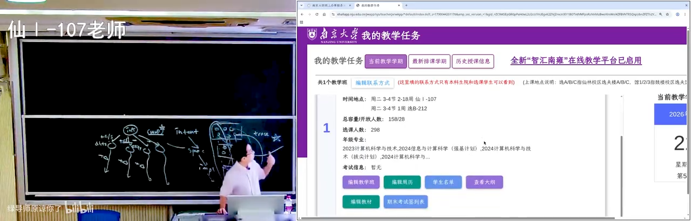

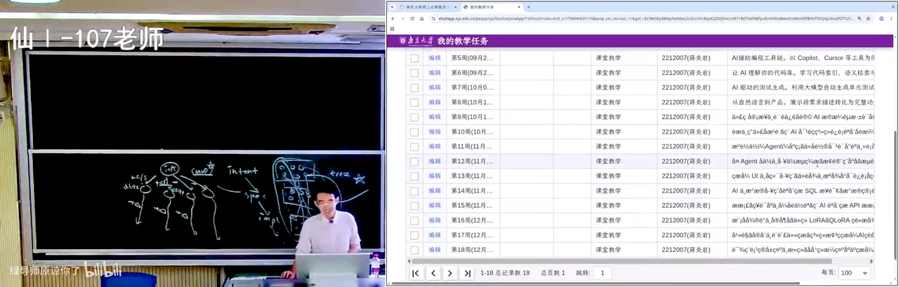

然后你就看到在这个界面里面有**无穷多的功能**。你看比如说有"编辑联系方式"，然后我在这里有"当前教学学期""最新排课学期""历史授课信息"。然后在这个历史授课信息里面，我要选择学年学期——诶，选择学年学期不太好用。你的感觉是不太好用、又还蛮好用的：**它还是做了需求分析的。**

### 7.3 一个个功能点：条件弹窗、bug、与非功能性需求

- **期末考试签到表。** 这也是一个需求功能点：它在期末考试期间允许你点击这个按钮；在没有到期末考试发布的时候，你要弹出一个窗口告诉你"无法打印"。
- **编辑教材。** 编辑教材进入了另外一个页面，有一个弹出窗口……再试一次啊，编辑教材——嘶，曾经好像是可以的。**好，我们已经成功发现了一个 bug。**
- **查看大纲。** 大纲说的是教学安排，仅展示最新一个教学班。哦，它等了很久才把这个页面刷新出来——**这个可能不满足它的非功能性需求**（要求状态正常）。


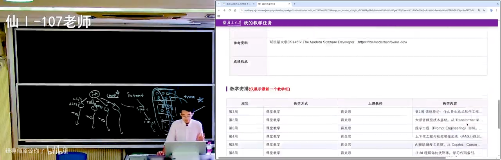

（看有没有还有没有别的可以点的。我就不用 AI（键）的点，我还是用古法方式来点。）

### 7.4 助教与慕课：需求叠加出来的史诗级 bug

没问题，这是我的教学任务。然后和本科生相关的还有很多功能，比如**助教**。我的助教——我这门课好像没有助教。我能搜我的名字吗？不对，这是学号。这是我班上的助教：**"找不到课内教学班没有助教"**。诶，这是什么？让我瞧一瞧……在这里我看到了一些 JX……太厉害了，教学班名称，**堪比 agent**。

搜索——哎，就看到这个**需求是不断叠加的**：


```mermaid
graph LR
    A["曾经: 没有慕课功能"] --> B["疫情时: 领导说<br/>我们需要为老师添加慕课"]
    B --> C["添加完慕课以后<br/>需要慕课的助教"]
    C --> D["慕课的助教不要当成<br/>普通教学班的助教"]
    D --> E["史诗级 bug<br/>找不到课内教学班 / 没有助教"]
    style E fill:#4a2020,stroke:#d96a6a,color:#fbe8e8
```

毫无疑问，在比如说疫情之前是没有慕课这样的功能的。然后在疫情的时候，领导说我们需要为老师添加慕课；然后添加完慕课以后需要慕课的助教；然后慕课的助教不要把它当成普通教学班的助教，要把它当成慕课的助教——然后就有了这个……啧，**史诗级的 bug**。我不知道为什么，但是这是一个史诗级的。

然后我点删除可以吗？好。点新增可以吗？——**"请在可维护时段内操作"**。课内教学班可以吗？新增，请在可维护（时段内操作）啊——现在不能、已经不能申请助教了。anyway，这就是你看到的教务系统。

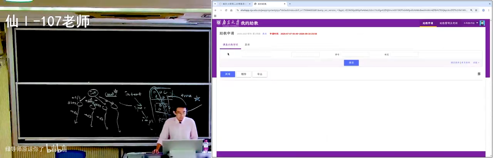

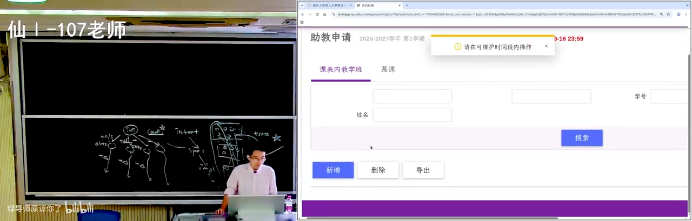

### 7.5 你们不敢，agent 敢

所以你就理解上（一）页我说的：**曾经很难讲——你们不会去见真正的客户的。**

你们可能也不敢拍胸脯说："这个给我 20 万，我找几个同学，我们把这个南大的教务系统给包了。"**你承担不了这个责任。** 到时候跟你签一个合同，然后你说——你如果**逾期交付**的时候、**达不到功能要求**的时候、**达不到非功能要求**的时候怎么办的时候，你就傻眼了。

当然你们作为一个成年人，你们是可以去成立自己公司、然后去和学校签订这样的协议。但是你们不敢。

> **你们不敢不要紧，agent 它敢就行。** 所以我干了这样的一件事。

## 8. 让 GPT 爬出一份"真的"需求说明书

*(参考时间: 23:19)*

我让 GPT 帮我——就用 PyAgent 说："我去爬一下，去帮我生成一个（像）校服信箱的投稿一样"——我让 GPT 去**探索一下这个教务系统里面和教师相关（注意只是教师相关）的功能，然后得到一个需求说明书。**

好，我们来看一看。这个需求说明书还是很不错的：**《南京大学本科教学服务平台需求说明书》**。

> 这就是一个**真实的**需求报告的案例。你们可以在软件工程的课上看到这样的案例，然后软件工程课上也可能会给你们看一些来自比如说真实企业的需求说明书的一部分——**但这个就是真的。**

所以 AI 真的是很好用：你要学东西的时候，我就想如果要教需求工程的话，我当然可以找一个经典的案例，那我也可以**把身边的案例直接变成需求说明书**。

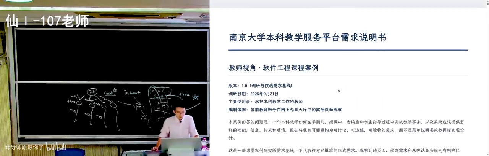

你马上就发现这个目录里面有这么多项：从**调研方法、证据边界**到**业务目标、成功标准**，到各种各样的**详细用例规约、功能需求目录**，最后还有**术语文档与配套文件**。

所以你看，**GPT 是懂软件工程的。** 它为什么要写这么多？这在我们看来——这已经是一个做好的系统——这就完全是 slop，就突然间写了好多好多的东西。但它懂得：如果你要做一个真正的工程，**当你面对的是客户的时候，一个术语（表）就很重要**——在他看不懂的时候，他可以去查一下术语，他就对齐了。虽然你不是 UML、（还）在一个早期的意图沟通的阶段，但是这些东西显然是有一定用处的。


## 9. 需求清单里的 traceability，与"tedious 到你不想干"

*(参考时间: 25:06)*

### 9.1 有编号的 ID 就是 traceability

需求功能的目录——你看它是**有 traceability 的**。每一个……它遵循了一个比较好的软件工程的规范：里面的每一个需求，比如说需求点和比如说前面是不是有叫**角色**——角色、参与者，或者**业务目标**——它都有一个语义上的、有一个**形式语义**（的编号）。然后这个形式语义可以帮你建立 traceability。

而不是说我这个教学班是和学生管理是有关的——你自然语言肯定是说了这样的一句话的——但是**它用有编号、一个 ID、有形式意义的 ID，它就在一定程度上帮助你做了 traceability。**

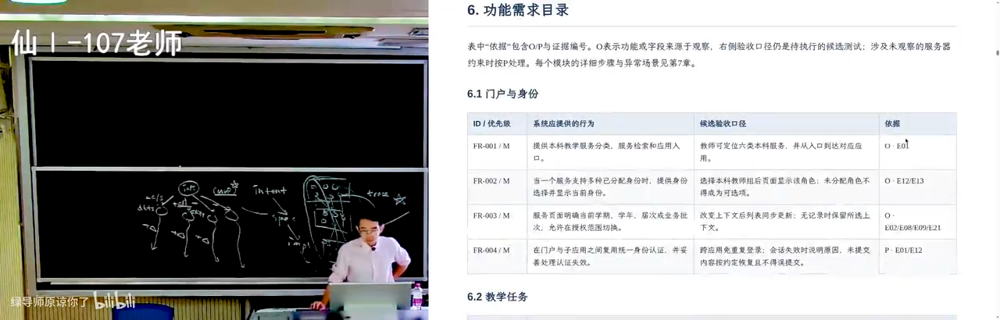

### 9.2 当你真正做软件的时候，复杂就来了

我们来看一看功能需求：

> **门户与身份**：提供分类服务、检索和应用入口；当一个服务支持多种已分配身份时，提供身份选择并显示当前身份。

你看，当你真正做软件的时候，**这复杂的就来了**。你可以不说这些——这些你都不说——但是**到底有还是没有呢？**

我们看一下：它应该是观察到了**身份选择**。诶，我就不登录了——刚才在那个本科生（界面）、在我选择教师课表还是哪一个界面的时候，确实看到了它让我选（反正我选了底下那个"本科生教师"）。

再比如：**服务页面明确当前学期、学年（或）业务批次，允许在授权范围内切换。** 这也是一个——在**意图阶段**的设计。你的领导想要（这个），或者说不光是领导的、还是一线的教师说："我打开这个页面以后，什么样的界面对我来说是比较舒适的？"

所以刚才你看到，交互系统还是有一定的设计（感）的：它会想你做这件事情的时候会想要做什么，然后它会留一个 **combobox** 在那边，你可以选那个 combobox，然后选一个学期或者选一个什么东西。

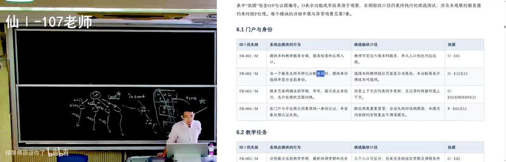

### 9.3 tedious 到你根本就不想干

教学周记、课程与大纲、教材选用——好，这你就知道了：**这就是一个非常 tedious 的事情，然后这个事情 tedious 到你根本就不想干。**

因为你做这些事情对你获得学分、获得学分绩、获得长进，看起来没有什么本质的好处。你还不如去做一个你之前没有想过的算法题——这样可以使你解决算法问题的能力高一点，使得你在最后**保研机试**的时候可以比别人多拿一点分数。而你在这里面一个一个条目往后写，是非常 nonsense 的，你自己不会想去写。

**但是就是量变引起质变。** 如果这个需求文档——比如说你的课程的作业也给你一个需求文档：你的数字逻辑电路课的作业、**计算机系统基础**课的作业——你们写那个 NEMU 的时候，哎，挺好玩的，**这是一个你们见到的第一个比较长的需求文档。**

我们在设计这门课的时候（就想到了）：在那之前 **OJ 都是一个非常短的需求文档**——明确给你输入接口是什么、输出接口是什么，而且那个输入输出的接口都很简单，一般（是）读入一个整数、还是空格分隔的整数，你只要用 `cin` 就可以（读）输入了。

而你们在计算机系统基础课上，**第一次见到一个比较长的 specification 的 guide**：

- 我们首先需求的要求是，你要实现一个 **NEMU**；
- 你的第一个 lab 可能是实现一个**调试器**——这个调试器你不需要事先解释指令；
- 第二个实验你需要实现**指令的解释**。好，这也是一句话——**但是到底什么是指令呢？指令的行为写在文档里。** 你就得到了另外的一个更大的需求文档。

所以其实，当系统走到大到一定程度的时候，**你们做的训练都是相通的**：你在学计算机系统基础这门课的时候，其实一定程度上学了软件工程。

## 10. AI 的魅力时刻：一份需求文档 → 一个假的教务系统

*(参考时间: 29:24)*

然后就是 AI 的魅力时刻了，我就不展开了。这是需求工程里面——你为了挣钱——你看这是**验收场景**，还有验收的场景，然后还有**需求清单**：一个非常好的、结构化的需求清单。

这个 checklist 最终你就可以把它分成：前 20 个需求分给这个团队，后 20 个需求分给那个团队，然后就可以 **track 每一个人的进度**——你就知道哪一个团队落后于实现需求、落后于进度了。**这个 traceability 有了以后，你作为一个管理者，你就可以把团队管起来了。**（当然这是我们本科上课的时候不怎么学的。）


AI 的魅力时刻就在于——我又干了这样的一件事：**我让 GPT 起一个 sub agent，然后这个 sub agent 不要看任何其他的教务系统，只根据这个需求说明书来实现一个假的教务系统。**

然后就得到了一个……哎，我觉得**突然你又有信心了**：觉得好像我也可以跟学校谈一个 20 万的合同了。


哎，真的还就是跟我刚才看的那个挺像的嘞：返回到全部教学任务、我的教学任务、本科教材管理（《软件工程：实践者的研究方法》）、编辑记录……我看这能不能编辑啊，演示书目一，保存记录——**记录已保存**，这个成功地保存了。

**学生名单**——诶，这是 GPT 起名字的偏好，就它认为在我的教务系统里面这些（名字）……这些名字其实挺文雅的。然后你又觉得它有自己的这个偏执在里面。

诶，这是什么？"一次记录，缺课一次"——哎，它不给我输入一？那就保存记录……哇，这个还是——**那它没有阻止我。** 我记录一个这个（超过总课次的数字）其实也不合理，因为这个数字已经超过了所有的这个学期上课次数的总和。


> 但你可以看到的是，**软件工程的魅力时刻**：当你的需求是清楚的时候、当你的需求文档已经写到那个程度的时候，那么**编码的事情、traceability 的事情、测试的事情，其实 AI 都能帮你搞定了——你只需要一份需求就行了。**

### 10.1 需求无非就是把客户想要什么想清楚

这是需求工程。我们一会还会再回到这里。先给大家看一下这个：一个**从入学到毕业**的（流程），它包括了**权限规则、版本、数据同步、操作留痕**各种各样的这样的功能。你就知道了：

> **需求无非就是通过无尽的和客户的沟通，把客户想要什么给想清楚。**

小到包括你要在界面上面要不要放一个当前学期和学年、要不要在哪一个地方有一个修改的按钮——这些都要跟用户对齐，因为**你的用户不是你自己**。

在你设计——尤其是做需求的时候——这个是普遍的、我们 computer science 同学缺乏的那种**软技能**：**你要有同理心**。你不是说"我是一个 geek，我就假设所有人都会写程序"。你要考虑的是那个**教务员**：那个教务员可能是本科学历，然后今年已经 53 岁、还有两年就要退休了，一个优雅的女士。她在上大学的时候可能甚至都没有操作过电脑。

然后我们要设计一个教务系统：**要为她设计，也要同样为我设计、为年轻人设计。** 诶，这个时候怎么得到那一张表——这是完全是另外的一个问题（当然这不是这门课的重点）。

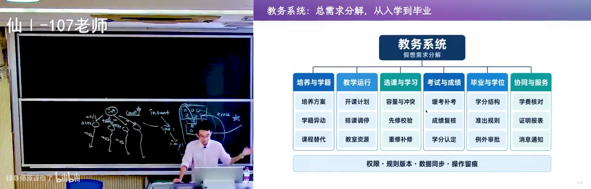

## 11. 行业壁垒：做软件是被迫从零开始的

*(参考时间: 34:03)*

这门课的重点是说：**当你的教务系统已经像刚才那样、用一个那么长的需求列表来做的话，其实就已经进入了泥潭。**

应该这么说：**如果你真的要做一个教务系统，那你就是被迫的——你被迫要从零开始。** 当然这就是**行业的壁垒和经验**：

- 如果我是一个有行业资质、或者说在这个行业已经摸爬滚打 20 年的公司，我有很多这个**领域知识**，我知道教务员想要什么；我对**学位授予的流程**比你清楚，我就知道这个流程应该怎么样变成这个需求的文档列表。
- 你作为一个毛头小伙子、本科生，你不知道这个教务员到底想要什么，所以你设计出来的那个软件、你做的那个需求**很有可能就是有偏差的**。

但某种程度上我做软件都是被迫的：在刚开始的时候、一个空项目的时候，**没有任何东西是漂移的**；但当你一旦写出了一个需求列表的时候，马上——不管是 AI 还是人类——就给你实现了一版，就像刚才我们看到的那个教务系统一样。

> 那实现那一版以后，**这个你就背上了技术债。**


```mermaid
graph LR
    E["空项目<br/>没有任何东西是漂移的"] --> RL["写出需求列表"]
    RL --> IM["AI / 人类<br/>马上实现一版"]
    IM --> TD["背上技术债"]
    TD --> DR["需求漂移<br/>（定律：需求永远说不清楚）"]
    DR --> RL
    style TD fill:#4a2020,stroke:#d96a6a,color:#fbe8e8
```

## 12. 定律：需求永远不可能说清楚，而且不是一成不变的

*(参考时间: 35:26)*

因为我们的**定律**是：

1. **你永远不可能真的把用户的需求说清楚；**
2. **其次，需求不是一成不变的。**

### 12.1 离散数学拆课：一个 AI 虚构但真的会发生的案例

我这边（是）AI 帮我虚构的一个案例，我大概能体会这个案例实际可能会发生——这真的是可能在学校里发生的。

比如说我们干了这样的一件事：**我们把离散数学课拆开了**（这是你们知道的）。我们觉得第一门课的离散数学没有教会大家那个**数学的语言**，所以我把它拆开了（从上学期一门课变成了上下学期两门课）。

然后拆开以后就带来一个非常糟糕的后果：**我们的准出结果变了，我们的保研要求也变了，然后新旧是衔接不上的。**

因为以前的系统里面比如说定义：我们要求计算机系（或者计算机学院）的学生如果要毕业，那就必须要选修**离散数学**——合理。好，那这个离散数学现在从一门课变成了两门课，那怎么办呢？我是不是要在系统里面增加一个规则，说：

> **我允许毕业 = 选修了离散数学 OR 选修了离散数学一。** 这就一个"或"的关系。

然后最早的时候，第一版在沟通这个需求的时候，**肯定没有想过这件事**。系统里没有（这条规则）的时候，当它写这个需求的 checklist 的时候，它会说什么呢？

> 好，我们要在一个界面上面有一个叫**毕业要求**（的东西）。然后在毕业要求上面，我们要给教务员（应该是教务员）一个**下拉框**、一个**增加一条**的按钮；然后这个增加一条的按钮可以**选一个课程**。

这是一个——在那个时候、就在固定到刚开始做需求的那个时间点——**当然是非常合理的需求**。但是一旦这个需求固定下来，当我们的离散数学课拆成 2 份了——**好，完蛋了，这个东西不能适应我们新加的需求。那就对不起，重构吧**：我们再把这个需求的文档调出来，"这个地方不能这样了，我要在这里加一个或，下拉框里加一个或"。

**然后每当你叠加一个这个东西的时候，这个屎山就开始累积了。**

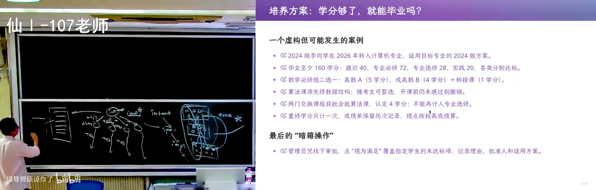

### 12.2 裂缝会传递到系统里的各个部分

你们写过软件的都懂这个：**你不要紧，你让我做个东西好吧，改需求真的受不了。** 因为改需求它会破坏（一致性）：

> 你做了一个整体上一致的设计，但是一旦这个需求中间产生了一个**裂缝**以后，它会**传递到系统里的各个部分**。然后当你一个看似很小的需求要改、牵动了整个系统的各个部分的时候，你就一团乱麻。

这里面举了更多的例子：什么**重修**，然后还可以**交换**、可以**抵扣**（也就有些课程可以抵扣）。这里面带来的（问题是）：如果有一个同学从别的院系转过来，然后别的院系又有一个离散数学课（软院好像还是一门的离散数学课），然后这时候这门课能不能抵扣计算机学院的离散数学呢？

- 它应该抵扣计算机学院的离散数学一和二？
- 还是我要求抵扣计算机学院的离散数学一、你还要再上一个离散数学二？

**这就无穷多。你一旦面对这个开放的物理世界的时候，你就没办法了。**

### 12.3 最后的兜底：override 与打电话给工程师

而且（哪怕）一万个（规则都写完了），最后你的系统里没有的东西，**还是可以暗箱操作的**——就最终还是有个 **override** 的。

因为比如说你今年 6 年了、拿不到本科学位了，就是因为离散数学这门课；然后刚好在这个时候碰到了我把离散数学课拆成两门。那怎么办呢？现在已经是春季学期了、马上要毕业了，你已经不可能再去修那个课了——**它在春季学期开，它不开**。怎么办呢？

最后领导说、这个教学主任说："我认为这两门课之间是可以存在**替代关系**的。" 好，那这个系统里面最终怎么办呢？

> 最终——好，**打电话给工程师**："这个数据库里面，这个同学的毕业条件，你把它改成满足。" 然后这个就过去了。

这个还是**档案可查**的：层层的审批流程都在，最终是教学院长认为这个同学学了这个旧的离散数学、还是可以抵扣这个新的离散数学的——**也合理嘛，就是在人类世界意义上有一个合理的解释。**

所以这就是软件系统的复杂：**你任何时候实现需求就做了；一旦你做了需求分析，你就背上了技术债。**

## 13. 一次真实的 500 事故：绕过前端校验

*(参考时间: 40:51)*

我记得我开始上课的第一天——那应该是 **2018 年**的时候，好多年以前了——那个时候还是一个老版的教务系统，好像是和我上学的时候教务系统差不多。

然后上课第一天我就发现：诶，这个系统我没有用过，因为我以前都是**学生端**，我第一次用**老师端**，然后发现很好玩：**可以给同学设置缺课次数。**

然后我不知道为什么要做这个需求。就是如果是我来做这个需求的话，我就不要把"缺课次数"这个 feature 放在我的教务系统里面：

> 同学缺课就缺课吧。你不需要在系统里留证据——只要老师比如说有一个签到表、点名表留证据，然后扫描一下，我就可以把你开除了。你们学生手册里面有写的：无故缺课达到多少次就可以（予以）开除了。

然后我就试着**绕过了那个前端的校验**。（刚才你看那个 GPT 实现，那个质量还是不错的，我相信它前端后端也都会做校验。）对，我要输入一个非常大的缺课次数——它直接拒绝我了。**我把一位同学的缺课次数从零改成了一**——这好像也不是什么有害的操作。

然后但是，立马，我发现**所有的、只要能够选出这位同学的选课记录的页面就全部 crash 了，直接 500**。

然后我就只好打电话给教务，说"哎呀这个教务系统崩溃了"。然后我不知道他怎么解决，反正第二天可能工程师登录到了那个数据库里面，然后把那个 `1` 的条目给修复了。

然后我就知道——**这就是软件系统，你们真实面临的软件系统的需求。**

### 13.1 所以：需求只是一个 lesson，而 AI 给了你驾驭它的错觉

这意味着什么呢？这意味着**需求只是一个 lesson**：因为我其实没有办法在这门课上面讲需求和产品设计——这（产品设计）可能应该是另外一门产品课，我这门软件工程课不适合，可能就这样带过比较合适。

就 AI 时代：

- 你做 MVP **没问题、正确，而且是前所未有的容易**；你先优先实现那个最重要的功能；
- 你看到一个产品，你马上就知道哪个地方"哎呀设计错了"，你这个时候**返工的成本是比较低的**。

> 但是这也给你产生了一个**驾驭 AI 的错觉**：因为 AI 确实可以往后修——你迭代三个版本，AI 都是可以往后修的。但一旦你在一个**真实的系统**里面运行足够长的时间（比如说**计算机系改成了计算机学院**），当你一开始面对这些事、你原来的设计不起作用的时候——好，你就面临麻烦了。

## 14. There is no silver bullet

*(参考时间: 43:30)*

这也是**所有的软件工程都面临的问题**，叫 **there is no silver bullet**——没有银弹。

所谓的银弹是：吸血鬼和狼人是没有办法（被）普通（武器）杀死的，但是要有一个 silver bullet。**但是没有银弹。**

在软件工程里，随着软件的增长，**你在最早的时候、在第一个时刻制定下来的那些决策**会不断地（发酵）——因为你的软件要**生存**、要**挣钱**。

> 假设这个软件不是（课程作业）——你课程上面我随时可以把它清零、从零从头再做一遍。你这个软件一旦上线，它就开始和**物理世界产生交火**，那你就必须持续地背着这个 technical debt 维护下去。那它的成本就会因为你前面做得不够前瞻，不断地变得更糟糕。

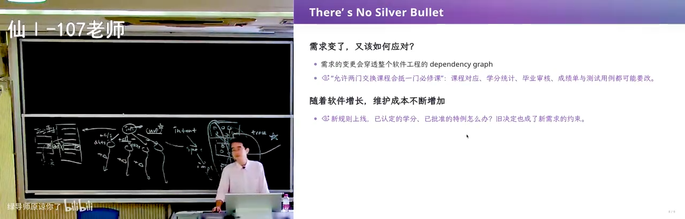

## 15. 无处不在的架构：第一步要做的其实是架构

*(参考时间: 44:23)*

对，这是需求。**那解决这个问题的方式是什么呢？——是架构。**

其实刚才我已经有一点点透露了：我们怎么应对这个问题？当你刚开始的时候，你可能有一个需求，或者是在 MVP 的阶段你还没有试图把所有要做的事情都放进来——你可以想一想：

> **我们的软件第一步迈向哪里，是对这个软件的长期生存有最好的效果的？** 而第一步你要做的，实际上是**软件的架构**，不仅仅是一个 MVP。

MVP——就刚才我们看的那个 slop、那个 AI 生成的那个 MVP——**那已经不能算 MVP 了，这已经算是一个小型的产品原型了，维护它会变得非常困难。**

你想要驾驭这个软件系统的复杂性，你在一开始的时候要想：**我怎么样做一个最小的软件，使得这个软件能够随着需求的膨胀和改变，它依然能够一定程度上有一点韧性。**

> **实际上哪怕是最小的代码，它都是有软件的架构的。**

然后这里面说白了就一个：**把耦合解开。** 就是比如说一开始的话，我用一个数据库来存放所有的（数据）——如果你在一开始的时候就立即做这个决定，你可以快速得到一个能 work 的原型，AI 也能很快给你做出来；**但是如果你不去仔细思考这个系统里面到底哪些概念是可以分开的，确实很容易进入软件维护的泥潭。**

好，讲到**架构**，大家都觉得有玄学、好像很高大上，但其实不是的：

> 从你第一次开始设计任何的代码、任何的系统的时候，**无论它多小，它里面都有一种架构的思维**。因为**架构本质上就是怎么样去控制一个东西的复杂性**。而当你的代码开始稍微哪怕有一点点的规模，你都可以去考虑这个复杂性应该怎么样去分解。

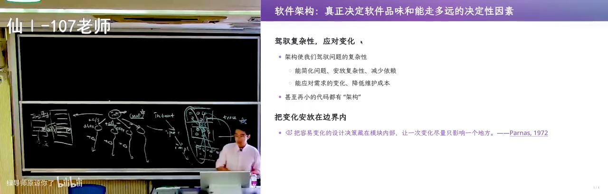

## 16. getopt：命令行参数解析里的架构

*(参考时间: 46:40)*

比如说，我不知道你们写 OJ 的时候会不会这样写：写一个 `main`，然后

```text
read input → parse input → process input → write output
```

你们会这样写吗？不知道。然后你们会看到，如果你要做一个**命令行的程序**，比如说你要写一个 `main`，然后这个 `main` 是有 `argc` 和 `argv` 的——这是**操作系统和进程之间的约定**，它会传一个 vector of arguments，把参数以字符串的形式传过来。

**那你们怎么处理参数呢？一个 `strcmp` 吗？**

你就想想：如果你今天在保研的那个机试的现场，那个题目要求你处理这个 `argv`，你会 `strcmp` 吗？然后你们就会回想起这个世界上有一个东西叫 **`getopt`**。

你在课上看过这样的代码，你在做实验的时候写过这样的代码；然后你在别人的实际的项目里面——比如说你们感兴趣 **Redis** 是怎么实现的、**`ls`** 这些东西是怎么实现的——你会看到这样的一个代码。

> **它也是一个架构，它也是一个分解复杂性的方法。** 因为有复杂性啊：这个 `argv` 本身就是一个非常复杂的东西。

比如说（你看）npm 的 help——它本身就有很多（参数），然后有些还是支持这个长参数：有 **UNIX 风格的长参数、短参数**。然后在 C 的时代，你要写一个 parser 是很复杂的。

**这里就有个架构**：你可以在这里 `getopt`，然后它就把这个复杂性给隔开了。这个 `argv` 它有一组约定，实际上这个约定是**有标准**的，是有个叫 **POSIX 标准**的；然后在这个 POSIX 标准上，它就可以用 `getopt` 来处理，最后你只要写一个 `while` 循环 + 一个 `switch case`，你就可以解析这里的参数了。

```c
/* POSIX 约定下的经典 parsing 架构：把复杂度隔离在 getopt 里 */
int opt;
while ((opt = getopt(argc, argv, "ab:c:")) != -1) {
    switch (opt) {
        case 'a': /* flag  a       */ break;
        case 'b': /* 取值  b=...   */ break;
        case 'c': /* 取值  c=...   */ break;
        default:  /* usage() 退出  */ break;
    }
}
/* 剩下的 argv[optind..] 才是位置参数 —— 从这里出发做业务 */
```


```mermaid
graph LR
    A["argv<br/>一串复杂、可任意变化的字符串"] --> G["getopt<br/>POSIX 约定的解析器"]
    G --> P["parsing state<br/>结构化的选项 + optind"]
    P --> S["switch / case<br/>业务分支"]
    S --> B["业务逻辑"]
    style P fill:#1f3a5f,stroke:#4a90d9,color:#e8f0fb
```

你就学会了一种这样的 **parser 的架构模式**。然后当然这只是一个非常非常小的例子：

> 你在看到任何一个**好的、符合 best practice 的代码**的时候，它背后都有**架构的设计**，然后背后都**映射到需求**。

### 16.1 随时随地都有 intent / spec / implementation

所以我说需求——刚才我讲那个教务系统有点过度了——**你在做任何事的时候、做任何软件工程行为的时候，其实都有 intent、specification 和 implementation。** 不是（只有）一个教务系统那种 monolithic 的（系统才谈需求）：**随时随地，在一个模块里你都可以谈需求、都可以谈架构、都可以谈优雅。**

所以我很讨厌那种"老登"的那种（照本宣科）的授课方式。曾经我和这个学院的老教师有比较大的分歧：比如说我们说我们要讲这个 **C++**，相对来说至少在 C++11、14、17 里面的一些（特性）——如果你要讲 C++ 的话，那可能是在这 pre-AI 时代了——这些特性以及它们应该怎么用。然后这个老登的回应是说"我讲了，我怎么没讲呢"。然后他讲什么呢？他讲：

```cpp
auto add = [](int a, int b) { return a + b; };   // “lambda，讲完了”
```

**然后这个讲了和没讲有什么区别呢？**

其实你们在学习的时候，你看到的每一个东西——我说不管是你在 GitHub 上面找到一个好的项目的 README，还是你就看到一个 `getopt`——**如果你再往后想一想："诶，这确实是一种模式"**，这个 parsing 的模式：**把一个复杂的字符串，最后变成一个简单的 parsing state。**

> 它就是一种**抵抗需求变化**的方式：因为你的 `argc` 是可以变化的，`argv` 各种各样的变化，但是它用这个 parsing state 把这个问题给解决了。

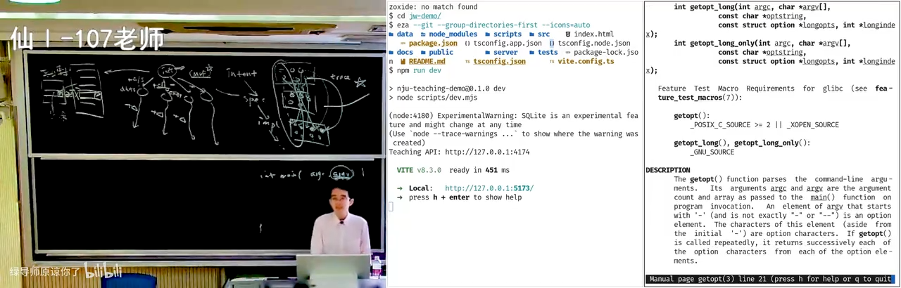

## 17. 汉诺塔的四种表达：架构是一种品位

*(参考时间: 50:49)*

所以我们可以看几个比较典型的架构。我**从最小的十行代码的架构**来开始讲。

为什么我们现在说大模型对架构掌控得还不是很好，或者说**架构是一种品位**？其实是因为**架构和需求其实是连在一起的**：你没有需求就不用谈架构了。当你谈需求和架构的时候，你的需求面对的是一个**开放的**（世界），就是**为未来的需求做的一个架构**。

> 那你什么样的时候能设计出好的架构呢？**就是你对需求掌握到什么程度。**

举个例子，就是我最喜欢的 **Tower of Hanoi**——非递归的 Tower of Hanoi。我曾经也是在开始上课的时候，我先问我的研究生（保研的研究生）说："哎，让你写个非递归的 Tower of Hanoi，你能写出来吗？" 然后研究生摇头。所以最后就变成了我上课时候的一个例子。

其实就这个**十行的代码**，它背后的架构联系到大家：**为什么写不出来？为什么写一个非递归的汉诺塔那么困难？**

### 17.1 表达一：GPT-6 —— 一切都是数学规律

那我们来看一看现在的人和模型对这个架构（的处理）。比如说我要做一个非递归（的汉诺塔），我就给它一个 prompt，它说我要写 `hanoi`。**你们来猜一猜 GPT 又写了什么？**

（它的意思）即便说"我不做人类了"——**你写不出来是因为你的数学不如我好。** 然后它找到了这个 Tower of Hanoi 的这个**数学性质**。所以很明显，**GPT-6 是在数学道路上狂奔**，然后希望它在数学上面的能力能够拯救人类世界的一切。

然后它就开始写这个：反正这是对的——它说

> **盘号 = 1 + 步号二进制末尾零的个数**；每个盘子的移动方向……

（幻灯片上是它的原代码，`uint64_t` 一路位运算，人类确实读不动：）

```c
/* GPT-6：盘号 = 1 + 步号二进制末尾 0 的个数；每个盘子的移动方向固定 */
for (uint64_t step = 1; step <= total; step++) {
    int disk = 1;
    for (uint64_t x = step; (x & 1) == 0; x >>= 1) {
        disk++;
    }
    int direction = (n - disk) % 2 == 0 ? -1 : 1;
    int from = position[disk];
    int to = (from + direction + 3) % 3;
    printf("Move disk %d: %c -> %c\n", disk, pegs[from], pegs[to]);
    position[disk] = to;
}
```

这还是一个移动方向固定吗？**We don't know.** 反正 anyway，它这个应该是对的——**反正你看不明白，但是 highly optimized、极度最优。**（当然我没有（验证），除非我叫它模拟栈。）

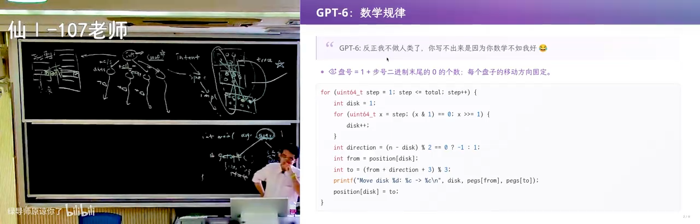

### 17.2 表达二：DeepSeek V4 Flash —— 递归是栈

同样的 prompt，这个 **DeepSeek V4 Flash 就更有人感**：它写了个非常优雅的代码，就是**标准答案**。基本上如果你要写一个非递归的汉诺塔的话，这是一个非常干净的架构。

因为它知道我们的 recursion 递归：**当我说要把一些盘子移过去的时候，那我要把剩下的任务——就还要继续执行的任务——留在栈里，这样我总是执行栈顶的任务，往前。** 所以非常优雅。

（幻灯片的标题就叫 **"DeepSeek：任务栈"**，配文是"人类语料里似乎让我这么干"：）

```c
/* DeepSeek V4 Flash：显式任务栈，标准答案 */
push(&s, n, A, B, C);
while (!isEmpty(&s)) {
    Task t = pop(&s);
    if (t.n == 1) {
        printf("%c -> %c\n", t.src, t.dst);
    } else {
        push(&s, t.n - 1, t.aux, t.src, t.dst);
        push(&s, 1,       t.src, t.aux, t.dst);
        push(&s, t.n - 1, t.src, t.dst, t.aux);
    }
}
```


然后我特意试了一下**豆包**：豆包选了这个方案，但是写了一个有瑕疵的代码，跟这个基本上差不多，我就不展示了。（然后我就呵呵。）

### 17.3 表达三：我 —— 程序是一个状态机，所以我写一个 C 语言解释器

然后我就不一样。**我作为一个架构师：架构关乎的是你对需求掌握到什么程度。** 所以我要写一个非递归的 Tower of Hanoi，我想的是"**为什么大家写不出来**"——大家写不出来的时候，是因为**你对递归这件事情理解得不够深**。

所以我故意地（用了一个 overkill 的方案）。上过我课的同学都见过这个代码，我故意说：

> **我们的程序实际上是一个状态机。**（回头你们可以去看我操作系统讲的这个课。）

任何一个——就是 **C 语言是一个状态**（我花了一整节课来讲这个），然后这个状态的一个 **single step** 是它的 **operational semantics**（叫操作语义），它的一个**小步语义**。比如说一个 `hanoi(n-1)`，它是一个 **well-defined** 的、在程序语言世界上是 well-defined 的一步操作。

**所以我们只需要模拟这个：我可以写一个 C 语言的解释器。** 当你理解了 C 语言的解释器的时候，你就很容易写出把任何代码（机械地跑起来）。我当时讲的其实是两个函数互相调用——F 调 G、G 调 F——你非常容易、没有任何难度，因为你就是把这个 C 语言的**形式语义、小步语义翻译成一个状态机的表示**。

然后你可以把它翻译成它：**如果你觉得这个代码不够优雅**——对，对于 Tower of Hanoi 来说 **overkill** 了，因为我可以把任意的程序翻译（过来）——**你还可以把它变成那个（显式栈的版本），它们俩是等价的：做一个 simplification、做个优化就可以从它变成它。**

所以在我看来，作为架构师，**这是理解 C 语言形式语义的好机会。** 所以看到不同的人（的解法）——我现在还可以守住我的品位。我说这个 GPT 可能它其实懂，但是它可能不会往这个方向去想。所以我觉得我有比较强的信心：**认为强化学习可以把这个 GPT 往这个方向去引导**；它一旦学会，它也能在适当的时候做出这样的实现。

### 17.4 表达四：CSDN —— 训练还没有收敛

当然最后有个搞笑的：我在**百度**上搜索"非递归汉诺塔"，然后找到了第一个（结果）。而且百度很搞笑——百度第一个条目还是**递归**汉诺塔。然后我往下找到 **CSDN** 的第一个非递归汉诺塔，然后我看到了这样的一个代码：

> 啧，这个……我甚至比 AI slop（还要糟糕）——**它甚至比 AI slop 问题还要严重。** 就这里有一个 `move`，但是 `std` 是有 `move` 的……哦对哈。

然后（右边）我不知道是不是 AI（写的评论），也给你营造一种这个 CSDN 的博客质量很高的感觉。**但如果你们在上学的时候被这种 slop 污染了**——你还不如跟 AI 学，跟 DeepSeek 学都很好（GPT-6 已经不当人了）。

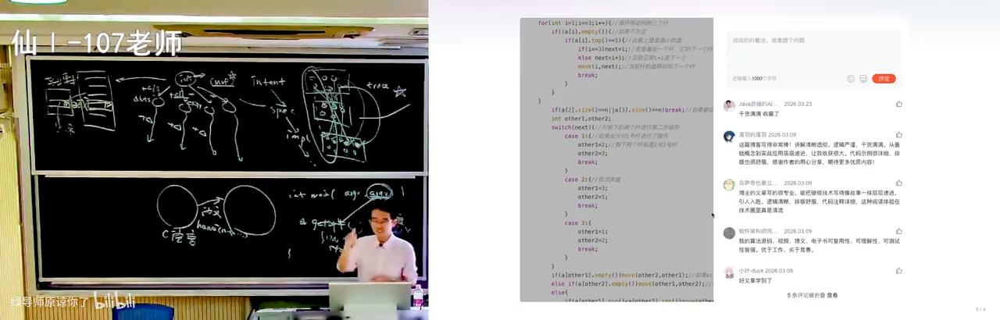

### 17.5 跳出问题看问题

所以，**同一个汉诺塔四种表达**。我们说我们要控制的是**复杂性**；它是一个架构，也关乎**抽象**。然后我们**站在不同的层面上考虑这个问题，叫跳出问题看问题**：

| 表达 | 站着的层面 | 讲者点评 |
| --- | --- | --- |
| **GPT-6** | 数学 | "GPT 也跳出问题看问题了：一切都是数学规律，我只要把程序世界里面的数学规律理解清楚，那没有任何问题是我解决不了的。**我服。**" |
| **DeepSeek V4 Flash** | 人类语料中的共识 | "这是一个人类反复说'递归是栈、递归是栈'，它在语料里面学到了这一点，做了一个正确的事情。" |
| **讲者本人** | 编程语言的形式语义 | "我往外走了一步：是你们对编程语言（和）世界的理解，投射成了递归和非递归的区别，然后再投射成这样的一份代码。" |
| **CSDN 博客** | —— | "这个不知道是什么，这就属于是**训练还没有收敛**。" |

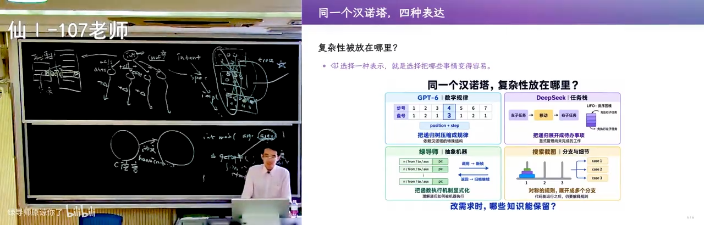

这个很有意思吧：**你在任何一个小的地方，都能看出架构水平的高低。** 这是**十行**的架构。

## 18. 架构能力从哪来：压缩就是智能

*(参考时间: 57:46)*

然后如果我们要再大一点，比如说 **2000 行的架构**，我们（要）展示**跳出问题看问题**：

> 代码之外有**客户**的规律，客户之外有**社会**的规律，社会之外有**宇宙**的规律。

你们肯定想问：**架构的能力从哪来？从你学过的每一个东西上来**——如果它是好的、它是优雅的、它促使了你对这个问题的思考。

> **压缩就是智能。** 你把它压缩了，那你的那个 **first principle**——你总是从 first principle 去推导"应该怎么样"。

所以其实这些能力就是你在学校里面学习、社会上面的积累，共同赋予你的。

比如说你必须要和**除了教科书、除了做题之外的人**打交道，你才能知道：一个马上就要退休的、优雅的教务老师，他是怎么看待教务系统的。他的想法可能和你的想法不一样——**你的想法总是"最好的数据库、最高的性能 whatsoever"，但对他来说他只是想要那个字大一点、他点鼠标的时候不要手滑到边上那个按钮上。**

**共情别人的能力。**

## 19. 2000 行的架构：在 Excel 里生成二维码

*(参考时间: 58:57)*

然后 2000 行——我讲一个我上课时候讲过的例子：**QR code generator**，就是二维码生成。我上课的时候讲了一个 **Excel 生成二维码**的例子。

（我打开它看一下……应该是第一次课的时候。）对，就生成这样的一个可以扫描的二维码：它可以把任何一个长的字符串，编码成一个你能够直接扫描的二维码。


然后你回头再用软件工程的、就用我们今天讲过的概念去理解这个问题：

> 这是一个和教务系统不太一样的例子——**它的需求是非常明确的**。需求就是 Excel 的一个单元格：我希望在这个 Excel 里面有一个**生成 01 序列的单元格**；它有一个输入的单元格、它有一些输出的单元格，非常 **deterministic** 的任务。
>
> **但是这里面是有架构的考虑的。**

### 19.1 agent 知道自己不会做，于是它开始"做架构"

agent 对自己的能力到底到什么程度是**有估计的**：所以 agent 会——当这个任务足够困难的时候——它就会**不做了**。

如果你让 agent，比如说你有两个 sheet：第二个工作表里面是我的学生的**实验成绩**，第一个工作表里面是我誊好了的学生的**期末考试成绩**；然后我说"诶，给我写个公式，把那个学号对应的那个实验成绩给我拉过来"——**那这个是在它能力范围内，它就会一把梭。**

然后这个事情显然超出它的能力范围，它还是会试图去**分解**这个问题——**它也会做架构**。但你看到，**至少今天的模型在做架构这件事上稍稍是有一些落后的。**

### 19.2 直接写成一个公式的后果：一页 Lisp

然后这里你就面对一个问题：**如果你直接把它写成一个公式，你就会得到一个……**

> 笑话说我们偷了一个 **Lisp** 程序，然后看到最后一页是这个。

就因为这个公式实在是太长了。因为 Excel 的计算（能力）比较有限——就好比是让你们用那种什么 **Brainfuck** 去实现一个 nontrivial 的程序、什么**毁灭战士**的游戏，那你写出来的程序就会是这样的。

**那这个时候你就需要一个抽象。**


### 19.3 需求看起来明确，但其实有很多坑：Excel 是有版本的

而且我觉得 AI 之前我看到的那两个版本，它没有考虑到的是：**这个需求看起来明确，但其实有很多坑。**

比如说 **Excel 是有版本的**：我们知道 Excel 从 2019、2023，它不断地都在增加新的功能。比如说我刚才讲的那个需求叫"查找学号对应的成绩"，以前是一个叫 **VLOOKUP** 的函数——有没有同学知道吗？没有同学知道，说明你们都不是 Excel 的 power user。**太好了，你们是 agent 时代的第一类人**：你要干什么，只要跟 agent 说就行了，你永远永远不需要再学一个像吃屎一样的语言了。

然后微软大概终于在某一年（2019 还是 2024）终于受不了了，然后说我们推出了一个新的叫 **XLOOKUP**（extended lookup），可以更方便地查找。

> 就这个 Excel 是在**演化**的，那么马上这个需求就会变得**模糊不清**：我到底是应该兼容一个旧版本的标准，使得我在各种人身上都能打开——我发给那个教务老师，教务老师也能打开这个二维码；还是我要做一个"我自己用一用即抛的"，那我就可以用最新的语法实现最简单的公式？**那到底是哪个呢？**

然后你看到的是：**如果需求变了，你的代码维护是极度痛苦的。**

> 你想，如果 AI 给你 vibe code 了一个用 Excel 2023 公式的代码，你突然说"哎呀不行，2023 不行，要改成 2019、要改成 2003"——**全完蛋。这是摧毁性的：你的设计和实现就会从头回到原点，然后重新再做一遍。**

那对于一个 **2000 行**的项目来说，这个是 OK 的，你可以重做。但是如果这个 2000 行的项目已经嵌入到了一个**巨大无比的需求**、嵌入到教务系统的时候、它和其他的部分产生关联的时候——**加钱对不对？** 那你作为这个项目经理（只能说）："我要加人、我要加钱，我只能用这个方式来满足你的需求。" **但这显然就是一个架构没有设计好。**

这个还有很多：比如说我的需求，可能等我最后出来以后，我对它**放的位置**不满意，我要把它整体往右移一格——**如果你所有的单元格都是硬编码的，直接立即崩溃。** 你看到它对需求的变更**抵抗是很糟糕的**。

## 20. 跳出问题看问题：这其实是一个编译问题

*(参考时间: 64:37)*

所以如果我们跳出问题看问题，**其实这是一个编译的问题。**

（我要开个 AI……正常是这样的。先把这个关掉。嘶。）"给我一个**从字符串到二维码的伪代码**。"

这个问题本身是清楚的——它显然（不需要）去读文件（乱猜），**二维码是完全有规范的**。好，它给了一个你看非常短的（伪代码）：

- 有什么**版本、纠错等级、掩码**；
- 然后它有一个**大小**；
- 然后它有**数据编码**（0100、八位组字节）；
- 然后有一个**纠错码**——它是一个 data 乘以 X 的 26 次方模（一个多项式），然后 134 个码字；
- 最后加上一个 **ECC**，最后直接放到这个空间里。

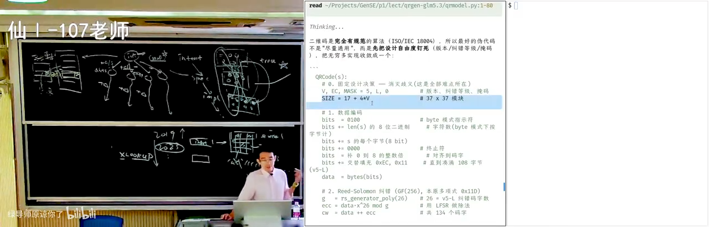

> **那为什么这么简单的东西，在 Excel 里面实现这么困难呢？这个 gap 到底是在哪里？**

如果你跳到问题外面，你就很明显能看到：**二维码容易用算法来描述。** 就这个过程，我用一个 `.py`——`qr.py`——那就再容易不过了。

（这就是明年保研机试我就出这个题：让你去实现，最后打一个 0/1 矩阵。好像是一个 OK 的、测试大家是不是有一定（能力）的题目；如果要拖网的话、还必须要拖网的话，是一个不错的测试大家的题目。）

**但是我们的要求是 Excel。**

### 20.1 py2xl 不存在，而 LLM 直接上手就做

- 我们**不存在任何一个翻译器**、一个编译器可以把一个 Python 编译成 Excel——这显然也是做不到的：Excel 它本质上是为了这个**财务、报表**这些而设计的，管理学生的成绩是一个小的数据库，**它本身就不是为了做 Turing complete 计算来做的**。所以没有一个 `py → excel` 的编译器（就叫它 `py2xl` 吧），**这个东西不存在**。
- 然后如果我们直接把它变成比如说伪代码或者是自然语言，然后我们用 **LLM 去编译**——那我们也看到了这个 LLM 的问题：**它直接上手就做**，做了以后**需求漂移**的时候就会遇到很大的问题。

### 20.2 我要的其实是一个中间语言

所以你马上就知道：**如果我有个好的架构，我是不是可以在 Python 和 Excel 中间构造另外一个语言？**

> 然后这个语言它**既可以很容易地翻译成 Excel，又可以继承一定的 Python 的功能**。就是刚才那个伪代码——**我希望我要的东西其实是一个中间的编程语言**，然后这个编程语言能够支持描述这些运算中需要的东西，然后它又可以翻译成（Excel）。

我做了这样的一个设计：**这样的语言是可以翻译成 Python 的。** 比如说你们都写过那种**表达式求值**的程序——我就做一个**表达式树**：比如说"异或""加"，什么 A、B；或者是 `x of 1`（这可以取出一个字符串里面的某一个（字符））。**这就是一个小的编程语言。**

然后这个编程语言显然很容易翻译成 Python：你直接把它打包就行了，**它递归地翻译**——你把任何一个表达式树 dump 出来，你就是递归地左子树、右子树，然后根据这个节点拼起来。

所以这个语言可以翻译成 Python，**这个语言也可以翻译成 Excel**：我只要要求**每一个节点都有一个翻译成 Excel 的规则**。我可以把这个东西放到一个格子里（任意的格子都可以），然后把这个结果放到一个格子里，然后我就可以在这里做出一个"这两个格子拼起来"的结果。

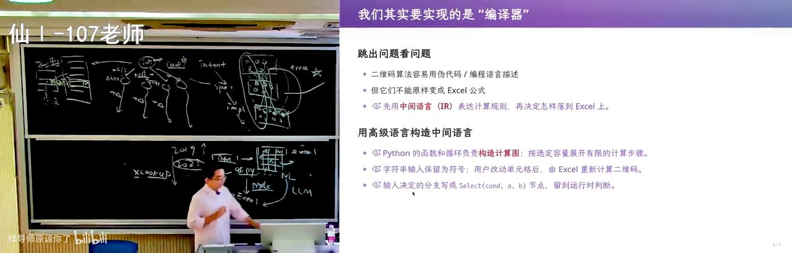

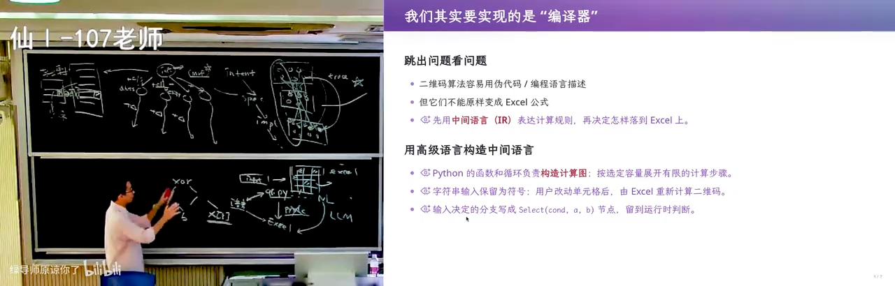

### 20.3 于是流程变成了：LLM 生成 → Python 验证 → Excel 交付

好，那我就好办了：

1. 我让**大语言模型生成这个语言的**二维码计算的逻辑；
2. 然后我把这个语言**翻译成 Python 去验证**，看我的这个公式写得对不对；
3. **等我公式写对了，我再去写 Excel。**


```mermaid
graph LR
    N["自然语言 / 伪代码<br/>（QR 规范）"] --> L["LLM"]
    L --> IR["中间语言<br/>表达式树 · 每节点两条翻译规则"]
    IR --> PY["翻译到 Python<br/>用于验证：公式对不对"]
    IR --> XL["翻译到 Excel<br/>用于交付：单元格公式"]
    PY -. "验证通过后再生成" .-> XL
    XL --> OPT["改写规则 / 优化<br/>循环外提 · PGO"]
    style IR fill:#1f3a5f,stroke:#4a90d9,color:#e8f0fb
    style PY fill:#1f3d2a,stroke:#4ad98a,color:#e8fbef
    style XL fill:#3d2f1f,stroke:#d9a44a,color:#fdf3e3
```

你看到这样的架构，**不就是我们刚才在第一个那个最小的例子里我讲那个 `getopt` 一样的设计吗？** 你说我们要写一个命令行的工具，我们第一件事情先 `getopt` 得到一个 parsing state，再从那个 parsing state 出发去做下一步——**一样的设计。**

> 所以你们作为一个 **unsupervised learner**、你们作为神经网络：神经网络就是看好的东西，你看得多了，你自然就能泛化了。当然你看得多的时候，你要**有意识**去看"好这个东西为什么要这样"。回头突然有一天你会想通——看到某一个 blog 的时候，或者有一天听我上课的时候，突然就想通了一件事：哦，**原来这个世界上大家做的事情都是差不多的。**

**一份中介语言，两种执行方式。** 所以我的架构就是：从 LLM 翻译成中间语言，这个（Python 后端）用来**验证**，这个（Excel 后端）用来**交付**。

> 这样，**这些 AI 给我生成的 slop 也就不重要了。**

### 20.4 在架构上继续发展：优化

而且这个架构上我还可以发展出比如说**优化**。什么是优化呢？**我不是（有）一个语言吗？** 一个语言我如果觉得性能不好、哪个地方生成了太长的代码，我就有一些**改写的规则**：我可以把一个程序从一个形态改写成另一个形态。

比如说你们都知道：如果我有一个变量在循环里面每次都计算，但它们的值都一样，我就可以把这个变量的计算**提到循环的外面**——编译器可以自动做这件事；（或者）你自己也可以手动把这个计算移出去，你可以做**手工的优化**。而**如果我有个中间语言，我就可以让大语言模型去优化它。**

然后你在这个计算机系统（课）里面学到的，比如说 **profiling-guided optimization**：你可以先要知道性能瓶颈在哪里，然后再用这个性能的 profile 再去指导你代码应该写成什么样更好。**诶，你的概念又用上了。**

所以**一个好的架构可以承载这个需求的变化**：未来如果 Excel 的版本改了，没问题啊，我无非就是把一些**算子**用另外一个方式去实现。

然后（我）讲了算子的时候，你发现今天这个 **AI inference（框架）也在干这个事**。类似的，是人类就是这样：因为他们有很多领域的知识，所以在他们领域里面有非常多好的设计——**这些都非常值得大家学习。**

## 21. 50 万行的架构：AI 实现的教务系统长什么样

*(参考时间: 72:33)*

那么终于到我们最后一个：**十行的讲完了，2000 行的讲完了，50 万行的架构应该怎么设计。**

当然我觉得**架构就一件事：跳出问题看问题。**

因为当我们谈架构师的时候，你想到了什么？想到那些架构师都在那（画）框图：**数据库、微服务、流式数据处理、应用框架**——然后选这个应用框架、这几个应用框架搭起来，"我就解决这个教务系统的问题了"。

### 21.1 一个 monolithic 的 54KB / 83KB / 38KB

在我们开始看架构之前，我们先来看一下这个 **AI 实现了一个什么样的架构**。很好玩：这是我在它生成中间的时候看到的结果，所以我就当场发了一个**小红书**，说"GPT-6 说'我不当人了、我不做人了'"——就是刚才那个汉诺塔：我在数学上能想清楚，数学上就是对的，那我不就是对的吗？**毫无破绽。**

然后它写的时候，它一个 function——你看它叫 `function applications(`，然后啪啪啪啪啪（一路括号套下去）。后来我发现 GPT 还很贴心地用那个代码的**格式化工具**帮我把它格式化完了，所以现在看这个东西就正常一些了。

现在看教务系统的 demo 的话，它还是一个 **monolithic**：

- 一个 **54KB** 的（入口/页面文件）；
- 一个 **83KB 的 `.tsx`**；
- 一个 **38KB 的 `services`**。

还是很有水准的。虽然……我真的觉得它还蛮厉害的：**这个东西能做对。**

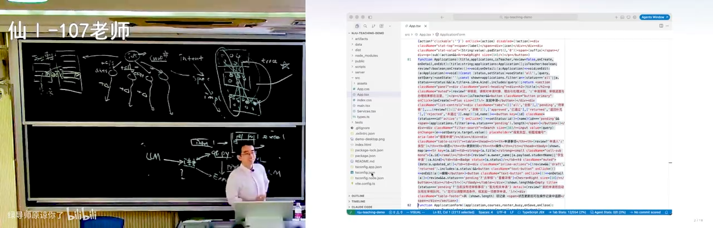

### 21.2 让 D 老师来评价一下

我们也可以问它啊："**这个教务系统使用了怎样的架构？**" 我们让 **D 老师（DeepSeek）**来评价一下 GPT 生成的东西。

然后当时我就**惊了**。惊了以后我就启动了一个独立的 session，然后问那个 GPT（在跑的）："**这个软件能维护吗？**" 害怕地问它。它说：**能**——"现在只不过是把这个业务逻辑挤在几个大文件里，但是这个东西维护是完全没有问题的。"


它说：你看，**经典三层单体、前后端分离**啊，而且有几个**生产级横切设计**：

- **乐观锁**：所有写请求带 `version`，`version()` 校验失败返回 **409**；
- **幂等**：前端每个写请求自带 `Idempotency-Key`，后端 `mutation()` 里存储"身份 + 内容 + 响应"，重试去重；
- **事务**：`transaction()` 用 `BEGIN IMMEDIATE / COMMIT / ROLLBACK` 包住"业务写入 + 审计 + 幂等记录"；
- **审计**：`audit` 表记录操作者、对象、前后值；
- **统一错误码**：`400 / 401 / 403 / 404 / 409`。

（所以我肯定会在某一次课的时候来讲讲这些。）

而它给出的**架构总览**（`docs/architecture.md`）是这样的：

```text
React SPA --本地 HTTP JSON--> Express REST --> SQLite(单文件)
```

- **前端**：React 19 + TS + Vite，**无路由库、无状态管理库、无 API 层**——全部逻辑在 `src/App.tsx`（2305 行）和 `src/Services.tsx`（1177 行）两个巨型组件里，靠 `useState` + 手写 fetch 封装（`api()`）驱动；
- **后端**：Express 5 单文件 `server/app.mjs`（522 行），**裸 SQL**（`node:sqlite` 的 `DatabaseSync`），无 ORM、无 migration，建表就是一段 `db.exec(CREATE TABLE IF NOT EXISTS ...)`；
- **持久层**：一张 `resources` 表用 **JSON blob** 存七类"扩展服务"；核心业务（课程 / 成绩 / 申请）才用关系表。

所以你看，它就是觉得很有自信：**它确实做了工程上、就是你们做不来的、这个至少要摸爬滚打几年才理解的设计**——它有这个软件工程的直觉。然后你看它有**数据驱动**、**横向扩展**，扩展性很好啊。当然也有差的一面。

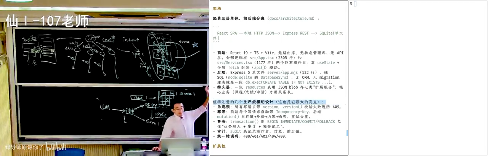

> 这个很有趣：**很快 AI 生成生产软件的方式就要超过人类了。**
>
> 但是我觉得，如果我**跳出问题看问题**，我觉得这**还不是一个非常好的架构**：因为本质上这是一个 **CRUD 的架构**，就是**增删改查**的架构。

## 22. CRUD 的基本原理：世界是一台状态机

*(参考时间: 76:32)*

然后这样的一个架构，来自于一个什么样的基本原理呢？

> **基本原理是：我们的软件是物理世界过程在信息世界里面的投影。** 然后我们的物理世界是**有状态的**——**everything is a state machine**，我自己也是一个 state machine。

所以软件系统它很容易会建模成一个 **state transition system**：也就是说它有一个**状态**，然后这个状态一般来说是用**数据库**（表示）——persistent 的状态是用数据库。

比如说我可以用一张表来表示**学生**：学生有学号、姓名、院系等等等等；然后我还有一张表表示**学院**、表示**选课**……反正各种各样的东西都可以用**二维的表**来表示——这是你们在数据库课上面学过的。

### 22.1 normal form：用 id 引用，铲除冗余的 dependency

然后数据库要求你**消除这个表里面所有的冗余**，要把这个数据库 factor 成 **normal form**。什么意思呢？

你最好不要（在别的表里）有一个（学生的）姓名。比如说：

- **学生表**：学号是唯一的，比如说 `1234`；学生有个姓名。
- **另一张表**：如果要引用一个学生，**尽量不要用姓名来引用**——因为学生可能会**重名**，然后就算不重名，这个也会带来一些麻烦。
- 更好的是不要用姓名，**就把这一列从这个表里面去掉，而是这里面放一个学生的 `id`**（比如说 `1234`）。这个 `id` 就相当于一个**链接**，这个链接指向了学生的这个信息；然后这个学生还可以再指向别的表里面的一些信息。

这样把信息（冗余降到）最小（的原则），其实是**铲除冗余的 dependency**：

> **我一个地方改了以后，我不会需要改另外一个地方。** 因为如果这个学生真的改名字了——不要笑，这件事情在中国是合法的——你用这个分解的方式，那你学生改了名字，这个名字改掉就行了，你就记一个曾用名。但如果你是这样的、存了两份名字，那对不起，你要知道**这两个地方都要修改**。这就是一个很大的代价。

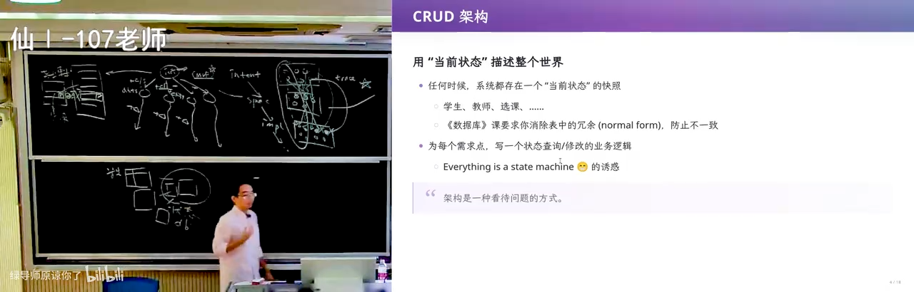

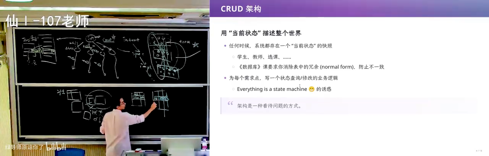

### 22.2 状态迁移：一次退学就是一次 UPDATE

然后我们一般来说会把这样的世界建模成**状态**：在任何时候这个状态就代表了，比如说在现在这个时间点上，**南京大学有哪些学生、有哪些学生选了哪些课、有哪些老师**等等。

然后每当（发生一个操作）——我的信息系统就**前后端分离**嘛，这也是一个非常经典的前后端分离的架构——那如果比如说今天我选择**退学**（"我没有买到 token，然后我选择退学"），那就是一个 **update 这个数据库的过程**，然后它就从一个状态迁移到了下一个状态：

```mermaid
stateDiagram-v2
    direction LR
    S0["状态 S0<br/>学生 A 存在"] --> S1["状态 S1<br/>A 的记录不存在了"]
    S1 --> S2["状态 S2<br/>…"]
    note right of S0
        物理世界事件：退学
        → 一次数据库 UPDATE / transaction
    end note
    note right of S1
        始终是 consistent 的视图：
        打开网页就看到当前状态的投影
    end note
```

> 那这里就（是）状态：比如说我现在 A 还在，那在下一个状态里面 A 就没有了、A 这个记录就不存在了。那这就是一个**始终是 consistent 的视图**：我永远在教务系统里面打开那个网页，就看到这个东西的一个**投影**。
>
> **这是非常经典的架构，没有任何的错误。**

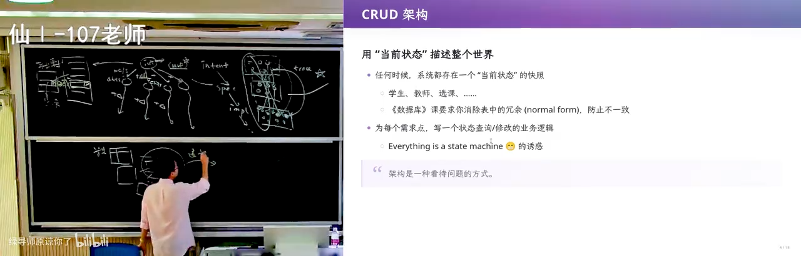

## 23. CRUD 为什么会死：丢掉的历史与无法解释的黑洞

*(参考时间: 79:49)*

**但是但是但是**——如果我们想想教务系统为什么不适合这样的一个 CRUD 架构：

> 就是因为**当前的状态**里面——当我看这个当前状态的时候，我看到的是一片祥和的景象，但是**这个当前状态所有的历史它丢掉了。**

### 23.1 一个字符串就能让数据库内部不一致

比如说如果我真的在某一个地方里面，学生的姓名存了两次——这是非常正常的：在某一个表里面姓名存了两次，因为这可能是一个**字符串**：这个字符串就是"（学位证）加学号，**授予谁谁谁什么什么**"，它没有用**关联**的方式，而用一个字符串（就）写到数据库里了。

**那这个时候数据库内部就发生了不一致了。**

### 23.2 "是否允许毕业"：一个由历史算出来的列

所以比如说 GPT 给了我一个例子。它说：在**学生表**里面有 `student_id`，然后有一个 column 就叫 **"是否允许毕业"**。

- 比如说你们现在（的）学分——你再上我的课，应该学分还不够——所以应该都**不允许毕业**；
- 然后有的同学这个学分修够了，它就**允许毕业**。

而这个"允许毕业"的这个 `1`，是**有很多其他的状态算出来的**，是因为之前有**触发**：比如说每当你修了一个学分、或者你的毕业设计状态改变等等的时候，它都要重新计算一个"你的这个是否毕业的逻辑"。

> 因为这个东西对信息系统来说很重要：**教务员老师、辅导员老师需要能够在教务系统里面导出"现在还毕不了业的学生"，要找你一个一个谈话。** 他必须要在教务系统里才能（做到）——这是个很典型的需求点。

**但是这样的东西是历史上的计算的 dependency，然后它们随着当前的状态都没有了：**

> 你知道这个学生**可以**毕业，但是你不知道他**为什么**可以毕业；你知道他**不能**毕业，你不知道他**为什么**不能毕业。**这个计算的过程丢掉了。**

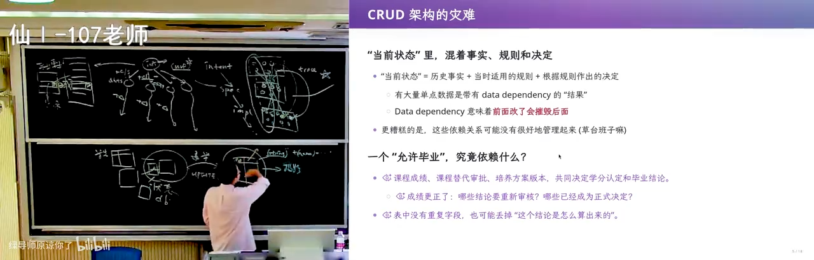

### 23.3 建模不了的物理世界，最后都变成黑洞

而计算的过程丢掉，这个软件又是**现实世界物理过程的一个有损的投影**，那么最后导致的是：**物理世界里面我建模不了的，全部都需要通过其他的途径来解决。**

- **政策更新了**：今天政策更新了、领导批准了这个培养计划新的方案，**新的数据还没有导入到教务系统**——你们经常遇到这个问题：**不一致**。物理事件已经发生了（这个培养计划已经通过了、学期已经开始了、我已经上课了），**物理世界已经发生的事实，在系统里面没有建模。**
- **教室不能用**：比如说这个教室还不能用——很典型的**第一周**，整个仙（林）一这一片都还在修，教室不能用。这一点教务系统显然没有建模；最后就靠他们**手改**、重新安排教室，我第一周就去另外一个教室上课了。

> 然后这样慢慢随着时间的积累，你的系统里面会有**大量不一致的数据**，随着时间变成**无法解释的黑洞**：
> - 哎，明明这个同学不该（能）毕业的，他为什么毕业了呢？
> - 明明这个同学没有交学费、应该毕不了业的，为什么他能毕业呢？
>
> **系统里面就无数这样你想都不能想的不一致。**

**所以你们在面对这种需求的时候，CRUD 就会死。**

## 24. "南大没系了"：改名引发的数据库迁移两难

*(参考时间: 84:01)*

（现场演示时页面弹出"当前环境异常"——啊，我知道它对 Linux 很害怕。）

**南大没系了。** 我们是最后一批"系"，然后现在成为了**计算机学院**。

好，在**南大院系发生调整**的时候，这个教务系统就**瑟瑟发抖**了。因为还是这样的 CRUD：它是一个 **single point of truth**——所有的事实都在这。

那好，我们的这个 `department` 变了。那我应该是把旧的这个 department……我的世界里面实际上是一个**对象**（虽然是表嘛，它还是对象），这个表就叫"计算机（系）"。

> **那我要把它的 `name` 从"计算机系"改成"计算机学院"吗？要吗？——要也不对，不要也不对。**

**如果改（update 这个 object）：** 计算机系现在确实是变成计算机学院了，但是这意味着**我的毕业记录**——如果我 select 到系统里面查询，我就变成了"**2011 年毕业于南京大学计算机学院**"。

> **这个就属于事实不符了**：因为我在 2011 年的时候（还是计算机系）。系统里面给我打印什么证明的时候，给我生成了这个东西——**好糟糕。**

**如果不改：** 也很麻烦。因为你现在所有的这个 `department_id` 都指向计算机系，还是得把它改过来。你需要对它做一个**数据库的迁移**：你要创建一个新的对象，然后新的对象和旧的对象之间的这个关联关系，你还要把它考虑清楚。

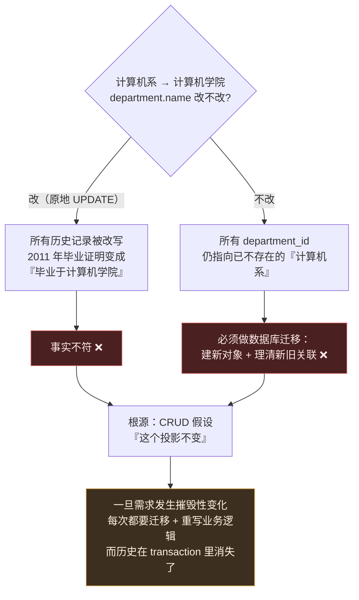
```mermaid
graph TD
    Q{"计算机系 → 计算机学院<br/>department.name 改不改?"}
    Q -->|"改（原地 UPDATE）"| A["所有历史记录被改写<br/>2011 年毕业证明变成<br/>『毕业于计算机学院』"]
    A --> A2["事实不符 ❌"]
    Q -->|"不改"| B["所有 department_id<br/>仍指向已不存在的『计算机系』"]
    B --> B2["必须做数据库迁移：<br/>建新对象 + 理清新旧关联 ❌"]
    A2 --> C["根源：CRUD 假设<br/>『这个投影不变』"]
    B2 --> C
    C --> D["一旦需求发生摧毁性变化<br/>每次都要迁移 + 重写业务逻辑<br/>而历史在 transaction 里消失了"]
    style A2 fill:#4a2020,stroke:#d96a6a,color:#fbe8e8
    style B2 fill:#4a2020,stroke:#d96a6a,color:#fbe8e8
    style D fill:#3d2f1f,stroke:#d9a44a,color:#fdf3e3
```

所以：

> 如果你假设这个世界就是这样的、**这个投影不变了**，CRUD 当然是一个**完美的架构**。但是只要你假设这个需求会发生**摧毁性的变化**，那么这个数据库你每次都要这样想：**你每次都会涉及一个数据库的迁移、业务逻辑的重写。**
>
> 你代码是可以重写，但是**你的历史（会）消失**——因为这是一个 database 的 **transaction**，它 update 完了以后，就从这个状态彻底地挪到了新的状态。

你做一次数据库的迁移，你就要考虑**历史上所有可能发生的情况**；而且何况这个数据库里面**已经有很多的不一致了**，你很难写出一个规则来迁移。你还要冒着**数据库迁移完了以后这个数据库就坏掉了**（的风险）——就像我那个把（缺课次数）改成 `1` 一样。

> 因为你在你的**测试环境**里面做一次迁移，和你把一个**真的、学校里面所有的数据**都做一次迁移，这个难度是完全不一样的。

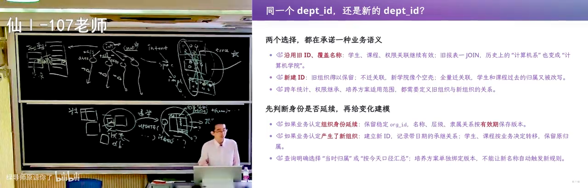

## 25. 手艺活：一家公司，和一个研究生院的屎山

*(参考时间: 87:18)*

所以你们就理解了，为什么现在——或者说到今天之前——软件的设计实现，**ERP 这类的系统**（不管是教务系统啊），**它的设计、实现、维护都是手艺活。**

就是，你看我调侃这个教务系统做得不好——它确实有做得不好的一面；但是你反过头来想，它作为一个软件工程的实践者：

> 他可能这家公司在 **2000 年**的时候成立了，然后在 2000 年成立的时候，他做的**唯一的选择**就是参考一个已有的**企业架构**来做一个教务系统，来**抢占这个教育市场的第一桶金**。然后他把这个东西做出来了；做出来以后，它就是一个 **CRUD 的系统**。那他一旦背上这个技术债，他就要在这个**中国大学教育改革几十年的时间里面不断地扛下所有**。
>
> **所以这是一门手艺活。**

### 25.1 我读 PhD 时室友的那个项目

这里面还有一些有意思的故事。我读 PhD 的时候，我们的软件工程组——我是软件所的，然后隔壁的软件工程组——接了学校**研究生院的教务系统**的这个订单，可能就**二三十万**吧。

在大家来看可能是一个比较大的订单，实际上在（定制化）软件里面是比较小的订单——因为**你要不停地维护这个屎山**。

但后来这个故事是：**这个屎山维护不下去了。**

我还记得我们当时刚读 PhD，那是我的**室友**，然后我就经常跟他抬杠：我会跟他聊"研究生院这个系统怎么设计"（那个时候叫研究生院），然后我就经常**喷他**，因为他是一个非常典型的 **CRUD 架构**。我说："你最后会面临各种各样的问题。"

**果然**就在那几年：

- 我们的研究生发生了**巨大的扩招**；
- 然后多了很多研究生的**类型**、**培养的类型**；
- 而且研究生（大家知道）压力很大，经常会有这种**调整**。

**这都是他们在做需求设计的时候始料未及的。** 然后最后那个系统就彻底变成屎山，然后最后就……反正就不存在了嘛：**现在统一变成公司维护的这个系统。** 他们还是有一些领域知识，知道这些系统应该怎么把屎山给扶起来。

## 26. 如果重做架构：persistent data structure 与三种等价的视图

*(参考时间: 89:53)*

**但是如果我要重做一个教务系统的架构，我会怎么做呢？**

我就会看到这个 **single point of truth 太危险了**：一旦你有任何的不一致，你都不知道应该怎么样把它拿出来。

然后你就想到**数据结构课上讲过一种非常神奇的东西，叫 persistent data structure**：它可以得到这个数据结构**所有的历史**。

### 26.1 从"存一棵树"到"存所有版本的树"

也就是你存一个数据结构、存一棵树——**那这就是 CRUD**：你看数据库也是一个数据结构嘛，所以你当前就是存一个库，然后你对它做一个操作，它就到下一个状态——**这就是经典的 CRUD。**

但我还有另外一种：

- 我可以**一开始只有一个节点**；
- 然后有一个节点以后，我可以创建——下一次它（这棵）树不变了，那我就可以（复用），这个节点还在，我把这个节点放过来；
- 然后如果我到有一天，比如说这个树变了——比如说我要在这个节点上新建一个——那我就把它**到根的路径上面（复制）长出来一个**，然后它的**左子树可以指向它**（旧的那棵）。

> **这个树无论多大，我其实都是可以存下来的。**

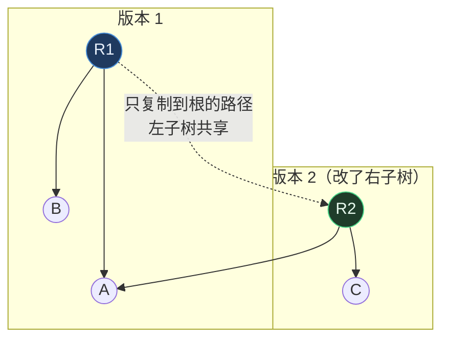
```mermaid
graph TD
    subgraph V1["版本 1"]
        R1((R1)) --> A1((A))
        R1 --> B1((B))
    end
    subgraph V2["版本 2（改了右子树）"]
        R2((R2)) --> A1
        R2 --> C2((C))
    end
    R1 -. "只复制到根的路径<br/>左子树共享" .-> R2
    style R1 fill:#1f3a5f,stroke:#4a90d9,color:#e8f0fb
    style R2 fill:#1f3d2a,stroke:#4ad98a,color:#e8fbef
```

### 26.2 三种等价的视图：状态 / 日志 / delta

然后我可以**存状态**，也可以**存操作**，也可以**存操作对状态的 delta**——**这三种视图是等价的**：

| 视图 | 存什么 | 你在哪门课学过 |
| --- | --- | --- |
| **日志** | write-ahead log / journal | 数据库、操作系统课 |
| **delta** | 每次操作对状态的增量 | **git、SVN** 这样的版本管理里面的思想 |
| **状态** | 当前状态本身 | **CRUD** |

> **但它们都可以帮你回放历史，得到当前的状态。**

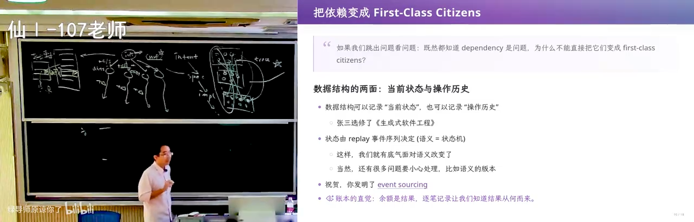

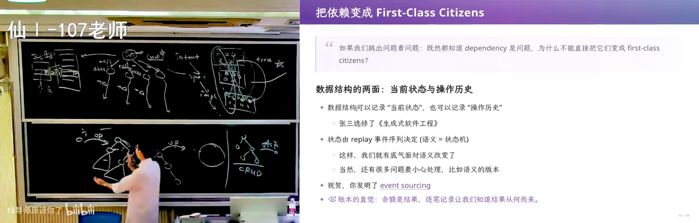

## 27. Event sourcing：先把干的所有事情都记下来

*(参考时间: 92:16)*

所以如果你想要设计一个更好的架构，**最好是先把干的所有的事情都先记下来**：今天张三退学了，今天张三又复学了。

### 27.1 "复学"这个需求之前没有被考虑过

你可以假想：**之前这个世界没有"复学"这个操作。** 没有复学这个操作，就是把张三从这个数据库里面**抹掉**——抹掉了它就抹掉了，他可能有一些记录就删掉了。你要把这些和他（相关的）、他和其他部分的关联**重新给建起来**，那你就要付很大的代价：你要加上"复学"这个操作（"他又买到 token 了"）。

**然而如果你是用记录所有的操作的方式，你就可以通过 replay 知道张三复学前的状态是什么，然后你再把这个状态拿过来——它没有丢。**

> 你的逻辑是不能减少的：即便使用记录日志、记录历史的方式，比如说"复学"这个事情之前没有考虑过，我**依然要为它写一个逻辑**。但是**因为事实是不可篡改的、你世界里面所有东西都是对事实的投影**，那你好像就**有底气了一些，你就不怕错了**。
>
> 你就不会像刚才那样说"我要做一个数据库迁移的时候，**我手在抖**"——因为你总是知道，你任何一个做错了，你都可以很快地**退回到过去的一个快照**，然后再把这个逻辑做修复。

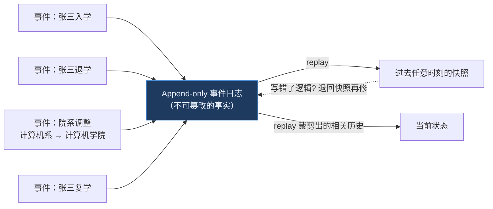
```mermaid
graph LR
    E1["事件：张三入学"] --> L["Append-only 事件日志<br/>（不可篡改的事实）"]
    E2["事件：张三退学"] --> L
    E3["事件：院系调整<br/>计算机系 → 计算机学院"] --> L
    E4["事件：张三复学"] --> L
    L -->|replay| S1["过去任意时刻的快照"]
    L -->|replay 裁剪出的相关历史| S2["当前状态"]
    S1 -.->|"写错了逻辑? 退回快照再修"| L
    style L fill:#1f3a5f,stroke:#4a90d9,color:#e8f0fb
```

### 27.2 计算机系 / 计算机学院的问题也好解了

然后你也可以看到：**计算机系、计算机学院的问题相对来说也好解决一些了。**

我可以在某一个时刻发生了一个事件，叫**"院系调整"**。然后：

- **你查询一个过去的人的时候，你会查询到他过去的版本**，并且你知道他经历了这个（事件）。如果你要查询他过去比如**毕业时候**发生的事情，你直接查他毕业时候就可以。
- **如果你想要得到一个它比较新的信息**，你可以看到投影出和这个人相关的（历史）：这个同学在比如说 **2007 年入学、2011 年毕业**，然后到这（期间）都是**计算机系**；然后计算机系在 **2014 年**改为了**计算机学院**。

> 你看到，我可以**裁出一个**（和事实相关的历史）：你总是想要得到一个事实、当前的事实，你可以裁出一个和事实相关的历史，然后把这个相关历史 **replay** 得到我现在要的状态。
>
> **我可以查询过去，也可以查询现在——这就是一个好的架构设计。**

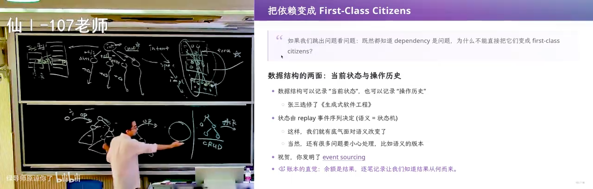

### 27.3 恭喜你，你发明了 event sourcing

幻灯片上把这一刻写成了三行：

> - 数据结构可以记录"当前状态"，也可以记录"操作历史"；
> - **状态由 replay 事件序列决定（语义 = 状态机）**；
> - 祝贺，你发明了 **event sourcing**。
>
> 还有一句"**账本的直觉**"：**余额是结果，逐笔记录让我们知道结果从何而来。**

然后**恭喜你，你就发明了一个叫 event sourcing 的、非常经典的设计模式。**

> **它的想法很简单：从历史事件生成状态，而不是直接维护这个 CRUD 的状态。**

你们可以回去在 agent 的带领下了解一下。

然后你马上会反应过来：**是不是会有性能问题？** 因为要大量的 replay。**但这都不是很大的问题**：我们总可以比如说用**快照、缓存**各种各样的（方式）——它会有一些优化的技巧。

然后这是一个（区别）：

> 比如说你**已经在屎山上**了，你把它变成一个 event sourcing 的设计**就会变得很困难**；但是如果你**从一开始就做 event sourcing 的设计**，很多问题都不会发生，你就能比较好地解决。

### 27.4 那些 fancy 的概念，其实你都不需要

然后这样就有了很多这种 fancy 的软件工程概念：

- 什么 **CQRS**（Command Query Responsibility Segregation）——但这和 event sourcing 是**独立的**；
- 还有什么 **domain-driven design** 这种。

> **然后其实你们都不需要（先学这些）。** 你们可以去看，但是你只要回到这个最初的 **first principle**：
>
> **你要设计一个 50 万行教务系统的时候，我们跳出这个问题，看到教务系统根源的问题在哪里，你就能做一个正确的架构设计——哪怕你没有听说过这些，你也能做一个正确的架构设计。**

---

## 附：本讲的三条主线

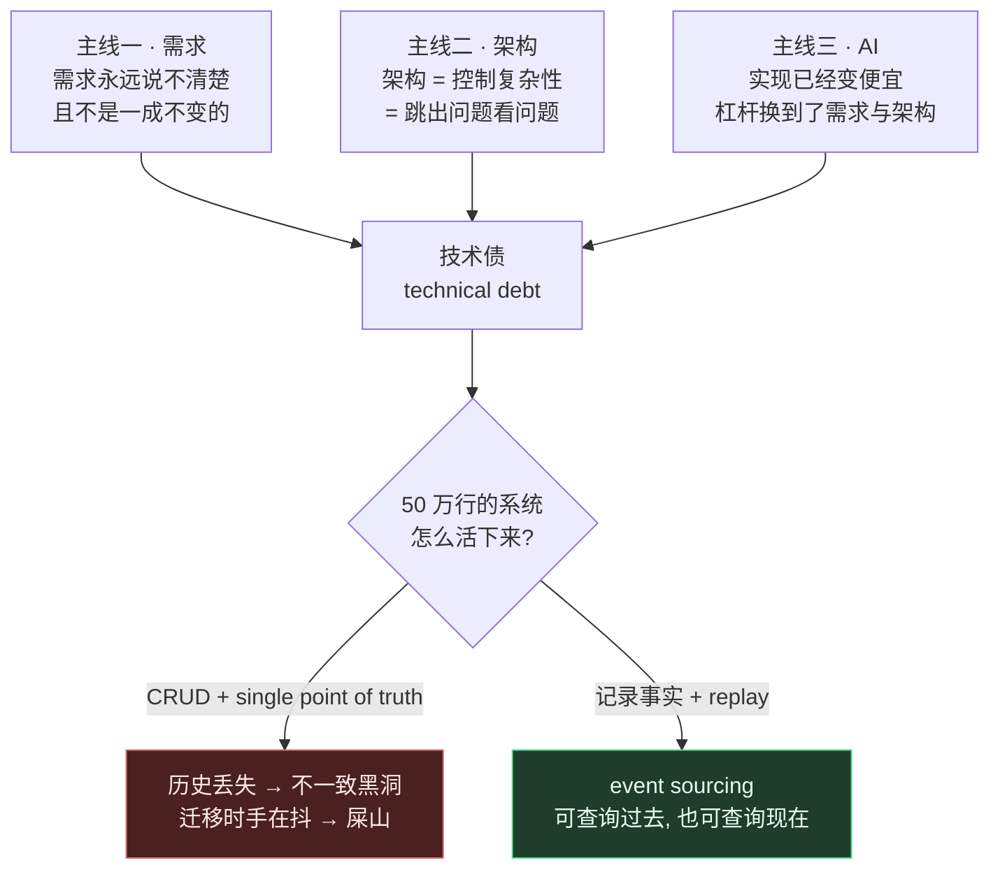
```mermaid
graph TD
    A["主线一 · 需求<br/>需求永远说不清楚<br/>且不是一成不变的"] --> D["技术债<br/>technical debt"]
    B["主线二 · 架构<br/>架构 = 控制复杂性<br/>= 跳出问题看问题"] --> D
    C["主线三 · AI<br/>实现已经变便宜<br/>杠杆换到了需求与架构"] --> D
    D --> E{"50 万行的系统<br/>怎么活下来?"}
    E -->|"CRUD + single point of truth"| F["历史丢失 → 不一致黑洞<br/>迁移时手在抖 → 屎山"]
    E -->|"记录事实 + replay"| G["event sourcing<br/>可查询过去, 也可查询现在"]
    style F fill:#4a2020,stroke:#d96a6a,color:#fbe8e8
    style G fill:#1f3d2a,stroke:#4ad98a,color:#e8fbef
```

---

## 后记 Postscript：本书是如何生成的

本书由 B 站 AI 字幕（`ai-zh`，覆盖率 100%、2387 段、总时长 96 分 50 秒）经 AI 重构而成：口语转书面语、按内容自身逻辑分为 27 章（另加本篇后记）、绘制 8 张 Mermaid 图、插入 48 个截图锚点；截帧管线在已登录的浏览器里逐个 seek 到锚点时间、隐藏播放器 UI、锁定顶码率流后截取纯视频帧；最终渲染为带截图放大（lightbox）与 Mermaid 交互的 HTML。

与视频逐句对照的订正稿见 `transcript.corrected.txt`：先由脚本按本讲错词 MAP 修正（如 `java 系统 / 交互系统 / 撬务系统 → 教务系统`、`价格 → 架构`、`技术站 / 技术宅 → 技术债`、`淘宝号 / TPHONY / tao ho h诺尔 → 汉诺塔`、`get opp t / get a o p t → getopt`、`passer / passing → parser / parsing`、`video cup → VLOOKUP`、`卡牌 → lookup`、`史山 / 石山 / 使臣 → 屎山`、`南大没戏了 → 南大没系了`、`record is → Redis`、`二个C和阿个V → argc 和 argv`、`web code → vibe code` 等），再由 AI 通读全文做一轮行级订正（保留讲师原始字词与有意重复，仅修明显识别错误）。

**本讲的一处已知瑕疵**：官方章节把 00:00–15:03 标为"引言（后半音频翻车）"——录制现场讲者的机器输入设备全部失效（UI 与 OBS 推流仍正常），这一段音频质量明显下降，字幕在 07:50–08:10 一带尤其破碎；本书对该区间只做了保守归纳，未强行补全语义。
